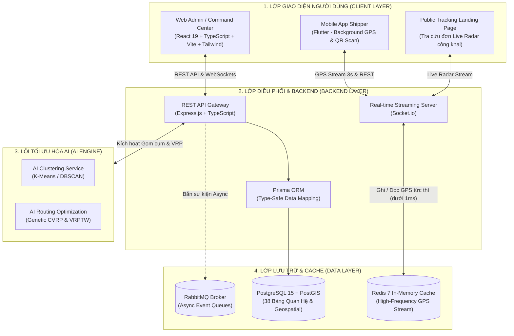
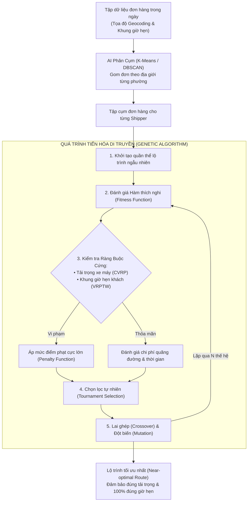

# 📑 BÁO CÁO PHÂN TÍCH & LỰA CHỌN CÔNG NGHỆ (TECH STACK REPORT)
## HỆ THỐNG ĐIỀU VẬN & TỐI ƯU HÓA TUYẾN ĐƯỜNG LOGISTICS THÔNG MINH (SMART LOGISTICS PLATFORM - SLP)

> **Tài liệu Báo cáo Kỹ thuật & Luận cứ Bảo vệ Công nghệ**  
> Dùng cho: Báo cáo đồ án, thuyết minh giải pháp kỹ thuật, tài liệu bàn giao kiến trúc hệ thống.

---

## 📑 MỤC LỤC
1. [Tổng Quan Kiến Trúc Hệ Sinh Thái Công Nghệ](#1-tổng-quan-kiến-trúc-hệ-sinh-thái-công-nghệ)
2. [Cơ Sở Dữ Liệu & Bộ Nhớ Đệm (Database & Caching Layer)](#2-cơ-sở-dữ-liệu--bộ-nhớ-đệm-database--caching-layer)
   - [2.1. CSDL Quan hệ: PostgreSQL 15 + PostGIS Extension](#21-csdl-quan-hệ-chính-postgresql-15--postgis-extension)
   - [2.2. Bộ nhớ đệm thời gian thực: Redis 7 (In-Memory)](#22-bộ-nhớ-đệm-thời-gian-thực-redis-7-in-memory)
   - [2.3. Message Broker: RabbitMQ (Kiến trúc EDA)](#23-message-broker-rabbitmq-kiến-trúc-eda)
3. [Phân Hệ Backend & Động Cơ Real-time (Backend Layer)](#3-phân-hệ-backend--động-cơ-real-time-backend-layer)
   - [3.1. Nền tảng Backend: Node.js (TypeScript) + Express.js](#31-nền-tảng-backend-nodejs-typescript--expressjs)
   - [3.2. Tầng Ánh Xạ Dữ Liệu: Prisma ORM (Schema-Driven)](#32-tầng-ánh-xạ-dữ-liệu-prisma-orm-schema-driven)
   - [3.3. Động cơ Truyền Thông Thời Gian Thực: Socket.io](#33-động-cơ-truyền-thông-thời-gian-thực-socketio)
4. [Phân Hệ Frontend & Trung Tâm Điều Hành (Frontend Layer)](#4-phân-hệ-frontend--trung-tâm-điều-hành-frontend-layer)
   - [4.1. Framework & Công Cụ Build: React 19 + TypeScript + Vite 8](#41-framework--công-cụ-build-react-19--typescript--vite-8)
   - [4.2. Giao Diện & Trực Quan Hóa Bản Đồ: Tailwind CSS v4 + Leaflet & MapLibre GL](#42-giao-diện--trực-quan-hóa-bản-đồ-ui--gis-visualization)
5. [Phân Hệ Ứng Dụng Di Động Tài Xế (Mobile Layer)](#5-phân-hệ-ứng-dụng-di-động-tài-xế-mobile-layer)
   - [5.1. Công nghệ: Flutter (Dart SDK)](#51-công-nghệ-flutter-dart-sdk)
6. [Lõi Tối Ưu Hóa Trí Tuệ Nhân Tạo (AI Optimization Engine)](#6-lõi-tối-ưu-hóa-trí-tuệ-nhân-tạo-ai-optimization-engine)
   - [6.1. Thuật toán: K-Means / DBSCAN + Genetic Algorithm (CVRP + VRPTW)](#61-thuật-toán-k-means--dbscan--genetic-algorithm-cvrp--vrptw)
7. [Bảng Ma Trận So Sánh & Tổng Hợp Quyết Định Công Nghệ](#7-bảng-ma-trận-so-sánh--tổng-hợp-quyết-định-công-nghệ)

---

## 🏗️ 1. TỔNG QUAN KIẾN TRÚC HỆ SINH THÁI CÔNG NGHỆ

Hệ thống **Smart Logistics Platform (SLP)** được thiết kế theo mô hình **Kiến trúc Hướng Sự kiện chịu tải cao (High-Performance Event-Driven Architecture - EDA)**, phân tách rõ ràng thành các tầng độc lập nhưng liên kết chặt chẽ thông qua giao thức REST API và WebSockets.

---

## 🗄️ 2. CƠ SỞ DỮ LIỆU & BỘ NHỚ ĐỆM (DATABASE & CACHING LAYER)

### 2.1. CSDL Quan hệ chính: **PostgreSQL 15 + PostGIS Extension**

#### 📌 Vai trò trong hệ thống:
Lưu trữ toàn bộ 38 bảng dữ liệu quan hệ của hệ thống bao gồm: Người dùng, Phân quyền RBAC, Khách hàng B2B/B2C, Sổ địa chỉ kho, Đơn hàng, Kiện hàng, Vận đơn trung chuyển liên kho (Line-haul), Thùng gom hàng (Tote), Đội xe & Tài xế, Điểm dừng lộ trình, và Chứng từ bàn giao/ảnh chữ ký điện tử (POD).

#### 💡 Lý do lựa chọn:
1. **Tuân thủ chuẩn ACID toàn vẹn cao**: Logistics đòi hỏi tính nhất quán tuyệt đối trong giao dịch tiền tệ (COD), lịch sử luân chuyển kiện hàng, và tình trạng niêm phong thùng container. Bất kỳ sai lệch dữ liệu nào cũng dẫn đến thất thoát hàng hóa.
2. **Tiện ích PostGIS (Chuẩn vàng cho Hệ thống Thông tin Địa lý GIS)**:
   - PostGIS là extension biến PostgreSQL thành CSDL không gian địa lý mạnh mẽ nhất thế giới mã nguồn mở.
   - Cho phép lưu trữ kiểu dữ liệu hình học bản đồ `GEOMETRY` và `GEOGRAPHY` (Point, LineString, Polygon).
   - Tích hợp chỉ mục không gian `GIST Index` và hàng trăm hàm toán học địa lý (`ST_Distance`, `ST_DWithin`, `ST_Contains`, `ST_Centroid`) giúp tính toán khoảng cách đường chim bay, ranh giới phường xã, và phân vùng giao hàng trực tiếp bằng SQL với tốc độ mili-giây.
3. **Hỗ trợ kiểu dữ liệu JSONB cực mạnh**: Cho phép lưu trữ cấu trúc quan hệ chuẩn mực, đồng thời lưu trữ linh hoạt các trường dữ liệu động như: Cấu hình tham số siêu giải thuật AI, metadata ảnh chụp POD, hoặc payload phản hồi từ bản đồ bên thứ ba.

#### ⚖️ Phân tích so sánh với các giải pháp khác:
| Tiêu chí | **PostgreSQL + PostGIS (Được chọn)** | **MongoDB (NoSQL Document)** | **MySQL** |
| :--- | :--- | :--- | :--- |
| **Tính toàn vẹn quan hệ (ACID, Foreign Keys)** | 🟢 **Tuyệt đối**, hỗ trợ transaction nhiều bảng phức tạp. | 🔴 Yếu. Không có khóa ngoại chặt chẽ, dễ sinh dữ liệu rác khi quản lý chuỗi 38 bảng logistics liên kết chéo. | 🟡 Khá (InnoDB engine). |
| **Xử lý Không gian Địa lý (GIS)** | 🟢 **Chuẩn công nghiệp**. Hỗ trợ hàng trăm hàm chuyên sâu và tính toán trắc địa chính xác. | 🟡 Hỗ trợ cơ bản (2dsphere index), thiếu các phép toán không gian phức tạp. | 🔴 Hỗ trợ Spatial rất sơ khai, hiệu năng truy vấn không gian chậm. |
| **Lưu trữ JSON & Linh hoạt** | 🟢 Hỗ trợ `JSONB` có index nhị phân, hiệu năng ngang ngửa Document DB. | 🟢 Bản chất là Document BSON. | 🟡 Hỗ trợ JSON nhưng chỉ mục và cú pháp hạn chế. |
| **Chi phí & Bản quyền** | 🟢 Hoàn toàn mã nguồn mở, cộng đồng lớn. | 🟡 Giấy phép SSPL phức tạp cho doanh nghiệp. | 🟢 Mã nguồn mở (GPL/Oracle). |

---

### 2.2. Bộ nhớ đệm thời gian thực: **Redis 7 (In-Memory)**

#### 📌 Vai trò trong hệ thống:
Vùng đệm lưu trữ dữ liệu tần suất cao (In-Memory Buffer) cho luồng tọa độ GPS "sống" của hàng trăm tài xế gửi về định kỳ 3–5 giây/lần; xử lý cơ chế Pub/Sub và lưu phiên làm việc.

#### 💡 Lý do lựa chọn & Giải quyết bài toán thắt nút cổ chai (Bottleneck):
* **Giải quyết bài toán nghẽn Disk I/O**: Nếu 500 tài xế đồng thời gửi tọa độ GPS 3 giây/lần và ghi trực tiếp vào ổ đĩa của PostgreSQL, máy chủ sẽ phải chịu hàng ngàn lệnh `UPDATE/INSERT` mỗi giây, nhanh chóng làm tràn hàng đợi ghi đĩa và sập CSDL.
* **Độ trễ phản hồi siêu tốc (< 1ms)**: Redis lưu trữ hoàn toàn trên RAM, có khả năng xử lý hơn 100.000 lượt đọc/ghi mỗi giây.
* **Luồng vận hành tối ưu**:
  1. GPS tài xế $\rightarrow$ Ghi đè vào Redis Key `driver:location:{id}` trong **0.5ms**.
  2. Socket.io trích xuất tức thì từ Redis phát sóng về màn hình Live Radar của Admin và Khách hàng.
  3. Chỉ khi tài xế bấm xác nhận một sự kiện vận hành quan trọng (Lấy hàng, Xuất kho, Giao thành công), hệ thống mới ghi một bản ghi log vĩnh viễn vào PostgreSQL.

#### ⚖️ Phân tích so sánh với Memcached:
* **Memcached**: Chỉ lưu trữ key-value dạng chuỗi thô sơ, không hỗ trợ cấu trúc dữ liệu phong phú (Hashes, Sorted Sets, Geohash), không có cơ chế lưu bền vững xuống đĩa (AOF/RDB), và không có tính năng Pub/Sub để phát sự kiện realtime.
* **Redis 7**: Đáp ứng toàn diện các kiểu dữ liệu, có tính năng Geo Set (`GEOADD`, `GEODIST`), Pub/Sub, Stream và cơ chế bảo toàn dữ liệu khi khởi động lại.

---

### 2.3. Message Broker: **RabbitMQ (Kiến trúc EDA)**

#### 📌 Vai trò trong hệ thống:
Quản lý hàng đợi tin nhắn (Message Queue) cho các tác vụ bất đồng bộ nặng: Tính toán phân cụm AI theo lô, gửi email thông báo trạng thái đơn hàng, và xuất báo cáo đối soát cước phí tự động nhằm giải phóng luồng chính của API Gateway.

---

## ⚙️ 3. PHÂN HỆ BACKEND & ĐỘNG CƠ REAL-TIME (BACKEND LAYER)

### 3.1. Nền tảng Backend: **Node.js (TypeScript) + Express.js**

#### 📌 Vai trò trong hệ thống:
Xây dựng API Gateway, xử lý toàn bộ logic nghiệp vụ điều phối, quản lý phân quyền theo vai trò (RBAC), kiểm thực dữ liệu (Validation), và tích hợp WebSocket Server.

#### 💡 Lý do lựa chọn:
1. **Kiến trúc Bất đồng bộ Non-blocking I/O**: Node.js sử dụng mô hình đơn luồng hướng sự kiện (Single-threaded Event Loop), cực kỳ tối ưu cho các ứng dụng I/O-intensive như hệ thống Logistics (nơi phần lớn thời gian là nhận request mạng, đọc/ghi database, và stream tọa độ qua WebSockets).
2. **Ngôn ngữ TypeScript đồng nhất toàn hệ thống**:
   - Khắc phục hoàn toàn nhược điểm "thiếu an toàn kiểu" (Dynamic Typing) của JavaScript thuần.
   - Cung cấp Type-safety, Interface, Enums và Generics chặt chẽ, giảm thiểu 90% lỗi runtime bug (`TypeError: Cannot read property of undefined`).
   - Cho phép chia sẻ chung cấu trúc dữ liệu (Data Transfer Objects - DTOs) giữa Backend và Frontend React.
3. **Framework Express.js gọn nhẹ & linh hoạt**:
   - Cung cấp kiến trúc tối giản, không áp đặt boilerplate nặng nề.
   - Hệ sinh thái Middleware khổng lồ (`cors`, `helmet`, `class-validator`, `jsonwebtoken`, `swagger-ui-express`).
   - Dễ dàng gắn kết Socket.io Server chạy song song trên cùng một HTTP Server instance.

#### ⚖️ Phân tích so sánh với các giải pháp Backend khác:
| Tiêu chí | **Node.js + TS (Được chọn)** | **Java (Spring Boot)** | **Python (FastAPI / Django)** | **PHP (Laravel)** |
| :--- | :--- | :--- | :--- | :--- |
| **Xử lý Concurrency & Real-time I/O** | 🟢 **Rất cao** (Xử lý hàng chục ngàn kết nối I/O nhẹ nhàng) | 🟢 Rất cao (Đa luồng thread pool nhưng ngốn RAM) | 🟡 Trung bình (Bị giới hạn bởi GIL - Global Interpreter Lock) | 🔴 Thấp (Mô hình request-response truyền thống theo vòng đời) |
| **Mức độ tiêu tốn RAM lúc khởi động** | 🟢 Rất nhẹ (~50MB - 100MB) | 🔴 Rất nặng (~500MB - 1.5GB RAM) | 🟢 Nhẹ (~70MB - 150MB) | 🟡 Trung bình (~100MB - 200MB) |
| **Tốc độ phát triển & Khả năng tùy biến** | 🟢 Rất nhanh, linh hoạt | 🔴 Chậm, cấu hình dependency injection phức tạp | 🟢 Rất nhanh | 🟢 Nhanh |
| **Chia sẻ Code với Frontend** | 🟢 **Dùng chung 100% Types/DTOs** | 🔴 Không (Phải viết lại DTO bằng Java) | 🔴 Không | 🔴 Không |

---

### 3.2. Tầng Ánh Xạ Dữ Liệu: **Prisma ORM (Schema-Driven)**

#### 📌 Vai trò trong hệ thống:
Tầng trừu tượng hóa truy vấn CSDL, quản lý schema tập trung và tự động tạo migration.

#### 💡 Lý do lựa chọn:
* **Mô hình Schema-Driven duy nhất**: Toàn bộ định nghĩa 38 bảng, quan hệ (1-1, 1-N, N-N), Enums, và Indexes được viết tại file [schema.prisma](file:///d:/smart-logistics-platform/backend/prisma/schema.prisma).
* **Tự động sinh Client Type-Safe**: Khi schema thay đổi, lệnh `prisma generate` tự động tạo mã TypeScript định kiểu chính xác 100%. Lập trình viên được IDE gợi ý code (IntelliSense) và báo lỗi ngay khi biên dịch nếu truy vấn sai trường dữ liệu.
* **Hỗ trợ Seed & Migration mạnh mẽ**: Lệnh `prisma migrate` lưu vết lịch sử cấu trúc DB chuẩn mực; tích hợp công cụ `Prisma Studio` giúp quản trị dữ liệu trực quan trên web (`localhost:5555`) mà không cần cài đặt thêm phần mềm quản trị CSDL ngoài.

---

### 3.3. Động cơ Truyền Thông Thời Gian Thực: **Socket.io**

#### 📌 Vai trò trong hệ thống:
Tạo kết nối song công (Full-duplex) liên tục giữa máy chủ với ứng dụng di động tài xế và bảng điều khiển Web Admin.

#### 💡 Lý do lựa chọn:
* **Cơ chế Phân phòng linh hoạt (Rooms & Namespaces)**: Cho phép server phát dữ liệu đúng đối tượng mục tiêu (ví dụ: Shipper gửi vị trí chỉ phát vào Room của đơn hàng tương ứng và Room giám sát của Admin, không phát tràn lan gây lãng phí băng thông).
* **Tự động Reconnection & Fallback**: Khi tài xế đi vào hầm hoặc khu vực sóng di động 4G yếu bị mất kết nối, Socket.io tự động thử kết nối lại ngay khi có mạng và có cơ chế fallback sang HTTP Long-polling nếu WebSocket bị chặn bởi tường lửa.
* **Hiệu ứng "Hạ cờ tức thì"**: Khi Shipper bấm "Giao thành công", sự kiện `order:delivered` được phát sóng tức thì, làm cột cờ điểm giao trên màn hình Admin lập tức đổi màu hoàn tất mà **không cần người dùng bấm F5**.

---

## 💻 4. PHÂN HỆ FRONTEND & TRUNG TÂM ĐIỀU HÀNH (FRONTEND LAYER)

### 4.1. Framework & Công Cụ Build: **React 19 + TypeScript + Vite 8**

#### 📌 Vai trò trong hệ thống:
Xây dựng giao diện web Single Page Application (SPA) hiện đại phục vụ: Màn hình giám sát Radar toàn cảnh, Quản lý đơn hàng & khách hàng, Bàn phân loại hàng hóa vào Thùng gom (Zone Sorting), và Cửa sổ cấu hình thuật toán AI.

#### 💡 Lý do lựa chọn:
1. **Vite 8 Build Tool**:
   - Sử dụng cơ chế Native ES Modules giúp tốc độ khởi động máy chủ phát triển trong vòng **mili-giây**.
   - Tính năng Hot Module Replacement (HMR) cực nhanh, giữ nguyên trạng thái ứng dụng khi sửa code.
   - Tối ưu hóa bundle đầu ra (Rollup) nhỏ gọn, loại bỏ hoàn toàn hiện tượng chậm chạp của Webpack truyền thống.
2. **React 19 Component Architecture**:
   - Kiến trúc module hóa component giúp tái sử dụng tối đa các thành phần UI phức tạp (Modal điều phối, Bảng dữ liệu phân trang, Form nhập địa chỉ kho đa điểm).
   - Cơ chế Virtual DOM tối ưu hóa việc vẽ lại các phần tử trên bản đồ khi nhận hàng trăm luồng tọa độ GPS/giây.
3. **Lựa chọn Single Page Application (SPA) thay vì Next.js (SSR)**:
   - Hệ thống Web Admin của SLP là ứng dụng nghiệp vụ nội bộ (B2B Dashboard), yêu cầu tương tác client-side dày đặc, duy trì kết nối WebSocket bền bỉ và quản lý state phức tạp.
   - SPA giúp việc chuyển tab không bị tải lại trang, tiết kiệm tài nguyên máy chủ so với chi phí vận hành Node.js Server-Side Rendering (SSR).

#### ⚖️ Phân tích so sánh Frontend:
| Tiêu chí | **React + Vite (Được chọn)** | **Angular** | **Vue.js** |
| :--- | :--- | :--- | :--- |
| **Tốc độ Dev & Build** | 🟢 **Cực nhanh (< 50ms HMR)** | 🔴 Rất chậm (Cần biên dịch TypeScript cồng kềnh) | 🟢 Nhanh (Dùng Vite) |
| **Hệ sinh thái Thư viện Bản đồ (GIS)** | 🟢 **Lớn nhất thị trường** (Hàng ngàn wrapper cho Leaflet, MapLibre) | 🟡 Hạn chế, khó tích hợp tùy biến sâu | 🟡 Khá, ít lựa chọn hơn React |
| **Độ linh hoạt & Thiết kế UI** | 🟢 Tự do kết hợp headless UI (Shadcn, Base-UI) | 🔴 Bị đóng khung trong kiến trúc nguyên khối | 🟢 Linh hoạt |

---

### 4.2. Giao Diện & Trực Quan Hóa Bản Đồ (UI & GIS Visualization)

* **Styling**: **Tailwind CSS v4 + Shadcn UI + Base-UI + Lucide Icons**
  - Cung cấp giao diện chuẩn Enterprise (Glassmorphism, Dark/Light Mode, Animation sắc nét).
  - Tối ưu hóa kích thước CSS bundle (Zero-runtime CSS purge), giúp trang tải siêu tốc.
* **Bản đồ trực quan**: **Leaflet & MapLibre GL**
  - **Mã nguồn mở, miễn phí bản quyền**: Khắc phục nhược điểm chi phí cực kỳ đắt đỏ của Google Maps JavaScript API khi hiển thị hàng triệu lượt xem bản đồ và cập nhật tọa độ liên tục.
  - **Tùy biến không giới hạn**: Cho phép vẽ các Custom Markers (icon xe máy di chuyển mượt mà, cột cờ thứ tự `1, 2, ..., N`), các đường Polyline đa sắc màu đại diện cho từng tuyến xe, và các lớp phủ Zone địa lý trực quan.

---

## 📱 5. PHÂN HỆ ỨNG DỤNG DI ĐỘNG TÀI XẾ (MOBILE LAYER)

### 5.1. Công nghệ: **Flutter (Dart SDK)**

#### 📌 Vai trò trong hệ thống:
Ứng dụng di động cài đặt trên điện thoại của Tài xế thu gom (Pickup) và Tài xế giao hàng chặng cuối (Delivery) để: Nhận ca làm việc, xem lộ trình tối ưu, quét mã QR barcode bốc dỡ hàng, điều hướng bản đồ, chụp ảnh chữ ký điện tử (POD) và phát tọa độ GPS chạy ngầm về máy chủ.

#### 💡 Lý do lựa chọn:
1. **Một mã nguồn đa nền tảng (Cross-Platform)**: Viết một lần bằng ngôn ngữ Dart, xuất bản đồng thời cho cả Android và iOS, tiết kiệm 50% chi phí và nhân lực phát triển so với lập trình Native (Kotlin + Swift) riêng biệt.
2. **Hiệu năng Native xuất sắc (60 – 120 FPS)**: Flutter biên dịch trực tiếp ra mã máy (Native ARM code) và vẽ trực tiếp lên màn hình thông qua engine đồ họa (Impeller/Skia) mà không cần qua cầu nối trung gian (Bridge), giúp danh sách đơn hàng cuộn mượt mà không có độ trễ.
3. **Hỗ trợ chạy ngầm hoàn hảo (Background GPS Service)**: Có các thư viện native plugin mạnh mẽ cho phép ứng dụng liên tục thu thập tọa độ vị trí chính xác và gửi về máy chủ định kỳ 3–5 giây/lần kể cả khi tài xế tắt màn hình hoặc chuyển sang ứng dụng khác.

#### ⚖️ Phân tích so sánh với React Native:
* **React Native**: Dựa vào cầu nối JavaScript Bridge trung gian để giao tiếp với các module Native. Khi thực hiện các tác vụ nặng như quét mã QR camera liên tục và định vị GPS tần suất cao chạy ngầm, React Native dễ bị nghẽn Bridge dẫn đến tụt FPS hoặc bị hệ điều hành tắt ngầm (Kill background process).
* **Flutter**: Đóng gói trực tiếp mã máy, kiểm soát vòng đời ứng dụng ổn định và tin cậy hơn trên đa dạng dòng điện thoại Android giá rẻ của Shipper.

---

## 🧠 6. LÕI TỐI ƯU HÓA TRÍ TUỆ NHÂN TẠO (AI OPTIMIZATION ENGINE)

### 6.1. Thuật toán: **K-Means / DBSCAN + Genetic Algorithm (CVRP + VRPTW)**

#### 📌 Vai trò trong hệ thống:
* **Giai đoạn 1: Gom cụm đơn hàng (Clustering)**: Sử dụng **K-Means / DBSCAN** để quét toàn bộ dữ liệu đơn hàng trong kho, tự động phân nhóm các điểm giao theo mật độ địa lý và ranh giới hành chính của từng phường/quận để gán cho tài xế phụ trách vùng đó, triệt tiêu hoàn toàn việc chạy chéo tuyến.
* **Giai đoạn 2: Tối ưu hóa lộ trình xe (Vehicle Routing Problem - VRP)**: Sử dụng **Thuật toán Di truyền (Genetic Algorithm)** để tính toán chuỗi thứ tự các điểm dừng `Điểm 1 -> Điểm 2 -> ... -> Điểm N` ngắn nhất.

#### 💡 Lý do lựa chọn Thuật toán Di truyền (Genetic Algorithm) kết hợp Hàm phạt (Penalty Function):
1. **Giải quyết bài toán NP-Hard trong thời gian thực**: Bài toán VRP với nhiều điểm dừng là bài toán bùng nổ tổ hợp. Các thuật toán vét cạn chính xác (Exact Algorithms) sẽ mất hàng giờ hoặc hàng ngày để tính toán. Thuật toán Di truyền (Meta-heuristic) tìm ra nghiệm gần tối ưu (Near-optimal) chỉ trong **vài giây**.
2. **Xử lý đồng thời 2 ràng buộc cứng (Multi-Constraint Handling)**:
   - **Ràng buộc tải trọng (CVRP - Capacitated VRP)**: Tổng trọng lượng các kiện hàng gán cho shipper không vượt quá sức chứa phương tiện.
   - **Ràng buộc khung giờ hẹn (VRPTW - VRP with Time Windows)**: Đảm bảo shipper đến điểm giao nằm trong đúng cửa sổ thời gian khách yêu cầu (ví dụ: 09:00 - 11:30).
3. **Cơ chế Hàm phạt (Penalty Function)**: Thay vì loại bỏ cứng các cá thể gây bế tắc không gian tìm kiếm, GA cho phép các lộ trình vi phạm tồn tại tạm thời nhưng bị phạt điểm thích nghi rất nặng. Qua các thế hệ lai ghép và đột biến, các cá thể vi phạm sẽ tự động bị đào thải tự nhiên, giữ lại lời giải có tổng quãng đường ngắn nhất và thỏa mãn 100% ràng buộc.

---

## 📊 7. BẢNG MA TRẬN SO SÁNH & TỔNG HỢP QUYẾT ĐỊNH CÔNG NGHỆ

| Phân hệ / Hạng mục | Công nghệ lựa chọn | Công nghệ thay thế cân nhắc | Lý do then chốt lựa chọn |
| :--- | :--- | :--- | :--- |
| **Cơ sở dữ liệu chính** | **PostgreSQL 15 + PostGIS** | MongoDB, MySQL, Oracle | Hỗ trợ chuẩn ACID tuyệt đối cho giao dịch vận đơn & sức mạnh tính toán trắc địa bản đồ số không đối thủ của PostGIS. |
| **Bộ nhớ đệm Realtime** | **Redis 7 In-Memory** | Memcached, DynamoDB | Độ trễ < 1ms, xử lý hàng trăm nghìn tọa độ GPS/giây, ngăn chặn hoàn toàn nguy cơ sập đĩa cứng PostgreSQL. |
| **Backend Core** | **Node.js + Express.js** | Java Spring Boot, Python Django | Kiến trúc Non-blocking I/O xử lý hàng ngàn kết nối WebSocket đồng thời, tốn ít RAM, chia sẻ code TypeScript với Frontend. |
| **Ngôn ngữ lập trình** | **TypeScript** | JavaScript thuần, Python | Đảm bảo Type-safety 100%, bắt lỗi ngay lúc biên dịch, bảo trì an toàn hệ thống 38 bảng dữ liệu quan hệ. |
| **ORM Framework** | **Prisma ORM** | TypeORM, Sequelize | Thiết kế Schema-Driven tập trung, tự sinh client type-safe, tích hợp GUI quản trị Prisma Studio tiện lợi. |
| **Giao tiếp Realtime** | **Socket.io** | Raw WebSocket, HTTP Polling | Hỗ trợ phân phòng (Rooms), tự động kết nối lại (Auto-reconnect), truyền phát sự kiện hạ cờ Live không cần F5. |
| **Frontend Web** | **React 19 + Vite 8** | Angular, Next.js | SPA tốc độ cao, HMR < 50ms, hệ sinh thái component bản đồ GIS phong phú nhất. |
| **CSS & UI Component** | **Tailwind CSS v4 + Shadcn** | Material UI, Ant Design | Giao diện hiện đại chuẩn Enterprise, bundle CSS siêu nhẹ, toàn quyền tùy biến mã nguồn component. |
| **Bản đồ số Web** | **Leaflet + MapLibre GL** | Google Maps JS API | Mã nguồn mở, miễn phí bản quyền, tùy biến Marker/Polyline xe di chuyển trực quan. |
| **Mobile App Shipper** | **Flutter (Dart)** | React Native, Native (Kotlin/Swift) | Viết một lần chạy Android/iOS, hiệu năng 60 FPS mượt mà, hỗ trợ chạy GPS ngầm và quét mã QR camera ổn định. |
| **Lõi Tối Ưu Lộ Trình** | **Genetic Algorithm (CVRP + VRPTW)** | Quy hoạch tuyến tính (ILP), ACO | Giải bài toán NP-hard trong vài giây, xử lý hoàn hảo đồng thời 2 ràng buộc cứng tải trọng xe và khung giờ hẹn khách. |

---

## 🎯 8. KẾT LUẬN

Hệ sinh thái công nghệ của **Smart Logistics Platform (SLP)** được chọn lọc kỹ lưỡng dựa trên **3 nguyên tắc thiết kế cốt lõi**:
1. **Tính sẵn sàng và Chịu tải cao (High Performance & Scalability)**: Kết hợp PostgreSQL (lưu bền vững) và Redis (vùng đệm In-Memory) để giải quyết triệt để bài toán nghẽn luồng dữ liệu GPS thời gian thực.
2. **Tính Toàn vẹn và An toàn Dữ liệu (Type-Safety & ACID Compliance)**: Áp dụng TypeScript xuyên suốt từ Backend đến Frontend kết hợp Prisma ORM và CSDL PostgreSQL đảm bảo không có lỗi sai lệch kiểu dữ liệu hoặc mất mát đơn hàng.
3. **Tối ưu hóa Chi phí & Trải nghiệm Người dùng (Cost Efficiency & UX)**: Ứng dụng công nghệ mã nguồn mở (PostGIS, MapLibre, Leaflet, Flutter, Vite) giúp hệ thống vận hành mượt mà, độc lập, không bị phụ thuộc vào các dịch vụ bản đồ bên thứ ba đắt đỏ, sẵn sàng triển khai thực tế cho các doanh nghiệp logistics quy mô vừa và lớn.

---
*Tài liệu được xuất bản bởi Đội ngũ Phát triển Dự án Smart Logistics Platform.*
