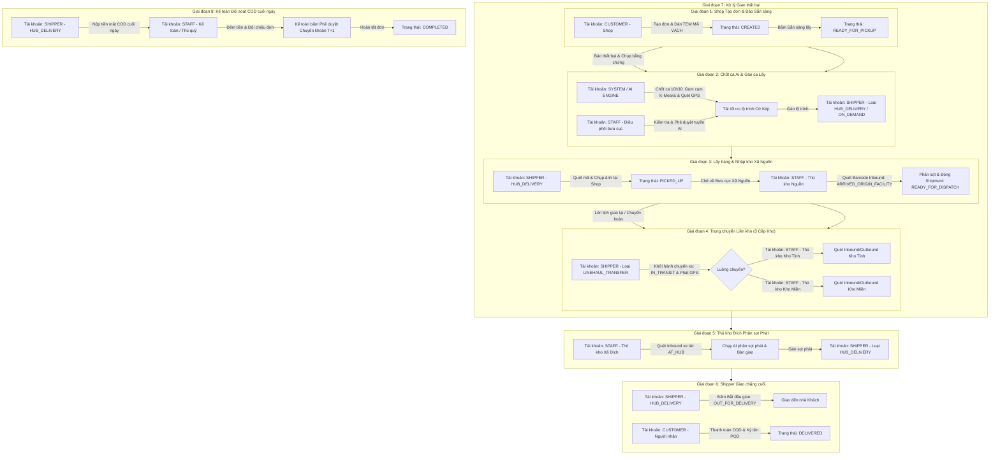

# BÁO CÁO CHI TIẾT QUY TRÌNH LUÂN CHUYỂN ĐƠN HÀNG VÀ PHÂN NGHỆP VỤ TÀI KHOẢN (ACCOUNT & ROLE MATRIX)

**Dự án**: Smart Logistics Platform (SLP)  
**Ngày cập nhật**: 06/08/2026  
**Ngôn ngữ**: Tiếng Việt  

---

## I. TỔNG QUAN PHÂN CẤP TÀI KHOẢN & LOẠI NHÂN VIÊN / TÀI XẾ

Hệ thống **Smart Logistics Platform** quy định rõ 4 Nhóm Vai trò Tài khoản (`Role`) và 3 Loại Tài xế chuyên biệt (`DriverType`):

### 1. Phân loại Vai trò Tài khoản (`Role`):
* **`CUSTOMER` (Khách hàng)**: Tài khoản Shop gửi hàng hoặc Khách hàng mua hàng.
* **`STAFF` (Nhân viên)**: Tài khoản nhân viên bưu cục, chia thành các nghiệp vụ chuyên môn:
  * **Thủ kho Bưu cục / Kho Tổng**: Quét mã Inbound/Outbound, cân đo, đóng sọt hàng.
  * **Điều phối viên (Dispatcher)**: Phê duyệt tuyến AI, gán ca lấy/giao, xử lý sự cố.
  * **Kế toán / Thủ quỹ (Accountant/Cashier)**: Thu tiền mặt COD từ Shipper, đối soát & duyệt chuyển khoản T+1 cho Shop.
* **`SHIPPER` / Driver (Tài xế)**: Tài khoản lái xe trực tiếp giao nhận.
* **`ADMIN` (Quản trị viên)**: Quyền tối cao toàn hệ thống.

### 2. Phân loại Loại Tài xế (`DriverType`):
* **`HUB_DELIVERY` (Tài xế Bưu cục / Shipper chặng đầu & chặng cuối)**: Lái xe máy/xe van nhỏ chuyên lấy hàng tại Shop và giao hàng đến nhà Người nhận trong địa bàn Phường/Xã.
* **`LINEHAUL_TRANSFER` (Tài xế Xe tải Trung chuyển Đường dài)**: Lái xe tải lớn/xe container chuyên chở các Vận đơn (`Shipment`) luân chuyển liên kho (Xã $\rightarrow$ Tỉnh $\rightarrow$ Miền).
* **`ON_DEMAND` (Tài xế Giao nhanh / Tức thì)**: Tài xế chạy ca linh hoạt giao hàng hỏa tốc.

---

## II. MA TRẬN TÀI KHOẢN & HÀNH ĐỘNG THEO 8 GIAI ĐOẠN

---

## III. BẢNG CHI TIẾT PHÂN CÔNG TÀI KHOẢN THEO TỪNG GIAI ĐOẠN

| Giai đoạn | Loại Tài khoản (`Role`) | Nghiệp vụ / Loại Nhân viên / DriverType | Hành động thực tế thực hiện trên Phần mềm |
| :--- | :--- | :--- | :--- |
| **1. Tạo đơn** | `CUSTOMER` | Khách hàng Gửi (Shop) | Đăng nhập Web/App $\rightarrow$ Điền thông tin đơn $\rightarrow$ Tạo đơn (`CREATED`) $\rightarrow$ Dán tem mã vạch $\rightarrow$ Bấm **"Sẵn sàng lấy"** (`READY_FOR_PICKUP`). |
| **2. Chốt ca AI** | `SYSTEM` & `STAFF` | Hệ thống AI & Nhân viên Điều phối Bưu cục | Đúng 10h30/15h30: AI gom cụm đơn K-Means $\rightarrow$ Quét GPS Shipper ngoài đường $\rightarrow$ Trộn đơn Giao tồn & Đơn Lấy mới $\rightarrow$ Điều phối viên duyệt gán ca. |
| **2. Nhận ca lấy** | `SHIPPER` | DriverType = `HUB_DELIVERY` / `ON_DEMAND` | Nhận thông báo Ca lấy mới $\rightarrow$ Mở Mobile App xem bản đồ **Cờ Đỏ 🔴 (Giao)** & **Cờ Xanh 🟢 (Lấy)** theo chuỗi lộ trình tái tối ưu. |
| **3. Đi lấy** | `SHIPPER` | DriverType = `HUB_DELIVERY` | Di chuyển đến địa chỉ Shop $\rightarrow$ Mở Camera quét tem barcode trên bưu kiện $\rightarrow$ Chụp ảnh bằng chứng $\rightarrow$ Xác nhận đã lấy (`PICKED_UP`) $\rightarrow$ Chở về kho Xã Nguồn. |
| **3. Nhập kho Xã** | `STAFF` | Thủ kho Bưu cục Xã Nguồn | Quét mã vạch Inbound nhập bưu cục (`ARRIVED_ORIGIN_FACILITY`) $\rightarrow$ Cân đo $\rightarrow$ Gom các đơn cùng tuyến thành Vận đơn (`Shipment`) $\rightarrow$ Bàn giao xe tải (`READY_FOR_DISPATCH`). |
| **4. Trung chuyển**| `SHIPPER` | DriverType = `LINEHAUL_TRANSFER` | Tiếp nhận Chuyến xe xe tải $\rightarrow$ Bấm **"Khởi hành"** (`IN_TRANSIT`) $\rightarrow$ Bật GPS ngầm $\rightarrow$ Lái xe tải vận chuyển qua các trạm trung chuyển Kho Tỉnh & Kho Miền. |
| **4. Trạm Kho Tỉnh**| `STAFF` | Thủ kho Kho Tỉnh (`PROVINCIAL_HUB`) | Quét Barcode Check-in/Check-out tại Kho Tỉnh $\rightarrow$ Phân luồng: Xuất về Bưu cục Xã Đích (nếu Nội tỉnh) hoặc Xuất lên Kho Miền (nếu Liên tỉnh). |
| **4. Trạm Kho Miền**| `STAFF` | Thủ kho Kho Miền (`SORTING_CENTER`) | Quét Barcode tự động nhập/xuất kho tại Kho Phân Loại Miền Nguồn và Miền Đích. |
| **5. Nhập kho Đích**| `STAFF` | Thủ kho Bưu cục Xã Đích | Quét Barcode Inbound nhận xe tải cập bến (`AT_HUB`) $\rightarrow$ Bấm **"Chạy AI phân sọt phát"** $\rightarrow$ Bàn giao sọt phát cho Shipper chặng cuối. |
| **6. Đi giao** | `SHIPPER` | DriverType = `HUB_DELIVERY` / `ON_DEMAND` | Nhận sọt phát $\rightarrow$ Bấm **"Bắt đầu giao"** (`OUT_FOR_DELIVERY`) $\rightarrow$ Gọi điện báo khách $\rightarrow$ Di chuyển tới nhà Người nhận. |
| **6. Giao thành công**| `CUSTOMER` & `SHIPPER`| Người nhận & Shipper Giao | Người nhận trả tiền mặt COD $\rightarrow$ Shipper quét barcode $\rightarrow$ Mở khung cho Khách **KÝ TÊN POD** hoặc chụp ảnh bằng chứng $\rightarrow$ Hoàn thành (`DELIVERED`). |
| **7. Giao thất bại**| `SHIPPER` & `STAFF`| Shipper Giao & Điều phối Bưu cục | Shipper chọn lý do thất bại + chụp ảnh bằng chứng (`DELIVERY_FAILED`) $\rightarrow$ Mang hàng về kho $\rightarrow$ Điều phối viên sắp xếp ca giao lại hoặc bấm Chuyển hoàn (`RETURNING`). |
| **8. Nộp tiền COD**| `SHIPPER` | DriverType = `HUB_DELIVERY` | Cuối ngày về bưu cục $\rightarrow$ Mở Mobile App gửi **"Yêu cầu nộp tiền COD"** $\rightarrow$ Bàn giao tiền mặt cho Thủ quỹ. |
| **8. Đối soát T+1**| `STAFF` | Kế toán / Thủ quỹ (`ACCOUNTANT` / `CASHIER`) | Kế toán nhập số tiền mặt đếm được trên Web Console $\rightarrow$ Hệ thống tự đối chiếu với tiền hệ thống $\rightarrow$ Phê duyệt chuyển khoản COD T+1 cho Shop $\rightarrow$ Đóng đơn (`COMPLETED`). |

Tài liệu hợp nhất mã hóa tài khoản đã được lưu tại [bao_cao_quy_trinh_don_hang_va_actor.md](file:///d:/smart-logistics-platform/Design%20DB/bao_cao_quy_trinh_don_hang_va_actor.md).
