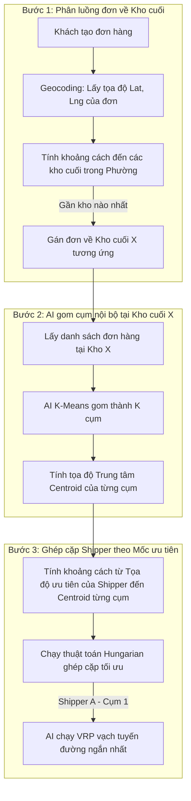

# Đề Xuất Giải Pháp: Tối Ưu Hóa Định Tuyến Chặng Cuối Kết Hợp Tọa Độ Mốc Ưu Tiên Của Shipper (Driver Affinity)

Tài liệu này đề xuất phương án cải tiến thuật toán điều phối đơn hàng tại Kho cuối (Last-mile Hub). Thiết kế này giải quyết bài toán thực tế khi **cơ sở dữ liệu không sử dụng cấp Quận/Huyện** và **trong cùng một Phường/Xã có nhiều kho cuối cùng hoạt động**.

---

## 1. Đặt Vấn Đề (Problem Statement)

Trong kiến trúc cơ sở dữ liệu phẳng hiện tại:
* Hệ thống chỉ quản lý địa chỉ theo cấu trúc: `AddressLine1` $\rightarrow$ `Ward` (Phường/Xã) $\rightarrow$ `Province` (Tỉnh/Thành phố). Không có cấp Quận/Huyện.
* **Thách thức:** Một Phường/Xã có thể có diện tích rất lớn và có tới **10 kho cuối cùng hoạt động**. 
* Do đó, chúng ta **không thể sử dụng tên Phường/Xã** làm ranh giới phân chia địa bàn hoạt động cho Shipper (vì các kho sẽ bị chồng lấn địa bàn hành chính).

---

## 2. Giải Pháp Đề Xuất: Phân Chia Bằng Tọa Độ GPS Thời Chiều Thực

Để cô lập địa bàn hoạt động giữa các kho cuối và ghép đúng shipper rành đường, chúng tôi sử dụng giải pháp **Tọa độ địa lý (GPS Coordinates)** thay thế hoàn toàn cho địa giới hành chính tĩnh:



### Các bước vận hành chi tiết:

1. **Phân luồng bưu kiện về kho cuối:** Khi khách hàng tạo đơn, hệ thống định vị tọa độ đơn hàng và tự động chuyển đơn về kho cuối gần nhất. Đảm bảo bưu kiện tại Kho X chỉ nằm trong bán kính phục vụ riêng của Kho X.
2. **Gom cụm đơn hàng (Clustering):** AI chạy thuật toán K-Means gom các bưu kiện tại Kho X thành $K$ cụm (với $K$ là số shipper đang làm việc). Tìm ra tọa độ trung tâm (Centroid) của từng cụm.
3. **Phân công theo Mốc ưu tiên (Driver Preferred Location):**
   * Mỗi Shipper đăng ký một **Tọa độ mốc ưu tiên** (ví dụ: Tọa độ nhà riêng hoặc một ngã tư quen thuộc) trên bản đồ.
   * Hệ thống tính khoảng cách đường chim bay từ tọa độ ưu tiên của các shipper đến tâm của các cụm đơn hàng.
   * Thuật toán Hungarian ghép cặp shipper với cụm đơn hàng có khoảng cách tối ưu nhất.
4. **VRP định tuyến:** AI di truyền (Genetic Algorithm) chạy để vạch ra lộ trình giao hàng tối ưu (1 $\rightarrow$ 2 $\rightarrow$ ... $\rightarrow$ N) cho từng shipper đối với cụm bưu kiện được giao.

---

## 3. Cơ Chế Giải Quyết Tranh Chấp Địa Bàn (Conflict Resolution)

Một câu hỏi vận hành quan trọng đặt ra: **Nếu 2 Shipper (hoặc nhiều hơn) đăng ký tọa độ ưu tiên trùng hoặc sát nhau, hệ thống sẽ xử lý thế nào khi chỉ có 1 cụm bưu kiện tại khu vực đó?**

### Giải pháp: Tối ưu hóa chi phí toàn cục (Global Cost Minimization)
Thuật toán Hungarian không hoạt động theo cơ chế gom góp cục bộ (Greedy) mà luôn giải quyết bài toán để **tổng quãng đường di chuyển của toàn đội là ngắn nhất**.

#### Ví dụ minh họa:
Giả sử có 3 Shipper và 3 Cụm đơn hàng ($A$, $B$, $C$):
* **Shipper 1** và **Shipper 2** cùng sống ở **Khu vực A** (tọa độ ưu tiên trùng nhau).
* **Shipper 3** sống ở **Khu vực B**.
* Có 3 cụm đơn hàng cần giao tại: Cụm A (ở khu A), Cụm B (ở khu B), Cụm C (ở khu C - xa).

Hệ thống sẽ chạy thuật toán Hungarian để so sánh các phương án gán đơn:

* **Phương án 1 (Gán lỗi):**
  * Shipper 1 $\rightarrow$ Cụm C (Xa 5km)
  * Shipper 2 $\rightarrow$ Cụm B (Xa 3km)
  * Shipper 3 $\rightarrow$ Cụm A (Xa 4km)
  * *Tổng khoảng cách di chuyển cả đội:* **12 km**

* **Phương án 2 (Tối ưu toàn cục bằng Hungarian):**
  * Shipper 1 $\rightarrow$ Cụm A (0km - đúng vùng ưu tiên)
  * Shipper 3 $\rightarrow$ Cụm B (0km - đúng vùng ưu tiên)
  * Shipper 2 $\rightarrow$ Cụm C (Chấp nhận chạy xa 5km)
  * *Tổng khoảng cách di chuyển cả đội:* **5 km**

$\Rightarrow$ **Hệ thống sẽ chọn Phương án 2.** 

> [!NOTE]
> Một trong hai shipper ở gần nhau sẽ được giao cụm tại khu vực đó. Shipper còn lại sẽ tự động được gán sang cụm đơn hàng gần đó thứ nhì để đảm bảo toàn đội có lộ trình tối ưu nhất. Xung đột được giải quyết hoàn toàn tự động bằng toán học mà không cần can thiệp thủ công.

---

## 4. Thiết Kế Cơ Sở Dữ Liệu Rút Gọn (Database Schema)

Nhờ chuyển sang dùng tọa độ GPS, cơ sở dữ liệu được tối giản hóa tối đa, không cần thêm bảng trung gian phức tạp:

```prisma
// File: schema.prisma

model Driver {
  id                   String                 @id @default(uuid()) @db.Uuid
  employeeCode         String                 @unique @map("employee_code") @db.VarChar(30)
  fullName             String                 @map("full_name") @db.VarChar(150)
  homeFacilityId       String?                @map("home_facility_id") @db.Uuid
  
  // Tọa độ mốc ưu tiên của Shipper (Nhà riêng hoặc khu vực quen thuộc)
  preferredLatitude    Float?                 @map("preferred_latitude")
  preferredLongitude   Float?                 @map("preferred_longitude")
  
  // Quan hệ với Kho cuối quản lý trực tiếp
  homeFacility         Facility?              @relation(fields: [homeFacilityId], references: [id], onDelete: SetNull)
}
```

---

## 5. Trải Nghiệm Người Dùng Trên Giao Diện (UI/UX Workflow)

Để thu thập tọa độ ưu tiên của Shipper một cách chính xác và thuận tiện:
1. **Giao diện Đăng ký/Cập nhật tài xế:** Hệ thống tích hợp một bản đồ số mini (Google Maps hoặc Mapbox).
2. **Thao tác:** Admin hoặc Shipper chỉ cần ghim một cột mốc (Marker) lên vị trí nhà riêng hoặc khu vực họ muốn chạy trên bản đồ.
3. **Lưu dữ liệu:** Hệ thống tự động ghi nhận kinh độ/vĩ độ của điểm ghim đó và lưu vào trường `preferredLatitude`/`preferredLongitude` trong DB.

---

## 6. Câu Hỏi Thảo Luận Nhóm (Team Discussion Points)

1. **Về phía Thuật toán:** Nhóm mình đã có sẵn thư viện tính khoảng cách (ví dụ: công thức Haversine tính khoảng cách giữa hai tọa độ GPS trên mặt cầu) để phục vụ cho thuật toán Hungarian chưa?
2. **Về phía Frontend:** Việc tích hợp Bản đồ số (Map Picker) vào trang thông tin tài xế có gặp trở ngại gì không?
3. **Cấu hình bán kính tối đa:** Có cần giới hạn bán kính tối đa (ví dụ: mốc ưu tiên của Shipper không được cách Kho cuối quá 10km) để tránh việc shipper đăng ký chạy quá xa kho của mình không?
