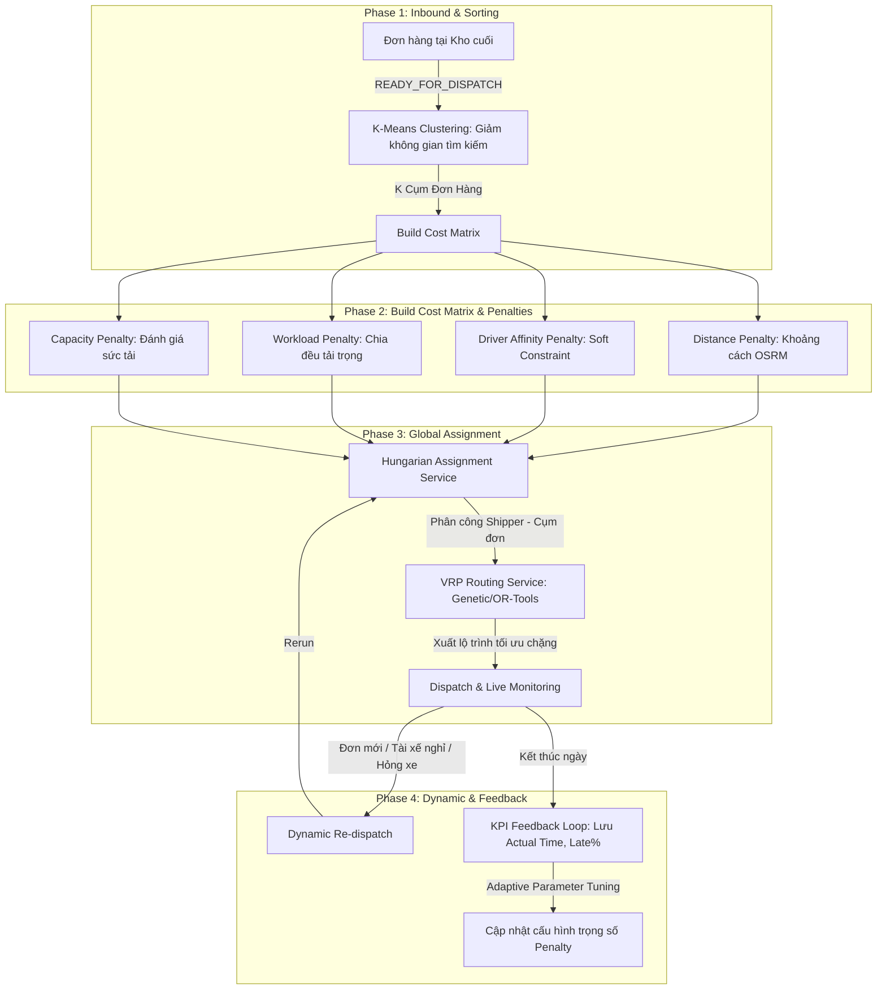

# Đề Xuất Giải Pháp: Tối Ưu Hóa Điều Phối & Định Tuyến Chặng Cuối Cấp Doanh Nghiệp (Enterprise-Grade Last-Mile Routing & Driver Affinity)

Tài liệu này đề xuất phương án cải tiến và mô hình hóa thuật toán điều phối đơn hàng tại Kho cuối (Last-mile Hub). Thiết kế này giải quyết bài toán thực tế khi **cơ sở dữ liệu không sử dụng cấp Quận/Huyện**, **nhiều kho cuối cùng hoạt động trên cùng một Phường/Xã**, và nâng cấp kiến trúc lên **chuẩn Enterprise** để đáp ứng quy mô vận hành công nghiệp.

---

## 1. Đặt Vấn Đề (Problem Statement)

Trong kiến trúc cơ sở dữ liệu phẳng hiện tại:
* Hệ thống chỉ quản lý địa chỉ theo cấu trúc: `AddressLine1` $\rightarrow$ `Ward` (Phường/Xã) $\rightarrow$ `Province` (Tỉnh/Thành phố). Không có cấp Quận/Huyện để chia vùng hành chính tĩnh.
* **Thách thức:** Một Phường/Xã có thể có diện tích rất lớn và có tới **10 kho cuối cùng hoạt động**. 
* Do đó, chúng ta **không thể sử dụng tên Phường/Xã** làm ranh giới phân chia địa bàn hoạt động cho Shipper (vì các kho sẽ bị chồng lấn địa bàn hành chính).
* Để cô lập địa bàn hoạt động giữa các kho cuối và ghép đúng shipper rành đường, chúng tôi sử dụng giải pháp **Tọa độ địa lý (GPS Coordinates)** và mô hình hóa **Mức độ gắn bó với khu vực hoạt động (Driver Affinity)** dưới dạng **Ràng buộc mềm (Soft Constraint)**.

---

## 2. Quy Trình Điều Phối Cấp Doanh Nghiệp (Enterprise Routing Pipeline)

Để đảm bảo hệ thống chạy linh hoạt và thông minh như các hãng vận chuyển lớn (GHN, J&T, DHL), quy trình điều phối được thiết kế theo luồng xử lý sau:



---

## 3. Các Điểm Cải Tiến Đạt Chuẩn Enterprise

### 3.1. Driver Affinity Point thay vì Preferred Location
* **Khái niệm:** Thay vì định nghĩa là "Nhà riêng của Shipper" (Preferred Location), hệ thống gọi là **Driver Affinity Point (Preferred Operating Area)**. 
* **Ý nghĩa:** Đây là khu vực mà Shipper vận hành hiệu quả nhất (có thể do họ quen đường, quen khách ruột, hoặc gần nơi họ thường trực). Hệ thống lưu trữ tọa độ trung tâm này để tính toán.
* **Quy tắc sử dụng định vị GPS thực tế:** Nếu Driver đang Online và có dữ liệu định vị thời gian thực (`DriverLocation`), hệ thống ưu tiên sử dụng vị trí hiện tại của Driver để xây dựng Cost Matrix. **Driver Affinity Point** chỉ được sử dụng làm phương án dự phòng khi Driver chưa vào ca, chưa Online hoặc mất tín hiệu GPS.

### 3.2. Sử dụng Cost Matrix (Ma trận Chi phí) thay vì Distance Matrix
* Thuật toán Hungarian sẽ tối ưu hóa **Ma trận Chi phí (Cost Matrix)** chứ không chỉ tối ưu quãng đường thuần túy.
* Công thức tính chi phí (Penalty Score) cho Shipper $i$ và Cụm đơn $j$ áp dụng chuẩn hóa (Normalize):
$$\text{Penalty}(i,j) = w_1 \times \text{DistanceNorm}(i,j) + w_2 \times \text{AffinityNorm}(i,j) + w_3 \times \text{WorkloadNorm}(i,j) + w_4 \times \text{CapacityNorm}(i,j)$$
* **Ghi chú về chuẩn hóa:** Do các đại lượng có đơn vị đo khác nhau (khoảng cách bằng km, sức tải bằng %, lượng đơn bằng số đơn), mỗi thành phần Penalty được chuẩn hóa về cùng miền giá trị (ví dụ: $0 \rightarrow 1$) trước khi nhân với trọng số nhằm tránh hiện tượng một đại lượng trội hơn hoàn toàn chiếm lĩnh ma trận chi phí.
* **Ưu điểm:** Thiết kế này cho phép hệ thống mở rộng cực kỳ dễ dàng. Sau này nếu muốn thêm các yếu tố như **Kẹt xe (Traffic)**, **Thời tiết (Weather)**, hay **Kỹ năng tài xế (Driver Skill)**, ta chỉ cần cộng thêm các trọng số Penalty vào ma trận chi phí mà hoàn toàn không phải viết lại lõi thuật toán Hungarian.

### 3.3. Driver Affinity là Ràng buộc mềm (Soft Constraint)
* **Nguyên tắc:** Affinity không phải là ràng buộc cứng (Hard Constraint). 
* Nếu khu vực ưu tiên của Shipper A hôm nay chỉ có 2 đơn, trong khi khu vực bên cạnh có 200 đơn, hệ thống sẽ tự động gán Shipper A sang vùng bên cạnh.
* **Cơ chế:** Khoảng cách đến Affinity Point càng gần $\rightarrow$ Penalty càng thấp $\rightarrow$ Hungarian ưu tiên chọn. Nếu phải chạy xa $\rightarrow$ Penalty cao $\rightarrow$ Hungarian chỉ chọn khi thực sự cần thiết (ví dụ thiếu người).

### 3.4. Định tuyến theo đường thực tế (OSRM) thay thế Haversine
* Ở bước lọc ứng viên (Candidate Selection), hệ thống có thể dùng khoảng cách đường thẳng Haversine để tính toán nhanh.
* Tuy nhiên, để tối ưu lộ trình thực tế, hệ thống tích hợp **OSRM (Open Source Routing Machine)** hoặc Goong API để tính khoảng cách di chuyển thực tế theo mạng lưới đường bộ Việt Nam (tránh đường một chiều, sông ngòi, cầu cấm...).
* **Cơ chế dự phòng (Fallback):** Nếu dịch vụ định tuyến đường bộ (OSRM/Goong) tạm thời không khả dụng do sự cố mạng hoặc quá tải API, hệ thống sẽ tự động hạ cấp (fallback) sang sử dụng khoảng cách Haversine làm phương án dự phòng để đảm bảo tiến trình điều phối không bị gián đoạn.

### 3.5. K-Means chỉ đóng vai trò Tiền xử lý (Pre-processing)
* **Dữ liệu đầu vào (Input):** Đầu vào của K-Means là tập hợp các tọa độ giao hàng (`deliveryLatitude`, `deliveryLongitude`) của các đơn hàng đang ở trạng thái `READY_FOR_DISPATCH` tại kho cuối đó.
* **Mục đích:** K-Means **không dùng để chia địa bàn cứng** mà là bước **Giảm không gian tìm kiếm (Reduce Search Space)** cho thuật toán VRP (Vehicle Routing Problem) phía sau, tránh việc VRP phải xử lý quá nhiều Node cùng lúc gây chậm hệ thống (NP-Hard).
* Số lượng cụm $K$ không nhất thiết phải bằng số lượng Driver ($K \approx \text{Số lộ trình dự kiến}$). Hệ thống có thể gộp cụm (Merge Route) linh hoạt nếu một tài xế xe tải lớn có thể cân được nhiều cụm nhỏ.

### 3.6. Tách biệt Assignment Service và Routing Service
* **Assignment Service (Dịch vụ Phân công):** Chịu trách nhiệm gán Shipper nào cho cụm đơn nào (sử dụng Hungarian).
* **Routing Service (Dịch vụ Vẽ tuyến):** Chịu trách nhiệm sắp xếp thứ tự giao trong cụm đó (sử dụng Genetic Algorithm hoặc Google OR-Tools).
* **Kiến trúc:** Việc tách biệt giúp hệ thống dễ bảo trì. Bạn có thể nâng cấp thuật toán vẽ tuyến (Routing) mà không gây ảnh hưởng đến logic phân công (Assignment).

### 3.7. Hỗ trợ Điều phối động lại (Dynamic Re-dispatch)
* Vận hành thực tế luôn có biến số: Phát sinh đơn mới giữa ca, shipper nghỉ đột xuất, hoặc xe hỏng giữa đường.
* Hệ thống hỗ trợ **Re-dispatch**: Chạy lại thuật toán Hungarian và VRP trên các đơn chưa giao để phân bổ lại lộ trình tối ưu thời gian thực.

### 3.8. Vòng lặp phản hồi KPI (KPI Feedback Loop)
* Cuối ngày, hệ thống ghi nhận các thông số vận hành thực tế: *Quãng đường thực tế di chuyển, Tỷ lệ trễ hạn (Late %), Tỷ lệ giao thất bại (Failed %)*.
* Dữ liệu này hỗ trợ việc điều chỉnh các hệ số trọng số Penalty ($w_1, w_2, w_3, w_4$) theo cấu hình hoặc áp dụng các quy tắc định sẵn (Rule-based Tuning) nhằm tối ưu hóa hiệu quả điều phối cho các ngày tiếp theo mà không làm tăng độ phức tạp học máy của hệ thống.

### 3.9. Xử lý Quá tải & Phân luồng Vận hành (Overload & Fleet Management)
Để giải quyết bài toán thực tế khi shipper giao tuyến tiêu chuẩn đã đầy sọt hàng nhưng hệ thống lại phát sinh các đơn hỏa tốc đường dài (tránh shipper bị quá tải và gây trễ đơn tiêu chuẩn), hệ thống áp dụng cơ chế 2 lớp:
* **Tầng Nghiệp vụ (Fleet Segmentation):** Bổ sung phân loại tài xế (`driverType` gồm `HUB_DELIVERY` và `ON_DEMAND`). Các đơn hàng hỏa tốc chỉ được phân phối cho tài xế `ON_DEMAND` và ngược lại, tạo bộ lọc loại bỏ ngay từ đầu trước khi đưa vào ma trận.
* **Tầng Thuật toán (Hard Penalty Cutoff):** Trong trường hợp bưu cục nhỏ dùng chung tài xế cho cả 2 dịch vụ, hệ thống sẽ tính toán thời gian hoàn thành dự kiến của tài xế (gồm thời gian giao sọt hàng hiện tại + thời gian di chuyển giao đơn gấp). Nếu tổng thời gian vượt quá ca làm việc (ví dụ 8 tiếng) hoặc làm vi phạm giờ cam kết (SLA) của các đơn hàng sẵn có trong sọt, thuật toán sẽ tự động gán giá trị Penalty cho cặp này là **Vô cùng ($\infty$)**. Thuật toán Hungarian sẽ loại bỏ hoàn toàn việc ghép cặp này, bắt buộc phải chọn shipper khác rảnh hơn.

### 3.10. Phân biệt Luồng Trạng Thái Đơn hàng Thường vs Đơn Hỏa tốc
Vì đơn hỏa tốc không đi qua Hub để phân loại và trung chuyển, hệ thống thiết kế luồng trạng thái ngắn gọn hơn, bỏ qua các bước lưu kho trung gian để tối ưu tốc độ xử lý:
* **Luồng đơn thường (Standard Flow):** `CREATED` $\rightarrow$ `READY_FOR_PICKUP` $\rightarrow$ `PICKED_UP` $\rightarrow$ `ARRIVED_ORIGIN_FACILITY` $\rightarrow$ `IN_TRANSIT` $\rightarrow$ `AT_HUB` $\rightarrow$ `READY_FOR_DISPATCH` $\rightarrow$ `OUT_FOR_DELIVERY` $\rightarrow$ `DELIVERED`.
* **Luồng đơn hỏa tốc (Express/Instant Point-to-Point Flow):** `CREATED` $\rightarrow$ `READY_FOR_PICKUP` $\rightarrow$ `PICKED_UP` $\rightarrow$ `IN_TRANSIT` (đang trên đường giao trực tiếp) $\rightarrow$ `OUT_FOR_DELIVERY` $\rightarrow$ `DELIVERED`.
* **Cơ chế vận hành:** Backend kiểm tra loại hình dịch vụ (`serviceType`). Nếu là dịch vụ hỏa tốc (Express/Instant), hệ thống cho phép đơn hàng bỏ qua các bước kiểm tra điều kiện kho bãi (Hub check-in/sorting) và đi thẳng từ trạng thái đã lấy hàng sang trạng thái đang trên đường giao hàng chặng cuối.

---

## 4. Thiết Kế Cơ Cơ Dữ Liệu Chi Tiết (Database Mapping)

Dưới đây là các bảng và trường thông tin trong cơ sở dữ liệu hiện tại của bạn sẽ được sử dụng cho chức năng này:

### A. Bản đồ các bảng & trường thông tin sử dụng:

| Tên Bảng | Tên Trường (Field) | Trạng thái trong DB | Vai trò trong chức năng |
| :--- | :--- | :---: | :--- |
| **`Driver`** <br>*(Tài xế)* | `id` (UUID) <br>`fullName` <br>`homeFacilityId` | **Đã có sẵn** | Xác định thông tin tài xế và kho quản lý trực tiếp (`homeFacility`). |
| | `preferredLatitude` <br>`preferredLongitude` | ⚠️ **CẦN THÊM MỚI** | Tọa độ mốc ưu tiên (kinh độ/vĩ độ) do tài xế đăng ký làm **Driver Affinity Point**. |
| | `driverType` (Enum) | ⚠️ **CẦN THÊM MỚI** | Phân loại nhóm shipper (`HUB_DELIVERY` / `ON_DEMAND`) để phân luồng đơn hàng. |
| **`DriverLocation`** <br>*(Định vị realtime)* | `driverId` <br>`latitude`, `longitude` <br>`recordedAt` | **Đã có sẵn** | Tọa độ thực tế lúc đang chạy (dùng để tính toán khoảng cách xuất phát thực tế của tài xế). |
| **`Order`** <br>*(Đơn hàng)* | `id` (UUID) <br>`status` <br>`destinationFacilityId` | **Đã có sẵn** | Lọc danh sách đơn hàng sẵn sàng giao tại Kho cuối (`READY_FOR_DISPATCH` / `AT_HUB`). |
| | `deliveryLatitude` <br>`deliveryLongitude` | **Đã có sẵn** | Tọa độ giao chặng cuối của khách hàng (dùng để chạy thuật toán K-Means gom cụm). |
| **`Route`** <br>*(Chuyến giao)* | `id` (UUID) <br>`driverId` <br>`status` | **Đã có sẵn** | Lưu kết quả chuyến giao hàng tối ưu sau khi thuật toán chạy xong. |
| **`RouteStop`** <br>*(Điểm dừng)* | `id` (UUID) <br>`routeId` <br>`sequence` <br>`latitude`, `longitude` | **Đã có sẵn** | Lưu danh sách thứ tự các điểm dừng cần giao (1 -> 2 -> 3) trong tuyến. |

---

### B. Cấu trúc Schema cần cập nhật:

Để áp dụng chức năng này, bạn cần cập nhật model `Driver` và thêm Enum `DriverType` vào file `schema.prisma` như sau:

```prisma
// File: backend/prisma/schema.prisma

enum DriverType {
  HUB_DELIVERY
  ON_DEMAND
}

model Driver {
  id                   String                 @id @default(uuid()) @db.Uuid
  // ... (các trường hiện tại) ...

  // ⚠️ THÊM MỚI: Tọa độ mốc ưu tiên của Shipper (Driver Affinity Point)
  preferredLatitude    Float?                 @map("preferred_latitude")
  preferredLongitude   Float?                 @map("preferred_longitude")
  
  // ⚠️ THÊM MỚI: Phân loại tài xế để phân luồng hỏa tốc/tiêu chuẩn
  driverType           DriverType             @default(HUB_DELIVERY) @map("driver_type")
  
  // Relations
  homeFacility         Facility?              @relation(fields: [homeFacilityId], references: [id], onDelete: SetNull)
  // ...
}
```

---

## 5. Trải Nghiệm Người Dùng Trên Giao Diện (UI/UX Workflow)

Để thu thập tọa độ ưu tiên của Shipper một cách chính xác và thuận tiện:
1. **Giao diện Đăng ký/Cập nhật tài xế:** Hệ thống tích hợp một bản đồ số mini (Leaflet / Google Maps).
2. **Thao tác:** Admin hoặc Shipper chỉ cần ghim một cột mốc (Marker) lên vị trí khu vực họ muốn chạy trên bản đồ.
3. **Lưu dữ liệu:** Hệ thống tự động ghi nhận kinh độ/vĩ độ của điểm ghim đó và lưu vào trường `preferredLatitude`/`preferredLongitude` trong DB.

---

## 6. Câu Hỏi Thảo Luận Nhóm (Team Discussion Points)

1. **Về phía Thuật toán:** Chúng ta sẽ cài đặt thư viện tính khoảng cách thực tế (ví dụ: gọi OSRM server hoặc Goong API) để thay thế dần Haversine ở các bước tính toán chi phí chính xác hay chưa?
2. **Cấu hình Trọng số:** Chúng ta nên để các hệ số trọng số Penalty ($w_1, w_2, w_3, w_4$) ở dạng biến môi trường (`.env`) hay lưu ở bảng `SystemSetting` trong DB để Admin có thể cấu hình động trực tiếp từ màn hình Admin Dashboard?
3. **Ràng buộc tải trọng:** Hệ thống đã lấy được thông tin `maxWeight` và `maxVolume` của xe gán cho Driver để kiểm tra sức tải của cụm đơn hàng hay chưa?
