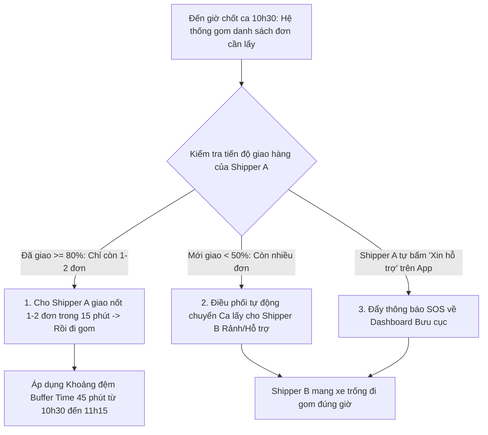

# GIẢI PHÁP ĐIỀU PHỐI ĐƠN LẤY HÀNG THỰC TẾ & XỬ LÝ SỰ CỐ CHƯA GIAO HẾT HÀNG

**Dự án**: Smart Logistics Platform (SLP)  
**Ngày cập nhật**: 06/08/2026  

---

## I. TỔNG QUAN PHƯƠNG ÁN 1: GOM ĐƠN THEO KHUNG GIỜ CHỐT CA (BATCHING & CUT-OFF WINDOWS)

Trong mô hình chốt ca cố định (Chuẩn GHN / GHTK / Shopee Xpress):
* **Ca Sáng (Chốt đơn lúc 10h30)** $\rightarrow$ Đi gom từ 11h00 - 12h15.
* **Ca Chiều (Chốt đơn lúc 15h30)** $\rightarrow$ Đi gom từ 16h00 - 17h30.

---

## II. XỬ LÝ SỰ CỐ: "ĐẾN GIỜ CHỐT CA 10H30 NHƯNG SHIPPER CHƯA GIAO HẾT HÀNG"

Đây là rủi ro vận hành thực tế rất phổ biến (do kẹt xe, khách hẹn trễ, đơn giao quá đông). Hệ thống SLP giải quyết bài toán này bằng **4 cơ chế phối hợp linh hoạt**:

---

### GIẢI PHÁP 1: KHOẢNG ĐỆM THỜI GIAN (BUFFER TIME 45 PHÚT)
* **Cơ chế**: Đặt **Khoảng đệm (Buffer Time)** giữa Giờ chốt danh sách đơn và Giờ xuất phát đi gom.
* **Lịch trình thực tế**:
  * **10h30**: Chốt danh sách đơn Shop bấm "Sẵn sàng lấy".
  * **10h30 - 11h15 (Khoảng đệm 45 phút)**: Thời gian cho Shipper xử lý nốt các đơn giao cuối cùng ca sáng.
  * **11h15 - 12h15**: Shipper chính thức di chuyển đi gom hàng từ các Shop về bưu cục.
* **Hiệu quả**: Nhờ có 45 phút khoảng đệm, **95% Shipper sẽ phát xong sạch sẽ thùng xe** trước khi đi gom!

---

### GIẢI PHÁP 2: TỰ ĐỘNG CHUYỂN CA LẤY CHO SHIPPER HỖ TRỢ (DYNAMIC OVERFLOW RE-ASSIGNMENT)
* **Cơ chế**: Đúng 10h30, hệ thống kiểm tra tiến độ giao của Shipper A phụ trách Phường đó:
  * **Nếu Shipper A còn $> 5$ đơn giao chưa phát** $\rightarrow$ Hệ thống hiển thị **Cảnh báo Vàng** trên Dashboard Bưu cục: *"Shipper A đang chậm tiến độ giao hàng (còn 6 đơn)"*.
  * **Hành động của Điều phối viên / Hệ thống**:
    * Chuyển Ca lấy này cho **Shipper B** (đồng nghiệp cùng bưu cục đã giao xong sớm) hoặc **Shipper trực bưu cục**.
    * Shipper B mang xe trống đi gom thay cho Shipper A.

---

### GIẢI PHÁP 3: TÍNH NĂNG "XIN HỖ TRỢ LẤY HÀNG" (SUPPORT REQUEST ON MOBILE APP)
* **Cơ chế**:
  * Trên ứng dụng Mobile của Shipper, khi đến 10h15 mà Shipper nhận thấy mình gặp sự cố (kẹt xe, phát sinh đơn giao khó) không thể giao xong trước 11h00.
  * Shipper bấm nút **"Báo trễ & Xin hỗ trợ lấy hàng"**.
  * Yêu cầu ngay lập tức phát tín hiệu SOS về Web Dashboard của Bưu cục để Điều phối viên chủ động cắt đơn lấy cho tài xế khác.

---

### GIẢI PHÁP 4: NGUYÊN TẮC SỌT KÉP & LẤY Ở ĐIỂM DỪNG CUỐI (DUAL BAG & LAST-STOP PICKUP)
* Trong trường hợp Bưu cục ít người, Shipper A vẫn bắt buộc phải tự đi lấy:
  * **Thiết kế sọt xe**: Shipper dùng 2 sọt/túi phân biệt:
    * *Sọt chính*: Chứa hàng giao chưa phát hết.
    * *Túi phụ / Sọt sau*: Dành riêng chứa hàng gom mới lấy từ Shop.
  * **Lộ trình chèn**: Các điểm lấy từ Shop được tự động xếp thành **các điểm dừng cuối cùng (Last Stops)** của lộ trình buổi sáng, sau khi đã phát xong hầu hết hàng giao.

---

## III. TỔNG KẾT BẢNG SO SÁNH QUY TRÌNH XỬ LÝ

| Tình huống thực tế lúc 10h30 | Cách hệ thống & Bưu cục xử lý | Kết quả vận hành |
| :--- | :--- | :--- |
| **Shipper A đã phát xong 100%** | Shipper A nhận Ca lấy 10h30 $\rightarrow$ Mang xe trống đi gom. | ✅ Rất mượt mà |
| **Shipper A còn 1 - 2 đơn giao** | Nhờ **Buffer Time**, Shipper A phát nốt 2 đơn (10-15 phút) rồi mới đi gom. | ✅ Đảm bảo tiến độ |
| **Shipper A còn > 5 đơn giao** | Bưu cục/Hệ thống điều Shipper B (đã xong việc) đi gom thay. | ✅ Không bị vướng hàng |
| **Shipper A gặp sự cố (kẹt xe)** | Shipper A bấm **"Xin hỗ trợ"** trên App Mobile $\rightarrow$ Bưu cục can thiệp. | ✅ Chủ động xử lý sự cố |

Nhờ sự kết hợp giữa **Khoảng đệm Buffer Time 45 phút** và **Cơ chế Chuyển ca hỗ trợ**, bạn hoàn toàn yên tâm áp dụng **Phương án 1 (Chốt ca cố định)** mà không sợ rủi ro Shipper chưa giao hết hàng!
