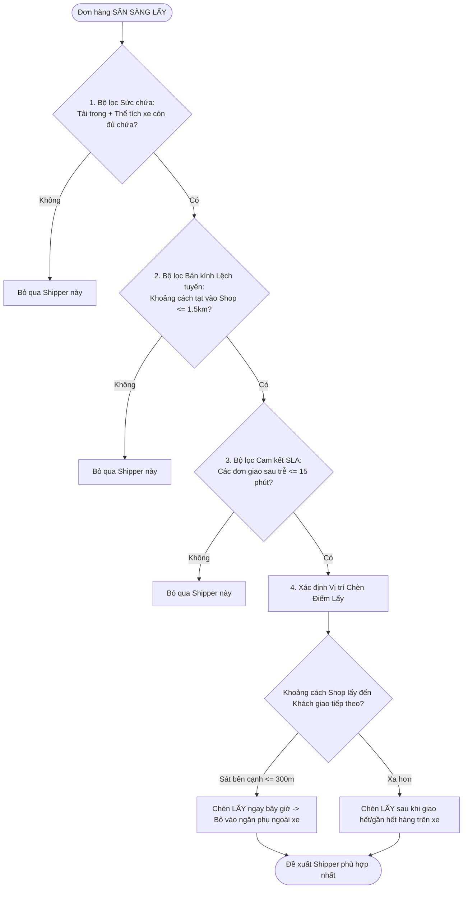

# GIẢI PHÁP ĐIỀU PHỐI ĐƠN LẤY ĐỘNG KHI SHIPPER VẪN CÒN HÀNG TRÊN XE (DYNAMIC PICKUP INSERTION)

**Dự án**: Smart Logistics Platform (SLP)  
**Tác giả**: Antigravity AI Team  
**Ngày lập**: 06/08/2026  

---

## I. ĐẶT BÀI TOÁN & THÁCH THỨC THỰC TẾ

Khi một đơn hàng chuyển sang trạng thái **Sẵn sàng lấy (`READY_FOR_PICKUP`)**, Nhân viên điều phối hoặc Thuật toán AI cần gán đơn lấy này cho một Shipper đang di chuyển ngoài đường dựa trên vị trí GPS thời gian thực.

* **Trường hợp 1 - Shipper RẢNH (Thùng xe trống / Đã giao xong hết)**: Rất đơn giản, chỉ cần chọn Shipper có khoảng cách GPS gần Shop nhất và gán đơn.
* **Trường hợp 2 - Shipper VẪN CÒN HÀNG GIAO TRÊN XE (Carrying Active Delivery Packages)**: Đây là bài toán phức tạp vì gặp 4 vướng mắc lớn:
  1. **Ràng buộc Tải trọng & Thể tích (Capacity Constraint)**: Thùng xe tải/xe máy có còn đủ thể tích nhồi thêm thùng hàng lấy mới không?
  2. **Tránh kẹt hàng / Xếp dỡ LIFO (Last-In-First-Out Constraint)**: Lấy gói hàng mới bỏ vào xe sẽ đè lên các gói hàng cũ. Khi đi giao gói hàng cũ nằm sâu bên trong, Shipper phải bốc gói mới ra rất vất vả.
  3. **Trễ cam kết giờ giao (SLA / Time-Window Violation)**: Tạt vào lấy đơn mới có làm trễ hẹn 5-10 đơn giao phía sau không?
  4. **Chi phí lệch tuyến (Detour Distance)**: Điểm lấy mới có quá xa khỏi hành trình giao hàng hiện tại không?

---

## II. GIẢI PHÁP KỸ THUẬT & THUẬT TOÁN 4 BỘ LỌC (4-STEP FILTERING ALGORITHM)

Để xử lý bài toán này, hệ thống áp dụng **Thuật toán Chèn Động (Dynamic Insertion Algorithm)**. Khi có đơn mới `READY_FOR_PICKUP`, hệ thống tự động chạy qua **4 Bộ lọc an toàn** trước khi đề xuất cho Nhân viên hoặc Gán tự động:



### Chi tiết 4 Bộ lọc Thuật toán:

1. **Bộ lọc 1: Sức chứa khả dụng (`Remaining Capacity Check`)**
   - $\sum \text{Trọng lượng hiện tại} + \text{Trọng lượng đơn mới} \le \text{Sức chứa tối đa của Xe}$
   - $\sum \text{Thể tích hiện tại} + \text{Thể tích đơn mới} \le \text{Thể tích tối đa của Xe}$
   - *Nếu quá tải $\rightarrow$ Vô hiệu hóa Shipper này.*

2. **Bộ lọc 2: Bán kính Lệch tuyến tối đa (`Max Detour Threshold`)**
   - Vị trí Shop lấy hàng chỉ được lệch khỏi quãng đường di chuyển hiện tại của Shipper không quá **1.5 km** (hoặc thời gian di chuyển tăng thêm $\le 7$ phút).

3. **Bộ lọc 3: Cam kết Thời gian Giao hàng (`SLA Violation Guard`)**
   - Việc tạt vào lấy hàng mới **KHÔNG ĐƯỢC** làm các đơn giao `DELIVERY` dự kiến phía sau bị trễ hẹn quá 15 phút so me cam kết với Khách nhận.

4. **Bộ lọc 4: Vị trí Chèn Lộ trình tối ưu (`Optimal Insertion Sequence`)**
   - **Tình huống A (Shop ở rất gần điểm giao kế tiếp $\le 300m$)**: Cho phép Shipper tạt vào lấy luôn, gói hàng mới để ở túi phụ / sọt ngoài xe để không chắn hàng giao cũ.
   - **Tình huống B (Shop ở xa hơn)**: Đặt điểm `PICKUP` này nằm ở **CUỐI CHUỖI GIAO HÀNG** (sau khi Shipper đã phát xong 70-80% số hàng trên xe).

---

## III. MÔ HÌNH VẬN HÀNH THỰC TẾ (OPERATIONAL STRATEGIES)

Nếu thuật toán quá phức tạp hoặc mật độ đơn hàng trong ngày quá cao, dự án logistics áp dụng **3 Mô hình phân tách đội xe**:

### 1. Mô hình Phân ca Giao - Nhận (Time-Window Shift)
* **Ca Sáng (08h00 - 11h30)**: Tập trung **90% GIAO HÀNG**. Đội xe chở đầy hàng đi phát cho người nhận để làm trống thùng xe.
* **Ca Trưa / Chiều (11h30 - 14h00 & 16h00 - 18h00)**: Tập trung **LẤY HÀNG**. Lúc này các Shop đã đóng gói hàng xong nhiều nhất và thùng xe Shipper đã vắng hàng, xe đi một vòng thu gom về bưu cục.

### 2. Mô hình Đội xe Hỗn hợp & Chuyên biệt (Fleet Role Division)
* **Shipper Chuyên Giao (Dedicated Delivery Shipper)**: Chỉ mang hàng từ bưu cục đi phát chặng cuối. Không gán đơn lấy mới giữa chừng để đảm bảo tỷ lệ thành công 100%.
* **Shipper Chuyên Lấy (Dedicated Pickup Shipper)**: Chuyên tuyến gom hàng từ các Shop lớn về bưu cục.
* **Shipper Linh hoạt (Dynamic Shipper)**: Nhận cả giao lẫn lấy dựa trên đề xuất của thuật toán AI 4 Bộ lọc.

### 3. Mô hình Điểm Gửi Hàng Tập Trung (Drop-off Point / PUDO)
* Nếu tất cả Shipper ngoài đường đều đang đầy xe hoặc không tiện đường, ứng dụng báo cho Shop lựa chọn:
  * **Lựa chọn A**: Chờ Shipper ca sau (Ca chiều) đến lấy tại nhà.
  * **Lựa chọn B (Gửi nhanh)**: Shop tự mang hàng ra Bưu cục Phường/Xã (`Ward Station`) gần nhất trong bán kính 1km và được **chiết khấu 10-15% cước phí gửi**.

---

## IV. THIẾT KẾ GIAO DIỆN MÀN HÌNH ĐIỀU PHỐI (DISPATCH CONSOLE UX)

Trên màn hình Web App dành cho **Nhân viên Điều phối tại Bưu cục**, khi bấm vào một đơn `READY_FOR_PICKUP`, màn hình hiển thị danh sách **Top 3 Shipper phù hợp nhất** được thuật toán xếp hạng:

```
+------------------------------------------------------------------------------------+
| 📦 ĐƠN HÀNG: #ORD-8892 | Địa chỉ lấy: 142 Nguyễn Thị Minh Khai, Q.3 (Sẵn sàng)    |
+------------------------------------------------------------------------------------+
| DANH SÁCH SHIPPER GỢI Ý ĐIỀU PHỐI:                                                  |
|                                                                                    |
| 🟢 1. NGUYỄN VĂN A (Biển xe: 59-P1 123.45)                                        |
|    - Vị trí: Cách Shop 450m (Đang ở đường Lê Quý Đôn)                               |
|    - Trạng thái xe: Đã giao 8/10 đơn (Còn 2 đơn giao - Thùng xe TRỐNG 80%)          |
|    - Độ lệch tuyến: +300m (+2 phút)                                                |
|    👉 [GỌI Ý TỐT NHẤT - BẤM GÁN ĐƠN]                                                |
|                                                                                    |
| 🟡 2. TRẦN VĂN B (Biển xe: 59-X2 888.99)                                        |
|    - Vị trí: Cách Shop 1.2 km                                                      |
|    - Trạng thái xe: Đã giao 3/12 đơn (Còn 9 đơn giao - Thùng xe ĐẦY 75%)            |
|    - Độ lệch tuyến: +1.1 km (+5 phút - Làm trễ 2 đơn giao 10 phút)                 |
|    👉 [GÁN ĐƠN (GIAO XONG MỚI LẤY)]                                                |
|                                                                                    |
| 🔴 3. LÊ VĂN C (Biển xe: 59-K1 555.44)                                        |
|    - Vị trí: Cách Shop 800m                                                        |
|    - Trạng thái xe: Thùng xe ĐẦY 100% (Không còn chỗ chứa)                          |
|    👉 [CẢNH BÁO: XE QUÁ TẢI - NÚT GÁN BỊ KHÓA]                                     |
+------------------------------------------------------------------------------------+
```

---

## V. TỔNG KẾT

Nhờ **Thuật toán Chèn Động 4 Bộ Lọc** kết hợp với **Giao diện Cảnh báo Trực quan trên Web Console**, Nhân viên điều phối sẽ không bao giờ gặp tình trạng gán nhầm đơn cho tài xế đang quá tải hoặc làm xáo trộn lộ trình giao hàng có sẵn!
