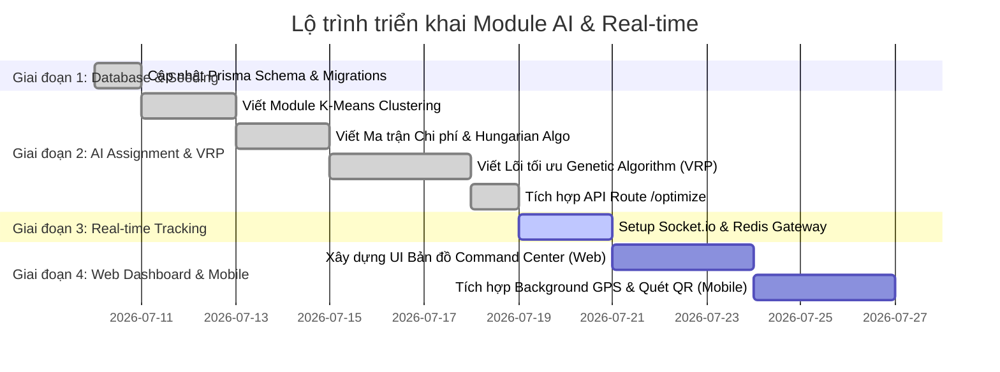

# KẾ HOẠCH TRIỂN KHAI: ĐIỀU PHỐI ĐƠN HÀNG BẰNG AI & GIÁM SÁT THỜI GIAN THỰC (REAL-TIME COMMAND CENTER)

Kế hoạch này vạch ra chi tiết các bước hiện thực hóa tính năng lõi (linh hồn) của đồ án tốt nghiệp: Tự động hóa khâu gom cụm đơn hàng, phân công Shipper thông minh (Driver Affinity + Hungarian), tối ưu lộ trình (Genetic Algorithm - VRP) và trực quan hóa thời gian thực bằng WebSockets + Redis.

---

## 📅 Tổng Quan Các Giai Đoạn Triển Khai



---

## 🛠️ Chi Tiết Từng Bước Triển Khai (Technical Roadmap)

### GIAI ĐOẠN 1: Cập Nhật Database Schema & Di Cư Dữ Liệu (1 ngày)
> [!IMPORTANT]
> Mục tiêu: Bổ sung các cột lưu trữ tọa độ ưu tiên (Affinity) và phân nhóm phương tiện cho tài xế.

1. **Prisma Schema Update:**
   Thêm các cột mới vào model `Driver` trong `schema.prisma`:
   ```prisma
   enum DriverType {
     HUB_DELIVERY  // Shipper chuyên chạy tuyến kho đến nhà dân
     ON_DEMAND     // Shipper chuyên chạy đơn hỏa tốc điểm-đối-điểm
   }

   model Driver {
     id                   String                 @id @default(uuid()) @db.Uuid
     // ... các trường hiện tại ...
     preferredLatitude    Float?                 @map("preferred_latitude")
     preferredLongitude   Float?                 @map("preferred_longitude")
     driverType           DriverType             @default(HUB_DELIVERY) @map("driver_type")
     // ...
   }
   ```
2. **Database Migration:**
   * Chạy lệnh tạo bản di cư cơ sở dữ liệu: `npx prisma migrate dev --name add_driver_affinity_fields`.
3. **Cập nhật Seed Data (`prisma/seed.ts`):**
   * Bổ sung dữ liệu tọa độ giả định cho các tài xế mẫu xung quanh Hub chính để làm sạch dữ liệu phục vụ test thuật toán.

---

### GIAI ĐOẠN 2: Lõi Xử Lý AI (AI Clustering & Assignment Engine) (8 ngày)
> [!IMPORTANT]
> Mục tiêu: Lập trình các service giải bài toán phân chia gom đơn và định tuyến tối ưu ở Backend.

#### 1. Module K-Means Clustering (`backend/src/services/routing/kmeans.service.ts`)
* **Nghiệp vụ:** Nhóm các điểm giao hàng rời rạc quanh Hub thành $K$ cụm nhỏ tập trung.
* **Đầu vào:** Danh sách các đơn hàng có trạng thái `READY_FOR_DISPATCH` tại Hub đó.
* **Đầu ra:** Các cụm đơn hàng kèm tọa độ trọng tâm (Centroid) của từng cụm.

#### 2. Module Hungarian Assignment (`backend/src/services/routing/assignment.service.ts`)
* **Nghiệp vụ:** Gán từng tài xế cho từng cụm đơn hàng sao cho phù hợp nhất.
* **Xây dựng Ma trận Chi phí (Cost Matrix):**
  Tính toán điểm phạt (Penalty Score) của tài xế $i$ đối với cụm $j$:
  $$\text{Penalty} = w_1 \times \text{Khoảng cách (GPS thực tế / Affinity Point)} + w_2 \times \text{Ràng buộc tải trọng}$$
* **Thuật toán Hungarian:** Giải quyết ghép cặp tối ưu (tìm tổ hợp gán có tổng Penalty thấp nhất).

#### 3. Module Vẽ Lộ Trình Tối Ưu - Genetic Algorithm VRP (`backend/src/services/routing/vrp.service.ts`)
* **Nghiệp vụ:** Đối với mỗi cụm đơn hàng đã gán cho một tài xế, sắp xếp chuỗi thứ tự dừng giao hàng tối ưu.
* **Hàm Thích Nghi (Fitness Function) & Ràng buộc cứng:**
  * **Tải trọng (CVRP):** Tính tổng khối lượng gói hàng trong tuyến $\le$ Sức tải xe của tài xế. Nếu vượt $\rightarrow$ Phạt nặng (đào thải phương án).
  * **Giờ hẹn khách (VRPTW):** Ước lượng thời gian tài xế đến các điểm, nếu trễ khung giờ hẹn của khách $\rightarrow$ Phạt nặng.
* Lai ghép (Crossover) và đột biến (Mutation) qua nhiều thế hệ để xuất ra danh sách điểm dừng tối ưu (`RouteStop.sequence`).

#### 4. Route API:
* Tạo endpoint `POST /api/v1/routes/optimize` nhận `facilityId` từ Admin/Staff để kích hoạt toàn bộ pipeline trên. Lưu kết quả vào bảng `Route` và `RouteStop`.

---

### GIAI ĐOẠN 3: Cổng Kết Nối Thời Gian Thực (WebSockets & Redis Gateway) (2 ngày)
> [!IMPORTANT]
> Mục tiêu: Đảm bảo server chịu tải được luồng GPS gửi lên liên tục từ hàng loạt tài xế mà không gây nghẽn database.

1. **Redis Cache Setup:**
   * Khi tài xế gửi GPS, server không lưu ngay vào cơ sở dữ liệu đĩa (Postgres) mà ghi trực tiếp đè vào bộ nhớ đệm Redis:
     `SET driver:location:[driverId] -> JSON {lat, lng, recordedAt}`
2. **Socket.io Gateway (`backend/src/gateways/tracking.gateway.ts`):**
   * Lắng nghe sự kiện `driver:update_location` truyền lên từ Mobile App.
   * Cập nhật vào Redis Cache.
   * Phát sóng (Broadcast) tọa độ thời gian thực đến phòng kết nối giám sát Web Admin (`admin:monitoring`).
3. **Cron Job Sync (Background Worker):**
   * Cứ mỗi 30 - 60 giây, chạy tác vụ ngầm gom dữ liệu GPS tạm thời trong Redis lưu hàng loạt (Bulk Insert) vào bảng lịch sử hành trình `DriverLocations` trong Postgres để làm báo cáo sau này.

---

### GIAI ĐOẠN 4: Web Dashboard & Mobile App (6 ngày)

#### 1. Bản đồ Giám sát Điều hành (Web Admin Dashboard)
* Xây dựng Tab **"Trung tâm điều hành"** (Command Center) sử dụng thư viện bản đồ Leaflet/Goong Map:
  * Trực quan hóa danh sách các tuyến đường (Routes) đang chạy dưới dạng các đường nối (Polyline) nhiều màu sắc.
  * Hiển thị biểu tượng (Marker) Shipper di chuyển mượt mà trên bản đồ khi nhận được dữ liệu socket từ Backend.
  * **Cột cờ điểm giao:** Hiển thị danh sách điểm giao đánh số thứ tự `1 -> N`. Khi tài xế quét giao thành công, cột cờ tự động đổi màu xám.

#### 2. Kết nối Mobile App (Flutter)
* **Luồng chạy nền (Background Location):**
  * Sử dụng package định vị chạy nền để kể cả khi tài xế tắt màn hình điện thoại, tọa độ GPS vẫn được gửi lên server qua Socket.io mỗi 3 - 5 giây.
* **Quét QR Code & POD (Bằng chứng giao hàng):**
  * Tích hợp máy quét camera quét mã vận đơn cập nhật nhanh trạng thái từ `OUT_FOR_DELIVERY` sang `DELIVERED`.
  * Cho phép tài xế chụp ảnh chữ ký/ảnh giao hàng thực tế để đẩy lên làm bằng chứng giao hàng thành công.

---

## 📈 Đánh Giá Rủi Ro & Giải Pháp Khắc Phục (Risk Mitigation)

| Rủi ro kỹ thuật | Mức độ ảnh hưởng | Giải pháp khắc phục |
| :--- | :---: | :--- |
| **API định tuyến OSRM / Goong bị quá tải/quá hạn mức.** | Cao | Thiết lập cơ chế dự phòng tự động chuyển sang sử dụng khoảng cách đường thẳng chim bay (Haversine) nếu API lỗi. |
| **Thuật toán VRP tính toán quá lâu trên tập dữ liệu lớn (NP-Hard).** | Trung bình | Sử dụng K-Means để giảm không gian tìm kiếm trước. Giới hạn số lượng điểm dừng tối đa cho mỗi tuyến là 30 điểm. |
| **Độ trễ truyền GPS do mạng di động chập chờn.** | Thấp | Phía Mobile App lưu tạm tọa độ vào bộ nhớ cục bộ (Local SQLite) khi mất mạng, sau đó đồng bộ bù khi có sóng trở lại. |
