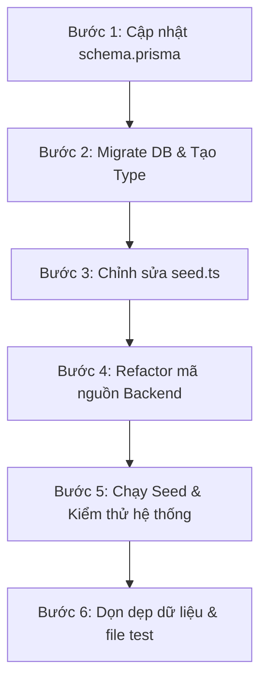

# 📋 KẾ HOẠCH TRIỂN KHAI CẬP NHẬT SCHEMA & REFACTOR SEED SCRIPTS (IMPLEMENTATION PLAN)

Kế hoạch này vạch ra từng bước cụ thể để đồng bộ cấu trúc cơ sở dữ liệu (`schema.prisma`), chỉnh sửa script seeding (`seed.ts`), refactor mã nguồn backend bị ảnh hưởng, tiến hành kiểm thử độc lập và dọn dẹp dữ liệu để tránh làm ảnh hưởng đến cơ sở dữ liệu chính.

---

## 📌 THÔNG TIN TÀI KHOẢN CẦN SEED (TEST ACCOUNTS)

Dưới đây là thông tin 4 tài khoản thử nghiệm theo yêu cầu:

| Vai trò (Role) | Mã vai trò (roleCode) | Username | Email | Số điện thoại | Mật khẩu (Password) | Trạng thái |
| :--- | :--- | :--- | :--- | :--- | :--- | :--- |
| **Quản trị hệ thống** | `ADMIN` | `admin` | `admin@velocity.vn` | `0900000001` | `AdminPassword123` | `ACTIVE` |
| **Nhân viên điều phối**| `STAFF` | `dispatcher` | `staff@velocity.vn` | `0900000002` | `StaffPassword123` | `ACTIVE` |
| **Tài xế / Shipper** | `SHIPPER` | `shipper` * | `driver@velocity.vn` | `0900000003` | `DriverPassword123` | `ACTIVE` |
| **Khách hàng** | `CUSTOMER` | `customer` | `customer@velocity.vn`| `0900000004` | `CustomerPassword123`| `ACTIVE` |

> [!NOTE]
> Để đảm bảo tính tương thích với URL, định tuyến và form đăng nhập của hệ thống, Username của Tài xế nên đặt là `shipper` trong cơ sở dữ liệu (tương tự các tài khoản khác sử dụng tiếng Anh không dấu, không khoảng trắng), đồng thời đặt Tên đầy đủ hiển thị (`fullName` trong hồ sơ `Driver`) là `Tài xế giao hàng (Shipper)`.

---

## 🗺️ LỘ TRÌNH TRIỂN KHAI TỪNG BƯỚC (STEP-BY-STEP WORKFLOW)



---

### BƯỚC 1: CẬP NHẬT PRISMA SCHEMA (`backend/prisma/schema.prisma`)
Cập nhật file `schema.prisma` để khớp hoàn toàn với thiết kế mới trong `Database_Schema.txt`:

1. **User & Role Relation**:
   - Xóa model `UserRole`.
   - Thêm trường `roleId String @map("role_id") @db.Uuid` vào model `User`.
   - Thiết lập quan hệ 1-N giữa `User` và `Role`:
     * Trong `User`: `role Role @relation(fields: [roleId], references: [id])`.
     * Trong `Role`: `users User[]`.
2. **Order & OrderPayment Fee Fields**:
   - Trong `Order`: Đổi tên `shippingFee`, `insuranceFee`, `codAmount`, `totalAmount` thành `estimatedShippingFee`, `estimatedInsuranceFee`, `estimatedCodAmount`, `estimatedTotalAmount`.
   - Trong `OrderPayment`: Đổi tên `shippingFee`, `insuranceFee`, `codAmount` thành `finalShippingFee`, `finalInsuranceFee`, `finalCodAmount`.
3. **Cắt giảm các trường bị loại bỏ**:
   - Xóa `description` khỏi `Role`, `FacilityType`, `Service`.
   - Xóa `pricingVersion` khỏi `Service` (giữ lại trong `Order`).
   - Xóa `module` khỏi `Permission`.
   - Xóa `notes` khỏi `ShipmentEvent`.
   - Xóa `note` khỏi `Customer`, `CustomerContact`, `Facility`.
   - Xóa `addressLine2`, `placeId`, `postalCode` khỏi `Address`.
4. **Chuẩn hóa `StaffProfile`**:
   - Loại bỏ trùng lặp và giữ lại thuộc tính `deletedAt` cho mục đích xóa mềm.

---

### BƯỚC 2: TIẾN HÀNH MIGRATION & GENERATE PRISMA CLIENT
Sau khi chỉnh sửa xong schema, thực hiện đồng bộ cấu trúc cơ sở dữ liệu:
1. Chạy lệnh tạo bản migration mới trong môi trường phát triển:
   ```bash
   npx prisma migrate dev --name sync_with_meeting_schema
   ```
2. Kiểm tra log để đảm bảo không xảy ra lỗi xung đột cấu trúc.

---

### BƯỚC 3: CẬP NHẬT FILE SEED (`backend/prisma/seed.ts`)
Thay đổi cách thức tạo dữ liệu mẫu để tương thích với schema mới:
1. **Dọn dẹp Master Data**: Loại bỏ các thuộc tính không còn tồn tại khi upsert dữ liệu mẫu (`description` trong roles/services, `module` trong permissions, v.v.).
2. **Cập nhật dữ liệu người dùng mẫu**: Cấu hình danh sách người dùng mẫu khớp chính xác với thông tin được yêu cầu ở bảng trên (đặc biệt đổi username của Nhân viên từ `staff` thành `dispatcher`).
3. **Cập nhật Logic gán vai trò**: Thay đổi câu lệnh tạo user để gán trực tiếp `roleId` vào lúc tạo thay vì gọi `prisma.userRole.create`.

---

### BƯỚC 4: REFACTOR MÃ NGUỒN BACKEND BỊ ẢNH HƯỞNG
Chỉnh sửa các file mã nguồn TypeScript bị lỗi biên dịch do thay đổi schema:

1. **`backend/src/middlewares/auth.middleware.ts`**:
   - Thay đổi logic nạp thông tin người dùng từ `userRoles` sang trường liên kết `role` duy nhất:
     ```typescript
     const roles = user.role ? [user.role.roleCode] : [];
     const permissions = user.role?.rolePermissions.map(rp => rp.permission.permissionCode) || [];
     ```
2. **`backend/src/services/auth.service.ts`**:
   - Thay đổi các vị trí tạo user, login, và refresh token tương tự như trên.
3. **`backend/src/services/staff.service.ts`**:
   - Sửa hàm filter danh sách nhân viên (`getStaffs`) từ truy vấn `userRoles` sang truy vấn trực tiếp qua `role`:
     ```typescript
     const where = { role: { roleCode: 'STAFF' } };
     ```
   - Thay đổi logic tạo nhân viên mới: gán `roleId` trực tiếp khi tạo `User`.
4. **`backend/src/services/driver.service.ts`**:
   - Thay đổi logic tạo tài xế mới: gán `roleId` trực tiếp khi tạo `User`.
5. **`backend/src/services/order.service.ts`**:
   - Đổi tên các thuộc tính lưu chi phí sang dạng tạm tính (`estimatedShippingFee`, v.v.) và chi phí thực tế thanh toán (`finalShippingFee`, v.v.).
6. **`backend/src/services/pricing/pricing.service.ts`**:
   - Cập nhật logic tính giá: Vì bảng `Service` không còn trường `pricingVersion`, chúng ta sẽ trả về một giá trị phiên bản mặc định (ví dụ: `'1.0.0'`) trong kết quả tính giá.

---

### BƯỚC 5: CHẠY THỬ NGHIỆM & KIỂM THỬ ĐỘC LẬP (TESTING FLOW)
Để kiểm tra tính toàn vẹn hệ thống mà không tạo ra rác trong cơ sở dữ liệu:
1. **Chạy Seed mới**:
   ```bash
   npx prisma db seed
   ```
2. **Tạo Script Test Login**: Viết một script tạm thời `test-login.ts` trong thư mục `scratch/` để giả lập quá trình đăng nhập bằng 4 tài khoản mới và in ra JWT Token cùng quyền hạn của chúng để xác nhận Auth hoạt động bình thường.
3. **Chạy script test**:
   ```bash
   npx ts-node C:\Users\Tuan Hung\.gemini\antigravity\brain\2b344f68-d571-4898-a95f-650d5c1f764d\scratch\test-login.ts
   ```

---

### BƯỚC 6: DỌN DẸP DỮ LIỆU SAU KHI TEST (CLEANUP)
Sau khi kết thúc quá trình thử nghiệm thành công:
1. **Xóa file test tạm thời**: Xóa toàn bộ file kiểm thử tạm thời trong thư mục `scratch/` để tránh gây nhiễu mã nguồn.
2. **Làm sạch Database**: Chạy lệnh reset cơ sở dữ liệu về trạng thái sạch sẽ (chỉ chứa master data và các tài khoản mẫu chuẩn):
   ```bash
   npx prisma migrate reset --force
   ```
