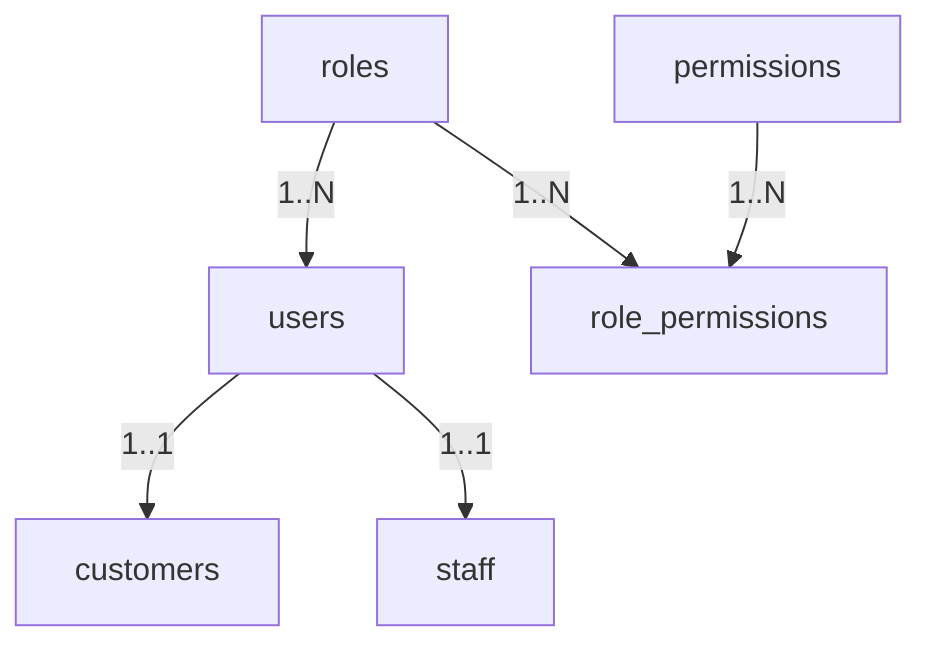

# PHASE 1 - MODULE 1: Authentication, Authorization & Identity Management

## 🎯 Mục Tiêu Module

Module **Authentication, Authorization & Identity Management** chịu trách nhiệm quản lý danh tính xác thực, tài khoản đăng nhập, hồ sơ cá nhân và phân quyền bảo mật cấp CSDL cho toàn bộ hệ thống.

Đây là **Core Module (Module Nền Tảng)** được chuẩn hóa theo tiêu chí:
1. **Chuẩn Hóa 3NF (Third Normal Form)**: Loại bỏ trùng lặp dữ liệu, phân tách danh tính đăng nhập credentials với thông tin định danh cá nhân (PII).
2. **Bảo Mật Phòng Thủ Theo Chiều Sâu (Defense-in-Depth Security)**: Bảng `users` chỉ chứa dữ liệu đăng nhập duy nhất (`username`, `password_hash`). Khi hacker tấn công được vào `users`, chúng chỉ thu được `username` mà không thể biết thông tin cá nhân/liên lạc hoặc tài khoản đó thuộc về ai.
3. **Phân Quyền 4 PostgreSQL DB Roles**: Thiết lập phân quyền bảng trực tiếp ở mức động cơ PostgreSQL Engine (`app_auth_user`, `app_customer_user`, `app_staff_user`, `app_admin_user`).

---

## 📊 Các Bảng Trong Module (6 Bảng Cốt Lõi)

| STT | Bảng | Tên Bảng DB (`@map`) | Chức Năng Cốt Lõi |
| :--- | :--- | :--- | :--- |
| 1 | `User` | `users` | Danh tính đăng nhập thuần túy (Username & Password Hash) |
| 2 | `Role` | `roles` | Danh mục Vai trò hệ thống (`ADMIN`, `STAFF`, `SHIPPER`, `CUSTOMER`) |
| 3 | `Permission` | `permissions` | Danh mục Quyền hạn thao tác chức năng chi tiết |
| 4 | `RolePermission` | `role_permissions` | Liên kết N-N giữa Vai trò (`roles`) và Quyền hạn (`permissions`) |
| 5 | `Customer` | `customers` | Hồ sơ cá nhân/doanh nghiệp Khách hàng (Lưu trực tiếp `full_name`, `phone`, `email`) |
| 6 | `Staff` | `staff` | Hồ sơ hợp nhất Nhân viên & Tài xế (Lưu trực tiếp PII, thông tin kho & bằng lái xe) |

---

## 🗺️ ERD Module 1



---

## 🛡️ Phân Quyền Bảo Mật Cấp CSDL (PostgreSQL DB Roles)

Hệ thống thiết lập 4 DB Roles trực tiếp tại động cơ PostgreSQL để giới hạn quyền hạn đọc/ghi theo từng dịch vụ:

```sql
-- 1. DB Role cho Auth Service (Chỉ truy cập bảng users)
CREATE ROLE app_auth_user WITH LOGIN PASSWORD 'AuthSecurePass2026!';
GRANT CONNECT ON DATABASE smart_logistics_db TO app_auth_user;
GRANT USAGE ON SCHEMA public TO app_auth_user;
GRANT SELECT, INSERT, UPDATE ON TABLE users TO app_auth_user;

-- 2. DB Role cho Customer Portal API
CREATE ROLE app_customer_user WITH LOGIN PASSWORD 'CustSecurePass2026!';
GRANT CONNECT ON DATABASE smart_logistics_db TO app_customer_user;
GRANT USAGE ON SCHEMA public TO app_customer_user;
GRANT SELECT, INSERT, UPDATE ON TABLE customers, customer_addresses, customer_contacts, orders TO app_customer_user;
REVOKE ALL ON TABLE staff, users, system_settings FROM app_customer_user;

-- 3. DB Role cho Operations / Staff / Shipper Portal API
CREATE ROLE app_staff_user WITH LOGIN PASSWORD 'StaffSecurePass2026!';
GRANT CONNECT ON DATABASE smart_logistics_db TO app_staff_user;
GRANT USAGE ON SCHEMA public TO app_staff_user;
GRANT SELECT, INSERT, UPDATE ON TABLE staff, customers, facilities, routes, route_stops, shipments, vehicles, orders, barcode_scans, delivery_proofs TO app_staff_user;
REVOKE ALL ON TABLE system_settings, roles, permissions, role_permissions FROM app_staff_user;

-- 4. DB Role cho Admin Portal
CREATE ROLE app_admin_user WITH LOGIN PASSWORD 'AdminSecurePass2026!';
GRANT CONNECT ON DATABASE smart_logistics_db TO app_admin_user;
GRANT USAGE ON SCHEMA public TO app_admin_user;
GRANT ALL PRIVILEGES ON ALL TABLES IN SCHEMA public TO app_admin_user;
GRANT ALL PRIVILEGES ON ALL SEQUENCES IN SCHEMA public TO app_admin_user;
```

---

## 🗄️ Chi Tiết Thiết Kế Các Bảng

### BẢNG 1 — `users` (Danh tính Đăng nhập Pure Credentials)
Chỉ lưu thông tin xác thực danh tính. Không chứa PII (`email`, `phone`, `full_name`).

| Field | PostgreSQL Type | Nullable | Ràng buộc & Chức năng |
| :--- | :--- | :---: | :--- |
| `id` | UUID | ❌ | Khóa chính (Primary Key), tự động `gen_random_uuid()`. |
| `username` | VARCHAR(50) | ❌ | Tên đăng nhập duy nhất (`UNIQUE`). |
| `password_hash` | TEXT | ❌ | Chuỗi mật khẩu băm mã hóa Bcrypt. |
| `status` | `UserStatus` | ❌ | ENUM: `ACTIVE`, `LOCKED`, `DISABLED`, `PENDING_VERIFICATION` (Mặc định `ACTIVE`). |
| `is_hidden` | BOOLEAN | ❌ | Flag ẩn tài khoản (Mặc định `false`). Thay thế `deleted_at`. |
| `role_id` | UUID | ❌ | Khóa ngoại tham chiếu $\rightarrow$ `roles(id)`. |
| `last_login_at` | TIMESTAMPTZ | ✅ | Thời điểm đăng nhập gần nhất. |
| `created_at` | TIMESTAMPTZ | ❌ | Thời điểm tạo tài khoản (`NOW()`). |
| `updated_at` | TIMESTAMPTZ | ❌ | Thời điểm cập nhật tài khoản gần nhất (`NOW()`). |

* **Constraints & Indexes:**
  ```sql
  PRIMARY KEY (id)
  UNIQUE (username)
  CREATE INDEX idx_users_status ON users(status);
  ```

---

### BẢNG 2 — `roles` (Vai trò Người dùng)
Danh mục các vai trò người dùng trong hệ thống.

| Field | PostgreSQL Type | Nullable | Ràng buộc & Chức năng |
| :--- | :--- | :---: | :--- |
| `id` | UUID | ❌ | Khóa chính (Primary Key). |
| `role_code` | VARCHAR(30) | ❌ | Mã vai trò duy nhất (`UNIQUE`). VD: `ADMIN`, `STAFF`, `SHIPPER`, `CUSTOMER`. |
| `role_name` | VARCHAR(100) | ❌ | Tên hiển thị vai trò. VD: "Quản trị viên", "Nhân viên điều phối". |
| `created_at` | TIMESTAMPTZ | ❌ | Thời điểm tạo (`NOW()`). |

---

### BẢNG 3 — `permissions` (Danh mục Quyền hạn)
Danh mục tất cả các quyền thao tác chức năng cụ thể trong hệ thống.

| Field | PostgreSQL Type | Nullable | Ràng buộc & Chức năng |
| :--- | :--- | :---: | :--- |
| `id` | UUID | ❌ | Khóa chính (Primary Key). |
| `permission_code` | VARCHAR(50) | ❌ | Mã quyền duy nhất (`UNIQUE`). VD: `ORDER_CREATE`, `ROUTE_OPTIMIZE`. |
| `permission_name` | VARCHAR(100) | ❌ | Tên hiển thị quyền chi tiết. |
| `description` | TEXT | ✅ | Mô tả phạm vi tác động của quyền. |
| `created_at` | TIMESTAMPTZ | ❌ | Thời điểm tạo (`NOW()`). |

---

### BẢNG 4 — `role_permissions` (Gán Quyền cho Vai trò)
Bảng trung gian liên kết N-N giữa `roles` và `permissions`.

| Field | PostgreSQL Type | Nullable | Ràng buộc & Chức năng |
| :--- | :--- | :---: | :--- |
| `role_id` | UUID | ❌ | Cặp Khóa chính, FK tham chiếu $\rightarrow$ `roles(id)` (CASCADE). |
| `permission_id` | UUID | ❌ | Cặp Khóa chính, FK tham chiếu $\rightarrow$ `permissions(id)` (CASCADE). |

---

### BẢNG 5 — `customers` (Hồ sơ Khách hàng - Pure PII Profile)
Lưu thông tin liên lạc & pháp lý của Khách hàng cá nhân/doanh nghiệp. Liên kết 1-1 với `users`.

| Field | PostgreSQL Type | Nullable | Ràng buộc & Chức năng |
| :--- | :--- | :---: | :--- |
| `id` | UUID | ❌ | Khóa chính (Primary Key). |
| `user_id` | UUID | ❌ | Khóa ngoại 1-1 duy nhất (`UNIQUE`), FK $\rightarrow$ `users(id)` (CASCADE). |
| `customer_code` | VARCHAR(30) | ❌ | Mã khách hàng duy nhất (`UNIQUE`). VD: `CUST-000001`. |
| `full_name` | VARCHAR(150) | ❌ | Họ và tên khách hàng/đại diện. |
| `phone` | VARCHAR(20) | ❌ | Số điện thoại liên lạc chính. |
| `email` | VARCHAR(255) | ✅ | Địa chỉ email nhận thông báo/hóa đơn. |
| `customer_type` | `CustomerType` | ❌ | ENUM: `INDIVIDUAL` (Gửi lẻ), `BUSINESS` (Shop/Doanh nghiệp). |
| `company_name` | VARCHAR(255) | ✅ | Tên công ty/Thương hiệu shop (nếu BIZ). |
| `tax_code` | VARCHAR(30) | ✅ | Mã số thuế doanh nghiệp. |
| `status` | `CustomerStatus`| ❌ | ENUM: `ACTIVE`, `INACTIVE`, `BLOCKED` (Mặc định `ACTIVE`). |
| `is_hidden` | BOOLEAN | ❌ | Flag ẩn hồ sơ (Mặc định `false`). |
| `created_at` | TIMESTAMPTZ | ❌ | Ngày đăng ký (`NOW()`). |
| `updated_at` | TIMESTAMPTZ | ❌ | Thời điểm cập nhật gần nhất. |

---

### BẢNG 6 — `staff` (Hồ sơ Hợp nhất Nhân viên & Tài xế)
Hợp nhất toàn bộ hồ sơ nhân sự vận hành (Kho, Điều phối, Văn phòng, Tài xế). Liên kết 1-1 với `users`.

| Field | PostgreSQL Type | Nullable | Ràng buộc & Chức năng |
| :--- | :--- | :---: | :--- |
| `id` | UUID | ❌ | Khóa chính (Primary Key). |
| `user_id` | UUID | ❌ | Khóa ngoại 1-1 duy nhất (`UNIQUE`), FK $\rightarrow$ `users(id)` (CASCADE). |
| `employee_code` | VARCHAR(30) | ❌ | Mã nhân viên duy nhất (`UNIQUE`). VD: `STF-000001`, `DRV-000001`. |
| `full_name` | VARCHAR(150) | ❌ | Họ và tên nhân sự. |
| `phone` | VARCHAR(20) | ❌ | Số điện thoại làm việc. |
| `email` | VARCHAR(255) | ✅ | Email nội bộ/liên hệ công việc. |
| `citizen_id` | VARCHAR(20) | ✅ | Số Căn cước công dân duy nhất (`UNIQUE`). |
| `position` | VARCHAR(100) | ❌ | Chức vụ: `ADMIN`, `DISPATCHER`, `WAREHOUSE_STAFF`, `DRIVER`. |
| `assigned_facility_id`| UUID | ✅ | FK tham chiếu $\rightarrow$ `facilities(id)` (SET NULL). |
| `driver_license_number`| VARCHAR(50)| ✅ | Số bằng lái xe (Duy nhất `UNIQUE`, Nullable nếu là staff văn phòng). |
| `driver_license_class`| VARCHAR(10) | ✅ | Hạng bằng lái: `A1`, `B2`, `C`, `FC`... (Nullable). |
| `driver_type` | `DriverType` | ✅ | ENUM: `HUB_DELIVERY`, `ON_DEMAND` (Nullable). |
| `employment_status` | `DriverEmploymentStatus`| ✅ | ENUM: `ACTIVE`, `ON_LEAVE`, `TERMINATED` (Default `ACTIVE`). |
| `hire_date` | DATE | ✅ | Ngày vào làm chính thức. |
| `preferred_latitude` | DOUBLE | ✅ | Tọa độ vĩ độ ưu tiên nhận đơn. |
| `preferred_longitude`| DOUBLE | ✅ | Tọa độ kinh độ ưu tiên nhận đơn. |
| `note` | TEXT | ✅ | Ghi chú quản lý nhân sự/tài xế. |
| `is_hidden` | BOOLEAN | 开启/❌ | Flag ẩn hồ sơ (Mặc định `false`). |
| `created_at` | TIMESTAMPTZ | ❌ | Thời điểm tạo hồ sơ. |
| `updated_at` | TIMESTAMPTZ | ❌ | Thời điểm cập nhật gần nhất. |
