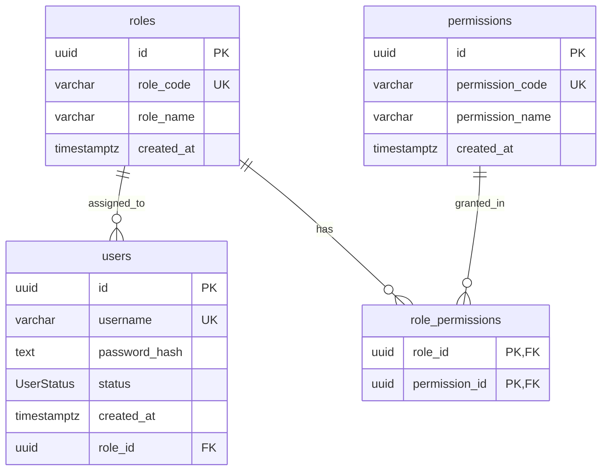

# PHASE 1 - MODULE 1: Authentication & Authorization (Xác thực & Phân quyền)

## 🎯 Mục Tiêu Module

Module **Authentication & Authorization** chịu trách nhiệm quản lý danh tính xác thực, tài khoản đăng nhập và phân quyền bảo mật cấp CSDL (RBAC) cho toàn bộ hệ thống Smart Logistics Platform.

Đây là **Core Module (Module Nền Tảng)** được chuẩn hóa theo tiêu chí:
1. **Chuẩn Hóa 3NF (Third Normal Form)**: Loại bỏ trùng lặp dữ liệu, phân tách danh tính đăng nhập credentials với thông tin định danh cá nhân (PII).
2. **Bảo Mật Phòng Thủ Theo Chiều Sâu (Defense-in-Depth Security)**: Bảng `users` chỉ chứa dữ liệu đăng nhập duy nhất (`username`, `password_hash`). Khi hacker tấn công được vào `users`, chúng chỉ thu được `username` và hash mật khẩu mà không thể biết thông tin cá nhân/liên lạc hoặc tài khoản đó thuộc về ai.
3. **Phân Quyền Vai Trò & Quyền Hạn (RBAC)**: Quản lý tập trung qua các bảng `roles`, `permissions`, `role_permissions`.

---

## 📊 Các Bảng Trong Module (4 Bảng Cốt Lõi)

| STT | Model Prisma | Tên Bảng DB (`@map`) | Chức Năng Cốt Lõi |
| :--- | :--- | :--- | :--- |
| 1 | `User` | `users` | Danh tính đăng nhập thuần túy (Username & Password Hash) |
| 2 | `Role` | `roles` | Danh mục Vai trò hệ thống (`ADMIN`, `STAFF`, `SHIPPER`, `CUSTOMER`...) |
| 3 | `Permission` | `permissions` | Danh mục Quyền hạn thao tác chức năng chi tiết |
| 4 | `RolePermission` | `role_permissions` | Liên kết N-N giữa Vai trò (`roles`) và Quyền hạn (`permissions`) |

---

## 🗺️ ERD Module 1



---

## 🗄️ Chi Tiết Thiết Kế Các Bảng

### BẢNG 1 — `users` (Danh tính Đăng nhập Pure Credentials)
Chỉ lưu thông tin xác thực danh tính. Không chứa PII (`email`, `phone`, `full_name`).

| Field | Prisma Type | PostgreSQL Type | Nullable | Ràng buộc & Chức năng |
| :--- | :--- | :--- | :---: | :--- |
| `id` | String | UUID | ❌ | Khóa chính (Primary Key), `@default(uuid())`. |
| `username` | String | VARCHAR(50) | ❌ | Tên đăng nhập duy nhất (`@unique`). |
| `password_hash` | String | TEXT | ❌ | Chuỗi mật khẩu băm mã hóa Bcrypt (`@map("password_hash")`). |
| `status` | UserStatus | Enum | ❌ | ENUM: `ACTIVE`, `LOCKED`, `DISABLED` (Mặc định `ACTIVE`). |
| `role_id` | String | UUID | ❌ | Khóa ngoại tham chiếu $\rightarrow$ `roles(id)` (ON DELETE RESTRICT). |
| `created_at` | DateTime | TIMESTAMPTZ | ❌ | Thời điểm tạo tài khoản (`@default(now())`). |

* **Constraints & Indexes:**
  ```sql
  PRIMARY KEY (id)
  UNIQUE (username)
  FOREIGN KEY (role_id) REFERENCES roles(id) ON DELETE RESTRICT
  ```

---

### BẢNG 2 — `roles` (Vai trò Người dùng - RBAC)
Danh mục các vai trò người dùng trong hệ thống.

| Field | Prisma Type | PostgreSQL Type | Nullable | Ràng buộc & Chức năng |
| :--- | :--- | :--- | :---: | :--- |
| `id` | String | UUID | ❌ | Khóa chính (Primary Key), `@default(uuid())`. |
| `role_code` | String | VARCHAR(30) | ❌ | Mã vai trò duy nhất (`@unique`). VD: `ADMIN`, `STAFF`, `SHIPPER`, `CUSTOMER`. |
| `role_name` | String | VARCHAR(100) | ❌ | Tên hiển thị vai trò (`@map("role_name")`). VD: "Quản trị viên", "Nhân viên điều phối". |
| `created_at` | DateTime | TIMESTAMPTZ | ❌ | Thời điểm tạo (`@default(now())`). |

---

### BẢNG 3 — `permissions` (Danh mục Quyền hạn Chi tiết)
Danh mục tất cả các quyền thao tác chức năng cụ thể trong hệ thống.

| Field | Prisma Type | PostgreSQL Type | Nullable | Ràng buộc & Chức năng |
| :--- | :--- | :--- | :---: | :--- |
| `id` | String | UUID | ❌ | Khóa chính (Primary Key), `@default(uuid())`. |
| `permission_code` | String | VARCHAR(50) | ❌ | Mã quyền duy nhất (`@unique`). VD: `ORDER_CREATE`, `ROUTE_OPTIMIZE`. |
| `permission_name` | String | VARCHAR(100) | ❌ | Tên hiển thị quyền chi tiết (`@map("permission_name")`). |
| `created_at` | DateTime | TIMESTAMPTZ | ❌ | Thời điểm tạo (`@default(now())`). |

---

### BẢNG 4 — `role_permissions` (Gán Quyền cho Vai trò)
Bảng trung gian liên kết N-N giữa `roles` và `permissions`.

| Field | Prisma Type | PostgreSQL Type | Nullable | Ràng buộc & Chức năng |
| :--- | :--- | :--- | :---: | :--- |
| `role_id` | String | UUID | ❌ | Cặp Khóa chính, FK tham chiếu $\rightarrow$ `roles(id)` (ON DELETE CASCADE). |
| `permission_id` | String | UUID | ❌ | Cặp Khóa chính, FK tham chiếu $\rightarrow$ `permissions(id)` (ON DELETE CASCADE). |

* **Constraints:**
  ```sql
  PRIMARY KEY (role_id, permission_id)
  FOREIGN KEY (role_id) REFERENCES roles(id) ON DELETE CASCADE
  FOREIGN KEY (permission_id) REFERENCES permissions(id) ON DELETE CASCADE
  ```
