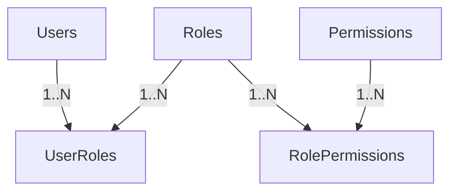

# PHASE 1 - MODULE 1: Authentication & Authorization

## 🎯 Mục tiêu Module

Module Authentication & Authorization chịu trách nhiệm quản lý toàn bộ tài khoản đăng nhập và phân quyền trong hệ thống.

Đây là **module nền tảng (Core Module)** vì gần như tất cả các module khác đều sẽ tham chiếu đến `Users`.

Module này trả lời các câu hỏi:
* Ai đang sử dụng hệ thống?
* Người đó là ai?
* Người đó có quyền gì?
* Người đó được phép thực hiện chức năng nào?

> [!NOTE]
> Module này **không lưu nghiệp vụ** như Driver, Customer hay Staff. Những thông tin nghiệp vụ đó sẽ nằm ở các module tương ứng và chỉ tham chiếu/liên kết đến bảng `Users` thông qua `user_id`.

---

## 📊 Các Bảng Trong Module (5 Bảng)

Mô hình phân quyền ở đây áp dụng chuẩn **RBAC (Role-Based Access Control)** để đảm bảo tính bảo mật và khả năng mở rộng linh hoạt:

| STT | Bảng | Chức năng |
| :--- | :--- | :--- |
| 1 | `Users` | Quản lý tài khoản đăng nhập |
| 2 | `Roles` | Quản lý vai trò (Admin, Staff, Shipper, Customer,...) |
| 3 | `Permissions` | Quản lý danh sách các quyền hạn trong hệ thống |
| 4 | `UserRoles` | Liên kết N-N giữa User và Role (một user có thể có nhiều vai trò) |
| 5 | `RolePermissions`| Liên kết N-N giữa Role và Permission (một vai trò có nhiều quyền) |

---

## 🗺️ ERD Module



### Tại sao cần bảng liên kết `RolePermissions`?
Trong các hệ thống thực tế (Enterprise), mối quan hệ giữa Vai trò (`Roles`) và Quyền hạn (`Permissions`) là quan hệ **Nhiều - Nhiều (Many-to-Many)**. 
* Ví dụ: Vai trò `ADMIN` được gán các quyền: `ORDER_CREATE`, `ORDER_DELETE`, `USER_MANAGE`.
* Vai trò `STAFF` được gán các quyền: `ORDER_CREATE`, `ORDER_UPDATE`.
Nếu không có bảng trung gian `RolePermissions` để lưu trữ cặp khóa ngoại `(role_id, permission_id)`, ta không thể biểu diễn cấu trúc phân quyền này một cách chuẩn hóa.

---

## 🗄️ Chi Tiết Thiết Kế Các Bảng

### BẢNG 1 — Users
Quản lý toàn bộ tài khoản đăng nhập. Mỗi người dùng hệ thống (kể cả admin, nhân viên, tài xế hay khách hàng) đều phải có một tài khoản tại đây.

* **Các trường dữ liệu:**

| Field | PostgreSQL Type | Nullable | Chức năng |
| :--- | :--- | :---: | :--- |
| `id` | UUID | ❌ | Khóa chính (Primary Key), tự động tạo UUIDv4. |
| `username` | VARCHAR(50) | ❌ | Tên đăng nhập duy nhất. |
| `email` | VARCHAR(255) | ❌ | Email đăng nhập và nhận thông báo (Duy nhất). |
| `password_hash` | TEXT | ❌ | Mật khẩu đã mã hóa (BCrypt/Argon2). Tuyệt đối không lưu mật khẩu gốc. |
| `phone` | VARCHAR(20) | ✅ | Số điện thoại dùng để nhận OTP hoặc đăng nhập. |
| `avatar_url` | TEXT | ✅ | Đường dẫn ảnh đại diện. |
| `status` | `user_status_enum` | ❌ | Trạng thái tài khoản (Sử dụng PostgreSQL ENUM). |
| `last_login_at` | TIMESTAMPTZ | ✅ | Lần đăng nhập gần nhất. |
| `created_at` | TIMESTAMPTZ | ❌ | Thời điểm tạo tài khoản (Mặc định `NOW()`). |
| `updated_at` | TIMESTAMPTZ | ❌ | Thời điểm cập nhật tài khoản (Mặc định `NOW()`). |
| `deleted_at` | TIMESTAMPTZ | ✅ | Thời điểm xóa mềm (Soft Delete). |

* **Định nghĩa ENUM Status:**
  ```sql
  CREATE TYPE user_status_enum AS ENUM ('ACTIVE', 'LOCKED', 'DISABLED');
  ```
  > [!TIP]
  > Việc sử dụng kiểu dữ liệu `ENUM` trong PostgreSQL thay cho `SMALLINT` giúp dữ liệu trở nên tường minh, dễ đọc trực tiếp khi truy vấn dữ liệu mà không cần thông qua một bảng từ điển hay code mapping.

* **Indexes & Constraints:**
  ```sql
  PRIMARY KEY (id)
  UNIQUE (username)
  UNIQUE (email)
  CREATE INDEX idx_users_phone ON Users(phone);
  CREATE INDEX idx_users_status ON Users(status);
  ```

---

### BẢNG 2 — Roles
Lưu trữ danh sách vai trò trong hệ thống.

* **Các trường dữ liệu:**

| Field | PostgreSQL Type | Nullable | Chức năng |
| :--- | :--- | :---: | :--- |
| `id` | UUID | ❌ | Khóa chính. |
| `role_code` | VARCHAR(30) | ❌ | Mã code duy nhất của vai trò (Ví dụ: `ADMIN`, `STAFF`, `SHIPPER`, `CUSTOMER`). |
| `role_name` | VARCHAR(100) | ❌ | Tên hiển thị của vai trò (Ví dụ: "Quản trị viên", "Nhân viên kho"). |
| `description` | TEXT | ✅ | Mô tả chi tiết chức năng nhiệm vụ của vai trò. |
| `created_at` | TIMESTAMPTZ | ❌ | Thời điểm tạo (Mặc định `NOW()`). |

* **Indexes & Constraints:**
  ```sql
  PRIMARY KEY (id)
  UNIQUE (role_code)
  ```

---

### BẢNG 3 — Permissions
Lưu trữ toàn bộ quyền hạn cụ thể đối với các tài nguyên trong hệ thống (Ví dụ: `ORDER_CREATE`, `DRIVER_ASSIGN`, `ROUTE_OPTIMIZE`).

* **Các trường dữ liệu:**

| Field | PostgreSQL Type | Nullable | Chức năng |
| :--- | :--- | :---: | :--- |
| `id` | UUID | ❌ | Khóa chính. |
| `permission_code`| VARCHAR(50) | ❌ | Mã quyền duy nhất. |
| `permission_name`| VARCHAR(100) | ❌ | Tên hiển thị của quyền. |
| `module` | VARCHAR(50) | ❌ | Thuộc module chức năng nào để dễ phân loại (Ví dụ: `ORDER`, `SHIPMENT`, `ROUTING`). |
| `description` | TEXT | ✅ | Mô tả quyền hạn. |
| `created_at` | TIMESTAMPTZ | ❌ | Thời điểm tạo. |

* **Indexes & Constraints:**
  ```sql
  PRIMARY KEY (id)
  UNIQUE (permission_code)
  CREATE INDEX idx_permissions_module ON Permissions(module);
  ```

---

### BẢNG 4 — UserRoles
Bảng trung gian liên kết giữa Users và Roles (Một tài khoản có thể đảm nhiệm nhiều vai trò cùng lúc).

* **Các trường dữ liệu:**

| Field | PostgreSQL Type | Nullable | Chức năng |
| :--- | :--- | :---: | :--- |
| `user_id` | UUID | ❌ | Khóa ngoại tham chiếu → `Users(id)` (ON DELETE CASCADE). |
| `role_id` | UUID | ❌ | Khóa ngoại tham chiếu → `Roles(id)` (ON DELETE CASCADE). |
| `assigned_at` | TIMESTAMPTZ | ❌ | Thời điểm gán vai trò. |
| `assigned_by` | UUID | ✅ | Khóa ngoại tham chiếu → `Users(id)` (Người thực hiện gán quyền). |

* **Indexes & Constraints:**
  ```sql
  PRIMARY KEY (user_id, role_id) -- Chặn trùng lặp cặp vai trò trên cùng user
  ```

---

### BẢNG 5 — RolePermissions
Bảng trung gian liên kết quyền hạn vào các vai trò.

* **Các trường dữ liệu:**

| Field | PostgreSQL Type | Nullable | Chức năng |
| :--- | :--- | :---: | :--- |
| `role_id` | UUID | ❌ | Khóa ngoại tham chiếu → `Roles(id)` (ON DELETE CASCADE). |
| `permission_id` | UUID | ❌ | Khóa ngoại tham chiếu → `Permissions(id)` (ON DELETE CASCADE). |

* **Indexes & Constraints:**
  ```sql
  PRIMARY KEY (role_id, permission_id) -- Chặn trùng lặp cặp quyền trên vai trò
  ```
