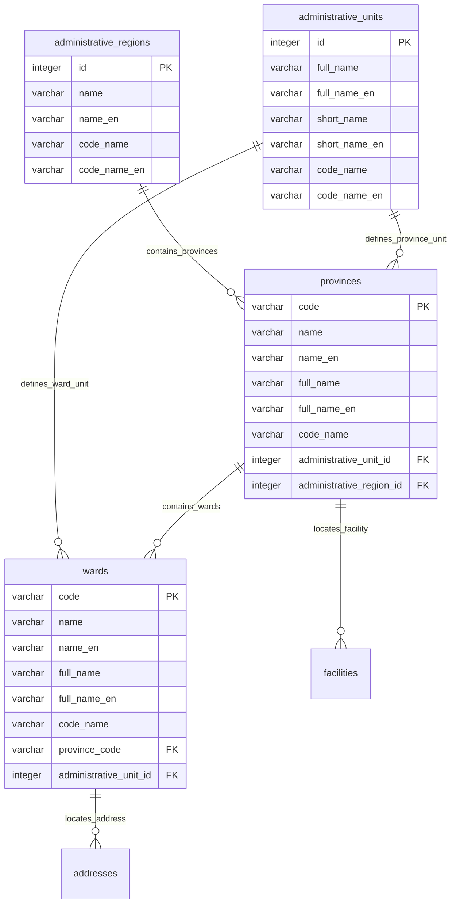

# MODULE 10 - Vietnamese Administrative Units (Đơn vị Hành chính Việt Nam)

## 🎯 Mục tiêu Module

Module **Vietnamese Administrative Units** quản lý danh mục dữ liệu địa chính chuẩn quốc gia của Việt Nam theo mô hình 2 cấp hành chính (Tỉnh/Thành phố $\rightarrow$ Phường/Xã):
* Quản lý các Vùng kinh tế - địa lý hành chính (`administrative_regions`): Đông Nam Bộ, Đồng Bằng Sông Hồng, Tây Nguyên...
* Quản lý Cấp đơn vị hành chính (`administrative_units`): Thành phố trực thuộc trung ương, Tỉnh, Phường, Xã...
* Quản lý danh mục 63 Tỉnh / Thành phố (`provinces`).
* Quản lý danh mục Phường / Xã / Thị trấn (`wards`) trực thuộc Tỉnh/Thành phố, liên kết trực tiếp với bảng `addresses` và `facilities`.

---

## 📊 Các Bảng Trong Module (4 Bảng)

| STT | Model Prisma | Tên Bảng DB (`@map`) | Chức Năng Cốt Lõi |
| :--- | :--- | :--- | :--- |
| 1 | `AdministrativeRegion`| `administrative_regions`| Danh mục các vùng địa lý - kinh tế hành chính |
| 2 | `AdministrativeUnit` | `administrative_units` | Danh mục cấp phân loại đơn vị hành chính |
| 3 | `Province` | `provinces` | Danh mục Tỉnh / Thành phố trực thuộc trung ương |
| 4 | `Ward` | `wards` | Danh mục Phường / Xã / Thị trấn trực thuộc Tỉnh/Thành |

---

## 🗺️ ERD Module 10



---

## 🗄️ Chi Tiết Thiết Kế Các Bảng

### BẢNG 1 — `administrative_regions` (Vùng Địa Lý Hành Chính)

| Field | Prisma Type | PostgreSQL Type | Nullable | Ràng buộc & Chức năng |
| :--- | :--- | :--- | :---: | :--- |
| `id` | Int | INTEGER | ❌ | Khóa chính (Primary Key). |
| `name` | String | VARCHAR(255) | ❌ | Tên vùng địa lý tiếng Việt. VD: `Đông Nam Bộ`. |
| `name_en` | String | VARCHAR(255) | ❌ | Tên vùng địa lý tiếng Anh (`@map("name_en")`). VD: `Southeast`. |
| `code_name` | String? | VARCHAR(255) | ✅ | Mã code name tiếng Việt (`@map("code_name")`). VD: `dong_nam_bo`. |
| `code_name_en` | String? | VARCHAR(255) | ✅ | Mã code name tiếng Anh (`@map("code_name_en")`). VD: `southeast`. |

---

### BẢNG 2 — `administrative_units` (Cấp Đơn Vị Hành Chính)

| Field | Prisma Type | PostgreSQL Type | Nullable | Ràng buộc & Chức năng |
| :--- | :--- | :--- | :---: | :--- |
| `id` | Int | INTEGER | ❌ | Khóa chính (Primary Key). |
| `full_name` | String? | VARCHAR(255) | ✅ | Tên đầy đủ tiếng Việt. VD: `Thành phố trực thuộc trung ương`. |
| `full_name_en` | String? | VARCHAR(255) | ✅ | Tên đầy đủ tiếng Anh. VD: `Municipality`. |
| `short_name` | String? | VARCHAR(255) | ✅ | Tên viết tắt tiếng Việt. VD: `Thành phố`. |
| `short_name_en`| String? | VARCHAR(255) | ✅ | Tên viết tắt tiếng Anh. VD: `City`. |
| `code_name` | String? | VARCHAR(255) | ✅ | Mã code name tiếng Việt. |
| `code_name_en` | String? | VARCHAR(255) | ✅ | Mã code name tiếng Anh. |

---

### BẢNG 3 — `provinces` (Tỉnh / Thành Phố)

| Field | Prisma Type | PostgreSQL Type | Nullable | Ràng buộc & Chức năng |
| :--- | :--- | :--- | :---: | :--- |
| `code` | String | VARCHAR(20) | ❌ | Khóa chính (Primary Key), mã địa chính. VD: `79` (TP.HCM), `01` (Hà Nội). |
| `name` | String | VARCHAR(255) | ❌ | Tên tỉnh/thành. VD: `Hồ Chí Minh`. |
| `name_en` | String? | VARCHAR(255) | ✅ | Tên tiếng Anh (`@map("name_en")`). VD: `Ho Chi Minh`. |
| `full_name` | String | VARCHAR(255) | ❌ | Tên đầy đủ địa chính (`@map("full_name")`). VD: `Thành phố Hồ Chí Minh`. |
| `full_name_en` | String? | VARCHAR(255) | ✅ | Tên đầy đủ tiếng Anh (`@map("full_name_en")`). |
| `code_name` | String? | VARCHAR(255) | ✅ | Mã code name địa chính (`@map("code_name")`). VD: `ho_chi_minh`. |
| `administrative_unit_id` | Int? | INTEGER | ✅ | FK $\rightarrow$ `administrative_units(id)` (ON DELETE RESTRICT, ON UPDATE CASCADE). |
| `administrative_region_id`| Int? | INTEGER | ✅ | FK $\rightarrow$ `administrative_regions(id)` (ON DELETE SET NULL, ON UPDATE CASCADE). |

* **Indexes & Constraints:**
  ```sql
  PRIMARY KEY (code)
  FOREIGN KEY (administrative_unit_id) REFERENCES administrative_units(id) ON DELETE RESTRICT ON UPDATE CASCADE
  FOREIGN KEY (administrative_region_id) REFERENCES administrative_regions(id) ON DELETE SET NULL ON UPDATE CASCADE
  ```

---

### BẢNG 4 — `wards` (Phường / Xã / Thị Trấn)

| Field | Prisma Type | PostgreSQL Type | Nullable | Ràng buộc & Chức năng |
| :--- | :--- | :--- | :---: | :--- |
| `code` | String | VARCHAR(20) | ❌ | Khóa chính (Primary Key), mã địa chính phường xã. VD: `26830`. |
| `name` | String | VARCHAR(255) | ❌ | Tên phường/xã. VD: `Phường 14`. |
| `name_en` | String? | VARCHAR(255) | ✅ | Tên tiếng Anh. |
| `full_name` | String? | VARCHAR(255) | ✅ | Tên đầy đủ. VD: `Phường 14`. |
| `full_name_en` | String? | VARCHAR(255) | ✅ | Tên đầy đủ tiếng Anh. |
| `code_name` | String? | VARCHAR(255) | ✅ | Mã code name địa chính. |
| `province_code`| String? | VARCHAR(20) | ✅ | FK $\rightarrow$ `provinces(code)` (ON DELETE RESTRICT, ON UPDATE CASCADE). |
| `administrative_unit_id` | Int? | INTEGER | ✅ | FK $\rightarrow$ `administrative_units(id)` (ON DELETE RESTRICT, ON UPDATE CASCADE). |

* **Indexes & Constraints:**
  ```sql
  PRIMARY KEY (code)
  FOREIGN KEY (province_code) REFERENCES provinces(code) ON DELETE RESTRICT ON UPDATE CASCADE
  FOREIGN KEY (administrative_unit_id) REFERENCES administrative_units(id) ON DELETE RESTRICT ON UPDATE CASCADE
  ```
