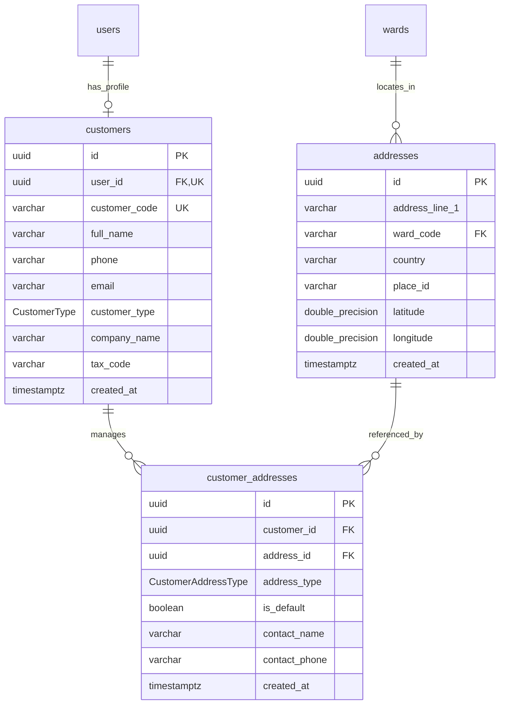

# MODULE 2 - Customers & Addresses (Khách hàng & Địa chỉ)

## 🎯 Mục tiêu Module

Module này quản lý hồ sơ thông tin khách hàng cá nhân / doanh nghiệp, sổ địa chỉ khách hàng và kho dữ liệu địa chỉ chuẩn hóa (Master Address Data) tích hợp tọa độ GPS và Map API (`place_id`).

> [!IMPORTANT]
> **Điểm nổi bật theo chuẩn Clean Architecture & 3NF:**
> 1. **PII Profile Separation**: Bảng `customers` lưu trữ trực tiếp thông tin liên hệ của khách hàng (`full_name`, `phone`, `email`) và liên kết 1-1 với tài khoản đăng nhập `users` qua `user_id UNIQUE`.
> 2. **Master Address Model**: Bảng `addresses` là kho địa chỉ dùng chung cho toàn bộ hệ thống (dùng cho Khách hàng, Bưu cục/Kho bãi ở Module 3, và Điểm lấy/giao đơn hàng ở Module 4). Bảng liên kết trực tiếp với Phường/Xã (`wards`) thuộc danh mục Hành chính Việt Nam.
> 3. **Customer Address Book**: Mối quan hệ giữa khách hàng và địa chỉ được quản lý qua bảng liên kết `customer_addresses`, tích hợp sẵn thông tin người phụ trách liên hệ tại kho/địa chỉ (`contact_name`, `contact_phone`).

---

## 📊 Các Bảng Trong Module (3 Bảng)

| STT | Model Prisma | Tên Bảng DB (`@map`) | Chức Năng Cốt Lõi |
| :--- | :--- | :--- | :--- |
| 1 | `Customer` | `customers` | Hồ sơ thông tin cá nhân/doanh nghiệp của Khách hàng |
| 2 | `Address` | `addresses` | Danh mục địa chỉ chuẩn hóa dùng chung toàn hệ thống |
| 3 | `CustomerAddress` | `customer_addresses` | Sổ địa chỉ liên kết Khách hàng với Địa chỉ & Thông tin liên hệ kho |

---

## 🗺️ ERD Module 2



---

## 🗄️ Chi Tiết Thiết Kế Các Bảng

### BẢNG 1 — `customers` (Hồ sơ Khách hàng)
Quản lý thông tin khách hàng cá nhân hoặc doanh nghiệp sử dụng dịch vụ vận chuyển.

| Field | Prisma Type | PostgreSQL Type | Nullable | Ràng buộc & Chức năng |
| :--- | :--- | :--- | :---: | :--- |
| `id` | String | UUID | ❌ | Khóa chính (Primary Key), `@default(uuid())`. |
| `user_id` | String | UUID | ❌ | Khóa ngoại 1-1 duy nhất (`@unique`), FK $\rightarrow$ `users(id)` (ON DELETE CASCADE). |
| `customer_code` | String | VARCHAR(30) | ❌ | Mã khách hàng duy nhất (`@unique`). VD: `CUST-000001`. |
| `full_name` | String | VARCHAR(150) | ❌ | Họ và tên khách hàng/đại diện (`@map("full_name")`). |
| `phone` | String? | VARCHAR(20) | ✅ | Số điện thoại liên lạc chính. |
| `email` | String? | VARCHAR(255) | ✅ | Địa chỉ email nhận thông báo/hóa đơn. |
| `customer_type` | CustomerType | Enum | ❌ | Loại khách hàng: `INDIVIDUAL` (Cá nhân), `BUSINESS` (Doanh nghiệp/Shop). |
| `company_name` | String? | VARCHAR(255) | ✅ | Tên công ty / Thương hiệu shop (nếu là `BUSINESS`). |
| `tax_code` | String? | VARCHAR(30) | ✅ | Mã số thuế doanh nghiệp (nếu là `BUSINESS`). |
| `created_at` | DateTime | TIMESTAMPTZ | ❌ | Thời điểm đăng ký tài khoản (`@default(now())`). |

* **Indexes & Constraints:**
  ```sql
  PRIMARY KEY (id)
  UNIQUE (user_id)
  UNIQUE (customer_code)
  CREATE INDEX idx_customer_email ON customers(email);
  FOREIGN KEY (user_id) REFERENCES users(id) ON DELETE CASCADE
  ```

---

### BẢNG 2 — `addresses` (Kho Dữ liệu Địa chỉ Chuẩn hóa)
Bảng danh mục địa chỉ chuẩn hóa dùng chung toàn hệ thống, tích hợp định vị GPS và API Bản đồ (Goong Maps / Google Maps).

| Field | Prisma Type | PostgreSQL Type | Nullable | Ràng buộc & Chức năng |
| :--- | :--- | :--- | :---: | :--- |
| `id` | String | UUID | ❌ | Khóa chính (Primary Key), `@default(uuid())`. |
| `address_line_1` | String | VARCHAR(255) | ❌ | Số nhà, tên đường chi tiết (`@map("address_line_1")`). |
| `ward_code` | String? | VARCHAR(20) | ✅ | Mã Phường/Xã FK $\rightarrow$ `wards(code)` (ON DELETE RESTRICT, ON UPDATE CASCADE). |
| `country` | String | VARCHAR(100) | ❌ | Quốc gia, mặc định: `'Vietnam'`. |
| `place_id` | String? | VARCHAR(255) | ✅ | Mã Place ID từ API bản đồ (Goong Map / Google Maps). |
| `latitude` | Float | DOUBLE PRECISION| ❌ | Vĩ độ GPS phục vụ AI Routing & Hiển thị Map. |
| `longitude` | Float | DOUBLE PRECISION| ❌ | Kinh độ GPS phục vụ AI Routing & Hiển thị Map. |
| `created_at` | DateTime | TIMESTAMPTZ | ❌ | Thời điểm khởi tạo bản ghi (`@default(now())`). |

* **Indexes & Constraints:**
  ```sql
  PRIMARY KEY (id)
  CREATE INDEX idx_addresses_coords ON addresses(latitude, longitude);
  FOREIGN KEY (ward_code) REFERENCES wards(code) ON DELETE RESTRICT ON UPDATE CASCADE
  ```

---

### BẢNG 3 — `customer_addresses` (Sổ Địa chỉ Khách hàng)
Bảng liên kết khách hàng với danh mục địa chỉ thường dùng, tích hợp thông tin người liên hệ tại kho/địa chỉ.

| Field | Prisma Type | PostgreSQL Type | Nullable | Ràng buộc & Chức năng |
| :--- | :--- | :--- | :---: | :--- |
| `id` | String | UUID | ❌ | Khóa chính (Primary Key), `@default(uuid())`. |
| `customer_id` | String | UUID | ❌ | FK $\rightarrow$ `customers(id)` (ON DELETE CASCADE). |
| `address_id` | String | UUID | ❌ | FK $\rightarrow$ `addresses(id)` (ON DELETE RESTRICT). |
| `address_type` | CustomerAddressType| Enum | ❌ | Loại địa chỉ: `HOME`, `OFFICE`, `WAREHOUSE`, `RETURN`. |
| `is_default` | Boolean | BOOLEAN | ❌ | Đánh dấu địa chỉ mặc định (Mặc định: `false`). |
| `contact_name` | String? | VARCHAR(150) | ✅ | Họ tên người phụ trách/liên hệ tại địa chỉ này. |
| `contact_phone`| String? | VARCHAR(20) | ✅ | Số điện thoại liên hệ trực tiếp tại địa chỉ này. |
| `created_at` | DateTime | TIMESTAMPTZ | ❌ | Thời điểm liên kết địa chỉ (`@default(now())`). |

* **Indexes & Constraints:**
  ```sql
  PRIMARY KEY (id)
  UNIQUE (customer_id, address_id)
  CREATE INDEX idx_cust_addr_customer ON customer_addresses(customer_id);
  FOREIGN KEY (customer_id) REFERENCES customers(id) ON DELETE CASCADE
  FOREIGN KEY (address_id) REFERENCES addresses(id) ON DELETE RESTRICT
  ```
