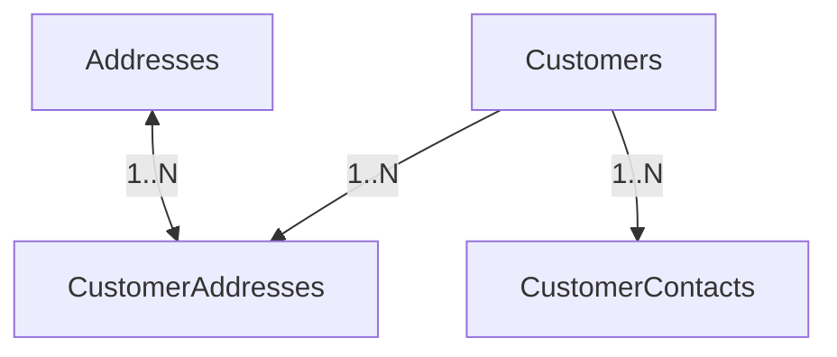

# MODULE 2 - Customer & Address Management (Final)

## 🎯 Mục tiêu Module

Module này quản lý hồ sơ khách hàng, danh bạ người liên hệ, sổ địa chỉ và liên kết giữa khách hàng với các địa chỉ.

> [!IMPORTANT]
> **Thay đổi cốt lõi so với thiết kế cũ:**
> `Addresses` không còn phụ thuộc trực tiếp vào `Customers`. Bảng `Addresses` giờ đây đóng vai trò là **Master Data dùng chung** cho toàn bộ hệ thống (dùng chung cho cả Khách hàng, Kho bãi ở Module 3, hoặc Đối tác/Nhà cung cấp sau này). 
> Mối quan hệ giữa khách hàng và địa chỉ được quản lý thông qua bảng liên kết `CustomerAddresses`.

---

## 📊 Các Bảng Trong Module (4 Bảng)

| STT | Bảng | Chức năng |
| :--- | :--- | :--- |
| 1 | `Customers` | Lưu trữ hồ sơ thông tin khách hàng |
| 2 | `Addresses` | Danh mục địa chỉ dùng chung (Master Address Data) |
| 3 | `CustomerAddresses` | Bảng liên kết khách hàng với địa chỉ (Sổ địa chỉ của khách hàng) |
| 4 | `CustomerContacts` | Người liên hệ của khách hàng (Đặc biệt cho Doanh nghiệp) |

---

## 🗺️ ERD Module



---

## 🗄️ Chi Tiết Thiết Kế Các Bảng

### BẢNG 1 — Customers
Quản lý thông tin khách hàng sử dụng dịch vụ. 

* **Các trường dữ liệu:**

| Field | PostgreSQL Type | Nullable | Chức năng |
| :--- | :--- | :---: | :--- |
| `id` | UUID | ❌ | Khóa chính. |
| `user_id` | UUID | ✅ | FK → `Users(id)` (nullable). Liên kết tài khoản đăng nhập. |
| `customer_code` | VARCHAR(30) | ❌ | Mã khách hàng duy nhất (Ví dụ: `CUS000001`). |
| `customer_type` | `customer_type_enum` | ❌ | Loại khách hàng (`INDIVIDUAL`, `BUSINESS`). |
| `company_name` | VARCHAR(255) | ✅ | Tên công ty (nếu là `BUSINESS`). |
| `tax_code` | VARCHAR(30) | ✅ | Mã số thuế doanh nghiệp (nếu là `BUSINESS`). |
| `status` | `customer_status_enum` | ❌ | Trạng thái khách hàng (`ACTIVE`, `INACTIVE`, `BLOCKED`). |
| `note` | TEXT | ✅ | Ghi chú chăm sóc khách hàng. |
| `created_at` | TIMESTAMPTZ | ❌ | Thời điểm tạo. |
| `updated_at` | TIMESTAMPTZ | ❌ | Thời điểm cập nhật. |
| `deleted_at` | TIMESTAMPTZ | ✅ | Xóa mềm (Soft Delete). |

* **Định nghĩa ENUMs:**
  ```sql
  CREATE TYPE customer_type_enum AS ENUM ('INDIVIDUAL', 'BUSINESS');
  CREATE TYPE customer_status_enum AS ENUM ('ACTIVE', 'INACTIVE', 'BLOCKED');
  ```

* **Indexes & Constraints:**
  ```sql
  PRIMARY KEY (id)
  UNIQUE (customer_code)
  UNIQUE (user_id)
  CREATE INDEX idx_customers_type ON Customers(customer_type);
  CREATE INDEX idx_customers_status ON Customers(status);
  ```

---

### BẢNG 2 — Addresses ⭐
Bảng danh mục địa chỉ chuẩn hóa dùng chung toàn hệ thống. Bảng này độc lập, giúp tránh trùng lặp dữ liệu địa chỉ vật lý và tích hợp tốt với các bản đồ số (Google Maps, OpenStreetMap).

* **Các trường dữ liệu:**

| Field | PostgreSQL Type | Nullable | Chức năng |
| :--- | :--- | :---: | :--- |
| `id` | UUID | ❌ | Khóa chính. |
| `address_line_1` | VARCHAR(255) | ❌ | Số nhà, tên đường, ngõ hẻm. |
| `address_line_2` | VARCHAR(255) | ✅ | Căn hộ, tòa nhà, số tầng, số phòng... |
| `ward` | VARCHAR(100) | ❌ | Phường / Xã. |
| `district` | VARCHAR(100) | ❌ | Quận / Huyện. |
| `province` | VARCHAR(100) | ❌ | Tỉnh / Thành phố. |
| `country` | VARCHAR(100) | ❌ | Quốc gia (Mặc định: 'Vietnam'). |
| `postal_code` | VARCHAR(20) | ✅ | Mã bưu chính. |
| `latitude` | DOUBLE PRECISION | ❌ | Vĩ độ GPS (phục vụ Routing AI). |
| `longitude` | DOUBLE PRECISION | ❌ | Kinh độ GPS (phục vụ Routing AI). |
| `formatted_address`| TEXT | ❌ | Địa chỉ hoàn chỉnh dạng chuỗi (đã chuẩn hóa). |
| `place_id` | VARCHAR(255) | ✅ | Google Place ID (dùng cho tích hợp bản đồ). |
| `created_at` | TIMESTAMPTZ | ❌ | Thời điểm tạo. |
| `updated_at` | TIMESTAMPTZ | ❌ | Thời điểm cập nhật. |

* **Indexes & Constraints:**
  ```sql
  PRIMARY KEY (id)
  -- Không dùng UNIQUE trên địa chỉ vì nhiều khách hàng có thể dùng chung 1 tòa nhà/địa chỉ vật lý.
  CREATE INDEX idx_addresses_coords ON Addresses(latitude, longitude);
  ```

---

### BẢNG 3 — CustomerAddresses
Bảng liên kết khách hàng với địa chỉ. Sử dụng khóa chính dạng đơn lẻ (`id`) thay vì Composite Key để đồng nhất kiến trúc và tăng tính linh hoạt khi cần tham chiếu chéo.

* **Các trường dữ liệu:**

| Field | PostgreSQL Type | Nullable | Chức năng |
| :--- | :--- | :---: | :--- |
| `id` | UUID | ❌ | Khóa chính. |
| `customer_id` | UUID | ❌ | FK → `Customers(id)` (ON DELETE CASCADE). |
| `address_id` | UUID | ❌ | FK → `Addresses(id)` (ON DELETE RESTRICT). |
| `address_type` | `customer_address_type_enum` | ❌ | Loại địa chỉ (`HOME`, `OFFICE`, `WAREHOUSE`, `RETURN`). |
| `is_default` | BOOLEAN | ❌ | Đánh dấu địa chỉ mặc định của khách hàng này (Mặc định `false`). |
| `created_at` | TIMESTAMPTZ | ❌ | Thời điểm liên kết địa chỉ. |

* **Định nghĩa ENUMs:**
  ```sql
  CREATE TYPE customer_address_type_enum AS ENUM ('HOME', 'OFFICE', 'WAREHOUSE', 'RETURN');
  ```

* **Indexes & Constraints:**
  ```sql
  PRIMARY KEY (id)
  UNIQUE (customer_id, address_id) -- Tránh liên kết lặp lại cùng một địa chỉ cho cùng khách hàng.
  CREATE INDEX idx_cust_addr_customer ON CustomerAddresses(customer_id);
  ```

---

### BẢNG 4 — CustomerContacts
Quản lý các đầu mối liên hệ của khách hàng, đảm bảo tính liên kết chặt chẽ cho mô hình B2B.

* **Các trường dữ liệu:**

| Field | PostgreSQL Type | Nullable | Chức năng |
| :--- | :--- | :---: | :--- |
| `id` | UUID | ❌ | Khóa chính. |
| `customer_id` | UUID | ❌ | FK → `Customers(id)` (ON DELETE CASCADE). |
| `full_name` | VARCHAR(150) | ❌ | Họ tên người liên hệ. |
| `phone` | VARCHAR(20) | ❌ | Số điện thoại. |
| `email` | VARCHAR(255) | ✅ | Email cá nhân. |
| `position` | VARCHAR(100) | ✅ | Chức vụ/Vai trò (Ví dụ: `Thủ kho`, `Kế toán`, `Giám đốc`). |
| `is_primary` | BOOLEAN | ❌ | Người liên hệ chính (Mặc định `false`). |
| `note` | TEXT | ✅ | Ghi chú về khung giờ gọi, lưu ý giao nhận. |
| `created_at` | TIMESTAMPTZ | ❌ | Thời điểm tạo. |

* **Indexes & Constraints:**
  ```sql
  PRIMARY KEY (id)
  CREATE INDEX idx_cust_contacts_customer ON CustomerContacts(customer_id);
  ```

---

## 💡 Đề Xuất Cơ Chế Trigger PostgreSQL Cho Địa Chỉ Mặc Định & Contact Chính

Để tự động hóa nghiệp vụ *"Mỗi khách hàng chỉ có duy nhất 1 địa chỉ mặc định (`is_default = true`)"* và *"Chỉ có duy nhất 1 người liên hệ chính (`is_primary = true`)"*, ta sử dụng trigger sau trong PostgreSQL:

### 1. Trigger cho bảng `CustomerAddresses` (Đảm bảo duy nhất 1 địa chỉ mặc định):
```sql
CREATE OR REPLACE FUNCTION handle_customer_default_address()
RETURNS TRIGGER AS $$
BEGIN
    IF NEW.is_default = TRUE THEN
        UPDATE CustomerAddresses
        SET is_default = FALSE
        WHERE customer_id = NEW.customer_id AND id <> NEW.id;
    END IF;
    RETURN NEW;
END;
$$ LANGUAGE plpgsql;

CREATE TRIGGER trg_unique_customer_default_address
BEFORE INSERT OR UPDATE OF is_default ON CustomerAddresses
FOR EACH ROW
WHEN (NEW.is_default = TRUE)
EXECUTE FUNCTION handle_customer_default_address();
```

### 2. Trigger cho bảng `CustomerContacts` (Đảm bảo duy nhất 1 liên hệ chính):
```sql
CREATE OR REPLACE FUNCTION handle_customer_primary_contact()
RETURNS TRIGGER AS $$
BEGIN
    IF NEW.is_primary = TRUE THEN
        UPDATE CustomerContacts
        SET is_primary = FALSE
        WHERE customer_id = NEW.customer_id AND id <> NEW.id;
    END IF;
    RETURN NEW;
END;
$$ LANGUAGE plpgsql;

CREATE TRIGGER trg_unique_customer_primary_contact
BEFORE INSERT OR UPDATE OF is_primary ON CustomerContacts
FOR EACH ROW
WHEN (NEW.is_primary = TRUE)
EXECUTE FUNCTION handle_customer_primary_contact();
```
