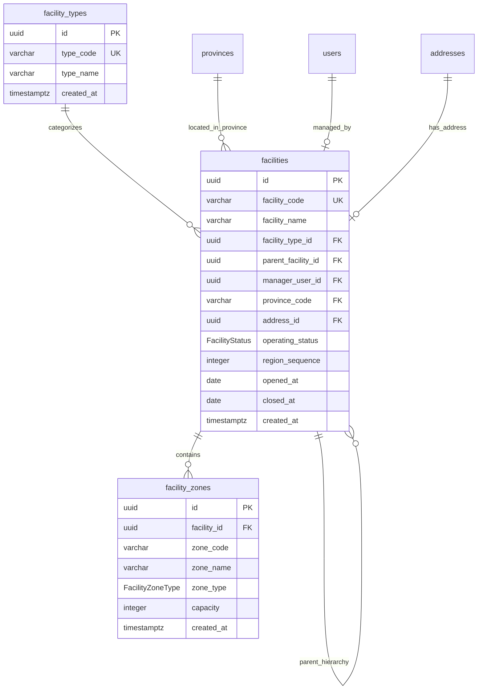

# MODULE 3 - Facility Network Management (Mạng lưới Bưu cục & Kho bãi)

## 🎯 Mục tiêu Module

Module này quản lý toàn bộ mạng lưới cơ sở vật lý (Backbone Network) của hệ thống Smart Logistics Platform:
* Tổ chức mạng lưới bưu cục theo cây phân cấp đa tầng (Tổng kho / Trung tâm chia chọn $\rightarrow$ Kho tỉnh $\rightarrow$ Bưu cục phát chặng cuối).
* Quản lý thông tin vị trí địa lý, địa chỉ (`address_id`), tỉnh thành (`province_code`), quản lý bưu cục (`manager_user_id`) và trạng thái hoạt động.
* Quản lý các phân khu chức năng (`facility_zones`) bên trong bưu cục/kho (Khu nhận `RECEIVING`, Khu chia chọn `SORTING`, Khu chờ xuất hàng `SHIPPING`, Khu lưu kho `STORAGE`, Khu hàng hoàn `RETURN`, Khu cách ly `QUARANTINE`).

---

## 📊 Các Bảng Trong Module (3 Bảng)

| STT | Model Prisma | Tên Bảng DB (`@map`) | Chức Năng Cốt Lõi |
| :--- | :--- | :--- | :--- |
| 1 | `FacilityType` | `facility_types` | Danh mục loại hình cơ sở (Trung tâm chia chọn, Hub tỉnh, Bưu cục phát...) |
| 2 | `Facility` | `facilities` | Quản lý danh sách các bưu cục / kho bãi logistics trong mạng lưới |
| 3 | `FacilityZone` | `facility_zones` | Quản lý các phân khu nghiệp vụ bên trong từng bưu cục / kho |

---

## 🗺️ ERD Module 3



---

## 🗄️ Chi Tiết Thiết Kế Các Bảng

### BẢNG 1 — `facility_types` (Danh mục Loại hình Cơ sở)
Danh mục các loại hình cơ sở logistics trong hệ thống mạng lưới.

| Field | Prisma Type | PostgreSQL Type | Nullable | Ràng buộc & Chức năng |
| :--- | :--- | :--- | :---: | :--- |
| `id` | String | UUID | ❌ | Khóa chính (Primary Key), `@default(uuid())`. |
| `type_code` | String | VARCHAR(30) | ❌ | Mã loại cơ sở duy nhất (`@unique`). VD: `SORTING_CENTER`, `HUB`, `WARD_STATION`. |
| `type_name` | String | VARCHAR(100) | ❌ | Tên hiển thị loại cơ sở (`@map("type_name")`). VD: `Trung tâm chia chọn cấp 1`. |
| `created_at` | DateTime | TIMESTAMPTZ | ❌ | Thời điểm khởi tạo (`@default(now())`). |

* **Indexes & Constraints:**
  ```sql
  PRIMARY KEY (id)
  UNIQUE (type_code)
  ```

---

### BẢNG 2 — `facilities` (Mạng lưới Bưu cục & Kho bãi)
Bảng dữ liệu trung tâm của mạng lưới logistics, tổ chức theo cấu trúc hình cây đệ quy đa cấp.

| Field | Prisma Type | PostgreSQL Type | Nullable | Ràng buộc & Chức năng |
| :--- | :--- | :--- | :---: | :--- |
| `id` | String | UUID | ❌ | Khóa chính (Primary Key), `@default(uuid())`. |
| `facility_code` | String | VARCHAR(30) | ❌ | Mã bưu cục duy nhất (`@unique`). VD: `FAC-HCM-001`, `HUB-HN-002`. |
| `facility_name` | String | VARCHAR(255) | ❌ | Tên bưu cục / kho bãi (`@map("facility_name")`). |
| `facility_type_id` | String | UUID | ❌ | FK $\rightarrow$ `facility_types(id)` (ON DELETE RESTRICT). |
| `parent_facility_id`| String? | UUID | ✅ | FK $\rightarrow$ `facilities(id)` (Bưu cục cấp trên, ON DELETE SET NULL). |
| `manager_user_id` | String? | UUID | ✅ | FK $\rightarrow$ `users(id)` (Quản lý bưu cục, ON DELETE SET NULL). |
| `province_code` | String? | VARCHAR(20) | ✅ | FK $\rightarrow$ `provinces(code)` (Tỉnh/Thành phố, ON DELETE SET NULL). |
| `address_id` | String? | UUID | ✅ | FK $\rightarrow$ `addresses(id)` (Địa chỉ chi tiết bưu cục, ON DELETE SET NULL). |
| `operating_status` | FacilityStatus | Enum | ❌ | Trạng thái: `ACTIVE`, `INACTIVE`, `MAINTENANCE`, `CLOSED`. |
| `region_sequence` | Int? | INTEGER | ✅ | Thứ tự định tuyến theo vùng miền. |
| `opened_at` | DateTime | DATE | ❌ | Ngày bắt đầu mở cửa hoạt động bưu cục. |
| `closed_at` | DateTime? | DATE | ✅ | Ngày đóng cửa (nếu trạng thái là `CLOSED`). |
| `created_at` | DateTime | TIMESTAMPTZ | ❌ | Thời điểm tạo bản ghi (`@default(now())`). |

* **Indexes & Constraints:**
  ```sql
  PRIMARY KEY (id)
  UNIQUE (facility_code)
  CREATE INDEX idx_facilities_parent ON facilities(parent_facility_id);
  CREATE INDEX idx_facilities_province ON facilities(province_code);
  CREATE INDEX idx_facilities_status ON facilities(operating_status);
  FOREIGN KEY (facility_type_id) REFERENCES facility_types(id) ON DELETE RESTRICT
  FOREIGN KEY (parent_facility_id) REFERENCES facilities(id) ON DELETE SET NULL
  FOREIGN KEY (manager_user_id) REFERENCES users(id) ON DELETE SET NULL
  FOREIGN KEY (province_code) REFERENCES provinces(code) ON DELETE SET NULL
  FOREIGN KEY (address_id) REFERENCES addresses(id) ON DELETE SET NULL
  ```

---

### BẢNG 3 — `facility_zones` (Phân khu Chức năng trong Kho)
Quản lý các khu vực nghiệp vụ chuyên biệt bên trong từng bưu cục / kho hàng.

| Field | Prisma Type | PostgreSQL Type | Nullable | Ràng buộc & Chức năng |
| :--- | :--- | :--- | :---: | :--- |
| `id` | String | UUID | ❌ | Khóa chính (Primary Key), `@default(uuid())`. |
| `facility_id` | String | UUID | ❌ | FK $\rightarrow$ `facilities(id)` (ON DELETE CASCADE). |
| `zone_code` | String | VARCHAR(30) | ❌ | Mã phân khu (`@map("zone_code")`). VD: `ZONE-REC-01`, `ZONE-SORT-A`. |
| `zone_name` | String | VARCHAR(100) | ❌ | Tên phân khu (`@map("zone_name")`). VD: `Khu vực Nhập hàng`. |
| `zone_type` | FacilityZoneType | Enum | ❌ | Loại phân khu: `RECEIVING`, `SORTING`, `SHIPPING`, `STORAGE`, `RETURN`, `QUARANTINE`. |
| `capacity` | Int? | INTEGER | ✅ | Sức chứa tối đa (số kiện hàng). |
| `created_at` | DateTime | TIMESTAMPTZ | ❌ | Thời điểm tạo phân khu (`@default(now())`). |

* **Indexes & Constraints:**
  ```sql
  PRIMARY KEY (id)
  UNIQUE (facility_id, zone_code)
  CREATE INDEX idx_facility_zones_fac ON facility_zones(facility_id);
  FOREIGN KEY (facility_id) REFERENCES facilities(id) ON DELETE CASCADE
  ```
