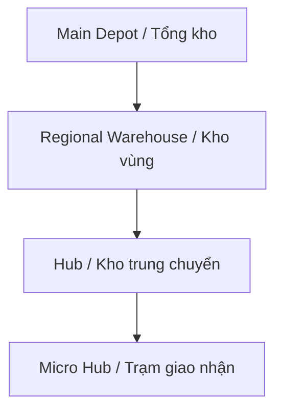
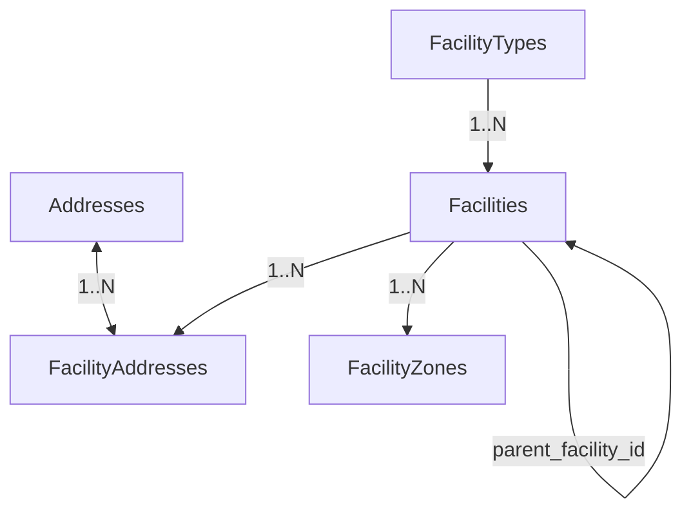

# MODULE 3 - Facility Network Management

## 🎯 Mục tiêu Module

Module này chịu trách nhiệm quản lý toàn bộ mạng lưới vật lý (Backbone Network) của hệ thống Logistics. 

Mạng lưới này được tổ chức theo cấu trúc hình cây phân cấp nhiều tầng:


Mọi thực thể quản trị sau này như tồn kho (`Inventory`), vận chuyển (`Shipments`), định tuyến (`Routes`), phương tiện (`Vehicles`), và tài xế (`Drivers`) đều sẽ được ánh xạ trực tiếp hoặc gián tiếp với các cơ sở (`Facilities`) trong module này.

---

## 📊 Các Bảng Trong Module (4 Bảng)

| STT | Bảng | Chức năng |
| :--- | :--- | :--- |
| 1 | `Facilities` | Quản lý danh sách các cơ sở logistics |
| 2 | `FacilityTypes` | Danh mục loại hình cơ sở (Tổng kho, Hub, Kho trung chuyển...) |
| 3 | `FacilityAddresses`| Liên kết cơ sở với địa chỉ (trong Master Addresses) |
| 4 | `FacilityZones` | Các khu vực chức năng bên trong cơ sở (Nhận hàng, lưu trữ, phân loại...) |

---

## 🗺️ ERD Module



---

## 🗄️ Chi Tiết Thiết Kế Các Bảng

### BẢNG 1 — Facilities
Bảng dữ liệu trung tâm của mạng lưới logistics, tổ chức cấu trúc đệ quy đa cấp.

* **Các trường dữ liệu:**

| Field | PostgreSQL Type | Nullable | Chức năng |
| :--- | :--- | :---: | :--- |
| `id` | UUID | ❌ | Khóa chính. |
| `facility_code` | VARCHAR(30) | ❌ | Mã cơ sở duy nhất (Ví dụ: `WH001`, `HUB102`). |
| `facility_name` | VARCHAR(255) | ❌ | Tên cơ sở (Ví dụ: `Tổng kho miền Nam`). |
| `facility_type_id` | UUID | ❌ | FK → `FacilityTypes(id)` (ON DELETE RESTRICT). |
| `parent_facility_id`| UUID | ✅ | FK → `Facilities(id)`. Nếu bằng `NULL` thì đây là Tổng kho (Main Depot). |
| `manager_user_id` | UUID | ✅ | FK → `Users(id)` (nullable). Người chịu trách nhiệm quản lý cơ sở. |
| `operating_status` | `facility_status_enum` | ❌ | Trạng thái hoạt động (`ACTIVE`, `INACTIVE`, `MAINTENANCE`, `CLOSED`). |
| `opened_at` | DATE | ❌ | Ngày bắt đầu hoạt động. |
| `closed_at` | DATE | ✅ | Ngày chính thức ngừng hoạt động (nếu có). |
| `note` | TEXT | ✅ | Ghi chú thêm. |
| `created_at` | TIMESTAMPTZ | ❌ | Thời điểm tạo. |
| `updated_at` | TIMESTAMPTZ | ❌ | Thời điểm cập nhật. |
| `deleted_at` | TIMESTAMPTZ | ✅ | Xóa mềm (Soft Delete). |

* **Định nghĩa ENUMs:**
  ```sql
  CREATE TYPE facility_status_enum AS ENUM ('ACTIVE', 'INACTIVE', 'MAINTENANCE', 'CLOSED');
  ```

* **Indexes & Constraints:**
  ```sql
  PRIMARY KEY (id)
  UNIQUE (facility_code)
  CREATE INDEX idx_facilities_parent ON Facilities(parent_facility_id);
  CREATE INDEX idx_facilities_status ON Facilities(operating_status);
  ```

* **Business Rules Quan Trọng:**
  1. `parent_facility_id` chỉ được bằng `NULL` đối với các cơ sở cao nhất (Tổng kho).
  2. **Không được có vòng lặp tham chiếu (Circular Reference):** Ví dụ Kho A là cha Kho B, Kho B là cha Kho C, nhưng Kho C lại là cha Kho A. Logic kiểm tra này sẽ được kiểm soát ở tầng Backend (NestJS) trước khi ghi dữ liệu.

---

### BẢNG 2 — FacilityTypes
Danh mục các loại hình cơ sở logistics để dễ dàng mở rộng và phân nhóm chức năng.

* **Các trường dữ liệu:**

| Field | PostgreSQL Type | Nullable | Chức năng |
| :--- | :--- | :---: | :--- |
| `id` | UUID | ❌ | Khóa chính. |
| `type_code` | VARCHAR(30) | ❌ | Mã loại duy nhất (Ví dụ: `MAIN_DEPOT`, `REGIONAL_WAREHOUSE`, `HUB`, `MICRO_HUB`, `FULFILLMENT_CENTER`). |
| `type_name` | VARCHAR(100) | ❌ | Tên hiển thị loại cơ sở (Ví dụ: `Kho trung chuyển`). |
| `description` | TEXT | ✅ | Mô tả vai trò của loại cơ sở. |
| `created_at` | TIMESTAMPTZ | ❌ | Thời điểm tạo. |

* **Indexes & Constraints:**
  ```sql
  PRIMARY KEY (id)
  UNIQUE (type_code)
  ```

---

### BẢNG 3 — FacilityAddresses ⭐
Bảng liên kết các cơ sở với bảng địa chỉ dùng chung (`Addresses`). Một cơ sở có thể có nhiều loại địa chỉ khác nhau (Địa chỉ lấy hàng, địa chỉ thanh toán hóa đơn...).

* **Các trường dữ liệu:**

| Field | PostgreSQL Type | Nullable | Chức năng |
| :--- | :--- | :---: | :--- |
| `id` | UUID | ❌ | Khóa chính. |
| `facility_id` | UUID | ❌ | FK → `Facilities(id)` (ON DELETE CASCADE). |
| `address_id` | UUID | ❌ | FK → `Addresses(id)` (ON DELETE RESTRICT). |
| `address_type` | `facility_address_type_enum` | ❌ | Loại địa chỉ (`MAIN`, `BILLING`, `RETURN`, `PICKUP`). |
| `is_primary` | BOOLEAN | ❌ | Địa chỉ giao dịch chính (Mặc định `false`). |
| `created_at` | TIMESTAMPTZ | ❌ | Thời điểm liên kết. |

* **Định nghĩa ENUMs:**
  ```sql
  CREATE TYPE facility_address_type_enum AS ENUM ('MAIN', 'BILLING', 'RETURN', 'PICKUP');
  ```
  > [!TIP]
  > Việc phân tách riêng `facility_address_type_enum` của Module 3 và `customer_address_type_enum` của Module 2 đảm bảo tính đóng gói (Encapsulation) miền nghiệp vụ (Domain Domain) rõ ràng, tránh xung đột logic.

* **Indexes & Constraints:**
  ```sql
  PRIMARY KEY (id)
  UNIQUE (facility_id, address_id) -- Tránh liên kết trùng lặp.
  CREATE INDEX idx_facility_addr_fac ON FacilityAddresses(facility_id);
  ```

---

### BẢNG 4 — FacilityZones
Quản lý các phân khu chức năng bên trong một cơ sở logistics (Ví dụ: Khu phân loại, Khu chứa hàng dễ cháy, Khu đông lạnh...). Đây là tiền đề để quản lý vị trí kho chi tiết (Inventory Slotting) ở các phase tiếp theo.

* **Các trường dữ liệu:**

| Field | PostgreSQL Type | Nullable | Chức năng |
| :--- | :--- | :---: | :--- |
| `id` | UUID | ❌ | Khóa chính. |
| `facility_id` | UUID | ❌ | FK → `Facilities(id)` (ON DELETE CASCADE). |
| `zone_code` | VARCHAR(30) | ❌ | Mã phân khu (Ví dụ: `RECV`, `SORT`, `STOR_A`). |
| `zone_name` | VARCHAR(100) | ❌ | Tên phân khu (Ví dụ: `Khu vực phân loại`). |
| `zone_type` | `facility_zone_type_enum` | ❌ | Phân loại phân khu (`RECEIVING`, `SORTING`, `STORAGE`, `DISPATCH`, `RETURN`, `QUARANTINE`). |
| `capacity` | INTEGER | ✅ | Sức chứa tối đa của phân khu (đơn vị: Kiện hàng, m3 hoặc pallets). |
| `created_at` | TIMESTAMPTZ | ❌ | Thời điểm tạo. |
| `updated_at` | TIMESTAMPTZ | ❌ | Thời điểm cập nhật. |

* **Định nghĩa ENUMs:**
  ```sql
  CREATE TYPE facility_zone_type_enum AS ENUM ('RECEIVING', 'SORTING', 'STORAGE', 'DISPATCH', 'RETURN', 'QUARANTINE');
  ```

* **Indexes & Constraints:**
  ```sql
  PRIMARY KEY (id)
  UNIQUE (facility_id, zone_code) -- Mã phân khu chỉ cần là duy nhất trong cùng 1 cơ sở
  CREATE INDEX idx_facility_zones_fac ON FacilityZones(facility_id);
  ```

* **Business Rules Quan Trọng:**
  * Không được phép xóa phân khu (`FacilityZones`) nếu phân khu đó đang chứa hàng tồn kho (Logic này sẽ được bắt bởi module Quản lý tồn kho - Inventory ở phase sau).

---

## 💡 Đề Xuất Cơ Chế Trigger PostgreSQL Đảm Bảo Duy Nhất 1 Địa Chỉ Chính

Tương tự như Module 2, để đảm bảo nghiệp vụ *"Mỗi cơ sở logistics chỉ có duy nhất 1 địa chỉ chính (`is_primary = true`)"*, ta tạo trigger tự động cập nhật:

```sql
CREATE OR REPLACE FUNCTION handle_facility_primary_address()
RETURNS TRIGGER AS $$
BEGIN
    IF NEW.is_primary = TRUE THEN
        UPDATE FacilityAddresses
        SET is_primary = FALSE
        WHERE facility_id = NEW.facility_id AND id <> NEW.id;
    END IF;
    RETURN NEW;
END;
$$ LANGUAGE plpgsql;

CREATE TRIGGER trg_unique_facility_primary_address
BEFORE INSERT OR UPDATE OF is_primary ON FacilityAddresses
FOR EACH ROW
WHEN (NEW.is_primary = TRUE)
EXECUTE FUNCTION handle_facility_primary_address();
```
