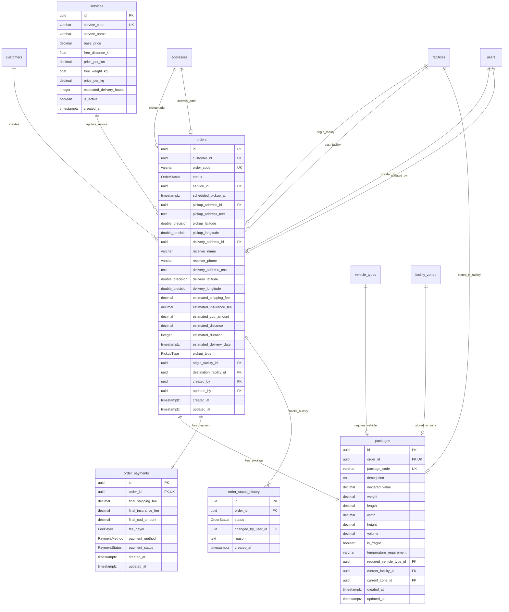

# MODULE 4 - Orders & Services (Đơn hàng & Gói dịch vụ)

## 🎯 Mục tiêu Module

Module Order Management chịu trách nhiệm quản lý toàn bộ vòng đời của Đơn hàng từ khi khách hàng tạo đơn trên Web/App đến khi đơn hàng hoàn tất hoặc chuyển sang các chặng điều phối và giao hàng:
* Quản lý gói cước dịch vụ và công thức tính giá chi tiết (`services`).
* Quản lý thông tin snapshot đơn hàng đóng băng tại thời điểm tạo (`orders`), bao gồm địa chỉ lấy/giao, tọa độ GPS, người nhận, lịch hẹn lấy hàng tận nơi, và các khoản phí ước tính.
* Quản lý chi tiết kiện hàng vật lý (`packages`) gắn liền với đơn hàng (mã barcode, kích thước, khối lượng, quy đổi thể tích, yêu cầu xe chuyên dụng, giá trị khai giá và vị trí phân khu kho hiện tại).
* Quản lý thông tin thanh toán tài chính và đối soát COD (`order_payments`).
* Ghi nhận dòng nhật ký lịch sử thay đổi trạng thái đơn hàng (`order_status_history`).

---

## 📊 Các Bảng Trong Module (5 Bảng)

| STT | Model Prisma | Tên Bảng DB (`@map`) | Chức Năng Cốt Lõi |
| :--- | :--- | :--- | :--- |
| 1 | `Service` | `services` | Danh mục gói cước và bảng giá dịch vụ vận chuyển |
| 2 | `Order` | `orders` | Bảng trung tâm quản lý thông tin nghiệp vụ và Snapshot Đơn hàng |
| 3 | `Package` | `packages` | Chi tiết kiện hàng vật lý, kích thước và phân khu kho lưu giữ |
| 4 | `OrderPayment` | `order_payments` | Thông tin thanh toán, cước phí và tiền COD thực tế |
| 5 | `OrderStatusHistory`| `order_status_history` | Nhật ký lịch sử thay đổi trạng thái của Đơn hàng |

---

## 🗺️ ERD Module 4



---

## 🗄️ Chi Tiết Thiết Kế Các Bảng

### BẢNG 1 — `services` (Bảng Giá & Gói Dịch Vụ Vận Chuyển)
Quản lý các gói cước và tham số cấu hình giá vận chuyển.

| Field | Prisma Type | PostgreSQL Type | Nullable | Ràng buộc & Chức năng |
| :--- | :--- | :--- | :---: | :--- |
| `id` | String | UUID | ❌ | Khóa chính (Primary Key), `@default(uuid())`. |
| `service_code` | String | VARCHAR(30) | ❌ | Mã dịch vụ duy nhất (`@unique`). VD: `EXPRESS`, `STANDARD`, `SAVING`. |
| `service_name` | String | VARCHAR(100) | ❌ | Tên gói dịch vụ (`@map("service_name")`). VD: "Giao Hỏa Tốc 2H". |
| `base_price` | Decimal | DECIMAL(12,2) | ❌ | Cước phí cơ bản (`@default(0.00)`). |
| `free_distance_km`| Float | DOUBLE PRECISION| ❌ | Khoảng cách miễn phí tối thiểu (Km, `@default(2.0)`). |
| `price_per_km` | Decimal | DECIMAL(12,2) | ❌ | Đơn giá cước cho mỗi Km vượt (`@default(0.00)`). |
| `free_weight_kg`| Float | DOUBLE PRECISION| ❌ | Khối lượng miễn phí tối thiểu (Kg, `@default(1.0)`). |
| `price_per_kg` | Decimal | DECIMAL(12,2) | ❌ | Đơn giá cước cho mỗi Kg vượt (`@default(0.00)`). |
| `estimated_delivery_hours`| Int | INTEGER | ❌ | Thời gian giao hàng cam kết (giờ, `@default(24)`). |
| `is_active` | Boolean | BOOLEAN | ❌ | Trạng thái kích hoạt (`@default(true)`). |
| `created_at` | DateTime | TIMESTAMPTZ | ❌ | Thời điểm khởi tạo (`@default(now())`). |

* **Indexes & Constraints:**
  ```sql
  PRIMARY KEY (id)
  UNIQUE (service_code)
  ```

---

### BẢNG 2 — `orders` (Quản Lý Đơn Hàng & Snapshot)
Bảng trung tâm lưu trữ thông tin nghiệp vụ và dữ liệu snapshot đóng băng của Đơn hàng.

| Field | Prisma Type | PostgreSQL Type | Nullable | Ràng buộc & Chức năng |
| :--- | :--- | :--- | :---: | :--- |
| `id` | String | UUID | ❌ | Khóa chính (Primary Key), `@default(uuid())`. |
| `customer_id` | String | UUID | ❌ | FK $\rightarrow$ `customers(id)` (ON DELETE RESTRICT). |
| `order_code` | String | VARCHAR(30) | ❌ | Mã tra cứu đơn hàng duy nhất (`@unique`). VD: `ORD-20260724-8891`. |
| `status` | OrderStatus | Enum | ❌ | Trạng thái vòng đời của đơn hàng (Xem Enum `OrderStatus`). |
| `service_id` | String | UUID | ❌ | FK $\rightarrow$ `services(id)` (ON DELETE RESTRICT). |
| `scheduled_pickup_at`| DateTime?| TIMESTAMPTZ | ✅ | Lịch hẹn Shipper đến lấy hàng tận nhà khách. |
| `pickup_address_id`| String? | UUID | ✅ | FK $\rightarrow$ `addresses(id)` (ON DELETE SET NULL). |
| `pickup_address_text`| String | TEXT | ❌ | Snapshot địa chỉ lấy hàng đầy đủ. |
| `pickup_latitude`| Float | DOUBLE PRECISION| ❌ | Vĩ độ GPS lấy hàng (phục vụ AI Routing). |
| `pickup_longitude`| Float | DOUBLE PRECISION| ❌ | Kinh độ GPS lấy hàng. |
| `delivery_address_id`| String?| UUID | ✅ | FK $\rightarrow$ `addresses(id)` (ON DELETE SET NULL). |
| `receiver_name` | String | VARCHAR(150) | ❌ | Tên người nhận hàng. |
| `receiver_phone` | String | VARCHAR(20) | ❌ | Số điện thoại người nhận. |
| `delivery_address_text`| String | TEXT | ❌ | Snapshot địa chỉ giao hàng đầy đủ. |
| `delivery_latitude`| Float | DOUBLE PRECISION| ❌ | Vĩ độ GPS giao hàng (phục vụ AI Routing). |
| `delivery_longitude`| Float | DOUBLE PRECISION| ❌ | Kinh độ GPS giao hàng. |
| `estimated_shipping_fee`| Decimal| DECIMAL(12,2)| ❌ | Cước phí vận chuyển tạm tính (`@default(0.00)`). |
| `estimated_insurance_fee`| Decimal| DECIMAL(12,2)| ❌ | Phí bảo hiểm tạm tính (`@default(0.00)`). |
| `estimated_cod_amount`| Decimal| DECIMAL(12,2)| ❌ | Tiền thu hộ COD tạm tính (`@default(0.00)`). |
| `estimated_distance`| Decimal?| DECIMAL(10,2)| ✅ | Khoảng cách ước tính (Km). |
| `estimated_duration`| Int? | INTEGER | ✅ | Thời gian di chuyển ước tính (phút). |
| `estimated_delivery_date`| DateTime?| TIMESTAMPTZ| ✅ | Ngày giờ dự kiến giao hàng thành công. |
| `pickup_type` | PickupType | Enum | ❌ | Hình thức gửi: `PICKUP` (Lấy tận nơi), `DROP_OFF` (Khách mang ra bưu cục). Mặc định `PICKUP`. |
| `origin_facility_id`| String? | UUID | ✅ | FK $\rightarrow$ `facilities(id)` (Bưu cục nhận đầu tiên, ON DELETE SET NULL). |
| `destination_facility_id`| String?| UUID | ✅ | FK $\rightarrow$ `facilities(id)` (Bưu cục phát cuối cùng, ON DELETE SET NULL). |
| `created_by` | String? | UUID | ✅ | FK $\rightarrow$ `users(id)` (ON DELETE SET NULL). |
| `updated_by` | String? | UUID | ✅ | FK $\rightarrow$ `users(id)` (ON DELETE SET NULL). |
| `created_at` | DateTime | TIMESTAMPTZ | ❌ | Thời điểm tạo đơn (`@default(now())`). |
| `updated_at` | DateTime | TIMESTAMPTZ | ❌ | Thời điểm cập nhật cuối (`@updatedAt`). |

* **Indexes & Constraints:**
  ```sql
  PRIMARY KEY (id)
  UNIQUE (order_code)
  CREATE INDEX idx_orders_customer ON orders(customer_id);
  CREATE INDEX idx_orders_status ON orders(status);
  FOREIGN KEY (customer_id) REFERENCES customers(id) ON DELETE RESTRICT
  FOREIGN KEY (service_id) REFERENCES services(id) ON DELETE RESTRICT
  FOREIGN KEY (pickup_address_id) REFERENCES addresses(id) ON DELETE SET NULL
  FOREIGN KEY (delivery_address_id) REFERENCES addresses(id) ON DELETE SET NULL
  FOREIGN KEY (origin_facility_id) REFERENCES facilities(id) ON DELETE SET NULL
  FOREIGN KEY (destination_facility_id) REFERENCES facilities(id) ON DELETE SET NULL
  FOREIGN KEY (created_by) REFERENCES users(id) ON DELETE SET NULL
  FOREIGN KEY (updated_by) REFERENCES users(id) ON DELETE SET NULL
  ```

---

### BẢNG 3 — `packages` (Kiện Hàng Vật Lý & Vị Trí Kho)
Chi tiết kiện hàng vật lý thuộc đơn hàng, bao gồm trọng lượng, kích thước, phân khu kho và giá trị khai giá.

| Field | Prisma Type | PostgreSQL Type | Nullable | Ràng buộc & Chức năng |
| :--- | :--- | :--- | :---: | :--- |
| `id` | String | UUID | ❌ | Khóa chính (Primary Key), `@default(uuid())`. |
| `order_id` | String | UUID | ❌ | Khóa ngoại 1-1 duy nhất (`@unique`), FK $\rightarrow$ `orders(id)` (ON DELETE CASCADE). |
| `package_code` | String | VARCHAR(30) | ❌ | Mã vạch kiện hàng duy nhất (`@unique`). VD: `PKG-8891-01`. |
| `description` | String? | TEXT | ✅ | Mô tả hàng hóa bên trong kiện. |
| `declared_value` | Decimal? | DECIMAL(12,2) | ✅ | Giá trị khai giá hàng hóa (căn cứ tính bảo hiểm). |
| `weight` | Decimal | DECIMAL(8,2) | ❌ | Trọng lượng kiện hàng (kg). |
| `length` | Decimal | DECIMAL(6,2) | ❌ | Chiều dài kiện hàng (cm). |
| `width` | Decimal | DECIMAL(6,2) | ❌ | Chiều rộng kiện hàng (cm). |
| `height` | Decimal | DECIMAL(6,2) | ❌ | Chiều cao kiện hàng (cm). |
| `volume` | Decimal | DECIMAL(10,4) | ❌ | Thể tích quy đổi ($m^3$). |
| `is_fragile` | Boolean | BOOLEAN | ❌ | Cờ cảnh báo hàng dễ vỡ (`@default(false)`). |
| `temperature_requirement`| String?| VARCHAR(50)| ✅ | Yêu cầu nhiệt độ bảo quản (VD: `COLD`, `FROZEN`, `NORMAL`). |
| `required_vehicle_type_id`| String?| UUID | ✅ | FK $\rightarrow$ `vehicle_types(id)` (Yêu cầu loại xe, ON DELETE SET NULL). |
| `current_facility_id`| String? | UUID | ✅ | FK $\rightarrow$ `facilities(id)` (Bưu cục hiện tại, ON DELETE SET NULL). |
| `current_zone_id` | String? | UUID | ✅ | FK $\rightarrow$ `facility_zones(id)` (Phân khu kho hiện tại, ON DELETE SET NULL). |
| `created_at` | DateTime | TIMESTAMPTZ | ❌ | Thời điểm tạo kiện (`@default(now())`). |
| `updated_at` | DateTime | TIMESTAMPTZ | ❌ | Thời điểm cập nhật cuối (`@updatedAt`). |

* **Indexes & Constraints:**
  ```sql
  PRIMARY KEY (id)
  UNIQUE (order_id)
  UNIQUE (package_code)
  CREATE INDEX idx_packages_order ON packages(order_id);
  CREATE INDEX idx_packages_location ON packages(current_facility_id, current_zone_id);
  FOREIGN KEY (order_id) REFERENCES orders(id) ON DELETE CASCADE
  FOREIGN KEY (required_vehicle_type_id) REFERENCES vehicle_types(id) ON DELETE SET NULL
  FOREIGN KEY (current_facility_id) REFERENCES facilities(id) ON DELETE SET NULL
  FOREIGN KEY (current_zone_id) REFERENCES facility_zones(id) ON DELETE SET NULL
  ```

---

### BẢNG 4 — `order_payments` (Thanh Toán & COD Chính Thức)
Quản lý thanh toán và thông tin đối soát tài chính của đơn hàng.

| Field | Prisma Type | PostgreSQL Type | Nullable | Ràng buộc & Chức năng |
| :--- | :--- | :--- | :---: | :--- |
| `id` | String | UUID | ❌ | Khóa chính (Primary Key), `@default(uuid())`. |
| `order_id` | String | UUID | ❌ | Khóa ngoại 1-1 duy nhất (`@unique`), FK $\rightarrow$ `orders(id)` (ON DELETE CASCADE). |
| `final_shipping_fee`| Decimal | DECIMAL(12,2) | ❌ | Tiền cước vận chuyển thực tế sau khi chốt. |
| `final_insurance_fee`| Decimal| DECIMAL(12,2) | ❌ | Phí bảo hiểm hàng hóa thực tế. |
| `final_cod_amount` | Decimal | DECIMAL(12,2) | ❌ | Số tiền thu hộ COD thực tế cần thu. |
| `fee_payer` | FeePayer | Enum | ❌ | Người thanh toán cước: `SENDER`, `RECEIVER`. |
| `payment_method` | PaymentMethod| Enum | ❌ | Phương thức: `CASH`, `BANK_TRANSFER`, `E_WALLET`, `COD`. |
| `payment_status` | PaymentStatus| Enum | ❌ | Trạng thái: `UNPAID`, `PAID`, `REFUNDED`. |
| `created_at` | DateTime | TIMESTAMPTZ | ❌ | Thời điểm khởi tạo (`@default(now())`). |
| `updated_at` | DateTime | TIMESTAMPTZ | ❌ | Thời điểm cập nhật (`@updatedAt`). |

* **Indexes & Constraints:**
  ```sql
  PRIMARY KEY (id)
  UNIQUE (order_id)
  FOREIGN KEY (order_id) REFERENCES orders(id) ON DELETE CASCADE
  ```

---

### BẢNG 5 — `order_status_history` (Nhật Ký Thay Đổi Trạng Thái Đơn Hàng)
Ghi nhận đầy đủ lịch sử biến động trạng thái phục vụ đối soát và hiển thị tiến trình.

| Field | Prisma Type | PostgreSQL Type | Nullable | Ràng buộc & Chức năng |
| :--- | :--- | :--- | :---: | :--- |
| `id` | String | UUID | ❌ | Khóa chính (Primary Key), `@default(uuid())`. |
| `order_id` | String | UUID | ❌ | FK $\rightarrow$ `orders(id)` (ON DELETE CASCADE). |
| `status` | OrderStatus | Enum | ❌ | Trạng thái chuyển đến. |
| `changed_by_user_id`| String? | UUID | ✅ | FK $\rightarrow$ `users(id)` (Người đổi trạng thái, ON DELETE SET NULL). |
| `reason` | String? | TEXT | ✅ | Lý do thay đổi trạng thái (đặc biệt khi giao/lấy thất bại). |
| `created_at` | DateTime | TIMESTAMPTZ | ❌ | Thời điểm ghi nhận (`@default(now())`). |

* **Indexes & Constraints:**
  ```sql
  PRIMARY KEY (id)
  CREATE INDEX idx_order_hist_order ON order_status_history(order_id);
  FOREIGN KEY (order_id) REFERENCES orders(id) ON DELETE CASCADE
  FOREIGN KEY (changed_by_user_id) REFERENCES users(id) ON DELETE SET NULL
  ```
