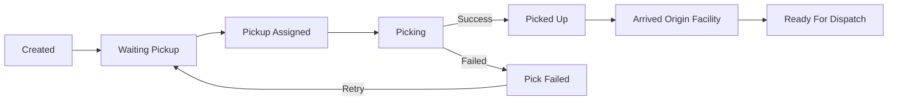
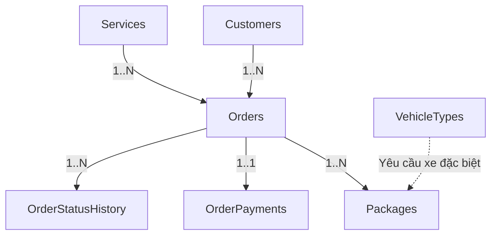

# MODULE 4 - Order Management

## 🎯 Mục tiêu Module

Module Order Management chịu trách nhiệm quản lý vòng đời của một đơn hàng kể từ khi khách hàng tạo đơn thành công cho đến khi hàng hóa được tập kết tại kho gốc và sẵn sàng đưa vào luồng điều phối vận chuyển liên kho hoặc giao chặng cuối.



> [!IMPORTANT]
> **Điểm kết thúc của Module 4:** Đơn hàng đạt trạng thái `READY_FOR_DISPATCH` (Đã nhập kho đầu tiên và sẵn sàng đóng gói/gom kiện để vận chuyển). 
> Kể từ trạng thái này, **Module 5 (Shipment Management)** sẽ tiếp quản để xử lý việc chia/gom kiện, xếp xe và định tuyến chặng giữa/chặng cuối.

---

## 📊 Các Bảng Trong Module (4 Bảng)

| STT | Bảng | Chức năng |
| :--- | :--- | :--- |
| 1 | `Orders` | Thông tin nghiệp vụ đơn hàng, trạng thái hiện tại & thông tin Snapshot |
| 2 | `Packages` | Thực thể độc lập lưu thông tin kích thước, khối lượng của từng kiện hàng thuộc đơn |
| 3 | `OrderPayments` | Quản lý thanh toán và thông tin đối soát tài chính (COD, bên thanh toán) |
| 4 | `OrderStatusHistory`| Ghi nhận lịch sử chi tiết mọi lần thay đổi trạng thái của đơn hàng |
| 5 | `Services` | Danh mục các dịch vụ vận chuyển cung cấp (Hỏa tốc, Tiết kiệm, Hàng đông lạnh...) |

---

## 🗺️ ERD Module



---

## 🗄️ Chi Tiết Thiết Kế Các Bảng

### BẢNG 1 — Orders ⭐
Bảng trung tâm lưu trữ thông tin nghiệp vụ chính của đơn hàng.

* **Các trường dữ liệu:**

| Field | PostgreSQL Type | Nullable | Chức năng |
| :--- | :--- | :---: | :--- |
| `id` | UUID | ❌ | Khóa chính. |
| `customer_id` | UUID | ❌ | FK → `Customers(id)` (ON DELETE RESTRICT). |
| `order_code` | VARCHAR(30) | ❌ | Mã đơn hàng duy nhất để tra cứu (Ví dụ: `ORD000001`). |
| `status` | `order_status_enum` | ❌ | Trạng thái hiện tại của đơn hàng. |
| `service_id` | UUID | ❌ | FK → `Services(id)` (ON DELETE RESTRICT). Gói dịch vụ vận chuyển sử dụng. |
| **--- SENDER SNAPSHOT ---** | | | **Bảo toàn dữ liệu lịch sử gửi hàng** |
| `pickup_address_id` | UUID | ✅ | FK → `Addresses(id)` (nullable, dùng để trace gốc). |
| `sender_name` | VARCHAR(150) | ❌ | Tên người gửi hàng thực tế tại thời điểm tạo đơn. |
| `sender_phone` | VARCHAR(20) | ❌ | SĐT người gửi hàng thực tế tại thời điểm tạo đơn. |
| `pickup_address_text`| TEXT | ❌ | Địa chỉ lấy hàng dạng text đầy đủ tại thời điểm tạo đơn. |
| `pickup_latitude` | DOUBLE PRECISION | ❌ | Vĩ độ GPS chính xác lúc lấy hàng (phục vụ VRP/Routing). |
| `pickup_longitude` | DOUBLE PRECISION | ❌ | Kinh độ GPS chính xác lúc lấy hàng. |
| **--- RECEIVER SNAPSHOT ---**| | | **Thông tin người nhận (Thường nằm ngoài hệ thống)** |
| `delivery_address_id`| UUID | ✅ | FK → `Addresses(id)` (nullable, dùng để trace gốc nếu có). |
| `receiver_name` | VARCHAR(150) | ❌ | Tên người nhận hàng thực tế. |
| `receiver_phone` | VARCHAR(20) | ❌ | SĐT người nhận hàng thực tế. |
| `delivery_address_text`| TEXT | ❌ | Địa chỉ giao hàng dạng text đầy đủ. |
| `delivery_latitude` | DOUBLE PRECISION | ❌ | Vĩ độ GPS giao hàng. |
| `delivery_longitude`| DOUBLE PRECISION | ❌ | Kinh độ GPS giao hàng. |
| **--- FINANCIAL SNAPSHOT ---**| | | **Thông tin tài chính đơn hàng** |
| `shipping_fee` | NUMERIC(12,2) | ❌ | Tiền cước vận chuyển (Mặc định `0.00`). |
| `insurance_fee` | NUMERIC(12,2) | ❌ | Phí bảo hiểm hàng hóa (nếu có). |
| `cod_amount` | NUMERIC(12,2) | ❌ | Số tiền thu hộ COD. |
| `pickup_type` | `pickup_type_enum` | ❌ | Hình thức gửi hàng (`PICKUP` Shipper lấy tận nơi, `DROP_OFF` Khách gửi tại bưu cục). |
| `estimated_delivery_date`| TIMESTAMPTZ | ✅ | Ngày dự kiến giao hàng thành công. |
| **--- AUDIT FIELDS ---** | | | |
| `created_by` | UUID | ✅ | FK → `Users(id)` (ON DELETE SET NULL). Người tạo đơn. |
| `updated_by` | UUID | ✅ | FK → `Users(id)` (ON DELETE SET NULL). Người cập nhật đơn cuối. |
| `created_at` | TIMESTAMPTZ | ❌ | Thời điểm tạo đơn. |
| `updated_at` | TIMESTAMPTZ | ❌ | Thời điểm cập nhật đơn. |

* **Định nghĩa ENUMs:**
  ```sql
  CREATE TYPE order_status_enum AS ENUM (
      'CREATED',
      'WAITING_PICKUP',
      'PICKUP_ASSIGNED',
      'PICKING',
      'PICK_FAILED',
      'PICKED_UP',
      'ARRIVED_ORIGIN_FACILITY',
      'READY_FOR_DISPATCH'
  );
  CREATE TYPE order_change_source_enum AS ENUM ('SYSTEM', 'CUSTOMER', 'DRIVER', 'ADMIN', 'API');
  ```

* **Indexes & Constraints:**
  ```sql
  PRIMARY KEY (id)
  UNIQUE (order_code)
  CREATE INDEX idx_orders_customer ON Orders(customer_id);
  CREATE INDEX idx_orders_status ON Orders(status);
  ```

---

### BẢNG 2 — Packages
Mô tả chi tiết các kiện hàng. Một đơn hàng có thể có nhiều kiện hàng độc lập. Toàn bộ các chặng vận hành quét mã vạch (Barcode/QR) tiếp theo sẽ xoay quanh `Packages` thay vì `Orders` để hỗ trợ chia nhỏ chặng xe hoặc phân tách/gom lô hàng linh hoạt.

* **Các trường dữ liệu:**

| Field | PostgreSQL Type | Nullable | Chức năng |
| :--- | :--- | :---: | :--- |
| `id` | UUID | ❌ | Khóa chính. |
| `order_id` | UUID | ❌ | FK → `Orders(id)` (ON DELETE CASCADE). |
| `package_code` | VARCHAR(30) | ❌ | Mã kiện hàng duy nhất để in Barcode/QR (Ví dụ: `PKG000001_1`). |
| `weight` | NUMERIC(8,2) | ❌ | Khối lượng kiện hàng (kg). |
| `length` | NUMERIC(6,2) | ❌ | Chiều dài kiện hàng (cm). |
| `width` | NUMERIC(6,2) | ❌ | Chiều rộng kiện hàng (cm). |
| `height` | NUMERIC(6,2) | ❌ | Chiều cao kiện hàng (cm). |
| `volume` | NUMERIC(10,4) | ❌ | Thể tích kiện hàng (m3), dùng để tính toán tải trọng xe. |
| `is_fragile` | BOOLEAN | ❌ | Kiện hàng dễ vỡ hay không (Mặc định `false`). |
| `temperature_requirement`| VARCHAR(50) | ✅ | Yêu cầu nhiệt độ bảo quản (Ví dụ: `COLD`, `FROZEN`, `NORMAL`). |
| `required_vehicle_type_id`| UUID | ✅ | FK → `VehicleTypes(id)` (nullable). Chỉ định loại xe bắt buộc (Ví dụ: xe đông lạnh). |
| `current_facility_id`| UUID | ✅ | FK → `Facilities(id)`. Vị trí bưu cục hiện tại kiện hàng đang nằm. |
| `current_zone_id` | UUID | ✅ | FK → `FacilityZones(id)`. Vị trí phân khu kho hiện tại. |
| `created_at` | TIMESTAMPTZ | ❌ | Thời điểm tạo kiện hàng. |
| `updated_at` | TIMESTAMPTZ | ❌ | Thời điểm cập nhật. |

* **Indexes & Constraints:**
  ```sql
  PRIMARY KEY (id)
  UNIQUE (package_code)
  CREATE INDEX idx_packages_order ON Packages(order_id);
  ```

---

### BẢNG 3 — OrderPayments
Quản lý thanh toán và thông tin đối soát tài chính của đơn hàng.

* **Các trường dữ liệu:**

| Field | PostgreSQL Type | Nullable | Chức năng |
| :--- | :--- | :---: | :--- |
| `id` | UUID | ❌ | Khóa chính. |
| `order_id` | UUID | ❌ | FK → `Orders(id)` (ON DELETE CASCADE) - Quan hệ 1..1. |
| `shipping_fee` | NUMERIC(12,2) | ❌ | Tiền cước vận chuyển thực tế. |
| `insurance_fee` | NUMERIC(12,2) | ❌ | Phí bảo hiểm hàng hóa thực tế. |
| `cod_amount` | NUMERIC(12,2) | ❌ | Số tiền thu hộ COD thực tế. |
| `fee_payer` | `fee_payer_enum` | ❌ | Người thanh toán cước (`SENDER`, `RECEIVER`). |
| `payment_method` | `payment_method_enum` | ❌ | Phương thức thanh toán (`CASH`, `BANK_TRANSFER`, `E_WALLET`, `COD`). |
| `payment_status` | `payment_status_enum` | ❌ | Trạng thái thanh toán (`UNPAID`, `PAID`, `REFUNDED`). |
| `created_at` | TIMESTAMPTZ | ❌ | Thời điểm tạo thanh toán. |
| `updated_at` | TIMESTAMPTZ | ❌ | Thời điểm cập nhật trạng thái thanh toán. |

* **Định nghĩa ENUMs:**
  ```sql
  CREATE TYPE fee_payer_enum AS ENUM ('SENDER', 'RECEIVER');
  CREATE TYPE payment_method_enum AS ENUM ('CASH', 'BANK_TRANSFER', 'E_WALLET', 'COD');
  CREATE TYPE payment_status_enum AS ENUM ('UNPAID', 'PAID', 'REFUNDED');
  ```

* **Indexes & Constraints:**
  ```sql
  PRIMARY KEY (id)
  UNIQUE (order_id) -- Ràng buộc 1..1 chặt chẽ giữa Order và Payment
  ```

---

### BẢNG 4 — OrderStatusHistory
Ghi nhận đầy đủ lịch sử thay đổi trạng thái của đơn hàng để phục vụ đối soát, phân tích thời gian xử lý (Lead time) và hiển thị tiến trình cho khách hàng.

* **Các trường dữ liệu:**

| Field | PostgreSQL Type | Nullable | Chức năng |
| :--- | :--- | :---: | :--- |
| `id` | UUID | ❌ | Khóa chính. |
| `order_id` | UUID | ❌ | FK → `Orders(id)` (ON DELETE CASCADE). |
| `status` | `order_status_enum` | ❌ | Trạng thái được chuyển đến. |
| `changed_by_user_id`| UUID | ✅ | FK → `Users(id)` (nullable). Người thực hiện cập nhật. |
| `change_source` | `order_change_source_enum`| ❌ | Nguồn gốc thay đổi trạng thái. |
| `reason` | TEXT | ✅ | Lý do thay đổi trạng thái (đặc biệt quan trọng với trạng thái `PICK_FAILED`). |
| `created_at` | TIMESTAMPTZ | ❌ | Thời điểm bản ghi được ghi nhận (Mặc định `NOW()`). |

* **Indexes & Constraints:**
  ```sql
  PRIMARY KEY (id)
  CREATE INDEX idx_order_hist_order ON OrderStatusHistory(order_id);
  ```

---

## 💡 Đề Xuất Cơ Chế Tự Động Ghi Lịch Sử Trạng Thái (PostgreSQL Trigger)

Để tránh việc lập trình viên quên viết câu lệnh Insert vào bảng lịch sử khi cập nhật trạng thái đơn hàng trên bảng `Orders`, ta có thể tạo một trigger tự động thực hiện việc này:

```sql
CREATE OR REPLACE FUNCTION log_order_status_history()
RETURNS TRIGGER AS $$
DECLARE
    v_user_id UUID;
    v_source order_change_source_enum;
BEGIN
    IF (TG_OP = 'INSERT') OR (OLD.status <> NEW.status) THEN
        -- Đọc thông tin từ session context của PostgreSQL (nếu được thiết lập bởi API layer)
        BEGIN
            v_user_id := NULLIF(current_setting('app.current_user_id', true), '')::UUID;
        EXCEPTION WHEN OTHERS THEN
            v_user_id := NULL;
        END;

        BEGIN
            v_source := COALESCE(NULLIF(current_setting('app.change_source', true), '')::order_change_source_enum, 'SYSTEM');
        EXCEPTION WHEN OTHERS THEN
            v_source := 'SYSTEM'::order_change_source_enum;
        END;

        -- Nếu là insert mới của đơn hàng và người tạo được khai báo trong created_by
        IF TG_OP = 'INSERT' AND v_user_id IS NULL THEN
            v_user_id := NEW.created_by;
        ELSIF TG_OP = 'UPDATE' AND v_user_id IS NULL THEN
            v_user_id := NEW.updated_by;
        END IF;

        INSERT INTO OrderStatusHistory (
            id, 
            order_id, 
            status, 
            changed_by_user_id, 
            change_source, 
            created_at
        )
        VALUES (
            gen_random_uuid(),
            NEW.id,
            NEW.status,
            v_user_id,
            v_source,
            NOW()
        );
    END IF;
    RETURN NEW;
END;
$$ LANGUAGE plpgsql;

CREATE TRIGGER trg_log_order_status_history
AFTER INSERT OR UPDATE OF status ON Orders
FOR EACH ROW
EXECUTE FUNCTION log_order_status_history();

---

### BẢNG 5 — Services ⭐⭐⭐
Danh mục các gói dịch vụ vận chuyển hệ thống cung cấp (ví dụ: Giao Hỏa Tốc, Giao Tiết Kiệm, Giao Hàng Cồng Kềnh). Việc tách riêng bảng này giúp cấu hình phí cơ bản và thêm mới loại hình dịch vụ dễ dàng mà không cần cập nhật mã nguồn hay ENUM.

* **Các trường dữ liệu:**

| Field | PostgreSQL Type | Nullable | Default | Chức năng |
| :--- | :--- | :---: | :---: | :--- |
| `id` | UUID | ❌ | `gen_random_uuid()` | Khóa chính. |
| `service_code` | VARCHAR(30) | ❌ | | Mã dịch vụ duy nhất (Ví dụ: `EXPRESS`, `STANDARD`, `SAVING`, `COLD_CHAIN`). |
| `service_name` | VARCHAR(100) | ❌ | | Tên hiển thị của dịch vụ (Ví dụ: "Giao hàng hỏa tốc 2h"). |
| `base_price` | NUMERIC(12,2)| ❌ | `0.00` | Giá cước cơ bản của dịch vụ. |
| `description` | TEXT | ✅ | | Mô tả chi tiết thời gian cam kết và điều kiện dịch vụ. |
| `is_active` | BOOLEAN | ❌ | `TRUE` | Trạng thái kích hoạt. |
| `created_at` | TIMESTAMPTZ | ❌ | `NOW()` | Thời điểm tạo dịch vụ. |
| `updated_at` | TIMESTAMPTZ | ❌ | `NOW()` | Thời điểm cập nhật dịch vụ. |

* **Indexes & Constraints:**
  ```sql
  PRIMARY KEY (id)
  UNIQUE (service_code)
  ```

```
