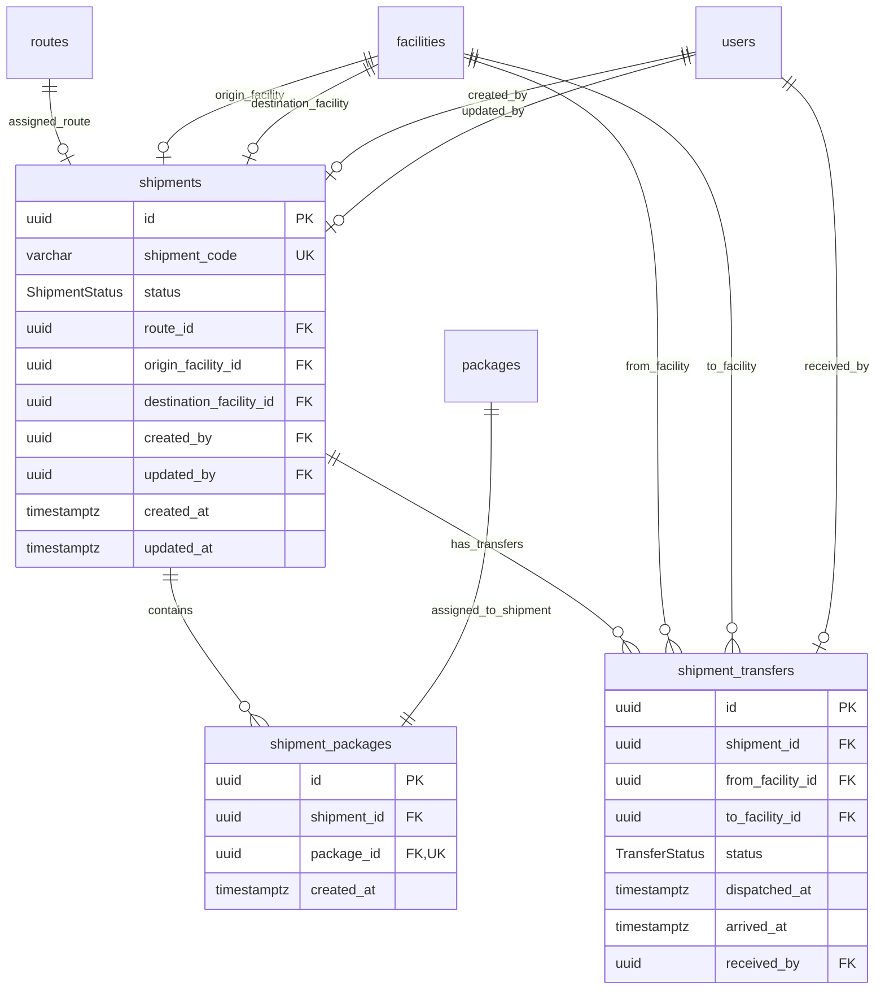

# MODULE 5 - Shipment Management (Quản lý Vận đơn & Trung chuyển)

## 🎯 Mục tiêu Module

Module Shipment Management quản lý toàn bộ quá trình vận chuyển thực tế của hàng hóa từ khi các kiện hàng được xuất kho gửi chặng giữa đến khi được giao chặng cuối thành công hoặc chuyển hoàn:
* Quản lý phiếu Vận đơn (`shipments`) đại diện cho các chuyến gom hàng di chuyển giữa các bưu cục hoặc giao chặng cuối.
* Quản lý liên kết gom kiện hàng vào vận đơn (`shipment_packages`) với ràng buộc 1 Kiện chỉ thuộc 1 Vận đơn active tại một thời điểm (`package_id UNIQUE`).
* Quản lý luồng điều chuyển / xuất nhập kho liên bưu cục giữa kho gửi và kho nhận (`shipment_transfers`).

---

## 📊 Các Bảng Trong Module (3 Bảng)

| STT | Model Prisma | Tên Bảng DB (`@map`) | Chức Năng Cốt Lõi |
| :--- | :--- | :--- | :--- |
| 1 | `Shipment` | `shipments` | Phiếu vận đơn gom hàng / Chuyến xe vận chuyển |
| 2 | `ShipmentPackage` | `shipment_packages` | Bảng trung gian gom kiện hàng vào Vận đơn (1 Kiện ↔ 1 Vận đơn) |
| 3 | `ShipmentTransfer` | `shipment_transfers` | Quản lý điều chuyển và giao nhận hàng hóa giữa các Bưu cục |

---

## 🗺️ ERD Module 5



---

## 🗄️ Chi Tiết Thiết Kế Các Bảng

### BẢNG 1 — `shipments` (Phiếu Vận Đơn / Chuyến Gom Hàng)
Bảng trung tâm quản lý các chuyến vận chuyển hàng hóa giữa các kho hoặc giao chặng cuối.

| Field | Prisma Type | PostgreSQL Type | Nullable | Ràng buộc & Chức năng |
| :--- | :--- | :--- | :---: | :--- |
| `id` | String | UUID | ❌ | Khóa chính (Primary Key), `@default(uuid())`. |
| `shipment_code` | String | VARCHAR(30) | ❌ | Mã vận đơn duy nhất (`@unique`). VD: `SHP-20260724-001`. |
| `status` | ShipmentStatus | Enum | ❌ | Trạng thái: `CREATED`, `ASSIGNED`, `IN_TRANSIT`, `AT_HUB`, `OUT_FOR_DELIVERY`, `DELIVERED`, `DELIVERY_FAILED`, `RETURNING`, `RETURNED`, `CANCELLED`. |
| `route_id` | String? | UUID | ✅ | FK $\rightarrow$ `routes(id)` (Lộ trình do AI chỉ định, ON DELETE SET NULL). |
| `origin_facility_id`| String? | UUID | ✅ | FK $\rightarrow$ `facilities(id)` (Bưu cục xuất phát, ON DELETE SET NULL). |
| `destination_facility_id`| String?| UUID | ✅ | FK $\rightarrow$ `facilities(id)` (Bưu cục đích đến, ON DELETE SET NULL). |
| `created_by` | String? | UUID | ✅ | FK $\rightarrow$ `users(id)` (Người tạo, ON DELETE SET NULL). |
| `updated_by` | String? | UUID | ✅ | FK $\rightarrow$ `users(id)` (Người cập nhật, ON DELETE SET NULL). |
| `created_at` | DateTime | TIMESTAMPTZ | ❌ | Thời điểm tạo phiếu (`@default(now())`). |
| `updated_at` | DateTime | TIMESTAMPTZ | ❌ | Thời điểm cập nhật (`@updatedAt`). |

* **Indexes & Constraints:**
  ```sql
  PRIMARY KEY (id)
  UNIQUE (shipment_code)
  CREATE INDEX idx_shipments_status ON shipments(status);
  FOREIGN KEY (route_id) REFERENCES routes(id) ON DELETE SET NULL
  FOREIGN KEY (origin_facility_id) REFERENCES facilities(id) ON DELETE SET NULL
  FOREIGN KEY (destination_facility_id) REFERENCES facilities(id) ON DELETE SET NULL
  FOREIGN KEY (created_by) REFERENCES users(id) ON DELETE SET NULL
  FOREIGN KEY (updated_by) REFERENCES users(id) ON DELETE SET NULL
  ```

---

### BẢNG 2 — `shipment_packages` (Gom Kiện Hàng Vào Vận Đơn)
Bảng trung gian gom kiện hàng vật lý vào vận đơn chuyến xe. Ràng buộc duy nhất `package_id UNIQUE` đảm bảo 1 kiện hàng chỉ nằm trên 1 vận đơn tại một thời điểm.

| Field | Prisma Type | PostgreSQL Type | Nullable | Ràng buộc & Chức năng |
| :--- | :--- | :--- | :---: | :--- |
| `id` | String | UUID | ❌ | Khóa chính (Primary Key), `@default(uuid())`. |
| `shipment_id` | String | UUID | ❌ | FK $\rightarrow$ `shipments(id)` (ON DELETE CASCADE). |
| `package_id` | String | UUID | ❌ | Khóa ngoại duy nhất (`@unique`), FK $\rightarrow$ `packages(id)` (ON DELETE RESTRICT). |
| `created_at` | DateTime | TIMESTAMPTZ | ❌ | Thời điểm đưa kiện vào vận đơn (`@default(now())`). |

* **Indexes & Constraints:**
  ```sql
  PRIMARY KEY (id)
  UNIQUE (package_id)
  UNIQUE (shipment_id, package_id)
  FOREIGN KEY (shipment_id) REFERENCES shipments(id) ON DELETE CASCADE
  FOREIGN KEY (package_id) REFERENCES packages(id) ON DELETE RESTRICT
  ```

---

### BẢNG 3 — `shipment_transfers` (Luân Chuyển Hàng Giữa Các Bưu Cục)
Quản lý luồng xuất/nhập kho chặng giữa. Theo dõi quá trình xe xuất phát từ Kho A và cập bến Kho B.

| Field | Prisma Type | PostgreSQL Type | Nullable | Ràng buộc & Chức năng |
| :--- | :--- | :--- | :---: | :--- |
| `id` | String | UUID | ❌ | Khóa chính (Primary Key), `@default(uuid())`. |
| `shipment_id` | String | UUID | ❌ | FK $\rightarrow$ `shipments(id)` (ON DELETE CASCADE). |
| `from_facility_id` | String | UUID | ❌ | FK $\rightarrow$ `facilities(id)` (Bưu cục xuất phát, ON DELETE RESTRICT). |
| `to_facility_id` | String | UUID | ❌ | FK $\rightarrow$ `facilities(id)` (Bưu cục đích đến, ON DELETE RESTRICT). |
| `status` | TransferStatus | Enum | ❌ | Trạng thái: `PENDING`, `IN_TRANSIT`, `ARRIVED`, `REJECTED`. |
| `dispatched_at` | DateTime? | TIMESTAMPTZ | ✅ | Thời điểm xe xuất phát rời kho gửi. |
| `arrived_at` | DateTime? | TIMESTAMPTZ | ✅ | Thời điểm xe cập bến và nhập kho đích. |
| `received_by` | String? | UUID | ✅ | FK $\rightarrow$ `users(id)` (Thủ kho nhận hàng, ON DELETE SET NULL). |

* **Indexes & Constraints:**
  ```sql
  PRIMARY KEY (id)
  CREATE INDEX idx_shp_trans_ship ON shipment_transfers(shipment_id);
  FOREIGN KEY (shipment_id) REFERENCES shipments(id) ON DELETE CASCADE
  FOREIGN KEY (from_facility_id) REFERENCES facilities(id) ON DELETE RESTRICT
  FOREIGN KEY (to_facility_id) REFERENCES facilities(id) ON DELETE RESTRICT
  FOREIGN KEY (received_by) REFERENCES users(id) ON DELETE SET NULL
  ```
