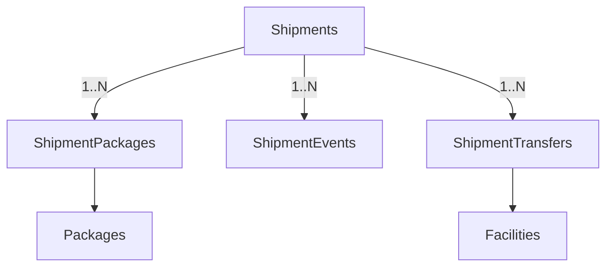

# MODULE 5 - Shipment Management

## 🎯 Mục tiêu Module

Module Shipment Management quản lý toàn bộ quá trình vận chuyển thực tế của hàng hóa (từ khi các kiện hàng được xuất kho gửi chặng giữa đến khi được giao chặng cuối thành công hoặc hoàn hàng). 

Nhiệm vụ của module bắt đầu khi:
1. Đơn hàng đạt trạng thái `READY_FOR_DISPATCH` ở Module 4.
2. Hệ thống (hoặc AI Routing Engine) gom các kiện hàng (`Packages`) vào một Phiếu vận chuyển (`Shipment`).
3. Điều phối viên hoặc AI gán tài xế, phương tiện và theo dõi quá trình hàng luân chuyển qua các kho trung chuyển (`Facilities`) cho đến khi hoàn tất.

---

## 📊 Các Bảng Trong Module (4 Bảng)

| STT | Bảng | Chức năng |
| :--- | :--- | :--- |
| 1 | `Shipments` | Phiếu vận chuyển (Quản lý trạng thái chuyến đi) |
| 2 | `ShipmentPackages` | Liên kết Nhiều-Nhiều giữa Shipment và các kiện hàng Package |
| 3 | `ShipmentEvents` | Nhật ký hành trình chi tiết của Shipment (Audit Trail / Timeline) |
| 4 | `ShipmentTransfers` | Quản lý luân chuyển hàng hóa giữa các kho (Nhập/Xuất kho liên kết) |

---

## 🗺️ ERD Module



---

## 🗄️ Chi Tiết Thiết Kế Các Bảng

### BẢNG 1 — Shipments ⭐
Bảng trung tâm đại diện cho "Một lần vận chuyển hàng hóa". Một Shipment có thể gom nhiều kiện hàng (`Packages`) của nhiều đơn hàng (`Orders`) khác nhau nếu chúng có cùng tuyến đường chặng giữa hoặc cùng khu vực giao hàng chặng cuối.

* **Các trường dữ liệu:**

| Field | PostgreSQL Type | Nullable | Chức năng |
| :--- | :--- | :---: | :--- |
| `id` | UUID | ❌ | Khóa chính. |
| `shipment_code` | VARCHAR(30) | ❌ | Mã phiếu vận chuyển duy nhất (Ví dụ: `SHP000001`). |
| `status` | `shipment_status_enum` | ❌ | Trạng thái của Shipment. |
| `route_id` | UUID | ✅ | FK → `Routes(id)` (nullable). Tuyến đường do AI chỉ định (Module 7). |
| `created_by` | UUID | ✅ | FK → `Users(id)` (ON DELETE SET NULL). Người tạo phiếu vận chuyển. |
| `updated_by` | UUID | ✅ | FK → `Users(id)` (ON DELETE SET NULL). Người cập nhật cuối cùng. |
| `created_at` | TIMESTAMPTZ | ❌ | Thời điểm tạo phiếu. |
| `updated_at` | TIMESTAMPTZ | ❌ | Thời điểm cập nhật. |
| `deleted_at` | TIMESTAMPTZ | ✅ | Xóa mềm phiếu vận chuyển. |

* **Định nghĩa ENUMs:**
  ```sql
  CREATE TYPE shipment_status_enum AS ENUM (
      'CREATED',           -- Phiếu vận chuyển mới tạo
      'ASSIGNED',          -- Đã gán tài xế & phương tiện
      'IN_TRANSIT',         -- Hàng đang đi trên đường
      'AT_HUB',             -- Hàng đã cập bến một kho trung chuyển
      'OUT_FOR_DELIVERY',   -- Tài xế đang đi giao chặng cuối cho khách nhận
      'DELIVERED',          -- Đã giao hàng thành công
      'FAILED',             -- Giao hàng thất bại
      'RETURNING'           -- Đang trên đường chuyển hoàn lại cho người gửi
  );
  ```

* **Indexes & Constraints:**
  ```sql
  PRIMARY KEY (id)
  UNIQUE (shipment_code)
  CREATE INDEX idx_shipments_status ON Shipments(status);
  ```

---

### BẢNG 2 — ShipmentPackages
Bảng trung gian liên kết Nhiều-Nhiều giữa Shipment và Packages. 
> [!NOTE]
> Một Kiện hàng (`Package`) có thể trải qua nhiều chuyến xe/chặng vận chuyển khác nhau (Ví dụ: Chuyến xe 1 đưa hàng từ Kho A đến Hub B, Chuyến xe 2 đưa hàng từ Hub B đến Micro Hub C). Do đó, một Package có thể liên kết với nhiều Shipment khác nhau theo thời gian, nhưng tại một thời điểm hoạt động chỉ nằm trên tối đa một Shipment có trạng thái `IN_TRANSIT`.

* **Các trường dữ liệu:**

| Field | PostgreSQL Type | Nullable | Chức năng |
| :--- | :--- | :---: | :--- |
| `id` | UUID | ❌ | Khóa chính đơn lẻ. |
| `shipment_id` | UUID | ❌ | FK → `Shipments(id)` (ON DELETE CASCADE). |
| `package_id` | UUID | ❌ | FK → `Packages(id)` (ON DELETE RESTRICT). |
| `created_at` | TIMESTAMPTZ | ❌ | Thời điểm đưa kiện hàng vào Shipment. |

* **Indexes & Constraints:**
  ```sql
  PRIMARY KEY (id)
  UNIQUE (shipment_id, package_id) -- Ngăn chặn chèn trùng lặp một kiện trong cùng một chuyến xe
  CREATE INDEX idx_shp_pkg_package ON ShipmentPackages(package_id);
  ```

---

### BẢNG 3 — ShipmentEvents
Bảng Audit Trail ghi nhận toàn bộ hành trình thời gian thực của hàng hóa để phục vụ tra cứu thông tin (Tracking Timeline) cho khách hàng và quản lý.

* **Các trường dữ liệu:**

| Field | PostgreSQL Type | Nullable | Chức năng |
| :--- | :--- | :---: | :--- |
| `id` | UUID | ❌ | Khóa chính. |
| `shipment_id` | UUID | ❌ | FK → `Shipments(id)` (ON DELETE CASCADE). |
| `event_type` | `shipment_event_type_enum` | ❌ | Mã loại sự kiện hành trình. |
| `facility_id` | UUID | ✅ | FK → `Facilities(id)` (nullable, nếu sự kiện diễn ra tại một kho). |
| `latitude` | DOUBLE PRECISION | ✅ | Tọa độ GPS ghi nhận thực tế khi xảy ra sự kiện. |
| `longitude` | DOUBLE PRECISION | ✅ | Tọa độ GPS ghi nhận thực tế khi xảy ra sự kiện. |
| `event_time` | TIMESTAMPTZ | ❌ | Thời gian sự kiện diễn ra. |
| `created_by` | UUID | ✅ | FK → `Users(id)` (nullable). Người quét mã hoặc kích hoạt sự kiện. |
| `notes` | TEXT | ✅ | Ghi chú bổ sung (Ví dụ: "Xe gặp sự cố hỏng lốp", "Quét mã vạch tại băng chuyền 2"). |

* **Định nghĩa ENUMs:**
  ```sql
  CREATE TYPE shipment_event_type_enum AS ENUM (
      'CREATED',
      'DRIVER_ASSIGNED',
      'DEPARTED_FACILITY',
      'ARRIVED_FACILITY',
      'OUT_FOR_DELIVERY',
      'DELIVERY_SUCCESS',
      'DELIVERY_FAIL',
      'RETURN_STARTED',
      'EXCEPTION_OCCURRED'
  );
  ```

* **Indexes & Constraints:**
  ```sql
  PRIMARY KEY (id)
  CREATE INDEX idx_shipment_events_ship ON ShipmentEvents(shipment_id);
  ```


### BẢNG 4 — ShipmentTransfers
Quản lý luồng xuất/nhập kho chặng giữa. Mỗi lần xe xuất phát từ Kho A và cập bến Kho B sẽ được ghi nhận tại đây để kiểm soát hao hụt và thời gian luân chuyển liên kho.

* **Các trường dữ liệu:**

| Field | PostgreSQL Type | Nullable | Chức năng |
| :--- | :--- | :---: | :--- |
| `id` | UUID | ❌ | Khóa chính. |
| `shipment_id` | UUID | ❌ | FK → `Shipments(id)` (ON DELETE CASCADE). |
| `from_facility_id` | UUID | ❌ | FK → `Facilities(id)` (Kho xuất phát). |
| `to_facility_id` | UUID | ❌ | FK → `Facilities(id)` (Kho đích đến). |
| `status` | `transfer_status_enum` | ❌ | Trạng thái luân chuyển (`PENDING`, `IN_TRANSIT`, `ARRIVED`, `REJECTED`). |
| `dispatched_at` | TIMESTAMPTZ | ✅ | Thời điểm xe lăn bánh rời kho xuất phát. |
| `arrived_at` | TIMESTAMPTZ | ✅ | Thời điểm xe cập bến và hoàn thành quét nhập kho đích. |
| `received_by` | UUID | ✅ | FK → `Users(id)` (nullable). Nhân viên kho đích ký xác nhận nhập kho. |

* **Định nghĩa ENUMs:**
  ```sql
  CREATE TYPE transfer_status_enum AS ENUM ('PENDING', 'IN_TRANSIT', 'ARRIVED', 'REJECTED');
  ```

* **Indexes & Constraints:**
  ```sql
  PRIMARY KEY (id)
  CREATE INDEX idx_shp_trans_ship ON ShipmentTransfers(shipment_id);
  ```


---

## 💡 Đề Xuất Cơ Chế Tự Động Tạo Timeline (PostgreSQL Trigger)

Mỗi khi bảng `Shipments` cập nhật trạng thái mới (`status`), hệ thống nên tự động chèn một dòng vào `ShipmentEvents` để làm lịch sử vết (Audit trail):

```sql
CREATE OR REPLACE FUNCTION log_shipment_status_event()
RETURNS TRIGGER AS $$
DECLARE
    v_event_type shipment_event_type_enum;
BEGIN
    IF (TG_OP = 'INSERT') OR (OLD.status <> NEW.status) THEN
        -- Ánh xạ các giá trị từ shipment_status_enum sang shipment_event_type_enum tương đương
        v_event_type := CASE NEW.status
            WHEN 'CREATED' THEN 'CREATED'::shipment_event_type_enum
            WHEN 'ASSIGNED' THEN 'DRIVER_ASSIGNED'::shipment_event_type_enum
            WHEN 'IN_TRANSIT' THEN 'DEPARTED_FACILITY'::shipment_event_type_enum
            WHEN 'AT_HUB' THEN 'ARRIVED_FACILITY'::shipment_event_type_enum
            WHEN 'OUT_FOR_DELIVERY' THEN 'OUT_FOR_DELIVERY'::shipment_event_type_enum
            WHEN 'DELIVERED' THEN 'DELIVERY_SUCCESS'::shipment_event_type_enum
            WHEN 'FAILED' THEN 'DELIVERY_FAIL'::shipment_event_type_enum
            WHEN 'RETURNING' THEN 'RETURN_STARTED'::shipment_event_type_enum
            ELSE 'EXCEPTION_OCCURRED'::shipment_event_type_enum
        END;

        INSERT INTO ShipmentEvents (
            id,
            shipment_id,
            event_type,
            event_time
        )
        VALUES (
            gen_random_uuid(),
            NEW.id,
            v_event_type,
            NOW()
        );
    END IF;
    RETURN NEW;
END;
$$ LANGUAGE plpgsql;

CREATE TRIGGER trg_log_shipment_status_event
AFTER INSERT OR UPDATE OF status ON Shipments
FOR EACH ROW
EXECUTE FUNCTION log_shipment_status_event();
```
