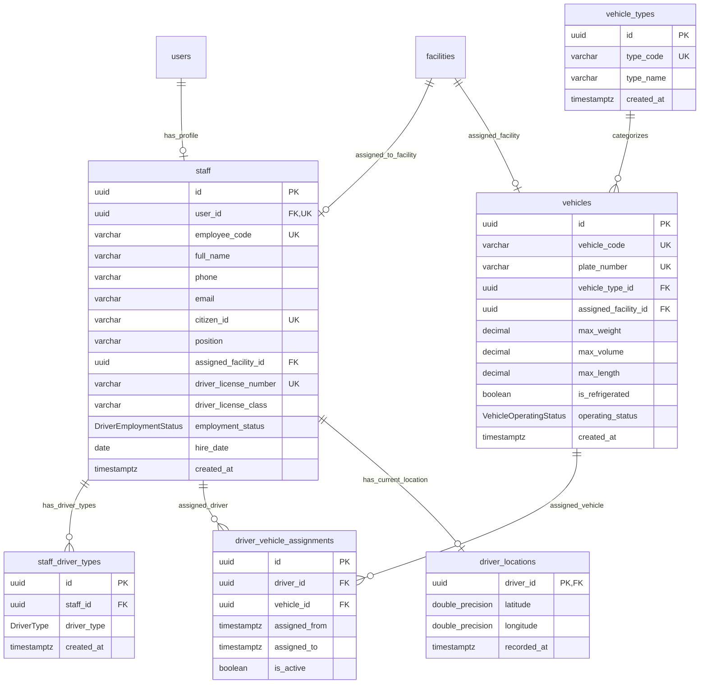

# MODULE 6 - Fleet & Driver Management (Đội xe & Nhân sự Vận hành)

## 🎯 Mục tiêu Module

Module Fleet & Driver Management quản lý toàn bộ nguồn lực vận tải vật lý (Resources) của hệ thống Logistics:
* Quản lý hồ sơ nhân sự vận hành hợp nhất (`staff`), bao gồm nhân viên văn phòng, thủ kho, điều phối viên và tài xế giao hàng (lưu bằng lái, hạng bằng, trạng thái ca).
* Quản lý đăng ký loại hình giao hàng của tài xế (`staff_driver_types`): Giao chặng cuối `HUB_DELIVERY`, Trung chuyển `LINEHAUL_TRANSFER`, Giao hỏa tốc `ON_DEMAND`.
* Quản lý danh mục phương tiện vận tải (`vehicles`) và loại phương tiện (`vehicle_types`).
* Quản lý phân công phương tiện cho tài xế (`driver_vehicle_assignments`).
* Quản lý tọa độ định vị GPS thời gian thực hiện tại của tài xế (`driver_locations`).

---

## 📊 Các Bảng Trong Module (6 Bảng)

| STT | Model Prisma | Tên Bảng DB (`@map`) | Chức Năng Cốt Lõi |
| :--- | :--- | :--- | :--- |
| 1 | `Staff` | `staff` | Hồ sơ nhân sự hợp nhất (Admin, Kho, Điều phối, Tài xế) |
| 2 | `StaffDriverType` | `staff_driver_types` | Loại hình giao hàng tài xế đăng ký đảm nhận |
| 3 | `Vehicle` | `vehicles` | Hồ sơ chi tiết các phương tiện vận tải trong đội xe |
| 4 | `VehicleType` | `vehicle_types` | Danh mục loại phương tiện (Xe máy, Xe tải 1.5T, Xe Van...) |
| 5 | `DriverVehicleAssignment`| `driver_vehicle_assignments`| Phân công phương tiện cho tài xế theo ca hoạt động |
| 6 | `DriverLocation` | `driver_locations` | Tọa độ GPS thời gian thực mới nhất của tài xế |

---

## 🗺️ ERD Module 6



---

## 🗄️ Chi Tiết Thiết Kế Các Bảng

### BẢNG 1 — `staff` (Hồ Sơ Hợp Nhất Nhân Viên & Tài Xế)
Hồ sơ nhân sự toàn diện, liên kết 1-1 với tài khoản `users` qua `user_id UNIQUE`.

| Field | Prisma Type | PostgreSQL Type | Nullable | Ràng buộc & Chức năng |
| :--- | :--- | :--- | :---: | :--- |
| `id` | String | UUID | ❌ | Khóa chính (Primary Key), `@default(uuid())`. |
| `user_id` | String | UUID | ❌ | Khóa ngoại 1-1 duy nhất (`@unique`), FK $\rightarrow$ `users(id)` (ON DELETE CASCADE). |
| `employee_code` | String | VARCHAR(30) | ❌ | Mã nhân viên duy nhất (`@unique`). VD: `STF-000001`, `DRV-000001`. |
| `full_name` | String | VARCHAR(150) | ❌ | Họ và tên nhân viên / tài xế (`@map("full_name")`). |
| `phone` | String | VARCHAR(20) | ❌ | Số điện thoại làm việc. |
| `email` | String? | VARCHAR(255) | ✅ | Email nội bộ / liên hệ. |
| `citizen_id` | String? | VARCHAR(20) | ✅ | Số CCCD duy nhất (`@unique`, `@map("citizen_id")`). |
| `position` | String | VARCHAR(100) | ❌ | Chức vụ: `ADMIN`, `DISPATCHER`, `WAREHOUSE_STAFF`, `DRIVER`. |
| `assigned_facility_id`| String?| UUID | ✅ | FK $\rightarrow$ `facilities(id)` (Bưu cục công tác, ON DELETE SET NULL). |
| `driver_license_number`| String?| VARCHAR(50)| ✅ | Số bằng lái xe GPLX (`@unique`, chỉ có khi là Driver). |
| `driver_license_class`| String?| VARCHAR(10)| ✅ | Hạng bằng lái: `A1`, `B2`, `C`, `FC`... |
| `employment_status` | DriverEmploymentStatus?| Enum | ✅ | Trạng thái: `ACTIVE`, `OFFLINE`, `SUSPENDED`, `DISABLED` (`@default(ACTIVE)`). |
| `hire_date` | DateTime?| DATE | ✅ | Ngày chính thức vào làm. |
| `created_at` | DateTime | TIMESTAMPTZ | ❌ | Thời điểm tạo hồ sơ (`@default(now())`). |

* **Indexes & Constraints:**
  ```sql
  PRIMARY KEY (id)
  UNIQUE (user_id)
  UNIQUE (employee_code)
  UNIQUE (citizen_id)
  UNIQUE (driver_license_number)
  CREATE INDEX idx_staff_status ON staff(employment_status);
  CREATE INDEX idx_staff_facility ON staff(assigned_facility_id);
  CREATE INDEX idx_staff_phone ON staff(phone);
  CREATE INDEX idx_staff_email ON staff(email);
  FOREIGN KEY (user_id) REFERENCES users(id) ON DELETE CASCADE
  FOREIGN KEY (assigned_facility_id) REFERENCES facilities(id) ON DELETE SET NULL
  ```

---

### BẢNG 2 — `staff_driver_types` (Phân Loại Hình Giao Hàng Cho Tài Xế)
Bảng trung gian quản lý các loại hình dịch vụ giao hàng mà tài xế đăng ký chạy.

| Field | Prisma Type | PostgreSQL Type | Nullable | Ràng buộc & Chức năng |
| :--- | :--- | :--- | :---: | :--- |
| `id` | String | UUID | ❌ | Khóa chính (Primary Key), `@default(uuid())`. |
| `staff_id` | String | UUID | ❌ | FK $\rightarrow$ `staff(id)` (ON DELETE CASCADE). |
| `driver_type` | DriverType | Enum | ❌ | Loại hình: `HUB_DELIVERY`, `LINEHAUL_TRANSFER`, `ON_DEMAND`. |
| `created_at` | DateTime | TIMESTAMPTZ | ❌ | Thời điểm gán (`@default(now())`). |

* **Indexes & Constraints:**
  ```sql
  PRIMARY KEY (id)
  UNIQUE (staff_id, driver_type)
  CREATE INDEX idx_staff_driver_types_staff ON staff_driver_types(staff_id);
  CREATE INDEX idx_staff_driver_types_type ON staff_driver_types(driver_type);
  FOREIGN KEY (staff_id) REFERENCES staff(id) ON DELETE CASCADE
  ```

---

### BẢNG 3 — `vehicles` (Hồ Sơ Phương Tiện Vận Tải)
Quản lý các phương tiện trong đội xe giao nhận và trung chuyển.

| Field | Prisma Type | PostgreSQL Type | Nullable | Ràng buộc & Chức năng |
| :--- | :--- | :--- | :---: | :--- |
| `id` | String | UUID | ❌ | Khóa chính (Primary Key), `@default(uuid())`. |
| `vehicle_code` | String | VARCHAR(30) | ❌ | Mã phương tiện duy nhất (`@unique`). VD: `VEH-TRK-001`. |
| `plate_number` | String | VARCHAR(20) | ❌ | Biển số xe duy nhất (`@unique`, `@map("plate_number")`). VD: `59C-123.45`. |
| `vehicle_type_id` | String | UUID | ❌ | FK $\rightarrow$ `vehicle_types(id)` (ON DELETE RESTRICT). |
| `assigned_facility_id`| String?| UUID | ✅ | FK $\rightarrow$ `facilities(id)` (Bưu cục quản lý xe, ON DELETE SET NULL). |
| `max_weight` | Decimal | DECIMAL(10,2) | ❌ | Tải trọng tối đa cho phép (kg). |
| `max_volume` | Decimal | DECIMAL(10,4) | ❌ | Thể tích thùng hàng tối đa ($m^3$). |
| `max_length` | Decimal? | DECIMAL(6,2) | ✅ | Chiều dài lòng thùng xe tối đa (m). |
| `is_refrigerated` | Boolean | BOOLEAN | ❌ | Hỗ trợ thùng bảo ôn / đông lạnh (`@default(false)`). |
| `operating_status`| VehicleOperatingStatus| Enum | ❌ | Trạng thái: `ACTIVE`, `MAINTENANCE`, `RETIRED`. |
| `created_at` | DateTime | TIMESTAMPTZ | ❌ | Thời điểm tạo bản ghi (`@default(now())`). |

* **Indexes & Constraints:**
  ```sql
  PRIMARY KEY (id)
  UNIQUE (vehicle_code)
  UNIQUE (plate_number)
  CREATE INDEX idx_vehicles_type ON vehicles(vehicle_type_id);
  FOREIGN KEY (vehicle_type_id) REFERENCES vehicle_types(id) ON DELETE RESTRICT
  FOREIGN KEY (assigned_facility_id) REFERENCES facilities(id) ON DELETE SET NULL
  ```

---

### BẢNG 4 — `vehicle_types` (Danh Mục Loại Phương Tiện)
Bảng danh mục các loại xe và tải trọng tiêu chuẩn phục vụ thuật toán phân xe của AI Routing.

| Field | Prisma Type | PostgreSQL Type | Nullable | Ràng buộc & Chức năng |
| :--- | :--- | :--- | :---: | :--- |
| `id` | String | UUID | ❌ | Khóa chính (Primary Key), `@default(uuid())`. |
| `type_code` | String | VARCHAR(30) | ❌ | Mã loại xe duy nhất (`@unique`). VD: `MOTORBIKE`, `VAN_500KG`, `TRUCK_1.5T`. |
| `type_name` | String | VARCHAR(100) | ❌ | Tên hiển thị loại xe (`@map("type_name")`). VD: `Xe tải 1.5 Tấn`. |
| `created_at` | DateTime | TIMESTAMPTZ | ❌ | Thời điểm khởi tạo (`@default(now())`). |

* **Indexes & Constraints:**
  ```sql
  PRIMARY KEY (id)
  UNIQUE (type_code)
  ```

---

### BẢNG 5 — `driver_vehicle_assignments` (Phân Công Xe Cho Tài Xế)
Quản lý lịch sử và trạng thái gán phương tiện cho tài xế theo ca làm việc.

| Field | Prisma Type | PostgreSQL Type | Nullable | Ràng buộc & Chức năng |
| :--- | :--- | :--- | :---: | :--- |
| `id` | String | UUID | ❌ | Khóa chính (Primary Key), `@default(uuid())`. |
| `driver_id` | String | UUID | ❌ | FK $\rightarrow$ `staff(id)` (Tài xế, ON DELETE CASCADE). |
| `vehicle_id` | String | UUID | ❌ | FK $\rightarrow$ `vehicles(id)` (Phương tiện, ON DELETE CASCADE). |
| `assigned_from` | DateTime | TIMESTAMPTZ | ❌ | Thời điểm bắt đầu giao xe. |
| `assigned_to` | DateTime? | TIMESTAMPTZ | ✅ | Thời điểm kết thúc bàn giao / trả xe. |
| `is_active` | Boolean | BOOLEAN | ❌ | Trạng thái hiệu lực hiện tại (`@default(true)`). |

* **Indexes & Constraints:**
  ```sql
  PRIMARY KEY (id)
  CREATE INDEX idx_dva_driver_active ON driver_vehicle_assignments(driver_id);
  CREATE INDEX idx_dva_vehicle_active ON driver_vehicle_assignments(vehicle_id);
  FOREIGN KEY (driver_id) REFERENCES staff(id) ON DELETE CASCADE
  FOREIGN KEY (vehicle_id) REFERENCES vehicles(id) ON DELETE CASCADE
  ```

---

### BẢNG 6 — `driver_locations` (Tọa Độ Định Vị GPS Hiện Tại Của Tài Xế)
Lưu trữ vị trí tọa độ GPS mới nhất thời gian thực của tài xế.

| Field | Prisma Type | PostgreSQL Type | Nullable | Ràng buộc & Chức năng |
| :--- | :--- | :--- | :---: | :--- |
| `driver_id` | String | UUID | ❌ | Khóa chính (Primary Key), đồng thời là FK $\rightarrow$ `staff(id)` (ON DELETE CASCADE). |
| `latitude` | Float | DOUBLE PRECISION| ❌ | Vĩ độ GPS hiện tại. |
| `longitude` | Float | DOUBLE PRECISION| ❌ | Kinh độ GPS hiện tại. |
| `recorded_at` | DateTime | TIMESTAMPTZ | ❌ | Thời điểm thiết bị ghi nhận tọa độ GPS. |

* **Indexes & Constraints:**
  ```sql
  PRIMARY KEY (driver_id)
  CREATE INDEX idx_drv_loc_coords ON driver_locations(latitude, longitude);
  FOREIGN KEY (driver_id) REFERENCES staff(id) ON DELETE CASCADE
  ```
