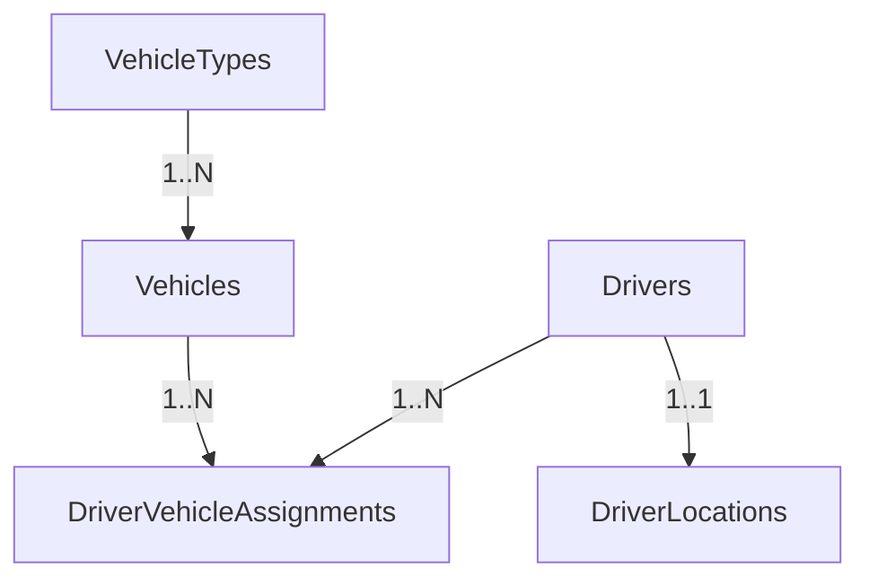

# MODULE 6 - Fleet & Driver Management

## 🎯 Mục tiêu Module

Module Fleet & Driver Management chịu trách nhiệm quản lý toàn bộ nguồn lực vận tải vật lý (Resources) của hệ thống Logistics bao gồm tài xế, đội xe phương tiện và vị trí thời gian thực.

Module này cung cấp thông tin đầu vào quan trọng cho **Module 5 (Shipment)** để gán tài xế nhận nhiệm vụ và **Module 8 (Routing Engine)** để tối ưu hóa tải trọng xe và tính toán quãng đường định tuyến thực tế.

---

## 📊 Các Bảng Trong Module (5 Bảng)

| STT | Bảng | Chức năng |
| :--- | :--- | :--- |
| 1 | `Drivers` | Lưu trữ hồ sơ nghiệp vụ tài xế (shipper) |
| 2 | `Vehicles` | Hồ sơ chi tiết các phương tiện vận tải |
| 3 | `VehicleTypes` | Danh mục loại phương tiện (Xe máy, Xe tải, Container...) |
| 4 | `DriverVehicleAssignments`| Liên kết lịch sử phân phối và gán tài xế với phương tiện |
| 5 | `DriverLocations` | Tọa độ GPS thời gian thực hiện tại của tài xế |

---

## 🗺️ ERD Module



---

## 🗄️ Chi Tiết Thiết Kế Các Bảng

### BẢNG 1 — Drivers
Hồ sơ nghiệp vụ tài xế. Tách biệt với bảng `Users` (Authentication) nhưng liên kết qua `user_id` để đăng nhập ứng dụng tài xế.

* **Các trường dữ liệu:**

| Field | PostgreSQL Type | Nullable | Chức năng |
| :--- | :--- | :---: | :--- |
| `id` | UUID | ❌ | Khóa chính. |
| `user_id` | UUID | ✅ | FK → `Users(id)` (ON DELETE RESTRICT). Tài khoản đăng nhập ứng dụng shipper. |
| `employee_code` | VARCHAR(30) | ❌ | Mã nhân viên/tài xế duy nhất (Ví dụ: `DRV0001`). |
| `full_name` | VARCHAR(150) | ❌ | Họ và tên tài xế. |
| `phone` | VARCHAR(20) | ❌ | Số điện thoại liên hệ (Duy nhất). |
| `citizen_id` | VARCHAR(20) | ✅ | Số căn cước công dân của tài xế (Duy nhất). |
| `driver_license_number`| VARCHAR(50)| ❌ | Số giấy phép lái xe (GPLX). |
| `driver_license_class` | VARCHAR(10) | ❌ | Hạng GPLX (Ví dụ: `A1`, `A2`, `B2`, `C`, `FC`). |
| `hire_date` | DATE | ❌ | Ngày ký hợp đồng/bắt đầu làm việc. |
| `employment_status` | `driver_employment_status_enum`| ❌ | Trạng thái công việc (`ACTIVE`, `OFFLINE`, `SUSPENDED`). |
| `home_facility_id` | UUID | ✅ | FK → `Facilities(id)` (ON DELETE SET NULL). Hub/Kho quản lý trực tiếp tài xế này. |
| `note` | TEXT | ✅ | Ghi chú lý lịch hoặc vi phạm. |
| `created_at` | TIMESTAMPTZ | ❌ | Thời điểm tạo. |
| `updated_at` | TIMESTAMPTZ | ❌ | Thời điểm cập nhật. |
| `deleted_at` | TIMESTAMPTZ | ✅ | Xóa mềm hồ sơ tài xế. |

* **Định nghĩa ENUMs:**
  ```sql
  CREATE TYPE driver_employment_status_enum AS ENUM ('ACTIVE', 'OFFLINE', 'SUSPENDED');
  ```

* **Indexes & Constraints:**
  ```sql
  PRIMARY KEY (id)
  UNIQUE (employee_code)
  UNIQUE (phone)
  UNIQUE (citizen_id)
  UNIQUE (user_id) -- Một tài khoản user chỉ liên kết với tối đa 1 hồ sơ tài xế
  CREATE INDEX idx_drivers_status ON Drivers(employment_status);
  CREATE INDEX idx_drivers_home ON Drivers(home_facility_id);
  ```

---

### BẢNG 2 — Vehicles
Quản lý hồ sơ phương tiện vận tải trong mạng lưới.

* **Các trường dữ liệu:**

| Field | PostgreSQL Type | Nullable | Chức năng |
| :--- | :--- | :---: | :--- |
| `id` | UUID | ❌ | Khóa chính. |
| `vehicle_code` | VARCHAR(30) | ❌ | Mã phương tiện duy nhất để kiểm soát (Ví dụ: `VEH001`). |
| `license_plate` | VARCHAR(20) | ❌ | Biển số xe duy nhất (Ví dụ: `29C-123.45`). |
| `vehicle_type_id` | UUID | ❌ | FK → `VehicleTypes(id)` (ON DELETE RESTRICT). |
| `home_facility_id` | UUID | ✅ | FK → `Facilities(id)` (ON DELETE SET NULL). Trạm/Kho đỗ mặc định của xe. |
| `max_weight` | NUMERIC(10,2) | ❌ | Tải trọng tối đa cho phép (kg). |
| `max_volume` | NUMERIC(10,4) | ❌ | Thể tích thùng hàng tối đa (m3). |
| `max_length` | NUMERIC(6,2) | ✅ | Chiều dài tối đa của thùng hàng (cm), dùng để lọc xe chở hàng quá khổ. |
| `refrigeration_supported`| BOOLEAN | ❌ | Có hỗ trợ đông lạnh hay không (Mặc định `false`). |
| `gps_device_id` | VARCHAR(100) | ✅ | Mã định danh thiết bị định vị GPS lắp trên xe (nếu có). |
| `operating_status` | `vehicle_operating_status_enum`| ❌ | Trạng thái xe (`ACTIVE`, `MAINTENANCE`, `RETIRED`). |
| `created_at` | TIMESTAMPTZ | ❌ | Thời điểm tạo. |
| `updated_at` | TIMESTAMPTZ | ❌ | Thời điểm cập nhật. |

* **Định nghĩa ENUMs:**
  ```sql
  CREATE TYPE vehicle_operating_status_enum AS ENUM ('ACTIVE', 'MAINTENANCE', 'RETIRED');
  ```

* **Indexes & Constraints:**
  ```sql
  PRIMARY KEY (id)
  UNIQUE (vehicle_code)
  UNIQUE (license_plate)
  CREATE INDEX idx_vehicles_type ON Vehicles(vehicle_type_id);
  ```

---

### BẢNG 3 — VehicleTypes
Bảng danh mục các loại phương tiện, lưu trữ thông số giới hạn tải trọng tiêu chuẩn làm tham số đầu vào cho thuật toán gom đơn/phân xe tự động.

* **Các trường dữ liệu:**

| Field | PostgreSQL Type | Nullable | Chức năng |
| :--- | :--- | :---: | :--- |
| `id` | UUID | ❌ | Khóa chính. |
| `type_code` | VARCHAR(30) | ❌ | Mã loại duy nhất (Ví dụ: `MOTORBIKE`, `VAN`, `TRUCK_1T5`, `CONTAINER`, `REFRIGERATED_TRUCK`). |
| `type_name` | VARCHAR(100) | ❌ | Tên hiển thị loại phương tiện (Ví dụ: `Xe tải 1.5 Tấn`). |
| `max_default_weight`| NUMERIC(10,2) | ❌ | Tải trọng tiêu chuẩn mặc định của loại xe này (kg). |
| `description` | TEXT | ✅ | Mô tả loại phương tiện. |
| `created_at` | TIMESTAMPTZ | ❌ | Thời điểm tạo. |

* **Indexes & Constraints:**
  ```sql
  PRIMARY KEY (id)
  UNIQUE (type_code)
  ```

---

### BẢNG 4 — DriverVehicleAssignments ⭐
Bảng liên kết động giữa tài xế và phương tiện.
> [!IMPORTANT]
> **Giải pháp lịch sử gán:** Không lưu `vehicle_id` trực tiếp trong bảng `Drivers` nhằm tránh mất vết lịch sử. Lịch sử gán xe được lưu hoàn toàn ở bảng này. 
> Tại một thời điểm, một tài xế chỉ được phân công hoạt động trên **duy nhất 1 phương tiện** (`is_active = true`) và phương tiện đó cũng chỉ có **duy nhất 1 tài xế** đang điều khiển.

* **Các trường dữ liệu:**

| Field | PostgreSQL Type | Nullable | Chức năng |
| :--- | :--- | :---: | :--- |
| `id` | UUID | ❌ | Khóa chính. |
| `driver_id` | UUID | ❌ | FK → `Drivers(id)` (ON DELETE CASCADE). |
| `vehicle_id` | UUID | ❌ | FK → `Vehicles(id)` (ON DELETE CASCADE). |
| `assigned_from` | TIMESTAMPTZ | ❌ | Thời điểm bắt đầu gán bàn giao xe. |
| `assigned_to` | TIMESTAMPTZ | ✅ | Thời điểm kết thúc bàn giao xe (Khi thu hồi/đổi xe). |
| `is_active` | BOOLEAN | ❌ | Đang kích hoạt sử dụng chặng hiện tại (Mặc định `true`). |

* **Indexes & Constraints:**
  ```sql
  PRIMARY KEY (id)
  CREATE INDEX idx_dva_driver_active ON DriverVehicleAssignments(driver_id) WHERE (is_active = true);
  CREATE INDEX idx_dva_vehicle_active ON DriverVehicleAssignments(vehicle_id) WHERE (is_active = true);
  ```

---

### BẢNG 5 — DriverLocations
Bảng lưu trữ tọa độ định vị GPS hiện tại thời gian thực của tài xế. Bảng này có quan hệ 1..1 chặt chẽ với `Drivers`.

* **Các trường dữ liệu:**

| Field | PostgreSQL Type | Nullable | Chức năng |
| :--- | :--- | :---: | :--- |
| `driver_id` | UUID | ❌ | Khóa chính và đồng thời là FK → `Drivers(id)` (ON DELETE CASCADE). |
| `latitude` | DOUBLE PRECISION | ❌ | Vĩ độ GPS hiện tại. |
| `longitude` | DOUBLE PRECISION | ❌ | Kinh độ GPS hiện tại. |
| `heading` | REAL | ✅ | Hướng di chuyển (Góc từ 0 đến 360 độ). |
| `speed` | REAL | ✅ | Vận tốc di chuyển tức thời (km/h). |
| `accuracy` | REAL | ✅ | Sai số bán kính định vị GPS (mét). |
| `recorded_at` | TIMESTAMPTZ | ❌ | Thời điểm thiết bị cập nhật tọa độ cuối cùng. |

* **Indexes & Constraints:**
  ```sql
  PRIMARY KEY (driver_id) -- Đảm bảo quan hệ 1..1, mỗi driver chỉ duy nhất 1 bản ghi vị trí hiện tại
  CREATE INDEX idx_drv_loc_coords ON DriverLocations(latitude, longitude);
  ```

* **Luồng dữ liệu Realtime (Redis sync):**
  1. Driver App liên tục gửi tọa độ GPS lên server mỗi **10 giây/lần**.
  2. Server ghi nhận trực tiếp vào **Redis Cache** (tốc độ cao, giảm tải cho ổ cứng SQL).
  3. Định kỳ chạy một worker ngầm (Background Job) để đồng bộ (Bulk Upsert) từ Redis về bảng `DriverLocations` trong PostgreSQL phục vụ báo cáo và lưu vết lịch sử di chuyển (nếu cần ở Phase sau).

---

## 💡 Đề Xuất Trigger PostgreSQL Tự Động Hạ Cờ Phân Công Xe Cũ

Để đảm bảo quy tắc nghiệp vụ *"Một tài xế/phương tiện chỉ có tối đa 1 liên kết hoạt động ở trạng thái `is_active = true`"*, ta sử dụng trigger sau:

```sql
CREATE OR REPLACE FUNCTION handle_driver_vehicle_assignment()
RETURNS TRIGGER AS $$
BEGIN
    IF NEW.is_active = TRUE THEN
        -- Hạ cờ active của phương tiện cũ hoặc tài xế cũ trong các bản ghi khác
        UPDATE DriverVehicleAssignments
        SET is_active = FALSE, assigned_to = NOW()
        WHERE (driver_id = NEW.driver_id OR vehicle_id = NEW.vehicle_id)
          AND id <> NEW.id 
          AND is_active = TRUE;
    END IF;
    RETURN NEW;
END;
$$ LANGUAGE plpgsql;

CREATE TRIGGER trg_unique_active_assignment
BEFORE INSERT OR UPDATE OF is_active ON DriverVehicleAssignments
FOR EACH ROW
WHEN (NEW.is_active = TRUE)
EXECUTE FUNCTION handle_driver_vehicle_assignment();
```
