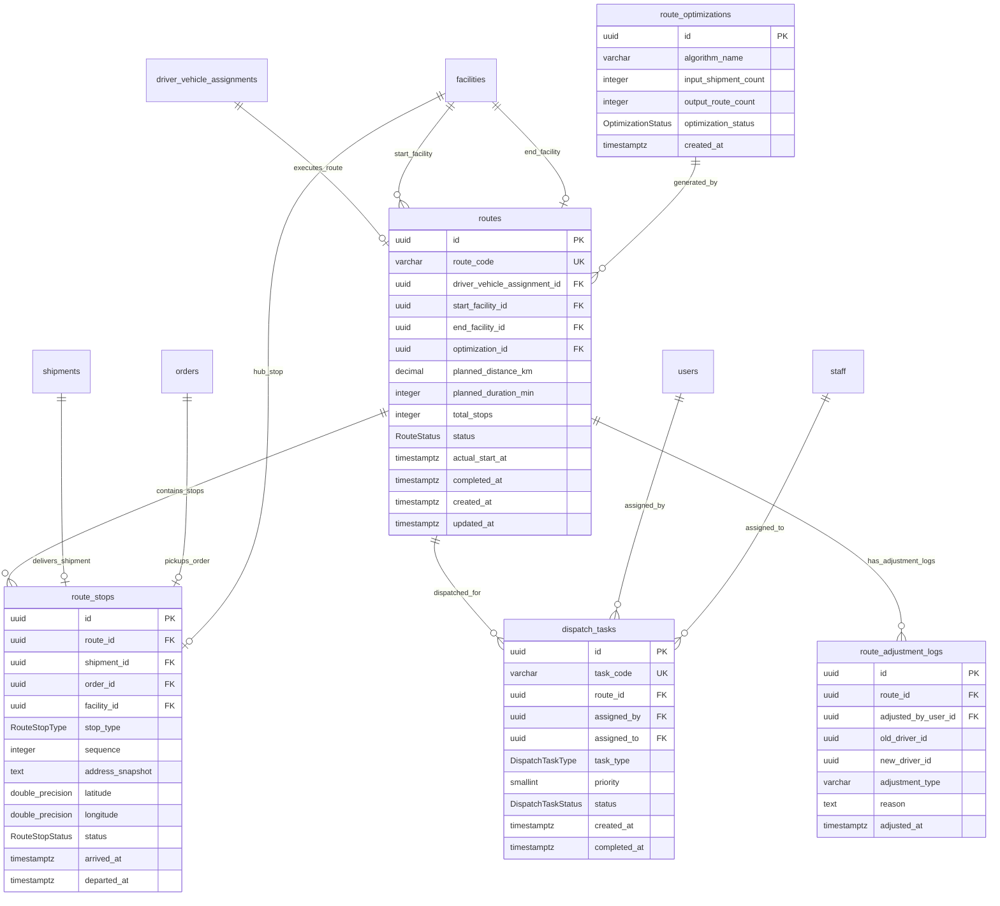

# MODULE 7 - Routing & Dispatch Engine (Lộ trình Tuyến xe & Điều phối)

## 🎯 Mục tiêu Module

Module Routing & Dispatch Engine đóng vai trò là **bộ não điều phối vận tải** của hệ thống Smart Logistics Platform:
* Tiếp nhận danh sách các lô hàng/vận đơn (`shipments`) và đơn hàng lấy tận nơi (`orders`).
* Gom nhóm và tối ưu hóa thứ tự các điểm dừng (`route_stops`) thông qua các thuật toán AI (K-Means Clustering + Genetic Algorithm VRP Solver).
* Tạo Tuyến giao hàng (`routes`) gán trực tiếp cho cặp Tài xế + Xe (`driver_vehicle_assignments`). Cho phép `driver_vehicle_assignment_id` là Nullable để AI sinh tuyến trước khi phân công tài xế.
* Quản lý phiếu điều phối (`dispatch_tasks`) gửi nhiệm vụ xuống Shipper App.
* Lưu vết siêu tham số và kết quả chạy thuật toán tối ưu hóa (`route_optimizations`).
* Ghi nhận nhật ký xử lý sự cố điều chỉnh thủ công tuyến đường (`route_adjustment_logs`) khi có sự cố phát sinh trên đường (đổi tài xế mid-trip, hủy tuyến...).

---

## 📊 Các Bảng Trong Module (5 Bảng)

| STT | Model Prisma | Tên Bảng DB (`@map`) | Chức Năng Cốt Lõi |
| :--- | :--- | :--- | :--- |
| 1 | `Route` | `routes` | Tuyến giao hàng (Bản kế hoạch di chuyển tối ưu bởi AI / Dispatcher) |
| 2 | `RouteStop` | `route_stops` | Thứ tự các điểm dừng trên tuyến (Lấy hàng, Bưu cục, Giao hàng) |
| 3 | `DispatchTask` | `dispatch_tasks` | Nhiệm vụ điều phối giao tuyến cho tài xế |
| 4 | `RouteOptimization`| `route_optimizations`| Siêu dữ liệu và kết quả tính toán của thuật toán AI Routing |
| 5 | `RouteAdjustmentLog`| `route_adjustment_logs`| Nhật ký xử lý sự cố điều chỉnh can thiệp lộ trình |

---

## 🗺️ ERD Module 7



---

## 🗄️ Chi Tiết Thiết Kế Các Bảng

### BẢNG 1 — `routes` (Tuyến Đường Di Chuyển Tối Ưu)
Đại diện cho một tuyến đường di chuyển/giao hàng hoàn chỉnh của một phương tiện.

| Field | Prisma Type | PostgreSQL Type | Nullable | Ràng buộc & Chức năng |
| :--- | :--- | :--- | :---: | :--- |
| `id` | String | UUID | ❌ | Khóa chính (Primary Key), `@default(uuid())`. |
| `route_code` | String | VARCHAR(30) | ❌ | Mã tuyến hiển thị duy nhất (`@unique`). VD: `RT-20260724-001`. |
| `driver_vehicle_assignment_id`| String?| UUID| ✅ | FK $\rightarrow$ `driver_vehicle_assignments(id)` (Nullable, cho phép AI sinh Route trước). |
| `start_facility_id` | String | UUID | ❌ | FK $\rightarrow$ `facilities(id)` (Bưu cục xuất phát, ON DELETE RESTRICT). |
| `end_facility_id` | String? | UUID | ✅ | FK $\rightarrow$ `facilities(id)` (Bưu cục kết thúc, ON DELETE RESTRICT). |
| `optimization_id` | String? | UUID | ✅ | FK $\rightarrow$ `route_optimizations(id)` (Lượt chạy AI, ON DELETE SET NULL). |
| `planned_distance_km` | Decimal | DECIMAL(10,2) | ❌ | Quãng đường dự kiến do AI tính toán (km, `@default(0.00)`). |
| `planned_duration_min`| Int | INTEGER | ❌ | Thời gian di chuyển dự kiến (phút, `@default(0)`). |
| `total_stops` | Int | INTEGER | ❌ | Tổng số điểm dừng trên tuyến (`@default(0)`). |
| `status` | RouteStatus | Enum | ❌ | Trạng thái: `PLANNED`, `ASSIGNED`, `IN_PROGRESS`, `COMPLETED`, `CANCELLED` (`@default(PLANNED)`). |
| `actual_start_at` | DateTime? | TIMESTAMPTZ | ✅ | Thời gian thực tế xe lăn bánh bắt đầu tuyến. |
| `completed_at` | DateTime? | TIMESTAMPTZ | ✅ | Thời điểm hoàn thành tuyến hoàn toàn. |
| `created_at` | DateTime | TIMESTAMPTZ | ❌ | Thời điểm tạo bản ghi (`@default(now())`). |
| `updated_at` | DateTime | TIMESTAMPTZ | ❌ | Thời điểm cập nhật (`@updatedAt`). |

* **Indexes & Constraints:**
  ```sql
  PRIMARY KEY (id)
  UNIQUE (route_code)
  CREATE INDEX idx_routes_dva ON routes(driver_vehicle_assignment_id);
  CREATE INDEX idx_routes_status ON routes(status);
  FOREIGN KEY (driver_vehicle_assignment_id) REFERENCES driver_vehicle_assignments(id) ON DELETE SET NULL
  FOREIGN KEY (start_facility_id) REFERENCES facilities(id) ON DELETE RESTRICT
  FOREIGN KEY (end_facility_id) REFERENCES facilities(id) ON DELETE RESTRICT
  FOREIGN KEY (optimization_id) REFERENCES route_optimizations(id) ON DELETE SET NULL
  ```

---

### BẢNG 2 — `route_stops` (Chi Tiết Các Điểm Dừng Trên Tuyến)
Chi tiết thứ tự các điểm dừng trên tuyến đường do AI sắp xếp theo cột `sequence`.

| Field | Prisma Type | PostgreSQL Type | Nullable | Ràng buộc & Chức năng |
| :--- | :--- | :--- | :---: | :--- |
| `id` | String | UUID | ❌ | Khóa chính (Primary Key), `@default(uuid())`. |
| `route_id` | String | UUID | ❌ | FK $\rightarrow$ `routes(id)` (ON DELETE CASCADE). |
| `shipment_id` | String? | UUID | ✅ | FK $\rightarrow$ `shipments(id)` (Dùng cho điểm dừng giao hàng, ON DELETE SET NULL). |
| `order_id` | String? | UUID | ✅ | FK $\rightarrow$ `orders(id)` (Dùng cho điểm dừng lấy hàng tận nhà, ON DELETE SET NULL). |
| `facility_id` | String? | UUID | ✅ | FK $\rightarrow$ `facilities(id)` (Dùng cho điểm dừng bưu cục, ON DELETE SET NULL). |
| `stop_type` | RouteStopType | Enum | ❌ | Loại điểm dừng: `PICKUP`, `HUB`, `DELIVERY`. |
| `sequence` | Int | INTEGER | ❌ | Thứ tự ghé thăm của điểm dừng trên tuyến (1, 2, 3...). |
| `address_snapshot` | String | TEXT | ❌ | Snapshot địa chỉ tại thời điểm lên lộ trình. |
| `latitude` | Float | DOUBLE PRECISION| ❌ | Vĩ độ GPS của điểm dừng. |
| `longitude` | Float | DOUBLE PRECISION| ❌ | Kinh độ GPS của điểm dừng. |
| `status` | RouteStopStatus| Enum | ❌ | Trạng thái: `PENDING`, `ARRIVED`, `DEPARTED`, `SKIPPED`, `FAILED` (`@default(PENDING)`). |
| `arrived_at` | DateTime? | TIMESTAMPTZ | ✅ | Thời điểm thực tế tài xế đến điểm dừng. |
| `departed_at` | DateTime? | TIMESTAMPTZ | ✅ | Thời điểm thực tế tài xế hoàn tất và rời điểm dừng. |

* **Indexes & Constraints:**
  ```sql
  PRIMARY KEY (id)
  UNIQUE (route_id, sequence)
  FOREIGN KEY (route_id) REFERENCES routes(id) ON DELETE CASCADE
  FOREIGN KEY (shipment_id) REFERENCES shipments(id) ON DELETE SET NULL
  FOREIGN KEY (order_id) REFERENCES orders(id) ON DELETE SET NULL
  FOREIGN KEY (facility_id) REFERENCES facilities(id) ON DELETE SET NULL
  ```

---

### BẢNG 3 — `dispatch_tasks` (Phiếu Giao Nhiệm Vụ Điều Phối)
Nhiệm vụ điều phối phân công tuyến đường cho tài xế xử lý qua Shipper Mobile App.

| Field | Prisma Type | PostgreSQL Type | Nullable | Ràng buộc & Chức năng |
| :--- | :--- | :--- | :---: | :--- |
| `id` | String | UUID | ❌ | Khóa chính (Primary Key), `@default(uuid())`. |
| `task_code` | String | VARCHAR(30) | ❌ | Mã nhiệm vụ điều phối duy nhất (`@unique`). VD: `TSK-20260724-88`. |
| `route_id` | String | UUID | ❌ | FK $\rightarrow$ `routes(id)` (ON DELETE RESTRICT). |
| `assigned_by` | String | UUID | ❌ | FK $\rightarrow$ `users(id)` (Người điều phối, ON DELETE RESTRICT). |
| `assigned_to` | String | UUID | ❌ | FK $\rightarrow$ `staff(id)` (Tài xế nhận nhiệm vụ, ON DELETE RESTRICT). |
| `task_type` | DispatchTaskType | Enum | ❌ | Loại nhiệm vụ: `ASSIGN_ROUTE`, `REASSIGN_ROUTE`, `EMERGENCY`. |
| `priority` | Int | SMALLINT | ❌ | Độ ưu tiên (`@default(1)`). |
| `status` | DispatchTaskStatus| Enum | ❌ | Trạng thái: `PENDING`, `ACCEPTED`, `REJECTED`, `COMPLETED`, `CANCELLED` (`@default(PENDING)`). |
| `created_at` | DateTime | TIMESTAMPTZ | ❌ | Thời điểm tạo phiếu (`@default(now())`). |
| `completed_at` | DateTime? | TIMESTAMPTZ | ✅ | Thời điểm tài xế hoàn thành toàn bộ nhiệm vụ. |

* **Indexes & Constraints:**
  ```sql
  PRIMARY KEY (id)
  UNIQUE (task_code)
  CREATE INDEX idx_disp_tasks_driver ON dispatch_tasks(assigned_to);
  CREATE INDEX idx_disp_tasks_status ON dispatch_tasks(status);
  FOREIGN KEY (route_id) REFERENCES routes(id) ON DELETE RESTRICT
  FOREIGN KEY (assigned_by) REFERENCES users(id) ON DELETE RESTRICT
  FOREIGN KEY (assigned_to) REFERENCES staff(id) ON DELETE RESTRICT
  ```

---

### BẢNG 4 — `route_optimizations` (Nhật Ký Tối Ưu Hóa AI)
Lưu trữ siêu tham số và kết quả chạy của động cơ AI Routing.

| Field | Prisma Type | PostgreSQL Type | Nullable | Ràng buộc & Chức năng |
| :--- | :--- | :--- | :---: | :--- |
| `id` | String | UUID | ❌ | Khóa chính (Primary Key), `@default(uuid())`. |
| `algorithm_name` | String | VARCHAR(50) | ❌ | Tên thuật toán sử dụng (VD: `K-Means + Genetic VRP`). |
| `input_shipment_count`| Int | INTEGER | ❌ | Số lượng vận đơn/đơn hàng đầu vào. |
| `output_route_count`| Int | INTEGER | ❌ | Số lượng tuyến đường tối ưu được sinh ra. |
| `optimization_status`| OptimizationStatus| Enum | ❌ | Kết quả: `SUCCESS`, `FAILED`. |
| `created_at` | DateTime | TIMESTAMPTZ | ❌ | Thời điểm chạy thuật toán (`@default(now())`). |

* **Indexes & Constraints:**
  ```sql
  PRIMARY KEY (id)
  ```

---

### BẢNG 5 — `route_adjustment_logs` (Nhật Ký Điều Chỉnh Can Thiệp Tuyến)
Bảng Audit Log lưu vết khi có sự cố phát sinh trên đường và cần can thiệp thủ công (đổi tài xế, hủy tuyến).

| Field | Prisma Type | PostgreSQL Type | Nullable | Ràng buộc & Chức năng |
| :--- | :--- | :--- | :---: | :--- |
| `id` | String | UUID | ❌ | Khóa chính (Primary Key), `@default(uuid())`. |
| `route_id` | String | UUID | ❌ | FK $\rightarrow$ `routes(id)` (Tuyến bị điều chỉnh, ON DELETE CASCADE). |
| `adjusted_by_user_id`| String | UUID | ❌ | FK $\rightarrow$ `users(id)` (Người thực hiện điều chỉnh). |
| `old_driver_id` | String? | UUID | ✅ | Mã tài xế cũ (nếu thay đổi tài xế). |
| `new_driver_id` | String? | UUID | ✅ | Mã tài xế mới được điều động thay thế. |
| `adjustment_type` | String | VARCHAR(50) | ❌ | Loại can thiệp: `REASSIGN_DRIVER`, `MODIFY_STOPS`, `CANCEL_ROUTE`. |
| `reason` | String | TEXT | ❌ | Lý do sự cố cần can thiệp điều chỉnh. |
| `adjusted_at` | DateTime | TIMESTAMPTZ | ❌ | Thời điểm thực hiện điều chỉnh (`@default(now())`). |

* **Indexes & Constraints:**
  ```sql
  PRIMARY KEY (id)
  CREATE INDEX idx_route_adj_route ON route_adjustment_logs(route_id);
  FOREIGN KEY (route_id) REFERENCES routes(id) ON DELETE CASCADE
  ```
