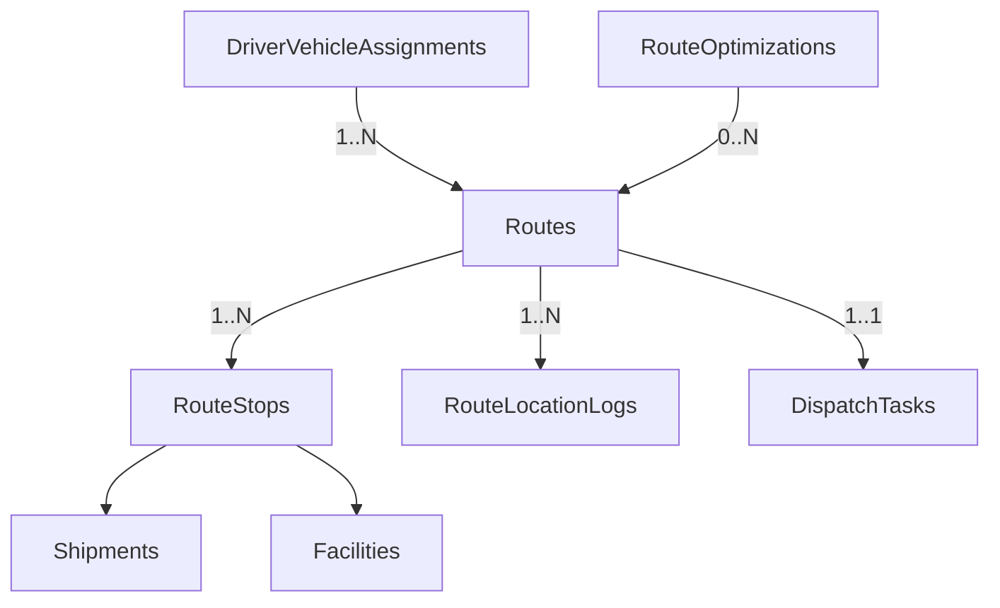
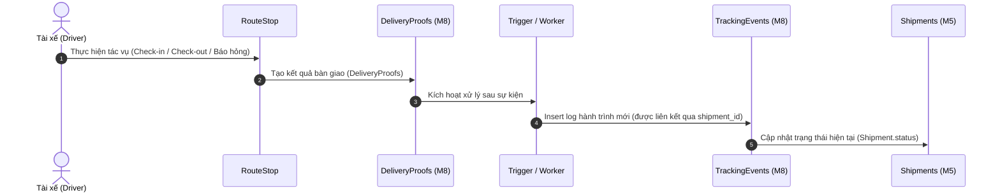

# MODULE 7 - Routing & Dispatch Engine

## 🎯 Mục tiêu Module

Module Routing & Dispatch Engine đóng vai trò là **bộ não điều phối vận tải** của hệ thống Logistics. Module này chịu trách nhiệm:
1. Tiếp nhận danh sách các lô hàng/chuyến vận chuyển (`Shipments`) đã sẵn sàng.
2. Gom nhóm và tối ưu hóa thứ tự các điểm dừng (`RouteStops`) thông qua các thuật toán AI (K-Means, Genetic Algorithm, VRP Solver).
3. Tạo Tuyến giao hàng (`Routes`) gán trực tiếp cho cặp Tài xế + Xe (`DriverVehicleAssignments`).
4. Ghi nhận nhật ký tọa độ định vị thực tế chạy ngầm của phương tiện (`RouteLocationLogs`).
5. Lưu vết siêu tham số và kết quả chạy thuật toán tối ưu hóa (`RouteOptimizations`).

---

## 💡 Phân Tích Kiến Trúc: Đề xuất Đổi Tên & Phân Định Ranh Giới

Sau khi phân tích kỹ lưỡng dưới góc độ **Software Architect**, chúng ta làm rõ ranh giới như sau:

1. **Không nên đổi tên `ShipmentAssignments` ở Module 5 thành `ResourceAssignments`**:
   * Việc gán **Tài xế ↔ Xe** đã được quản lý tập trung và chuẩn hóa tại bảng `DriverVehicleAssignments` ở Module 6 (Fleet Management). Đặt thêm tên `ResourceAssignments` ở Module 5 sẽ gây trùng lặp khái niệm.
2. **Ranh giới chuẩn hóa (Normalization) giữa Module 5 (Shipment) và Module 7 (Routing)**:
   * **Mô hình dư thừa (Redundant):** Nếu vừa có bảng `ShipmentAssignments` ở Module 5 (gán trực tiếp Tài xế/Xe cho từng Shipment) vừa có `RouteStops` ở Module 7 (gán Shipment vào điểm dừng của một Tuyến xe đã có Tài xế/Xe), ta sẽ gặp tình trạng **bất nhất dữ liệu**. Ví dụ: Bảng gán ghi tài xế A chở Shipment X, nhưng bảng Tuyến xe lại ghi tài xế B đang đi giao Shipment X.
   * **Giải pháp chuẩn hóa Enterprise:** 
     * **Bỏ hẳn bảng `ShipmentAssignments` ở Module 5** (hoặc chỉ dùng nó như một thực thể ghi nhận yêu cầu điều phối thô ban đầu).
     * Mối quan hệ chuẩn sẽ là: **Cặp Tài xế + Xe (`DriverVehicleAssignment`)** được gán cho **Tuyến xe (`Route`)**.
     * **Tuyến xe (`Route`)** chứa danh sách các **Điểm dừng (`RouteStops`)**.
     * Mỗi **Điểm dừng (`RouteStop`)** sẽ liên kết trực tiếp đến **Shipment** cần giao/nhận tại điểm đó.
     * Hệ thống sẽ truy vấn tài xế đang vận chuyển Shipment thông qua: `Shipment` ➔ `RouteStops` ➔ `Routes` ➔ `DriverVehicleAssignment`. Điều này giúp dữ liệu nhất quán 100% và hỗ trợ hoàn hảo cho các thuật toán tối ưu lộ trình nhiều điểm dừng (Multi-stop VRP).

---

## 📊 Các Bảng Trong Module (5 Bảng)

| STT | Bảng | Chức năng |
| :--- | :--- | :--- |
| 1 | `Routes` | Tuyến giao hàng (Bản kế hoạch di chuyển tối ưu) |
| 2 | `RouteStops` | Thứ tự các điểm dừng (Hub hoặc Điểm giao/nhận khách hàng) trên tuyến |
| 3 | `DispatchTasks` | Phiếu điều phối (Nhiệm vụ gán tuyến cho tài xế hoặc thay đổi khẩn cấp) |
| 4 | `RouteLocationLogs` | Log định vị GPS hành trình thực tế chạy ngầm của xe |
| 5 | `RouteOptimizations`| Metadata lưu kết quả tính toán của động cơ AI (phục vụ đối so sánh) |

---

## 🗺️ ERD Module



---

## 🗄️ Chi Tiết Thiết Kế Các Bảng

### BẢNG 1 — Routes ⭐⭐⭐
Đại diện cho một tuyến đường di chuyển/giao hàng hoàn chỉnh của một phương tiện.

* **Các trường dữ liệu:**

| Field | PostgreSQL Type | Nullable | Default | Chức năng |
| :--- | :--- | :---: | :---: | :--- |
| `id` | UUID | ❌ | `gen_random_uuid()` | Khóa chính. |
| `route_code` | VARCHAR(30) | ❌ | | Mã tuyến hiển thị trên UI (Ví dụ: `RT202607010001`). |
| `driver_vehicle_assignment_id`| UUID| ❌ | | FK → `DriverVehicleAssignments(id)` (ON DELETE RESTRICT). |
| `start_facility_id` | UUID | ❌ | | FK → `Facilities(id)`. Kho/Hub xuất phát của tuyến. |
| `end_facility_id` | UUID | ✅ | | FK → `Facilities(id)`. Kho kết thúc (NULL nếu tuyến kết thúc tại điểm giao khách hàng cuối cùng). |
| `optimization_id` | UUID | ✅ | | FK → `RouteOptimizations(id)`. NULL nếu tuyến được tạo thủ công bởi điều phối viên. |
| `planned_distance_km` | NUMERIC(10,2) | ❌ | `0.00` | Quãng đường dự kiến do AI/Google Maps API tính toán. |
| `actual_distance_km` | NUMERIC(10,2) | ✅ | | Quãng đường di chuyển thực tế ghi nhận sau khi hoàn thành. |
| `planned_duration_min`| INTEGER | ❌ | `0` | Thời gian di chuyển dự kiến (phút). |
| `actual_duration_min` | INTEGER | ✅ | | Thời gian di chuyển thực tế (phút). |
| `total_stops` | INTEGER | ❌ | `0` | Tổng số điểm dừng trên tuyến. |
| `status` | `route_status_enum` | ❌ | `'PLANNED'` | Trạng thái của tuyến. |
| `planned_start_at` | TIMESTAMPTZ | ❌ | | Thời gian dự kiến xuất phát. |
| `actual_start_at` | TIMESTAMPTZ | ✅ | | Thời gian thực tế xe lăn bánh bắt đầu tuyến. |
| `completed_at` | TIMESTAMPTZ | ✅ | | Thời điểm tuyến được hoàn thành hoàn toàn. |
| `created_at` | TIMESTAMPTZ | ❌ | `NOW()` | Thời điểm tạo bản ghi. |
| `updated_at` | TIMESTAMPTZ | ❌ | `NOW()` | Thời điểm cập nhật bản ghi. |

* **Định nghĩa ENUMs:**
  ```sql
  CREATE TYPE route_status_enum AS ENUM ('PLANNED', 'ASSIGNED', 'IN_PROGRESS', 'COMPLETED', 'CANCELLED');
  ```

* **Indexes & Constraints:**
  ```sql
  PRIMARY KEY (id)
  UNIQUE (route_code)
  CREATE INDEX idx_routes_dva ON Routes(driver_vehicle_assignment_id);
  CREATE INDEX idx_routes_status ON Routes(status);
  ```

---

### BẢNG 2 — RouteStops ⭐⭐⭐
Chi tiết các điểm dừng trên tuyến đường. Động cơ AI tối ưu hóa (VRP Solver) sẽ liên tục sắp xếp lại thứ tự điểm dừng thông qua cột `sequence`.

* **Các trường dữ liệu:**

| Field | PostgreSQL Type | Nullable | Default | Chức năng |
| :--- | :--- | :---: | :---: | :--- |
| `id` | UUID | ❌ | `gen_random_uuid()` | Khóa chính. |
| `route_id` | UUID | ❌ | | FK → `Routes(id)` (ON DELETE CASCADE). |
| `shipment_id` | UUID | ✅ | | FK → `Shipments(id)`. Chuyến hàng cần xử lý tại điểm dừng này. |
| `facility_id` | UUID | ✅ | | FK → `Facilities(id)`. Cơ sở logistics (nếu điểm dừng là kho trung chuyển). |
| `stop_type` | `route_stop_type_enum`| ❌ | | Loại điểm dừng (`PICKUP`, `HUB`, `DELIVERY`). |
| `sequence` | INTEGER | ❌ | | Thứ tự ghé thăm của điểm dừng trên tuyến (bắt đầu từ `1`). |
| `address_snapshot` | TEXT | ❌ | | Snapshot địa chỉ tại thời điểm lên tuyến để bảo toàn dữ liệu. |
| `latitude` | DOUBLE PRECISION| ❌ | | Vĩ độ GPS của điểm dừng. |
| `longitude` | DOUBLE PRECISION| ❌ | | Kinh độ GPS của điểm dừng. |
| `planned_arrival_at` | TIMESTAMPTZ | ✅ | | Thời gian dự kiến đến (ETA). |
| `actual_arrival_at` | TIMESTAMPTZ | ✅ | | Thời gian thực tế tài xế check-in tại điểm dừng. |
| `planned_departure_at`| TIMESTAMPTZ| ✅ | | Thời gian dự kiến xuất phát rời điểm dừng. |
| `actual_departure_at` | TIMESTAMPTZ | ✅ | | Thời gian thực tế tài xế check-out rời điểm dừng. |
| `status` | `route_stop_status_enum`| ❌| `'PENDING'` | Trạng thái xử lý điểm dừng. |

* **Định nghĩa ENUMs:**
  ```sql
  CREATE TYPE route_stop_type_enum AS ENUM ('PICKUP', 'HUB', 'DELIVERY');
  CREATE TYPE route_stop_status_enum AS ENUM ('PENDING', 'ARRIVED', 'DEPARTED', 'SKIPPED', 'FAILED');
  ```

* **Indexes & Constraints:**
  ```sql
  PRIMARY KEY (id)
  UNIQUE (route_id, sequence) -- Thứ tự điểm dừng không được trùng nhau trong cùng một tuyến
  
  -- Ràng buộc logic đảm bảo tính nhất quán của loại điểm dừng:
  CONSTRAINT chk_stop_references CHECK (
      (stop_type = 'HUB' AND facility_id IS NOT NULL AND shipment_id IS NULL) OR
      (stop_type IN ('PICKUP', 'DELIVERY') AND shipment_id IS NOT NULL AND facility_id IS NULL)
  )
  ```

---

### BẢNG 3 — DispatchTasks ⭐⭐
Nhiệm vụ điều phối. Cung cấp cơ chế giao tiếp giữa hệ thống điều hành (Dispatcher/AI) và tài xế qua ứng dụng di động.

* **Các trường dữ liệu:**

| Field | PostgreSQL Type | Nullable | Default | Chức năng |
| :--- | :--- | :---: | :---: | :--- |
| `id` | UUID | ❌ | `gen_random_uuid()` | Khóa chính. |
| `task_code` | VARCHAR(30) | ❌ | | Mã nhiệm vụ điều phối duy nhất (Ví dụ: `DISP000001`). |
| `route_id` | UUID | ❌ | | FK → `Routes(id)` (ON DELETE RESTRICT). |
| `assigned_by` | UUID | ❌ | | FK → `Users(id)`. Điều phối viên hoặc hệ thống tự động gán. |
| `assigned_to` | UUID | ❌ | | FK → `Drivers(id)`. Tài xế nhận nhiệm vụ chạy tuyến. |
| `task_type` | `dispatch_task_type_enum`| ❌ | | Phân loại nhiệm vụ (`ASSIGN_ROUTE`, `REASSIGN_ROUTE`, `EMERGENCY`). |
| `priority` | SMALLINT | ❌ | `1` | Độ ưu tiên của nhiệm vụ (Từ `1` - Thấp đến `5` - Khẩn cấp). |
| `status` | `dispatch_task_status_enum`| ❌| `'PENDING'` | Trạng thái xử lý của tài xế. |
| `note` | TEXT | ✅ | | Ghi chú hướng dẫn đặc biệt cho tài xế. |
| `created_at` | TIMESTAMPTZ | ❌ | `NOW()` | Thời điểm tạo phiếu điều phối. |
| `completed_at` | TIMESTAMPTZ | ✅ | | Thời điểm tài xế hoàn thành toàn bộ nhiệm vụ. |

* **Định nghĩa ENUMs:**
  ```sql
  CREATE TYPE dispatch_task_type_enum AS ENUM ('ASSIGN_ROUTE', 'REASSIGN_ROUTE', 'EMERGENCY');
  CREATE TYPE dispatch_task_status_enum AS ENUM ('PENDING', 'ACCEPTED', 'REJECTED', 'COMPLETED', 'CANCELLED');
  ```

* **Indexes & Constraints:**
  ```sql
  PRIMARY KEY (id)
  UNIQUE (task_code)
  CREATE INDEX idx_disp_tasks_driver ON DispatchTasks(assigned_to);
  CREATE INDEX idx_disp_tasks_status ON DispatchTasks(status);
  ```

---

### BẢNG 4 — RouteLocationLogs ⭐⭐
Lưu log tọa độ định vị GPS, tốc độ, và hướng di chuyển được gửi lên tự động chạy ngầm (background telemetry) từ thiết bị di động của tài xế khi thực hiện tuyến đường. Bảng này hỗ trợ tính năng vẽ lại hành trình thực tế trên bản đồ quản trị và phát hiện các sự cố chệch tuyến.

* **Các trường dữ liệu:**

| Field | PostgreSQL Type | Nullable | Default | Chức năng |
| :--- | :--- | :---: | :---: | :--- |
| `id` | UUID | ❌ | `gen_random_uuid()` | Khóa chính. |
| `route_id` | UUID | ❌ | | FK → `Routes(id)` (ON DELETE CASCADE). |
| `latitude` | DOUBLE PRECISION| ❌ | | Tọa độ vĩ độ GPS. |
| `longitude` | DOUBLE PRECISION| ❌ | | Tọa độ kinh độ GPS. |
| `speed_mps` | NUMERIC(5,2) | ✅ | | Tốc độ di chuyển tức thời (mét/giây). |
| `heading_degrees`| NUMERIC(5,2)| ✅ | | Hướng di chuyển góc 0 - 360 độ (0: Bắc, 90: Đông...). |
| `accuracy_meters`| NUMERIC(5,2)| ✅ | | Độ sai số của GPS tính bằng mét. |
| `recorded_at` | TIMESTAMPTZ | ❌ | `NOW()` | Thời điểm thiết bị ghi nhận tọa độ GPS này. |

* **Indexes & Constraints:**
  ```sql
  PRIMARY KEY (id)
  CREATE INDEX idx_route_loc_route ON RouteLocationLogs(route_id, recorded_at DESC);
  ```

---

### BẢNG 5 — RouteOptimizations ⭐⭐
Lưu trữ kết quả đầu ra của thuật toán AI Routing. Dữ liệu này giúp đánh giá hiệu quả tối ưu hóa của động cơ AI so với điều phối thủ công.

* **Các trường dữ liệu:**

| Field | PostgreSQL Type | Nullable | Default | Chức năng |
| :--- | :--- | :---: | :---: | :--- |
| `id` | UUID | ❌ | `gen_random_uuid()` | Khóa chính. |
| `algorithm_name` | VARCHAR(50) | ❌ | | Tên thuật toán sử dụng (Ví dụ: `K-Means + Genetic VRP`, `OR-Tools`). |
| `algorithm_version`| VARCHAR(20) | ✅ | | Phiên bản mã nguồn thuật toán để theo vết cập nhật. |
| `input_shipment_count`| INTEGER | ❌ | | Số lượng chuyến hàng đầu vào cần xử lý tối ưu. |
| `output_route_count`| INTEGER | ❌ | | Số lượng tuyến tối ưu được động cơ sinh ra thành công. |
| `execution_time_ms` | INTEGER | ❌ | | Thời gian xử lý tính toán của thuật toán (mili giây). |
| `fitness_score` | NUMERIC(8,4) | ✅ | | Điểm đánh giá lời giải của thuật toán Genetic (nếu áp dụng). |
| `optimization_status`| `optimization_status_enum`| ❌| `'SUCCESS'` | Kết quả chạy giải thuật (`SUCCESS`, `FAILED`). |
| `created_at` | TIMESTAMPTZ | ❌ | `NOW()` | Thời điểm chạy thuật toán. |

* **Định nghĩa ENUMs:**
  ```sql
  CREATE TYPE optimization_status_enum AS ENUM ('SUCCESS', 'FAILED');
  ```

* **Indexes & Constraints:**
  ```sql
  PRIMARY KEY (id)
  ```

---

## 💡 Business Rules

* Trạng thái di chuyển của tuyến (`Routes.status`) như `IN_PROGRESS` hay `COMPLETED` sẽ được ứng dụng của tài xế cập nhật trực tiếp thông qua REST API (`PATCH /api/v1/routes/{id}/status`) khi tài xế chủ động thực hiện hành động bắt đầu/kết thúc tuyến trên giao diện người dùng, thay vì suy luận tự động từ log GPS chạy ngầm.

---

## 💡 Luồng Cập Nhật Trạng thái Dựa Trên Sự Kiện (Event-Driven State Update)

Để đảm bảo tính linh hoạt tối đa (như xử lý trường hợp thất bại khi lấy hàng, đóng cửa hàng, hoặc giao hụt), chúng ta không cập nhật trực tiếp từ điểm dừng sang Shipment. Thay vào đó, áp dụng kiến trúc hướng sự kiện (Event-Driven):



### Ví dụ Vận Hành:
1. Tài xế đến địa chỉ người gửi hàng (`RouteStop` loại `PICKUP`).
2. Tài xế không liên lạc được với người gửi ➔ Ấn báo thất bại trên App ➔ Phát sinh bản ghi `FAILED` tại `DeliveryProofs`.
3. Hệ thống bắt sự kiện này thông qua trigger ➔ Chèn một dòng vào `TrackingEvents` với lý do hụt hàng ➔ Chuyển trạng thái `Shipments.status` sang `FAILED` (hoặc `PICK_FAILED`).
4. Tuyến đường `Route` vẫn tiếp tục hoạt động để tài xế di chuyển sang các điểm dừng tiếp theo thay vì bị khóa cứng.

---

## 🚚 Các Loại Tuyến Vận Hành (Route Types) Dùng Chung Cấu Trúc

Sự kết hợp linh hoạt giữa `Routes` và `RouteStops` cho phép mô hình hóa mọi loại tuyến đường trong thực tế mà không cần thay đổi cấu trúc bảng:

### 1. Tuyến Gom Hàng (Pickup Route)
* **Ý nghĩa:** Tài xế đi thu gom hàng từ các Shop/Người gửi và tập kết về Hub đầu tiên.
* **Cấu trúc Stops:**
  * Stop 1: `stop_type = 'PICKUP'` (Shop 1 - Lấy hàng) ➔ Tham chiếu `shipment_id = X`
  * Stop 2: `stop_type = 'PICKUP'` (Shop 2 - Lấy hàng) ➔ Tham chiếu `shipment_id = Y`
  * Stop 3: `stop_type = 'HUB'` (Hub Thủ Đức - Tập kết) ➔ Tham chiếu `facility_id = Hub_Thủ_Đức`

### 2. Tuyến Giao Hàng Chặng Cuối (Delivery Route)
* **Ý nghĩa:** Tài xế chặng cuối (Shipper) lấy hàng từ Hub đi giao đến tay các người nhận.
* **Cấu trúc Stops:**
  * Stop 1: `stop_type = 'HUB'` (Hub Quận 9 - Xuất phát) ➔ Tham chiếu `facility_id = Hub_Quận_9`
  * Stop 2: `stop_type = 'DELIVERY'` (Nhà khách A - Giao hàng) ➔ Tham chiếu `shipment_id = X`
  * Stop 3: `stop_type = 'DELIVERY'` (Nhà khách B - Giao hàng) ➔ Tham chiếu `shipment_id = Y`

### 3. Tuyến Luân Chuyển Liên Kho (Transfer Route / Middle Mile)
* **Ý nghĩa:** Xe tải lớn vận chuyển hàng loạt Shipment liên tỉnh từ kho gốc sang kho đích.
* **Cấu trúc Stops:**
  * Stop 1: `stop_type = 'HUB'` (Tổng kho Sóng Thần - Xuất hàng) ➔ Tham chiếu `facility_id = Kho_Sóng_Thần`
  * Stop 2: `stop_type = 'HUB'` (Hub Đà Nẵng - Nhập hàng) ➔ Tham chiếu `facility_id = Hub_Đà_Nẵng`
```
