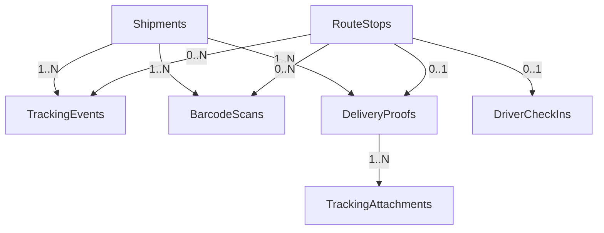

# MODULE 8 - Tracking, Scan & Proof of Delivery (Execution Layer)

## 🎯 Mục tiêu Module

Module **Tracking, Scan & Proof of Delivery** đóng vai trò là **lớp thực thi ngoài thực địa (Field Operations)** của hệ thống Logistics. 

Trái ngược với Module 7 (Tạo lập và tối ưu kế hoạch di chuyển), Module 8 tập trung hoàn toàn vào việc **ghi nhận những gì tài xế thực sự làm trên đường**. Module này là xương sống cung cấp:
* Dữ liệu theo dõi thời gian thực (Real-time tracking) cho khách hàng đầu cuối.
* Nhật ký quét mã vạch (Barcode scanning history) tại từng chặng trung chuyển và giao nhận để phục vụ đối soát (Audit Trail).
* Bằng chứng giao hàng số (Proof of Delivery - POD) bao gồm hình ảnh, chữ ký, tọa độ GPS, OTP.
* Log thời gian di chuyển và dừng đỗ (`Check-in/Check-out`) của tài xế để đánh giá KPI và tối ưu hóa thời gian dự kiến (ETA).

---

## 💡 Phân Biệt Kiến Trúc:

### 1. Shipment State vs. Tracking Events
Để hệ thống hoạt động ổn định ở quy mô lớn, chúng ta áp dụng mô hình phân tách rõ ràng:
* **`ShipmentStatusHistory` (Module 5):** Chỉ lưu lịch sử thay đổi **trạng thái nghiệp vụ** (Business State) có tính hữu hạn và điều khiển luồng (ví dụ: `CREATED`, `ASSIGNED`, `IN_TRANSIT`, `DELIVERED`).
* **`TrackingEvents` (Module 8):** Lưu **dòng thời gian hoạt động** (Operational Timeline) để hiển thị cho khách hàng hoặc phục vụ chăm sóc khách hàng. Nó bao gồm cả các sự kiện không làm thay đổi trạng thái nghiệp vụ của đơn hàng (ví dụ: *"Đã quét mã vạch phân loại tại kho Sóng Thần"*, *"Tài xế đang cách bạn 1km"*).

### 2. RouteLocationLogs (Module 7) vs. DriverCheckIns (Module 8)
Để tránh chồng chéo dữ liệu khi bắt chung hành động của tài xế trên App di động, chúng ta quy định rõ ràng vai trò:
* **`RouteLocationLogs` (Module 7 - Telemetry Layer):** Dùng để lưu vết log hành trình mang tính chất **hạ tầng/GPS**. Hệ thống tự động gửi tọa độ chạy ngầm (background ping) định kỳ để Admin có thể vẽ lại vết đường đi trên bản đồ, phát hiện chệch tuyến, hoặc cảnh báo an toàn. Không lưu các sự kiện bấm tay nghiệp vụ tại điểm dừng ở đây.
* **`DriverCheckIns` (Module 8 - Business Execution Layer):** Dùng để lưu mốc thời gian nghiệp vụ do **tài xế chủ động bấm nút Check-in/Check-out** trên giao diện App (ví dụ: *"Tôi đã đến điểm lấy hàng"*, *"Tôi đã rời điểm lấy hàng"*). Dữ liệu này dùng để đo lường chính xác thời gian xử lý tại điểm (Service Time) phục vụ tính toán KPI tài xế và tối ưu hóa thời gian dự kiến (ETA) của thuật toán VRP.

---

## 📊 Các Bảng Trong Module (5 Bảng)

| STT | Bảng | Chức năng |
| :--- | :--- | :--- |
| 1 | `TrackingEvents` | Dòng thời gian chi tiết của Shipment hiển thị cho khách hàng |
| 2 | `BarcodeScans` | Nhật ký toàn bộ các lần quét mã vạch (Package/Shipment) tại mọi điểm |
| 3 | `DeliveryProofs` | Bằng chứng xác nhận kết quả giao/nhận hàng (Thành công/Thất bại/Một phần) |
| 4 | `DriverCheckIns` | Ghi nhận thời gian thực tế tài xế dừng và rời khỏi mỗi điểm dừng |
| 5 | `TrackingAttachments` | Quản lý tệp tin đa phương tiện (Ảnh chụp gói hàng, chữ ký, video bằng chứng) |

---

## 🗺️ ERD Module



---

## 🗄️ Chi Tiết Thiết Kế Các Bảng

### BẢNG 1 — TrackingEvents ⭐⭐⭐
Bảng này chứa thông tin timeline giao hàng. Mọi ứng dụng tra cứu hành trình của khách hàng (Web/App) sẽ truy vấn trực tiếp từ đây.

* **Các trường dữ liệu:**

| Field | PostgreSQL Type | Nullable | Default | Chức năng |
| :--- | :--- | :---: | :---: | :--- |
| `id` | UUID | ❌ | `gen_random_uuid()` | Khóa chính. |
| `shipment_id` | UUID | ❌ | | FK → `Shipments(id)` (ON DELETE CASCADE). |
| `route_stop_id` | UUID | ✅ | | FK → `RouteStops(id)` (ON DELETE SET NULL). NULL nếu sự kiện phát sinh nội bộ tại Hub mà không thuộc tuyến giao/nhận nào. |
| `event_type` | `tracking_event_type_enum`| ❌ | | Loại sự kiện (Ví dụ: `PICKED_UP`, `ARRIVED_HUB`, `DELIVERED`, `FAILED`). |
| `event_source` | `event_source_enum`| ❌ | `'SYSTEM'` | Nguồn phát sinh sự kiện (`SYSTEM`, `DRIVER_APP`, `WAREHOUSE_APP`, `API`). |
| `description` | TEXT | ❌ | | Chuỗi văn bản hiển thị trực tiếp cho khách hàng (Ví dụ: "Đơn hàng đã rời kho trung chuyển Hà Nội"). |
| `latitude` | DOUBLE PRECISION| ✅ | | Tọa độ vĩ độ GPS khi sự kiện được kích hoạt. |
| `longitude` | DOUBLE PRECISION| ✅ | | Tọa độ kinh độ GPS khi sự kiện được kích hoạt. |
| `created_by` | UUID | ✅ | | FK → `Users(id)` (Người thực hiện ghi nhận sự kiện). |
| `occurred_at` | TIMESTAMPTZ | ❌ | `NOW()` | Thời gian sự kiện thực tế xảy ra ngoài hiện trường. |
| `created_at` | TIMESTAMPTZ | ❌ | `NOW()` | Thời gian ghi nhận vào DB (dùng để đối soát độ trễ ghi log). |

* **Định nghĩa ENUMs:**
  ```sql
  CREATE TYPE tracking_event_type_enum AS ENUM (
      'PICKED_UP',
      'ARRIVED_HUB',
      'DEPARTED_HUB',
      'OUT_FOR_DELIVERY',
      'DELIVERED',
      'FAILED',
      'RETURNED',
      'CANCELLED'
  );
  CREATE TYPE event_source_enum AS ENUM ('SYSTEM', 'DRIVER_APP', 'WAREHOUSE_APP', 'API');
  ```

* **Indexes & Constraints:**
  ```sql
  PRIMARY KEY (id)
  CREATE INDEX idx_track_events_shipment ON TrackingEvents(shipment_id, occurred_at DESC);
  ```

---

### BẢNG 2 — BarcodeScans ⭐⭐⭐
Lưu trữ chi tiết mỗi lần quét mã vạch/QR của nhân viên kho hoặc lái xe. Bảng này cực kỳ quan trọng cho việc định vị gói hàng đang ở bao tải nào, xe tải nào hoặc kho nào.

* **Các trường dữ liệu:**

| Field | PostgreSQL Type | Nullable | Default | Chức năng |
| :--- | :--- | :---: | :---: | :--- |
| `id` | UUID | ❌ | `gen_random_uuid()` | Khóa chính. |
| `shipment_id` | UUID | ❌ | | FK → `Shipments(id)` (ON DELETE CASCADE). |
| `package_id` | UUID | ✅ | | FK → `Packages(id)`. NULL nếu quét mã vạch của cả tải/container (Shipment) thay vì kiện lẻ. |
| `route_stop_id` | UUID | ✅ | | FK → `RouteStops(id)`. Liên kết điểm dừng trên tuyến nếu quét ngoài đường. |
| `facility_id` | UUID | ✅ | | FK → `Facilities(id)`. Liên kết kho/hub nếu quét kiểm kho hoặc phân loại chặng chặng giữa. |
| `scanned_by` | UUID | ❌ | | FK → `Users(id)`. Tài khoản thực hiện quét mã. |
| `scan_type` | `scan_type_enum` | ❌ | | Phân loại thao tác (`INBOUND` - nhập kho, `OUTBOUND` - xuất kho, `DELIVERY` - giao khách, `INVENTORY` - kiểm kê). |
| `barcode_value` | VARCHAR(100) | ❌ | | Giá trị thực tế của chuỗi mã vạch quét được. |
| `latitude` | DOUBLE PRECISION| ✅ | | Tọa độ GPS khi quét mã vạch ngoài kho. |
| `longitude` | DOUBLE PRECISION| ✅ | | Tọa độ GPS khi quét mã vạch ngoài kho. |
| `scanned_at` | TIMESTAMPTZ | ❌ | `NOW()` | Thời điểm quét mã vạch. |

* **Định nghĩa ENUMs:**
  ```sql
  CREATE TYPE scan_type_enum AS ENUM ('INBOUND', 'OUTBOUND', 'DELIVERY', 'INVENTORY', 'SORTING');
  ```

* **Indexes & Constraints:**
  ```sql
  PRIMARY KEY (id)
  CREATE INDEX idx_barcode_scans_value ON BarcodeScans(barcode_value);
  CREATE INDEX idx_barcode_scans_shipment ON BarcodeScans(shipment_id);
  ```

---

### BẢNG 3 — DeliveryProofs ⭐⭐⭐
Lưu giữ kết quả cuối cùng của quá trình giao hàng hoặc thu gom tại một điểm dừng. Hỗ trợ đầy đủ cho cả trường hợp giao thành công, thất bại một phần, hoặc thất bại hoàn toàn.

* **Các trường dữ liệu:**

| Field | PostgreSQL Type | Nullable | Default | Chức năng |
| :--- | :--- | :---: | :---: | :--- |
| `id` | UUID | ❌ | `gen_random_uuid()` | Khóa chính. |
| `shipment_id` | UUID | ❌ | | FK → `Shipments(id)` (ON DELETE CASCADE). |
| `route_stop_id` | UUID | ❌ | | FK → `RouteStops(id)` (ON DELETE RESTRICT). Điểm dừng phát sinh bàn giao. |
| `proof_type` | `proof_type_enum` | ❌ | | Hình thức xác thực kết quả (`PHOTO`, `SIGNATURE`, `OTP`, `FAILED_DELIVERY`). |
| `delivery_result` | `delivery_result_enum`| ❌ | | Kết quả cuối cùng (`SUCCESS`, `FAILED`, `PARTIAL`). |
| `receiver_name` | VARCHAR(150) | ✅ | | Tên người ký nhận thực tế (nếu thành công). |
| `receiver_phone` | VARCHAR(20) | ✅ | | Số điện thoại người nhận thực tế. |
| `failure_reason` | `delivery_failure_reason_enum`| ✅ | | Lý do giao hàng thất bại (nếu có). |
| `verified_latitude` | DOUBLE PRECISION| ✅ | | Tọa độ GPS khi ấn xác nhận kết quả trên App (để chống gian lận). |
| `verified_longitude`| DOUBLE PRECISION| ✅ | | Tọa độ GPS khi ấn xác nhận kết quả trên App. |
| `created_at` | TIMESTAMPTZ | ❌ | `NOW()` | Thời điểm tạo bản ghi. |

* **Định nghĩa ENUMs:**
  ```sql
  CREATE TYPE proof_type_enum AS ENUM ('PHOTO', 'SIGNATURE', 'OTP', 'FAILED_DELIVERY');
  CREATE TYPE delivery_result_enum AS ENUM ('SUCCESS', 'FAILED', 'PARTIAL');
  CREATE TYPE delivery_failure_reason_enum AS ENUM (
      'RECIPIENT_UNAVAILABLE', -- Khách không nghe máy/không có nhà
      'INCORRECT_ADDRESS',     -- Sai địa chỉ/Không tìm thấy địa chỉ
      'RECIPIENT_REJECTED',    -- Khách từ chối nhận hàng (Bom hàng)
      'FORCE_MAJEURE',         -- Thiên tai, thời tiết hoặc tai nạn
      'OTHER'                  -- Lý do khác
  );
  ```

* **Indexes & Constraints:**
  ```sql
  PRIMARY KEY (id)
  UNIQUE (route_stop_id) -- Đảm bảo mỗi điểm dừng chỉ có duy nhất một kết quả POD cuối cùng
  ```

---

### BẢNG 4 — DriverCheckIns ⭐
Ghi nhận thời gian thực tế tài xế dừng chân (check-in) và rời đi (check-out) tại mỗi điểm dừng để tính toán hiệu suất hoạt động và tối ưu hóa thời gian xử lý tại điểm (Service Time).

* **Các trường dữ liệu:**

| Field | PostgreSQL Type | Nullable | Default | Chức năng |
| :--- | :--- | :---: | :---: | :--- |
| `id` | UUID | ❌ | `gen_random_uuid()` | Khóa chính. |
| `route_stop_id` | UUID | ❌ | | FK → `RouteStops(id)` (ON DELETE CASCADE) - Đảm bảo tính nhất quán. |
| `driver_id` | UUID | ❌ | | FK → `Drivers(id)` (ON DELETE RESTRICT). |
| `check_in_at` | TIMESTAMPTZ | ❌ | `NOW()` | Thời điểm tài xế quét hoặc ấn nút bắt đầu làm việc tại điểm dừng. |
| `check_out_at` | TIMESTAMPTZ | ✅ | | Thời điểm tài xế hoàn thành công việc và rời đi. |
| `latitude` | DOUBLE PRECISION| ❌ | | Vĩ độ GPS tại thời điểm check-in (đối chiếu khoảng cách). |
| `longitude` | DOUBLE PRECISION| ❌ | | Kinh độ GPS tại thời điểm check-in. |
| `note` | TEXT | ✅ | | Ghi chú lý do đỗ xe hoặc trễ. |

* **Indexes & Constraints:**
  ```sql
  PRIMARY KEY (id)
  UNIQUE (route_stop_id) -- Mỗi điểm dừng chỉ có 1 lượt ghi nhận check-in/out
  ```

---

### BẢNG 5 — TrackingAttachments ⭐
Bảng này lưu trữ siêu dữ liệu (metadata) của các tệp đính kèm. 
> **Quy tắc vàng:** Tuyệt đối không lưu trữ dữ liệu nhị phân (Binary) trực tiếp trong cơ sở dữ liệu PostgreSQL. Toàn bộ file sẽ được lưu tại Cloud Object Storage (AWS S3, MinIO, Google Cloud Storage) và DB chỉ quản lý đường dẫn URL hoặc Object Key.

* **Các trường dữ liệu:**

| Field | PostgreSQL Type | Nullable | Default | Chức năng |
| :--- | :--- | :---: | :---: | :--- |
| `id` | UUID | ❌ | `gen_random_uuid()` | Khóa chính. |
| `delivery_proof_id` | UUID | ❌ | | FK → `DeliveryProofs(id)` (ON DELETE CASCADE). Liên kết trực tiếp với bằng chứng bàn giao. |
| `file_type` | `attachment_file_type_enum`| ❌ | | Loại tệp tin (`PHOTO`, `SIGNATURE`, `VIDEO`, `DOCUMENT`). |
| `storage_provider` | VARCHAR(30) | ❌ | `'S3'` | Tên nhà cung cấp dịch vụ lưu trữ (S3, MinIO, GCS...). |
| `object_key` | VARCHAR(500) | ❌ | | Đường dẫn chính xác của file lưu trữ (Ví dụ: `proofs/2026/07/01/img_123.jpg`). |
| `mime_type` | VARCHAR(100) | ❌ | | Định dạng tệp tin (`image/jpeg`, `image/png`, `application/pdf`). |
| `file_size_bytes` | BIGINT | ✅ | | Kích thước của tệp tin tính bằng byte (để kiểm soát quota tải lên). |
| `uploaded_at` | TIMESTAMPTZ | ❌ | `NOW()` | Thời điểm upload tệp tin thành công. |

* **Định nghĩa ENUMs:**
  ```sql
  CREATE TYPE attachment_file_type_enum AS ENUM ('PHOTO', 'SIGNATURE', 'VIDEO', 'DOCUMENT');
  ```

* **Indexes & Constraints:**
  ```sql
  PRIMARY KEY (id)
  CREATE INDEX idx_track_attach_proof ON TrackingAttachments(delivery_proof_id);
  ```

---

## 💡 Business Rules & Triggers Tự Động Hóa Vận Hành

Kiến trúc hướng sự kiện (Event-Driven) được hiện thực hóa bằng PostgreSQL Trigger. Khi tài xế tạo một bản ghi `DeliveryProofs` (Xác nhận giao hàng thành công hoặc thất bại), hệ thống sẽ **tự động sinh ra sự kiện tương ứng trong `TrackingEvents`** và cập nhật trạng thái của `Shipments` mà không cần code ứng dụng gọi thêm API thứ hai:

```sql
CREATE OR REPLACE FUNCTION process_delivery_proof_event()
RETURNS TRIGGER AS $$
DECLARE
    v_event_type tracking_event_type_enum;
    v_description TEXT;
    v_shipment_status shipment_status_enum; -- Enum trạng thái từ Module 5
BEGIN
    -- 1. Xác định loại sự kiện và trạng thái mới dựa trên kết quả giao hàng
    IF NEW.delivery_result = 'SUCCESS' THEN
        v_event_type := 'DELIVERED';
        v_description := 'Giao hàng thành công cho ' || COALESCE(NEW.receiver_name, 'người nhận');
        v_shipment_status := 'DELIVERED';
    ELIF NEW.delivery_result = 'FAILED' THEN
        v_event_type := 'FAILED';
        v_description := 'Giao hàng không thành công. Lý do: ' || 
            CASE NEW.failure_reason
                WHEN 'RECIPIENT_UNAVAILABLE' THEN 'Không liên lạc được với người nhận'
                WHEN 'INCORRECT_ADDRESS' THEN 'Địa chỉ người nhận không chính xác'
                WHEN 'RECIPIENT_REJECTED' THEN 'Người nhận từ chối nhận hàng (bom hàng)'
                ELSE 'Lý do khách quan khác'
            END;
        v_shipment_status := 'FAILED';
    ELSE
        v_event_type := 'FAILED';
        v_description := 'Giao hàng thành công một phần';
        v_shipment_status := 'IN_TRANSIT'; -- Cần xử lý hoàn chặng sau
    END IF;

    -- 2. Tự động thêm bản ghi vào TrackingEvents để khách hàng tra cứu hành trình
    INSERT INTO TrackingEvents (
        shipment_id,
        route_stop_id,
        event_type,
        event_source,
        description,
        latitude,
        longitude,
        occurred_at
    ) VALUES (
        NEW.shipment_id,
        NEW.route_stop_id,
        v_event_type,
        'DRIVER_APP',
        v_description,
        NEW.verified_latitude,
        NEW.verified_longitude,
        NEW.created_at
    );

    -- 3. Cập nhật trực tiếp trạng thái nghiệp vụ của Shipment tại Module 5
    UPDATE Shipments
    SET status = v_shipment_status,
        updated_at = NOW()
    WHERE id = NEW.shipment_id;

    RETURN NEW;
END;
$$ LANGUAGE plpgsql;

CREATE TRIGGER trg_after_delivery_proof
AFTER INSERT ON DeliveryProofs
FOR EACH ROW
EXECUTE FUNCTION process_delivery_proof_event();
```
