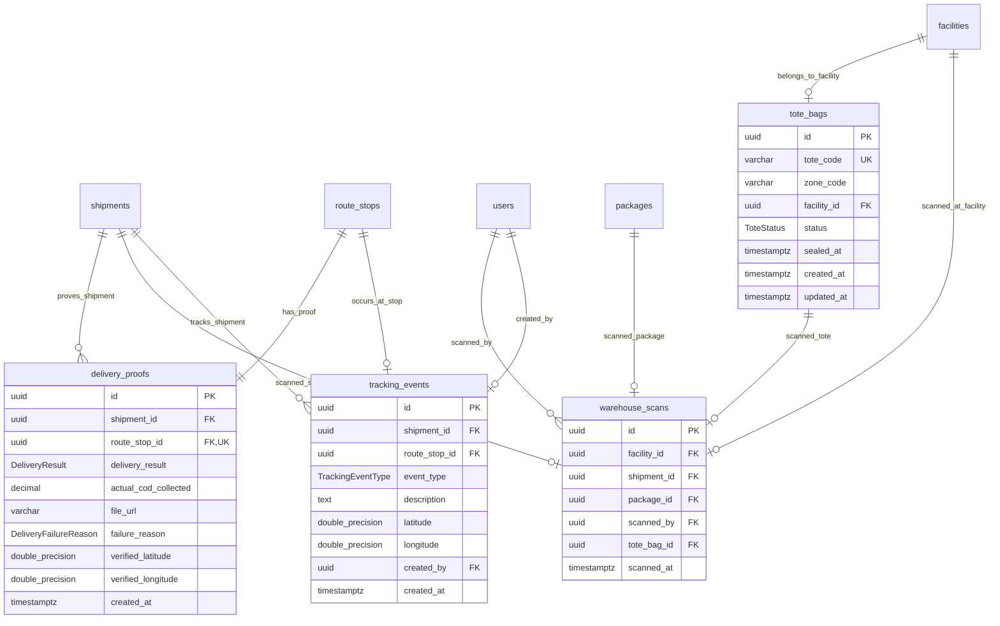

# MODULE 8 - Tracking, Scan & POD (Giám sát, Quét kho & Bằng chứng Giao hàng)

## 🎯 Mục tiêu Module

Module **Tracking, Scan & Proof of Delivery** đóng vai trò là **lớp thực thi ngoài thực địa (Field Operations)** của hệ thống Smart Logistics Platform:
* **Dòng thời gian sự kiện theo dõi công khai (`tracking_events`)**: Cung cấp dữ liệu theo dõi hành trình thời gian thực cho khách hàng và quản lý.
* **Nhật ký quét mã vạch kho bãi (`warehouse_scans`)**: Ghi nhận toàn bộ các thao tác quét barcode/QR của kiện hàng (`packages`), chuyến xe (`shipments`) và sọt gom hàng (`tote_bags`) tại các bưu cục.
* **Quản lý sọt gom & bao tải trung chuyển (`tote_bags`)**: Theo dõi các sọt hàng tập kết tại các phân khu kho (`zone_code`), trạng thái niêm phong (`OPEN`, `SEALED`, `LOADED`).
* **Bằng chứng giao hàng số (`delivery_proofs` - POD)**: Lưu vết chứng từ xác nhận kết quả bàn giao tại điểm dừng (`route_stops`), hình ảnh xác thực (`file_url`), tọa độ GPS chống gian lận và số tiền mặt COD thực thu tại chỗ (`actual_cod_collected`).

---

## 📊 Các Bảng Trong Module (4 Bảng)

| STT | Model Prisma | Tên Bảng DB (`@map`) | Chức Năng Cốt Lõi |
| :--- | :--- | :--- | :--- |
| 1 | `TrackingEvent` | `tracking_events` | Dòng thời gian sự kiện hành trình hiển thị cho khách hàng tra cứu |
| 2 | `WarehouseScan` | `warehouse_scans` | Nhật ký quét mã vạch nhập/xuất/phân loại tại bưu cục |
| 3 | `ToteBag` | `tote_bags` | Quản lý danh mục sọt gom & bao bì đóng gói trung chuyển |
| 4 | `DeliveryProof` | `delivery_proofs` | Bằng chứng giao hàng điện tử (POD) & tiền COD thực thu |

---

## 🗺️ ERD Module 8



---

## 🗄️ Chi Tiết Thiết Kế Các Bảng

### BẢNG 1 — `tracking_events` (Dòng Thời Gian Sự Kiện Hành Trình)
Bảng timeline giao hàng công khai hiển thị cho ứng dụng Web / Mobile tra cứu.

| Field | Prisma Type | PostgreSQL Type | Nullable | Ràng buộc & Chức năng |
| :--- | :--- | :--- | :---: | :--- |
| `id` | String | UUID | ❌ | Khóa chính (Primary Key), `@default(uuid())`. |
| `shipment_id` | String | UUID | ❌ | FK $\rightarrow$ `shipments(id)` (ON DELETE CASCADE). |
| `route_stop_id` | String? | UUID | ✅ | FK $\rightarrow$ `route_stops(id)` (ON DELETE SET NULL). |
| `event_type` | TrackingEventType| Enum | ❌ | Loại sự kiện (Xem Enum `TrackingEventType`). |
| `description` | String | TEXT | ❌ | Mô tả chi tiết hành trình hiển thị trực tiếp cho người dùng. |
| `latitude` | Float? | DOUBLE PRECISION| ✅ | Vĩ độ GPS khi sự kiện được kích hoạt. |
| `longitude` | Float? | DOUBLE PRECISION| ✅ | Kinh độ GPS khi sự kiện được kích hoạt. |
| `created_by` | String? | UUID | ✅ | FK $\rightarrow$ `users(id)` (Người kích hoạt sự kiện, ON DELETE SET NULL). |
| `created_at` | DateTime | TIMESTAMPTZ | ❌ | Thời điểm ghi nhận sự kiện (`@default(now())`). |

* **Indexes & Constraints:**
  ```sql
  PRIMARY KEY (id)
  CREATE INDEX idx_track_events_shipment ON tracking_events(shipment_id, created_at DESC);
  FOREIGN KEY (shipment_id) REFERENCES shipments(id) ON DELETE CASCADE
  FOREIGN KEY (route_stop_id) REFERENCES route_stops(id) ON DELETE SET NULL
  FOREIGN KEY (created_by) REFERENCES users(id) ON DELETE SET NULL
  ```

---

### BẢNG 2 — `warehouse_scans` (Nhật Ký Quét Mã Vạch Kho)
Lưu trữ chi tiết mỗi lần quét mã vạch/QR của nhân viên kho hoặc lái xe tại từng bưu cục.

| Field | Prisma Type | PostgreSQL Type | Nullable | Ràng buộc & Chức năng |
| :--- | :--- | :--- | :---: | :--- |
| `id` | String | UUID | ❌ | Khóa chính (Primary Key), `@default(uuid())`. |
| `facility_id` | String? | UUID | ✅ | FK $\rightarrow$ `facilities(id)` (Bưu cục thực hiện quét, ON DELETE SET NULL). |
| `shipment_id` | String? | UUID | ✅ | FK $\rightarrow$ `shipments(id)` (Vận đơn được quét, ON DELETE SET NULL). |
| `package_id` | String? | UUID | ✅ | FK $\rightarrow$ `packages(id)` (Kiện hàng được quét, ON DELETE SET NULL). |
| `scanned_by` | String | UUID | ❌ | FK $\rightarrow$ `users(id)` (Tài khoản thực hiện quét, ON DELETE RESTRICT). |
| `tote_bag_id` | String? | UUID | ✅ | FK $\rightarrow$ `tote_bags(id)` (Sọt gom chứa hàng, ON DELETE SET NULL). |
| `scanned_at` | DateTime | TIMESTAMPTZ | ❌ | Thời điểm quét mã (`@default(now())`). |

* **Indexes & Constraints:**
  ```sql
  PRIMARY KEY (id)
  CREATE INDEX idx_warehouse_scans_tote ON warehouse_scans(tote_bag_id);
  CREATE INDEX idx_warehouse_scans_shipment ON warehouse_scans(shipment_id);
  FOREIGN KEY (facility_id) REFERENCES facilities(id) ON DELETE SET NULL
  FOREIGN KEY (shipment_id) REFERENCES shipments(id) ON DELETE SET NULL
  FOREIGN KEY (package_id) REFERENCES packages(id) ON DELETE SET NULL
  FOREIGN KEY (scanned_by) REFERENCES users(id) ON DELETE RESTRICT
  FOREIGN KEY (tote_bag_id) REFERENCES tote_bags(id) ON DELETE SET NULL
  ```

---

### BẢNG 3 — `tote_bags` (Quản Lý Sọt Gom Hàng & Bao Bì Đóng Gói)
Quản lý các sọt gom kiện hàng tại các phân khu kho phục vụ đóng bao và xuất xe liên kho.

| Field | Prisma Type | PostgreSQL Type | Nullable | Ràng buộc & Chức năng |
| :--- | :--- | :--- | :---: | :--- |
| `id` | String | UUID | ❌ | Khóa chính (Primary Key), `@default(uuid())`. |
| `tote_code` | String | VARCHAR(100) | ❌ | Mã QR / Barcode sọt duy nhất (`@unique`). VD: `TOTE-HCM01-SORT-01`. |
| `zone_code` | String | VARCHAR(50) | ❌ | Mã phân khu tập kết sọt (`@map("zone_code")`). |
| `facility_id` | String? | UUID | ✅ | FK $\rightarrow$ `facilities(id)` (Bưu cục sở hữu sọt, ON DELETE SET NULL). |
| `status` | ToteStatus | Enum | ❌ | Trạng thái: `OPEN` (Đang gom), `SEALED` (Đã niêm phong), `LOADED` (Đã bốc lên xe). Mặc định `OPEN`. |
| `sealed_at` | DateTime? | TIMESTAMPTZ | ✅ | Thời điểm chốt niêm phong sọt. |
| `created_at` | DateTime | TIMESTAMPTZ | ❌ | Thời điểm tạo sọt (`@default(now())`). |
| `updated_at` | DateTime | TIMESTAMPTZ | ❌ | Thời điểm cập nhật (`@updatedAt`). |

* **Indexes & Constraints:**
  ```sql
  PRIMARY KEY (id)
  UNIQUE (tote_code)
  CREATE INDEX idx_tote_bags_code ON tote_bags(tote_code);
  CREATE INDEX idx_tote_bags_facility_zone ON tote_bags(facility_id, zone_code);
  FOREIGN KEY (facility_id) REFERENCES facilities(id) ON DELETE SET NULL
  ```

---

### BẢNG 4 — `delivery_proofs` (Bằng Chứng Giao Hàng Số - POD)
Lưu kết quả giao nhận tại điểm dừng, chữ ký/ảnh chụp xác thực và số tiền COD thực tế thu được.

| Field | Prisma Type | PostgreSQL Type | Nullable | Ràng buộc & Chức năng |
| :--- | :--- | :--- | :---: | :--- |
| `id` | String | UUID | ❌ | Khóa chính (Primary Key), `@default(uuid())`. |
| `shipment_id` | String | UUID | ❌ | FK $\rightarrow$ `shipments(id)` (ON DELETE CASCADE). |
| `route_stop_id` | String | UUID | ❌ | Khóa ngoại 1-1 duy nhất (`@unique`), FK $\rightarrow$ `route_stops(id)` (ON DELETE RESTRICT). |
| `delivery_result` | DeliveryResult | Enum | ❌ | Kết quả: `SUCCESS`, `FAILED`, `PARTIAL`. |
| `actual_cod_collected`| Decimal? | DECIMAL(12,2)| ✅ | Số tiền mặt COD thực tế tài xế đã thu tại chỗ. |
| `file_url` | String? | VARCHAR(500) | ✅ | Đường dẫn ảnh chụp bằng chứng giao hàng (Cloud Storage URL). |
| `failure_reason` | DeliveryFailureReason?| Enum | ✅ | Lý do thất bại: `RECIPIENT_UNAVAILABLE`, `INCORRECT_ADDRESS`, `RECIPIENT_REJECTED`, `FORCE_MAJEURE`, `OTHER`. |
| `verified_latitude` | Float? | DOUBLE PRECISION| ✅ | Tọa độ Vĩ độ GPS xác minh giao hàng trên App. |
| `verified_longitude`| Float? | DOUBLE PRECISION| ✅ | Tọa độ Kinh độ GPS xác minh giao hàng trên App. |
| `created_at` | DateTime | TIMESTAMPTZ | ❌ | Thời điểm tạo bản ghi (`@default(now())`). |

* **Indexes & Constraints:**
  ```sql
  PRIMARY KEY (id)
  UNIQUE (route_stop_id)
  FOREIGN KEY (shipment_id) REFERENCES shipments(id) ON DELETE CASCADE
  FOREIGN KEY (route_stop_id) REFERENCES route_stops(id) ON DELETE RESTRICT
  ```
