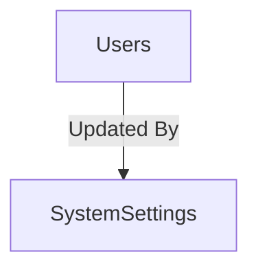

# MODULE 9 - System Configuration

## 🎯 Mục tiêu Module

Module **System Configuration** quản lý toàn bộ các thông số cấu hình và siêu tham số (hyperparameters) vận hành của hệ thống Smart Logistics. 

Mục tiêu cốt lõi của thiết kế này là **không bao giờ hard-code bất kỳ tham số nào trong mã nguồn** (source code). Mọi cấu hình liên quan đến:
* Các chỉ số vận hành thuật toán AI (Bán kính gom cụm K-Means, Tỷ lệ đột biến Genetic Algorithm, VRP Solver).
* Tham số thiết bị ngoại vi chặng ngoài (Khoảng cách gửi tọa độ GPS định kỳ).
* Các quy tắc nghiệp vụ (Giới hạn số điểm dừng tối đa, thời gian dừng mặc định).

đều được lưu trữ trong cơ sở dữ liệu. Nhờ đó, người quản trị (Admin) có thể tinh chỉnh hành vi của hệ thống trên giao diện quản trị trong thời gian thực mà không cần lập trình viên chỉnh sửa mã nguồn hoặc khởi động lại (re-deploy) ứng dụng.

---

## 📊 Các Bảng Trong Module (1 Bảng)

| STT | Bảng | Chức năng |
| :--- | :--- | :--- |
| 1 | `SystemSettings` | Lưu trữ cấu hình động toàn hệ thống dưới dạng Key-Value được phân loại |

---

## 🗺️ ERD Module



* **Lưu ý:** Bảng `SystemSettings` đứng độc lập, không có khóa ngoại ràng buộc với các thực thể nghiệp vụ khác (trừ `updated_by` tham chiếu đến `Users`), cho phép mọi thành phần trong hệ thống (API Gateway, Backend Services, AI Engine, Mobile App) truy cập trực tiếp và đọc cấu hình.

---

## 🗄️ Chi Tiết Thiết Kế Bảng: SystemSettings

Bảng này được thiết kế theo mô hình Key-Value mở rộng, đi kèm cơ chế kiểm tra kiểu dữ liệu tự động tại tầng cơ sở dữ liệu để tránh nhập sai định dạng.

* **Các trường dữ liệu:**

| Field | PostgreSQL Type | Nullable | Default | Chức năng |
| :--- | :--- | :---: | :---: | :--- |
| `id` | UUID | ❌ | `gen_random_uuid()` | Khóa chính. |
| `setting_key` | VARCHAR(100) | ❌ | | Khóa cấu hình duy nhất (Ví dụ: `GPS_INTERVAL`, `MUTATION_RATE`). |
| `setting_value` | TEXT | ❌ | | Giá trị thực tế của cấu hình (được lưu dưới dạng chuỗi TEXT, parse khi đọc). |
| `value_type` | `setting_value_type_enum`| ❌ | | Kiểu dữ liệu của cấu hình để thực hiện ép kiểu (`STRING`, `INTEGER`, `DECIMAL`, `BOOLEAN`, `JSON`). |
| `category` | `setting_category_enum`| ❌ | | Phân nhóm cấu hình (`AI`, `ROUTING`, `GPS`, `SYSTEM`, `MOBILE`, `BUSINESS`). |
| `description` | TEXT | ✅ | | Giải thích chi tiết ý nghĩa và phạm vi giá trị hợp lệ cho quản trị viên. |
| `is_editable` | BOOLEAN | ❌ | `TRUE` | Quy định cấu hình có được phép chỉnh sửa trên giao diện Admin hay không. |
| `is_active` | BOOLEAN | ❌ | `TRUE` | Trạng thái kích hoạt. Không được xóa dòng dữ liệu, chỉ tắt hoạt động. |
| `updated_by` | UUID | ✅ | | FK → `Users(id)` (ON DELETE SET NULL). Tài khoản cập nhật giá trị gần nhất. |
| `updated_at` | TIMESTAMPTZ | ❌ | `NOW()` | Thời điểm cập nhật cuối cùng. |
| `created_at` | TIMESTAMPTZ | ❌ | `NOW()` | Thời điểm tạo cấu hình. |

* **Định nghĩa ENUMs:**
  ```sql
  CREATE TYPE setting_value_type_enum AS ENUM ('STRING', 'INTEGER', 'DECIMAL', 'BOOLEAN', 'JSON');
  CREATE TYPE setting_category_enum AS ENUM ('AI', 'ROUTING', 'GPS', 'SYSTEM', 'MOBILE', 'BUSINESS');
  ```

* **Indexes & Constraints:**
  ```sql
  PRIMARY KEY (id)
  UNIQUE (setting_key) -- Đảm bảo key cấu hình là độc bản, không bị trùng lặp
  ```

---

## 💡 Business Rules & Triggers Đảm Bảo Tính Toàn Vẹn Cấu Hình

Để đảm bảo giá trị nhập vào `setting_value` phù hợp với kiểu dữ liệu khai báo tại `value_type`, tránh gây lỗi Runtime crash cho ứng dụng phía Backend hoặc Mobile, chúng ta thiết lập Trigger tự động xác thực dữ liệu tại tầng DB:

```sql
CREATE OR REPLACE FUNCTION validate_system_setting_value()
RETURNS TRIGGER AS $$
BEGIN
    -- 1. Kiểm tra không cho phép sửa setting_key để tránh lỗi sập các hệ thống phụ thuộc
    IF TG_OP = 'UPDATE' AND OLD.setting_key <> NEW.setting_key THEN
        RAISE EXCEPTION 'Không được phép thay đổi tên khóa cấu hình (setting_key) để tránh lỗi ứng dụng.';
    END IF;

    -- 2. Xác thực định dạng dựa trên value_type
    CASE NEW.value_type
        WHEN 'INTEGER' THEN
            -- Kiểm tra xem chuỗi có phải là số nguyên (có thể có dấu +/-)
            IF NEW.setting_value !~ '^[+-]?\d+$' THEN
                RAISE EXCEPTION 'Khóa % yêu cầu giá trị kiểu INTEGER. Giá trị nhận được: "%"', NEW.setting_key, NEW.setting_value;
            END IF;
            
        WHEN 'DECIMAL' THEN
            -- Kiểm tra xem chuỗi có phải là số thực (ví dụ: 0.15, -12.5)
            IF NEW.setting_value !~ '^[+-]?\d+(\.\d+)?$' THEN
                RAISE EXCEPTION 'Khóa % yêu cầu giá trị kiểu DECIMAL. Giá trị nhận được: "%"', NEW.setting_key, NEW.setting_value;
            END IF;
            
        WHEN 'BOOLEAN' THEN
            -- Chỉ cho phép chuỗi 'true' hoặc 'false' (không phân biệt hoa thường)
            IF LOWER(NEW.setting_value) NOT IN ('true', 'false') THEN
                RAISE EXCEPTION 'Khóa % yêu cầu giá trị kiểu BOOLEAN (true/false). Giá trị nhận được: "%"', NEW.setting_key, NEW.setting_value;
            END IF;
            
        WHEN 'JSON' THEN
            -- Tận dụng hàm cast kiểm tra tính hợp lệ của cú pháp JSON
            BEGIN
                PERFORM NEW.setting_value::jsonb;
            EXCEPTION WHEN OTHERS THEN
                RAISE EXCEPTION 'Khóa % yêu cầu giá trị kiểu JSON hợp lệ. Chuỗi nhận được không đúng cú pháp JSON.', NEW.setting_key;
            END;
            
        ELSE
            -- Đối với kiểu STRING, chấp nhận mọi giá trị
            NULL;
    END CASE;

    NEW.updated_at := NOW();
    RETURN NEW;
END;
$$ LANGUAGE plpgsql;

CREATE TRIGGER trg_validate_system_setting
BEFORE INSERT OR UPDATE ON SystemSettings
FOR EACH ROW
EXECUTE FUNCTION validate_system_setting_value();
```

---

## 📋 Ví Dụ Dữ Liệu Khởi Tạo (Seeding Data)

Dưới đây là tập hợp các tham số cấu hình cốt lõi cần được nạp sẵn khi khởi tạo hệ thống (Seeding):

| setting_key | setting_value | value_type | category | is_editable | Mô tả chi tiết |
| :--- | :--- | :--- | :--- | :---: | :--- |
| `GPS_INTERVAL_SECONDS` | `5` | `INTEGER` | `GPS` | `TRUE` | Khoảng thời gian định kỳ (giây) chạy ngầm gửi vị trí GPS của Shipper. |
| `ETA_REFRESH_INTERVAL_MIN` | `5` | `INTEGER` | `ROUTING` | `TRUE` | Chu kỳ tính toán lại thời gian dự kiến giao hàng (ETA) cho các stop. |
| `POPULATION_SIZE` | `100` | `INTEGER` | `AI` | `TRUE` | Kích thước quần thể khởi tạo cho thuật toán Genetic Algorithm (GA). |
| `MUTATION_RATE` | `0.15` | `DECIMAL` | `AI` | `TRUE` | Tần suất đột biến của thuật toán Genetic Algorithm (GA). |
| `CROSSOVER_RATE` | `0.80` | `DECIMAL` | `AI` | `TRUE` | Tỷ lệ lai ghép các tuyến trong quần thể của GA. |
| `KMEANS_CLUSTER_RADIUS_METERS`| `5000` | `INTEGER` | `AI` | `TRUE` | Bán kính tối đa của một cụm gom hàng/giao hàng của K-Means. |
| `MAX_ROUTE_DISTANCE_KM` | `120.0` | `DECIMAL` | `ROUTING` | `TRUE` | Giới hạn quãng đường di chuyển tối đa của một tài xế trong một ngày. |
| `MAX_STOPS_PER_ROUTE` | `45` | `INTEGER` | `ROUTING` | `TRUE` | Số điểm dừng (RouteStop) tối đa gán cho một tuyến giao/nhận. |
| `DEFAULT_SERVICE_TIME_MINUTES`| `10` | `INTEGER` | `BUSINESS` | `TRUE` | Thời gian mặc định dừng đỗ xử lý thủ tục giao nhận hàng tại điểm. |
| `ENABLE_AI_OPTIMIZATION` | `true` | `BOOLEAN` | `SYSTEM` | `TRUE` | Bật/tắt chế động cơ tối ưu AI tự động (nếu tắt sẽ dùng gán tay thủ công). |
| `MAX_DELIVERY_ATTEMPTS` | `3` | `INTEGER` | `BUSINESS` | `TRUE` | Số lần nỗ lực giao tối đa trước khi chuyển trạng thái sang hoàn trả hàng. |
| `OTP_EXPIRY_SECONDS` | `120` | `INTEGER` | `SYSTEM` | `TRUE` | Thời gian sống của mã OTP xác thực bàn giao gói hàng. |
| `ROUTING_AI_PROVIDER` | `"LOCAL_OR_TOOLS"`| `STRING` | `AI` | `FALSE` | Động cơ solver đang sử dụng (`LOCAL_OR_TOOLS`, `GRAPHHOPPER`, `OSRM`). |
