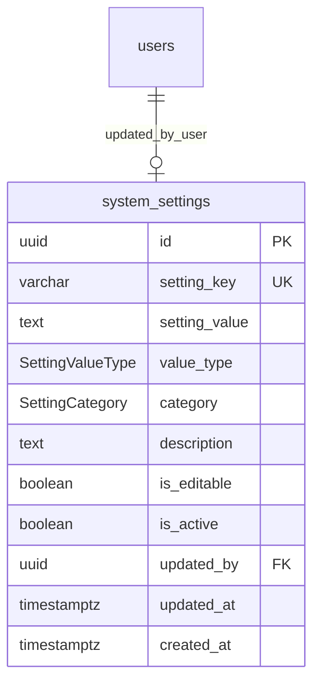

# MODULE 9 - System Configuration (Cấu hình Hệ thống & Tham số AI)

## 🎯 Mục tiêu Module

Module **System Configuration** quản lý toàn bộ các thông số cấu hình và siêu tham số (hyperparameters) vận hành của hệ thống Smart Logistics Platform:
* Cấu hình tham số thuật toán AI (kích thước quần thể Genetic Algorithm, tỷ lệ đột biến, bán kính cụm K-Means).
* Cấu hình chu kỳ truyền tải định vị GPS ngoại vi.
* Cấu hình quy tắc nghiệp vụ (thời gian xử lý tại điểm mặc định, số lần giao tối đa).
* Lưu trữ dưới dạng Key-Value được phân loại theo `category` (`AI`, `ROUTING`, `GPS`, `SYSTEM`, `MOBILE`, `BUSINESS`) và kiểm tra kiểu dữ liệu với `value_type` (`STRING`, `INTEGER`, `DECIMAL`, `BOOLEAN`, `JSON`).

---

## 📊 Các Bảng Trong Module (1 Bảng)

| STT | Model Prisma | Tên Bảng DB (`@map`) | Chức Năng Cốt Lõi |
| :--- | :--- | :--- | :--- |
| 1 | `SystemSetting` | `system_settings` | Lưu trữ cấu hình động toàn hệ thống dưới dạng Key-Value |

---

## 🗺️ ERD Module 9



---

## 🗄️ Chi Tiết Thiết Kế Bảng: `system_settings`

| Field | Prisma Type | PostgreSQL Type | Nullable | Ràng buộc & Chức năng |
| :--- | :--- | :--- | :---: | :--- |
| `id` | String | UUID | ❌ | Khóa chính (Primary Key), `@default(uuid())`. |
| `setting_key` | String | VARCHAR(100) | ❌ | Khóa cấu hình duy nhất (`@unique`). VD: `GPS_INTERVAL_SECONDS`, `POPULATION_SIZE`. |
| `setting_value` | String | TEXT | ❌ | Giá trị cấu hình (chuỗi TEXT). VD: `"5"`, `"100"`, `"0.15"`. |
| `value_type` | SettingValueType| Enum | ❌ | Kiểu dữ liệu: `STRING`, `INTEGER`, `DECIMAL`, `BOOLEAN`, `JSON`. |
| `category` | SettingCategory | Enum | ❌ | Phân nhóm: `AI`, `ROUTING`, `GPS`, `SYSTEM`, `MOBILE`, `BUSINESS`. |
| `description` | String? | TEXT | ✅ | Mô tả ý nghĩa và hướng dẫn sử dụng cấu hình. |
| `is_editable` | Boolean | BOOLEAN | ❌ | Cho phép chỉnh sửa trên giao diện Admin (`@default(true)`). |
| `is_active` | Boolean | BOOLEAN | ❌ | Trạng thái kích hoạt (`@default(true)`). |
| `updated_by` | String? | UUID | ✅ | FK $\rightarrow$ `users(id)` (Người cập nhật gần nhất, ON DELETE SET NULL). |
| `updated_at` | DateTime | TIMESTAMPTZ | ❌ | Thời điểm cập nhật cuối (`@default(now())`, `@updatedAt`). |
| `created_at` | DateTime | TIMESTAMPTZ | ❌ | Thời điểm khởi tạo bản ghi (`@default(now())`). |

* **Indexes & Constraints:**
  ```sql
  PRIMARY KEY (id)
  UNIQUE (setting_key)
  FOREIGN KEY (updated_by) REFERENCES users(id) ON DELETE SET NULL
  ```

---

## 📋 Danh Mục Tham Số Cấu Hình Mặc Định (Seeding Data)

| setting_key | setting_value | value_type | category | is_editable | Mô tả chi tiết |
| :--- | :--- | :--- | :--- | :---: | :--- |
| `GPS_INTERVAL_SECONDS` | `5` | `INTEGER` | `GPS` | `TRUE` | Khoảng thời gian định kỳ (giây) gửi vị trí GPS của Shipper. |
| `ETA_REFRESH_INTERVAL_MIN` | `5` | `INTEGER` | `ROUTING` | `TRUE` | Chu kỳ tính toán lại thời gian dự kiến giao hàng (ETA). |
| `POPULATION_SIZE` | `100` | `INTEGER` | `AI` | `TRUE` | Kích thước quần thể khởi tạo cho thuật toán Genetic Algorithm. |
| `MUTATION_RATE` | `0.15` | `DECIMAL` | `AI` | `TRUE` | Tần suất đột biến của thuật toán Genetic Algorithm. |
| `CROSSOVER_RATE` | `0.80` | `DECIMAL` | `AI` | `TRUE` | Tỷ lệ lai ghép các tuyến trong quần thể của GA. |
| `KMEANS_CLUSTER_RADIUS_METERS`| `5000` | `INTEGER` | `AI` | `TRUE` | Bán kính tối đa của một cụm gom hàng của K-Means (mét). |
| `MAX_ROUTE_DISTANCE_KM` | `120.0` | `DECIMAL` | `ROUTING` | `TRUE` | Quãng đường di chuyển tối đa của 1 tài xế trong một ngày. |
| `MAX_STOPS_PER_ROUTE` | `45` | `INTEGER` | `ROUTING` | `TRUE` | Số điểm dừng (RouteStop) tối đa gán cho 1 tuyến giao/nhận. |
| `DEFAULT_SERVICE_TIME_MINUTES`| `10` | `INTEGER` | `BUSINESS` | `TRUE` | Thời gian dừng đỗ xử lý thủ tục giao nhận hàng tại điểm. |
| `ENABLE_AI_OPTIMIZATION` | `true` | `BOOLEAN` | `SYSTEM` | `TRUE` | Bật/tắt chế độ tối ưu AI tự động. |
| `MAX_DELIVERY_ATTEMPTS` | `3` | `INTEGER` | `BUSINESS` | `TRUE` | Số lần nỗ lực giao tối đa trước khi chuyển sang hoàn hàng. |
| `OTP_EXPIRY_SECONDS` | `120` | `INTEGER` | `SYSTEM` | `TRUE` | Thời gian hiệu lực của mã OTP xác thực bàn giao gói hàng. |
