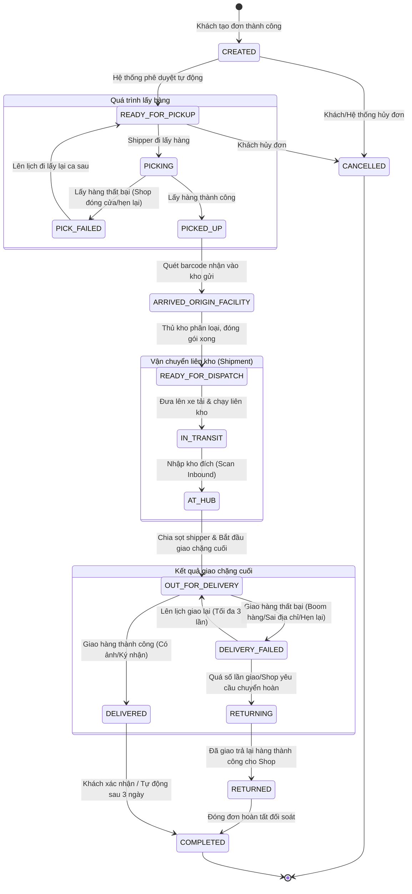

# Báo cáo Quy trình Cập nhật Trạng thái Đơn hàng & Chuyến xe (Phiên bản mới)

Báo cáo này mô tả chi tiết quy trình vòng đời của một đơn hàng (Order) từ khi được khởi tạo bởi khách hàng cho đến khi giao hàng thành công/chuyển hoàn và hoàn thành. Đồng thời, giải thích cách hệ thống phân tách giữa **Trạng thái Đơn hàng (Order Status)** và **Trạng thái Chuyến xe (Shipment Status)** để tối ưu hóa quy trình vận hành thực tế.

---

## 1. Sơ đồ Tổng quan Vòng đời Đơn hàng

Dưới đây là sơ đồ luồng trạng thái đầy đủ bao gồm các trường hợp lấy/giao thất bại, chuyển hoàn và hủy đơn:

---

## 2. Chi tiết Quy trình Gom hàng & Nhập kho gửi (First-mile)
Giai đoạn này xử lý riêng biệt cho từng gói hàng đơn lẻ, được cập nhật trực tiếp vào trường `status` của đơn hàng (**OrderStatus**).

| # | Quy trình thực tế | Trạng thái (OrderStatus) | Tác nhân / Sự kiện kích hoạt |
| :--- | :--- | :--- | :--- |
| **1** | **Khách tạo đơn thành công** | `CREATED` | **Hệ thống tự động**: Ngay khi API tạo đơn được gọi thành công. |
| **2** | **Hệ thống duyệt tự động** | `READY_FOR_PICKUP` | **Hệ thống tự động**: Sau khi chạy các luật kiểm tra địa chỉ, dịch vụ. |
| **3** | **Khách hàng chủ động hủy** | `CANCELLED` | **Khách hàng / Admin**: Bấm hủy đơn khi đơn chưa chuyển sang lấy hàng. |
| **4** | **Shipper di chuyển đi lấy hàng** | `PICKING` | **Thao tác Shipper**: Nhấp nút "Bắt đầu đi lấy" trên Mobile App. |
| **5** | **Lấy hàng thất bại** | `PICK_FAILED` | **Thao tác Shipper**: Xác nhận lấy hàng thất bại và chọn lý do (Shop hẹn lại, đóng cửa...). Đơn tự động quay về `READY_FOR_PICKUP` để chạy lại ca sau. |
| **6** | **Lấy hàng thành công** | `PICKED_UP` | **Thao tác Shipper**: Chụp ảnh gói hàng tại shop gửi và nhấn hoàn thành lấy. |
| **7** | **Hàng được mang về kho gửi** | `ARRIVED_ORIGIN_FACILITY` | **Thao tác Thủ kho**: Quét mã vạch (Barcode Scan Inbound) tại cửa kho gửi. |
| **8** | **Phân loại & chuẩn bị xuất phát** | `READY_FOR_DISPATCH`| **Thao tác Thủ kho**: Xác nhận gói hàng đã đóng thùng và sẵn sàng lên xe trung chuyển. |

---

## 3. Chi tiết Quy trình Vận chuyển liên kho & Giao hàng (Middle-mile & Last-mile)
Giai đoạn này được quản lý chủ yếu thông qua thực thể Chuyến xe (**ShipmentStatus**). Trạng thái đơn hàng sẽ tự động đồng bộ theo trạng thái chuyến xe mà nó đang thuộc về.

| # | Quy trình thực tế | Trạng thái (ShipmentStatus) | Cơ chế vận hành & Kích hoạt |
| :--- | :--- | :--- | :--- |
| **9** | **Đưa hàng lên xe tải chạy liên kho** | `IN_TRANSIT` | **Tài xế xe tải**: Bấm xuất phát hành trình liên kho. Hệ thống đồng bộ `OrderStatus` tương ứng của các đơn trong chuyến thành `IN_TRANSIT`. |
| **10** | **Xe tải di chuyển qua các trạm** | Ghi nhận sự kiện `ShipmentEvent` | **Hệ thống tự động**: Nhận tọa độ GPS từ App tài xế để cập nhật vị trí lộ trình thời gian thực (không đổi trạng thái đơn). |
| **11** | **Xe tải đến Kho đích** | `AT_HUB` | **Nhân viên kho đích**: Quét mã vạch Check-in nhập kho đích. Hệ thống đồng bộ `OrderStatus` tương ứng thành `AT_HUB`. |
| **12** | **Bàn giao hàng cho Shipper phát** | `OUT_FOR_DELIVERY` | **Thủ kho & Shipper**: Thủ kho phân sọt hàng cho từng Shipper. Shipper bấm "Bắt đầu giao" trên app. `OrderStatus` đổi thành `OUT_FOR_DELIVERY`. |
| **13** | **Shipper giao hàng thất bại** | `DELIVERY_FAILED` | **Thao tác Shipper**: Ghi nhận lý do giao thất bại (Khách không nghe máy, hẹn lại...). Đơn có thể quay lại bước **12** để giao lại ca sau (tối đa 3 lần). |
| **14** | **Bắt đầu quy trình chuyển hoàn** | `RETURNING` | **Hệ thống tự động / Admin**: Nếu quá 3 lần giao thất bại hoặc khách boom hàng trực tiếp. Đơn được gom vào chuyến xe chuyển hoàn để gửi trả lại shop. |
| **15** | **Hoàn trả thành công cho Shop** | `RETURNED` | **Thao tác Shipper hoàn**: Shipper mang gói hàng trả lại cho người gửi ban đầu và quét xác nhận đã trả hàng. |
| **16** | **Giao hàng thành công**| `DELIVERED` | **Thao tác Shipper**: Xác nhận trên Driver App kèm theo ảnh chụp bằng chứng giao hàng hoặc chữ ký người nhận. |
| **17** | **Đóng đơn hoàn tất đối soát** | `COMPLETED` | **Khách hàng hoặc Cron Job**: Khách hàng xác nhận hài lòng hoặc hệ thống tự động hoàn thành đơn sau khi hoàn tất đối soát tài chính COD. |

---

## 4. Các điểm tối ưu của quy trình này

*   **Tối ưu hiệu năng Database (Bulk Operations)**: Khi xe tải chở hàng trăm đơn di chuyển liên kho, hệ thống chỉ cần cập nhật trạng thái của 1 `Shipment` duy nhất thành `IN_TRANSIT` thay vì chạy hàng trăm câu lệnh UPDATE đơn lẻ.
*   **Minh bạch hành trình (Tracking History)**: Mọi thao tác quét mã vạch (Inbound/Outbound) đều tự động ghi lại lịch sử vào bảng `OrderStatusHistory` giúp người gửi lẫn người nhận tra cứu chính xác bưu kiện đang nằm ở kho nào.
*   **Hỗ trợ giao lại và chuyển hoàn (Exceptions & Returns)**: Giải quyết triệt để bài toán xử lý lỗi thực tế (chụp ảnh bằng chứng giao thất bại, đếm số lần giao lại, chuyển hướng luồng hàng thành đơn hoàn trả).
