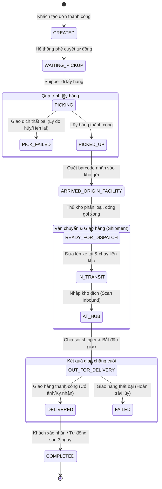

# Báo cáo Quy trình Cập nhật Trạng thái Đơn hàng & Chuyến xe

Báo cáo này mô tả chi tiết quy trình vòng đời của một đơn hàng (Order) từ khi được khởi tạo bởi khách hàng cho đến khi giao hàng thành công và hoàn thành, đồng thời giải thích cách hệ thống phân tách giữa **Trạng thái Đơn hàng (Order Status)** và **Trạng thái Chuyến xe (Shipment Status)** để tối ưu hóa quy trình vận hành thực tế.

---

## 1. Sơ đồ Tổng quan Vòng đời Đơn hàng

Dưới đây là sơ đồ luồng trạng thái từ lúc bắt đầu (Khách tạo đơn) đến lúc kết thúc (Hoàn thành giao hàng):

---

## 2. Chi tiết Quy trình Gom hàng & Nhập kho gửi (First-mile)
Giai đoạn này xử lý riêng biệt cho từng gói hàng đơn lẻ, được cập nhật trực tiếp vào trường `status` của đơn hàng (**OrderStatus**).

| # | Quy trình thực tế | Trạng thái (OrderStatus) | Tác nhân / Sự kiện kích hoạt |
| :--- | :--- | :--- | :--- |
| **1** | **Khách tạo đơn thành công** | `CREATED` (Đã tạo đơn) | **Hệ thống tự động**: Ngay khi API tạo đơn được gọi thành công. |
| **2** | **Hệ thống duyệt tự động** | `WAITING_PICKUP` (Chờ lấy hàng) | **Hệ thống tự động**: Sau khi chạy các luật kiểm tra địa chỉ, dịch vụ. |
| **3** | **Shipper di chuyển đi lấy hàng** | `PICKING` (Đang lấy hàng) | **Thao tác Shipper**: Nhấp nút "Bắt đầu đi lấy" trên Mobile App khi thấy đơn chờ lấy. |
| **4** | **Kết quả lấy hàng của Shipper** | `PICKED_UP` (Lấy thành công)  hoặc `PICK_FAILED` (Lấy thất bại) | **Thao tác Shipper**: Xác nhận lấy hàng thành công (chụp ảnh) hoặc chọn lý do thất bại trên App. |
| **5** | **Hàng được mang về kho gửi** | `ARRIVED_ORIGIN_FACILITY` (Đến kho gửi) | **Thao tác Thủ kho**: Quét mã vạch (Barcode Scan Inbound) tại cửa kho gửi. |
| **6** | **Phân loại & chuẩn bị xuất phát** | `READY_FOR_DISPATCH` (Sẵn sàng điều phối)| **Thao tác Thủ kho**: Xác nhận gói hàng đã đóng thùng và sẵn sàng lên xe trung chuyển. |

> [!NOTE]
> Khi đơn hàng chuyển sang trạng thái `READY_FOR_DISPATCH`, quá trình quản lý đơn lẻ sẽ tạm ngưng. Hệ thống sẽ chuyển sang gom nhiều đơn hàng có cùng tuyến đường vào một **Chuyến xe (Shipment)** để vận chuyển số lượng lớn.

---

## 3. Chi tiết Quy trình Vận chuyển liên kho & Giao hàng (Middle-mile & Last-mile)
Giai đoạn này được quản lý chủ yếu thông qua thực thể Chuyến xe (**ShipmentStatus**). Trạng thái đơn hàng sẽ tự động đồng bộ theo trạng thái chuyến xe mà nó đang thuộc về.

| # | Quy trình thực tế | Trạng thái (ShipmentStatus) | Cơ chế vận hành & Kích hoạt |
| :--- | :--- | :--- | :--- |
| **7** | **Đưa hàng lên xe tải chạy liên kho** | `IN_TRANSIT` (Đang vận chuyển) | **Tài xế xe tải**: Bấm xác nhận xuất phát hành trình liên kho. |
| **8** | **Xe tải di chuyển qua các trạm trung chuyển** | Hệ thống ghi nhận sự kiện `ShipmentEvent` | **Hệ thống tự động**: Nhận tọa độ GPS từ App tài xế để cập nhật vị trí lộ trình thời gian thực. |
| **9** | **Xe tải đến Kho đích** | `AT_HUB` (Đã đến kho đích) | **Nhân viên kho đích**: Quét mã vạch Check-in toàn bộ xe tải/lô hàng nhập kho đích. |
| **10** | **Bàn giao hàng cho Shipper phát** | `OUT_FOR_DELIVERY` (Đang giao hàng) | **Thủ kho & Shipper**: Thủ kho quét phân sọt hàng cho từng Shipper. Shipper bấm "Bắt đầu giao" trên app. |
| **11** | **Shipper giao hàng tới người nhận**| `DELIVERED` (Giao thành công)  hoặc `FAILED` (Giao thất bại) | **Thao tác Shipper**: Xác nhận trên Driver App kèm theo ảnh chụp bằng chứng giao hàng hoặc chữ ký. |
| **12** | **Khách hàng xác nhận / Tự động đóng đơn** | `COMPLETED` (Hoàn thành) | **Khách hàng hoặc Cron Job tự động**: Khách hàng xác nhận trên web hoặc hệ thống tự động hoàn thành đơn sau 3 ngày kể từ khi `DELIVERED`. |

---

## 4. Các điểm tối ưu của quy trình này

*   **Tối ưu hiệu năng Database (Bulk Operations)**: Khi xe tải chở 500 gói hàng di chuyển từ Tp.HCM ra Hà Nội, hệ thống chỉ cần cập nhật trạng thái của 1 `Shipment` duy nhất thành `IN_TRANSIT` thay vì chạy 500 câu lệnh UPDATE riêng lẻ.
*   **Minh bạch hành trình (Tracking History)**: Mọi thao tác quét mã vạch (Inbound/Outbound) đều tự động ghi lại lịch sử vào bảng `OrderStatusHistory` giúp người gửi lẫn người nhận tra cứu chính xác bưu kiện đang nằm ở kho nào, do ai xử lý.
*   **Hạn chế gian lận (Proof of Delivery - POD)**: Trạng thái `DELIVERED` chỉ được kích hoạt khi Shipper upload đầy đủ hình ảnh gói hàng tại thực địa hoặc chữ ký của người nhận trên ứng dụng di động.
