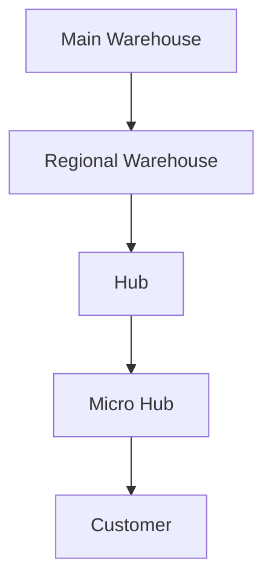
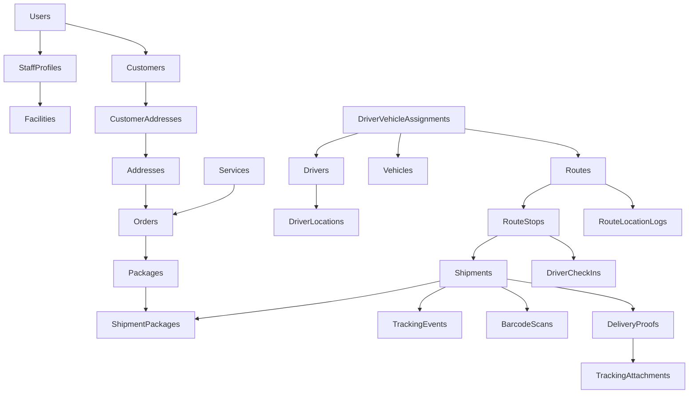

# PHASE 1 — Core Logistics Database (Version 1.0)

## 🎯 Mục tiêu
Xây dựng hệ thống điều vận giao hàng thông minh cho **1 Main Warehouse**, được thiết kế sẵn sàng để mở rộng quy mô đa cấp mà không cần sửa đổi cấu trúc database:

---

## 📦 Danh sách Module & Bảng Chi Tiết (Tổng cộng: 39 Bảng)

### Module 1 — Authentication & Authorization
**Mục tiêu:** Quản lý tài khoản người dùng và phân quyền hệ thống.
* **Các bảng (6 bảng):**
  1. `Users`
  2. `Roles`
  3. `Permissions`
  4. `UserRoles`
  5. `RolePermissions`
  6. `StaffProfiles` (Hồ sơ nhân sự kho gán theo cơ sở vận hành)

### Module 2 — Customer Management
**Mục tiêu:** Quản lý thông tin khách hàng gửi hàng.
* **Các bảng (4 bảng):**
  1. `Customers`
  2. `Addresses` (Master Data dùng chung)
  3. `CustomerAddresses` (Bảng liên kết)
  4. `CustomerContacts`
* **Hỗ trợ nghiệp vụ nâng cao:**
  * Sổ địa chỉ chuẩn hóa (Addresses) liên kết linh hoạt qua `CustomerAddresses`.
  * Nhiều người liên hệ (Contacts) trên cùng một tài khoản khách hàng doanh nghiệp.

### Module 3 — Facility Network
**Mục tiêu:** Quản lý hệ thống kho bãi và mạng lưới logistics.
* **Các bảng (4 bảng):**
  1. `Facilities`
  2. `FacilityTypes`
  3. `FacilityAddresses`
  4. `FacilityZones`
* **Chìa khóa mở rộng:** Cấu trúc đệ quy trong bảng `Facilities` thông qua trường tự tham chiếu:
  * `id`
  * `parent_facility_id` (Tham chiếu ngược lại `Facilities.id`)
  * `facility_type_id` (Liên kết với `FacilityTypes`)

### Module 4 — Order Management
**Mục tiêu:** Quản lý đơn hàng từ khách hàng gửi.
* **Các bảng (5 bảng):**
  1. `Orders`
  2. `Packages` (Thông tin chi tiết từng kiện hàng thuộc đơn hàng)
  3. `OrderPayments` (Thanh toán đơn hàng)
  4. `OrderStatusHistory` (Lịch sử trạng thái đơn hàng)
  5. `Services` (Danh mục gói dịch vụ vận chuyển)
* **Quan hệ nghiệp vụ:**
  $$\text{Services} \longrightarrow \text{Order} \longleftarrow \text{Customer}$$
  $$\text{Order} \longrightarrow \text{Package}$$

### Module 5 — Shipment Management ⭐ (Trọng tâm)
**Mục tiêu:** Quản lý quá trình đi giao hàng thực tế. Đây là module cốt lõi của hệ thống điều vận.
* **Các bảng (4 bảng):**
  1. `Shipments` (Phiếu vận chuyển)
  2. `ShipmentPackages` (Liên kết Shipment ↔ Package)
  3. `ShipmentEvents` (Nhật ký hành trình)
  4. `ShipmentTransfers` (Luân chuyển liên kho)
* **Quan hệ nghiệp vụ:**
  $$\text{Order} \longrightarrow \text{Package} \longrightarrow \text{ShipmentPackage} \longleftrightarrow \text{Shipment}$$
* **Hỗ trợ tối ưu hóa vận chuyển:**
  * Giao nhiều kiện cùng một đơn thông qua gom nhiều `Packages` vào `Shipments`.
  * Chia kiện hàng để giao nhiều đợt/nhiều tài xế khác nhau.
  * Gom nhiều kiện hàng của các đơn hàng khác nhau vào cùng một Shipment.
  * Giao hàng nhiều đợt chặng giữa và chặng cuối.

### Module 6 — Fleet & Driver Management
**Mục tiêu:** Quản lý đội xe, phương tiện vận chuyển, hồ sơ tài xế và theo dõi vị trí.
* **Các bảng (5 bảng):**
  1. `Drivers` (Có bổ sung `preferredLatitude`, `preferredLongitude` lưu tọa độ Driver Affinity Point; và `driverType` enum `HUB_DELIVERY`/`ON_DEMAND` để phân luồng dịch vụ)
  2. `Vehicles`
  3. `VehicleTypes` (Ví dụ: `Truck`, `Van`, `Motorbike`)
  4. `DriverVehicleAssignments` (Liên kết tài xế ↔ phương tiện)
  5. `DriverLocations` (Vị trí realtime của tài xế)
* **Luồng dữ liệu định vị:**
  $$\text{Real-time GPS} \longrightarrow \text{Redis (Cache)} \longrightarrow \text{Đồng bộ định kỳ vào SQL}$$

### Module 7 — Routing Engine ⭐ (Trí tuệ nhân tạo - AI)
**Mục tiêu:** Tối ưu hóa lộ trình giao hàng tự động.
* **Các bảng (5 bảng):**
  1. `Routes` (Tuyến giao hàng)
  2. `RouteStops` (Các điểm dừng trên lộ trình)
  3. `DispatchTasks` (Phiếu điều phối tuyến cho tài xế)
  4. `RouteLocationLogs` (Log định vị GPS hành trình thực tế chạy ngầm)
  5. `RouteOptimizations` (Kết quả tính toán tối ưu của AI)
* **Pipeline xử lý AI:**
  $$\text{Orders} \longrightarrow \text{Geocoding} \longrightarrow \text{K-Means Clustering} \longrightarrow \text{Clusters} \longrightarrow \text{Genetic Algorithm (GA)} \longrightarrow \text{VRP Solver} \longrightarrow \text{Optimal Routes}$$

### Module 8 — Tracking, Scan & Proof of Delivery ⭐
**Mục tiêu:** Ghi nhận toàn bộ các hoạt động thực thi thực địa của tài xế (Check-in, Check-out, Quét barcode, Ký nhận, Chụp ảnh POD).
* **Các bảng (5 bảng):**
  1. `TrackingEvents` (Dòng thời gian hiển thị cho khách hàng)
  2. `BarcodeScans` (Lịch sử quét mã vạch/QR)
  3. `DeliveryProofs` (Bằng chứng bàn giao hàng thành công/thất bại)
  4. `DriverCheckIns` (Thời gian check-in/out tại điểm dừng)
  5. `TrackingAttachments` (Tệp hình ảnh, chữ ký lưu trên Object Storage)
* **Sự kiện Tracking (`TrackingEvents`):**
  * Tách biệt rõ ràng với `ShipmentStatusHistory` (Module 5). `TrackingEvents` dùng để tra cứu timeline cho khách hàng và vận hành chặng ngoài hiện trường.

### Module 9 — System Configuration
**Mục tiêu:** Quản lý cấu hình toàn hệ thống và các siêu tham số cho thuật toán AI.
* **Các bảng (1 bảng):**
  1. `SystemSettings`
* **Ví dụ tham số cấu hình:**
  * `GPS_INTERVAL` (Tần suất gửi tọa độ GPS)
  * `POPULATION_SIZE`, `MUTATION_RATE` (Tham số cho giải thuật Genetic Algorithm)
  * `CLUSTER_RADIUS` (Bán kính tối đa để phân cụm K-Means)

---

## 📊 Tổng Hợp Số Lượng Bảng

| STT | Module | Số lượng bảng |
| :--- | :--- | :---: |
| 1 | Authentication & Authorization | 6 |
| 2 | Customer Management | 4 |
| 3 | Facility Network | 4 |
| 4 | Order Management | 4 |
| 5 | Shipment Management | 4 |
| 6 | Fleet & Driver Management | 5 |
| 7 | Routing Engine | 5 |
| 8 | Tracking, Scan & POD | 5 |
| 9 | System Configuration | 1 |
| | **👉 Tổng cộng** | **38 bảng** |

---

## 🗺️ ERD Nghiệp Vụ (Tổng quan luồng dữ liệu)

