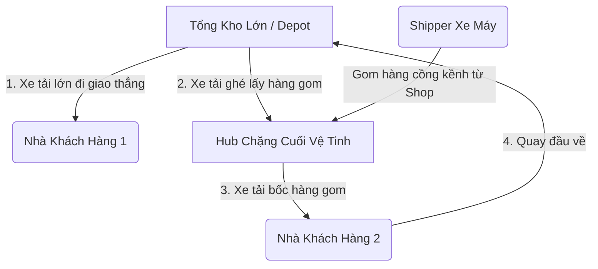
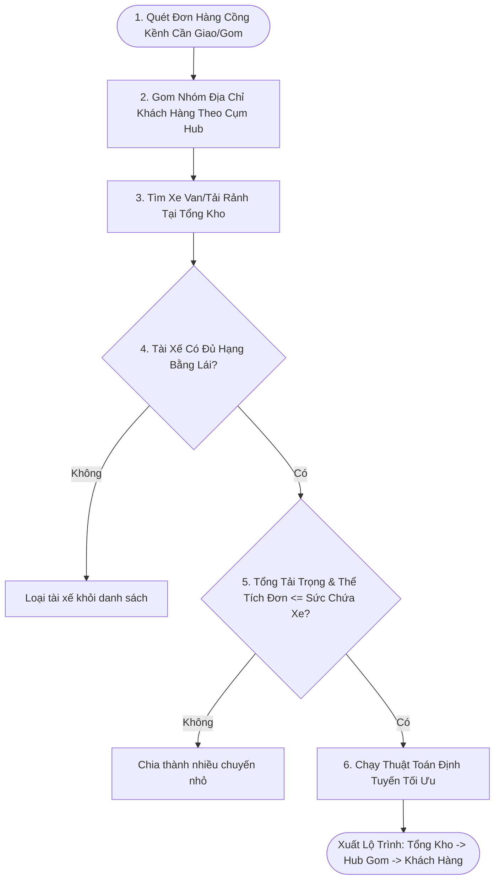

# Báo Cáo Giải Pháp Vận Hành: Mô Hình Chia Sẻ Đội Xe Động Chặng Cuối (Dynamic Fleet Pooling)

Mô hình **Dynamic Fleet Pooling (Chia sẻ đội xe động)** là phương pháp quản lý xe và điều phối trung tâm hiện đại, được các tập đoàn logistics lớn (như Amazon, DHL, GHTK...) áp dụng nhằm giải quyết bài toán giao nhận hàng cồng kềnh với chi phí tối ưu nhất.

Báo cáo này mô tả chi tiết luồng vận hành vật lý của hàng hóa, kiến trúc thuật toán AI, hiệu quả kinh tế và lộ trình tích hợp vào phần mềm `smart-logistics-platform`.

---

## 1. LUỒNG VẬN HÀNH VẬT LÝ (PHYSICAL WORKFLOW)

Trong mô hình này, bưu cục chặng cuối (`MICRO_HUB` hoặc `HUB` nhỏ) hoạt động như các **trạm trung chuyển vệ tinh** (chủ yếu xử lý hàng nhỏ bằng xe máy). Các mặt hàng nặng/cồng kềnh sẽ được lưu kho và phát trực tiếp từ **Tổng kho khu vực** (hoặc bưu cục trung tâm cụm).

### 1.1. Luồng Giao Hàng Cồng Kềnh (Outbound Flow)
1.  **Lưu kho tại Tổng kho**: Hàng cồng kềnh từ các tỉnh/nơi khác gửi về sẽ dừng lại ở **Tổng kho lớn** (`REGIONAL_WAREHOUSE` hoặc `MAIN_DEPOT`). Chúng **không** được xếp lên xe trung chuyển để chở về các Hub nhỏ nội đô.
2.  **Lập lộ trình tập trung**: Thuật toán AI định tuyến sẽ quét toàn bộ đơn hàng cồng kềnh cần giao trong ngày của các Hub lân cận, gán chúng vào xe Van/xe tải đậu ở Tổng kho.
3.  **Giao thẳng**: Tài xế lái xe tải xuất phát từ Tổng kho và di chuyển theo lộ trình AI lập, giao thẳng hàng tới nhà người nhận.

### 1.2. Luồng Gom Hàng Cồng Kềnh (Inbound / Pickup Flow)
1.  **Gom hàng vệ tinh**: Shipper xe máy đi gom hàng từ các shop nhỏ mang về Hub vệ tinh chặng cuối. Đối với các shop lớn có hàng nặng, họ có thể yêu cầu gom trực tiếp.
2.  **Xe tải gom động**: Xe tải dùng chung xuất phát từ Tổng kho (đang đi trên lộ trình giao hàng chặng cuối) sẽ ghé qua các Hub vệ tinh chặng cuối để bốc các đơn hàng cồng kềnh được gom tại đó lên xe, chở ngược về Tổng kho để phân loại đi tỉnh khác.

### 1.3. Lịch Trình Ca Chạy & Giải Pháp Chống Kẹt Hàng (LIFO / Loading Constraint)
Để giải quyết bài toán thực tế về việc xếp dỡ (tránh tình trạng hàng gom sau chặn lối ra của hàng giao trước - LIFO) và khớp nối thời gian sẵn sàng đóng gói của shop gửi, xe tải dùng chung chạy theo **Chu kỳ quay vòng xe (Vehicle Loop/Cycle)** khép kín:

*   **Quy tắc Trạng thái sẵn sàng**: Đơn hàng chỉ được AI gán vào lộ trình gom của xe tải khi Shop đã nhấn nút **"Đã chuẩn bị hàng" (Ready for Pickup)** trên hệ thống. Nếu chưa sẵn sàng, xe sẽ bỏ qua để tránh thời gian chờ lãng phí.
*   **Chia ca vận hành kết hợp Giao - Nhận**:
    *   **Ca Sáng (08h00 - 12h00)**:
        *   *08h00 - 10h30 (Phát hàng)*: Xe xuất phát từ Tổng kho với thùng xe chất đầy hàng giao. Thùng xe trống dần.
        *   *10h30 - 12h00 (Gom hàng)*: Thùng xe đã trống hoàn toàn, xe chạy qua các shop lớn và Hub vệ tinh chặng cuối để bốc hàng gom, chở ngược về Tổng kho hạ tải lúc 12h00.
    *   **Ca Chiều (13h30 - 18h00)**:
        *   *13h30 - 16h00 (Phát hàng)*: Xe chất đợt hàng giao thứ hai đi phát sạch sẽ cho người nhận.
        *   *16h00 - 18h00 (Gom hàng)*: Xe đi một vòng thu gom hàng gửi cuối ngày tại shop lớn và Hub vệ tinh, mang về Tổng kho lúc 18h00 để đóng xe Container chạy liên tỉnh ban đêm.

---

## 2. THUẬT TOÁN ĐỊNH TUYẾN AI & CÁC RÀNG BUỘC (AI ROUTING ENGINE)

Hệ thống định tuyến AI sẽ chuyển đổi từ bài toán tối ưu hóa cơ bản (VRP đơn cấp) sang **Multi-Echelon Vehicle Routing Problem (Định tuyến đa cấp)** với các ràng buộc chặt chẽ:

### Các ràng buộc cốt lõi trong code logic:
1.  **Ràng buộc Bằng lái (License Class Constraint)**:
    *   `Driver.driverLicenseClass` phải thỏa mãn yêu cầu của loại xe (`VehicleType.typeCode`).
    *   Tài xế lái xe Van/Tải nhẹ phải có bằng $\ge$ `B2`. Tài xế lái Container phải có bằng `FC`.
2.  **Ràng buộc Sức chứa (Capacity Constraint)**:
    *   $\sum \text{weight}_{\text{packages}} \le \text{Vehicle.maxWeight}$
    *   $\sum \text{volume}_{\text{packages}} \le \text{Vehicle.maxVolume}$
3.  **Ràng buộc Thời gian hoạt động (Time Windows)**:
    *   Tổng thời gian di chuyển từ Tổng kho -> Hub -> Giao khách -> Về lại Tổng kho phải nằm trong ca làm việc của tài xế (thường là 8 tiếng).

---

## 3. PHÂN TÍCH HIỆU QUẢ KINH TẾ (ECONOMIC IMPACT)

Dưới đây là bảng so sánh bài toán tài chính giữa việc mua xe phân tán tại từng Hub (PA1) và chia sẻ đội xe động tại Tổng kho (PA2) đối với một cụm gồm **5 Hub chặng cuối** và **1 Tổng kho**:

| Hạng mục chi phí | Phương án 1 (Phân tán tại Hub) | Phương án 2 (Chia sẻ động) | Nhận xét |
| :--- | :--- | :--- | :--- |
| **Số lượng xe Van cần mua** | **5 chiếc** (mỗi Hub 1 chiếc) | **2 chiếc** (đỗ ở Tổng kho) | **PA2 tiết kiệm 60% chi phí đầu tư xe (CAPEX)** |
| **Số lượng Tài xế cần thuê** | 5 tài xế | 2 tài xế | Giảm thiểu chi phí lương cứng nhân sự vận hành |
| **Tỷ lệ lấp đầy thùng xe (Utilization)** | Thấp (~30 - 45%) do lượng hàng cồng kềnh mỗi ngày tại từng Hub không đều. | Rất cao (~80 - 90%) do xe gom đơn của toàn bộ 5 Hub cùng lúc. | Xe chạy tối đa công suất, rút ngắn thời gian hoàn vốn đầu tư xe. |
| **Chi phí Xăng dầu (OPEX)** | Thấp hơn (xe chỉ chạy trong phạm vi hẹp của Hub). | Cao hơn (xe phải di chuyển từ Tổng kho đến Hub để gom hàng). | PA2 tốn thêm xăng chạy chặng đầu, nhưng bù lại bằng việc tiết kiệm chi phí mua xe và lương tài xế. |

---

## 4. TÁC ĐỘNG ĐẾN CƠ SỞ DỮ LIỆU & PHẦN MỀM HIỆN TẠI

### 4.1. Cấu trúc DB hiện tại (Không cần chỉnh sửa Schema)
Các bảng trong Database hiện nay đã được liên kết linh hoạt nên hoàn toàn đáp ứng được logic này:

*   Bảng `Vehicle` liên kết với `Facility` thông qua `homeFacilityId` $\rightarrow$ Chỉ cần gán `homeFacilityId` của xe Van/Tải về Tổng kho.
*   Bảng `Route` liên kết với `DriverVehicleAssignment` thông qua `driverVehicleAssignmentId`.
*   Bảng `Route` có trường `startFacilityId` và `endFacilityId` $\rightarrow$ Lưu ID của Tổng kho (nơi xuất phát và kết thúc lộ trình).
*   Bảng `RouteStop` có thể lưu điểm dừng tại Hub vệ tinh để bốc hàng và các điểm dừng tại nhà khách hàng để giao hàng.

### 4.2. Các phần cần bổ sung/nâng cấp trong Code
1.  **Backend (API & Logic)**:
    *   Tạo module API `/vehicles` để quản lý danh sách xe, loại xe và gán xe cho tài xế kèm kiểm tra chéo hạng bằng lái.
    *   Cập nhật thuật toán AI gom hàng trong `routing.service.ts` để gộp đơn của các Hub vệ tinh lân cận khi xử lý hàng cồng kềnh.
2.  **Frontend (UI)**:
    *   Tạo giao diện quản lý phương tiện (thêm, sửa xe) và tích hợp dropdown gán xe trống vào màn hình quản lý tài xế.
    *   Hiển thị bản đồ lộ trình di chuyển liên kho chặng cuối trên màn hình giám sát thời gian thực (`LiveTrackingTab.tsx`).
