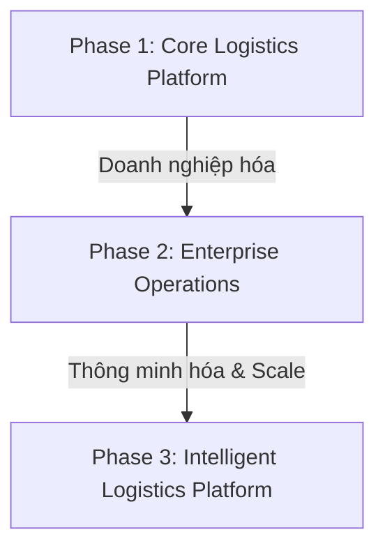

# ROADMAP: Phase 2 & Phase 3 Development (Future Expansion)

Tài liệu này lưu trữ định hướng phát triển dài hạn của hệ thống **Smart Logistics Platform** qua các giai đoạn trưởng thành của sản phẩm, tách biệt khỏi phạm vi hiện thực hóa của đồ án Phase 1 (Core Logistics).

---

## 🚀 PHASE 2 — Enterprise Operations (Vận Hành Doanh Nghiệp)

Giai đoạn này tập trung vào quản lý doanh thu, chi phí, quy tắc tự động hóa nghiệp vụ và chăm sóc khách hàng chuyên sâu khi lượng đơn hàng và đối tác tăng trưởng:

### 1️⃣ Billing & Settlement (Đối Soát & Thanh Toán)
* **Mục tiêu:** Quản lý dòng tiền và đối soát tài chính tự động.
* **Nghiệp vụ chi tiết:**
  * Quản lý dòng tiền thu hộ COD của tài xế chặng cuối, đối soát và chuyển khoản định kỳ cho khách hàng gửi (Shop).
  * Tích hợp cổng thanh toán trực tuyến, ví điện tử của khách hàng và tài xế.
  * Theo dõi công nợ đối tác doanh nghiệp (B2B), tự động xuất hóa đơn điện tử (VAT Invoice).

### 2️⃣ Pricing Engine (Động Cơ Tính Giá)
* **Mục tiêu:** Tính phí dịch vụ động thay vì áp giá cố định.
* **Nghiệp vụ chi tiết:**
  * Tính cước tự động dựa trên khoảng cách địa lý (tính qua toạ độ GPS chặng đi), trọng lượng quy đổi ($D \times R \times C / 5000$) và thể tích kiện hàng.
  * Phụ phí vùng sâu vùng xa, hàng cồng kềnh, phí bảo hiểm hàng hóa có giá trị cao.
  * Tự động áp dụng hệ số nhân giá vào giờ cao điểm, thời tiết xấu hoặc các ngày lễ tết.

### 3️⃣ Notification Service (Dịch Vụ Thông Báo Đa Kênh)
* **Mục tiêu:** Tăng trải nghiệm khách hàng thông qua cập nhật trạng thái thời gian thực.
* **Nghiệp vụ chi tiết:**
  * Tự động gửi SMS, Zalo OA (Zalo Official Account) hoặc Push Notification trên ứng dụng khi đơn hàng chuyển trạng thái (`Đang đi giao`, `Giao thành công`, `Giao hụt`).
  * Cung cấp link live tracking để người nhận xem vị trí thời gian thực của tài xế trên bản đồ.

### 4️⃣ Audit Log (Lịch Sử Hoạt Động Hệ Thống)
* **Mục tiêu:** Đảm bảo tính an toàn dữ liệu và chống gian lận.
* **Nghiệp vụ chi tiết:**
  * Ghi vết chi tiết mọi hành động thay đổi dữ liệu nhạy cảm từ phía Admin hoặc điều phối viên (Ví dụ: chỉnh sửa số tiền COD của đơn hàng, chuyển đổi tài xế thủ công ngoài tuyến định sẵn).
  * Lưu vết trước/sau thay đổi (Old Value -> New Value) và người thực hiện thay đổi.

### 5️⃣ Executive Dashboard & Automated Reports
* **Mục tiêu:** Hỗ trợ ra quyết định cho ban quản trị.
* **Nghiệp vụ chi tiết:**
  * Biểu đồ thống kê doanh thu, sản lượng đơn theo thời gian, tỷ lệ giao hàng thành công chặng đầu/chặng cuối (First/Last Mile Success Rate).
  * Đo lường KPI tài xế (Service Time tại điểm, tỷ lệ hoàn thành tuyến). Xuất báo cáo định kỳ dạng Excel/PDF.

### 6️⃣ Rule Engine (Động Cơ Quy Tắc Vận Hành)
* **Mục tiêu:** Tự động hóa việc phân loại đơn hàng bằng các điều kiện logic.
* **Nghiệp vụ chi tiết:**
  * Cấu hình quy tắc động: *"Nếu đơn hàng có COD > 20,000,000đ thì bắt buộc gọi điện xác thực trước khi điều phối"* hoặc *"Nếu kiện hàng nặng > 50kg bắt buộc gom vào xe tải thay vì xe máy"*.

---

## 🚀 PHASE 3 — Intelligent Logistics Platform (AI & Scale)

Giai đoạn tối ưu hóa triệt để chi phí vận hành bằng trí tuệ nhân tạo và chuyển đổi kiến trúc sang hệ thống phân tán quy mô lớn:

### 1️⃣ AI ETA (Dự Đoán Thời Gian Đến Thông Minh)
* **Mục tiêu:** Thay thế dịch vụ tính ETA tĩnh (như Google API tốn phí).
* **Nghiệp vụ chi tiết:**
  * AI tự học từ lịch sử giao nhận của hệ thống, kết hợp dữ liệu kẹt xe thời gian thực, thời tiết để dự đoán thời điểm giao hàng chính xác đến từng phút.

### 2️⃣ AI Route Learning (Học Tuyến Thực Tế)
* **Mục tiêu:** Tối ưu hóa tuyến đường dựa trên hành vi thực địa của tài xế.
* **Nghiệp vụ chi tiết:**
  * Thuật toán tự học các tuyến đường tài xế hay chọn chạy thực tế (có thể do đường tắt dễ đi hơn, tránh chốt giao thông, ít ngập nước) để cập nhật vào thuật toán định tuyến VRP, thay vì bắt buộc chạy theo bản đồ số lý thuyết.

### 3️⃣ Demand Forecast (Dự Báo Nhu Cầu)
* **Mục tiêu:** Chủ động chuẩn bị nguồn lực tài xế và phương tiện trước khi phát sinh đơn.
* **Nghiệp vụ chi tiết:**
  * Áp dụng Machine Learning (mô hình Time Series) dự báo số lượng đơn hàng cần lấy/giao tại từng khu vực (quận/huyện) trong 24h-48h tới dựa trên dữ liệu lịch sử và các sự kiện mua sắm lớn (Sale Day).

### 4️⃣ Auto Dispatch (Tự Động Gom & Điều Phối Tuyến)
* **Mục tiêu:** Loại bỏ hoàn toàn sự can thiệp thủ công của con người trong khâu lập tuyến.
* **Nghiệp vụ chi tiết:**
  * Khi đơn hàng chuyển sang `READY_FOR_DISPATCH`, AI tự động gom cụm, gán cho tài xế phù hợp nhất đang trực, tạo tuyến đường tối ưu và đẩy trực tiếp xuống App tài xế theo thời gian thực.

### 5️⃣ Digital Twin (Bản Sao Số Mô Phỏng)
* **Mục tiêu:** Chạy giả lập để tìm cấu hình vận hành tối ưu nhất.
* **Nghiệp vụ chi tiết:**
  * Tạo mô hình giả lập mạng lưới kho bãi và tài xế ảo, chạy thử nghiệm hàng ngàn phương án phân phối hàng hóa để tính toán chi phí xăng xe và hao phí nhân lực trước khi áp dụng cấu hình thực tế.

### 6️⃣ Microservices & Multi-Region Expansion
* **Mục tiêu:** Đảm bảo hệ thống chịu tải cao và mở rộng thị trường xuyên biên giới.
* **Nghiệp vụ chi tiết:**
  * Tách cơ sở dữ liệu nguyên khối (Monolith) của Phase 1 thành các cơ sở dữ liệu phân tán theo dịch vụ: `Order DB`, `Shipment DB`, `Routing DB`, `Tracking DB`, `Billing DB`.
  * Cấu hình database đa quốc gia: xử lý múi giờ lệch chéo, đa tiền tệ và đối soát thuế hải quan chặng quốc tế.
