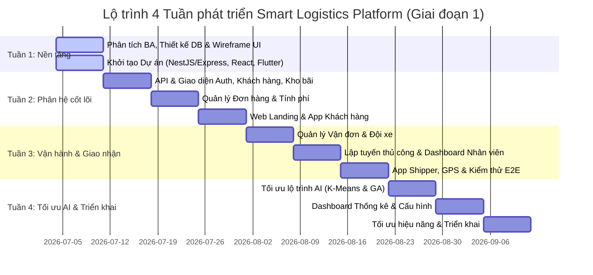

# KẾ HOẠCH TRIỂN KHAI CHI TIẾT 4 TUẦN (GIAI ĐOẠN 1)
## Hệ Thống Quản Lý Giao Vận Thông Minh (SLP)

Kế hoạch hành động chi tiết này được thiết kế để phân bổ **38 bảng cơ sở dữ liệu** và **giao diện ứng dụng di động/web** của Giai đoạn 1 vào lộ trình **4 tuần làm việc**. Các đầu việc được tổ chức theo từng tuần để nhóm phát triển chủ động điều phối và kiểm soát tiến độ.

---

## Sơ Đồ Cột Mốc 4 Tuần (Milestone Gantt)

---

## Chi Tiết Công Việc Từng Tuần (Weekly Breakdown)

### Tuần 1: Nền Tảng & Kiến Trúc Hệ Thống (Foundation & System Architecture)
**Mục tiêu:** Hoàn thiện phân tích nghiệp vụ, thiết kế cơ sở dữ liệu chi tiết, wireframe UI/UX, khởi tạo cấu trúc thư mục của 3 dự án (Backend, Web, Mobile) và chuẩn bị dữ liệu mẫu.

#### Các cột mốc công việc:
*   **Cột mốc 1 — Phân tích yêu cầu & Thiết kế kiến trúc:**
    *   Phân tích nghiệp vụ logistics chặng cuối (Last-mile) từ kho tập kết/bưu cục đến người nhận.
    *   Xác định 4 vai trò hệ thống: `Quản trị hệ thống (Admin)`, `Nhân viên (Staff)`, `Khách hàng (Customer)`, và `Tài xế giao hàng (Shipper)`.
    *   Vẽ luồng dữ liệu (Business Flow) cốt lõi: Khách hàng → Đơn hàng → Kiện hàng → Vận đơn → Tuyến đường → Điểm dừng → Giao hàng.
*   **Cột mốc 2 — Thiết kế Cơ sở dữ liệu (Database Design):**
    *   Chi tiết hóa 37/38 bảng của 9 module: định nghĩa thuộc tính, kiểu dữ liệu, ràng buộc (Khóa chính, Khóa ngoại, Unique, Index).
    *   Xác định các ENUM hệ thống (`OrderStatus`, `ShipmentStatus`, `DriverStatus`, v.v.).
    *   Cấu hình các Quy tắc nghiệp vụ (Business Rules - Ví dụ: Một tài xế chỉ lái một xe hoạt động tại một thời điểm, kiểm tra đệ quy Facility Tree).
*   **Cột mốc 3 — Thiết kế UI/UX (Wireframe & Sitemap):**
    *   Thiết kế wireframe trang giới thiệu (Landing page).
    *   Thiết kế wireframe trang quản trị Web Admin (Dashboard điều phối, danh sách đơn, quản lý tài xế, cấu hình hệ thống).
    *   Thiết kế wireframe ứng dụng di động (Mobile App) cho cả Khách hàng và Tài xế (Đăng nhập, tạo đơn, xem bản đồ tracking, danh sách điểm dừng, quét mã, POD).
*   **Cột mốc 4 — Khởi tạo dự án (Project Initialization):**
    *   **Backend:** Khởi tạo dự án bằng Express TypeScript. Cài đặt các thư viện lõi: Prisma ORM, PostgreSQL Driver, JWT, Redis Client, Swagger, Class-Validator. Cấu hình Prisma Migrations.
    *   **Frontend Web:** Khởi tạo React + Vite + TailwindCSS. Cài đặt các thư viện: React Router, Axios, Zustand, React Query.
    *   **Mobile App:** Khởi tạo Flutter. Cài đặt các packages: Riverpod/Bloc, Dio, Go Router, Google Maps/MapLibre.
    *   **Git Repository:** Khởi tạo repository chung, phân chia nhánh bảo mật (`main`, `develop`, `feature/*`).
*   **Cột mốc 5 — Dữ liệu mẫu (Seed Data) & Quy chuẩn code (Conventions):**
    *   Viết script `seed.ts` nạp dữ liệu mẫu ban đầu (Roles, Permissions, Gói dịch vụ, Tham số cấu hình).
    *   Tạo dữ liệu thử nghiệm: 100 Khách hàng, 300 Đơn hàng, 500 Kiện hàng, 20 Tài xế, 15 Xe, 5 Kho.
    *   Thống nhất quy tắc đặt tên (CamelCase, PascalCase, snake_case trong DB) và API Conventions (`/api/v1/...`).

> **Lưu ý — Tiêu chuẩn hoàn thành Tuần 1 (DoD 1):**
> * Tất cả 3 dự án (Backend, Web, Mobile) khởi chạy thành công trên máy local mà không có lỗi.
> * Database được tạo đầy đủ bảng trong PostgreSQL thông qua Prisma, dữ liệu seed mẫu được nạp thành công.
> * Bản vẽ thiết kế UI/UX wireframe đã được thống nhất hoàn toàn.

---

### Tuần 2: Xây Dựng Các Phân Hệ Nghiệp Vụ Cốt Lõi (Core Business Modules)
**Mục tiêu:** Hoàn thiện xác thực phân quyền, quản lý khách hàng, bưu cục và đơn hàng. Sau tuần này, khách hàng có thể tạo đơn hàng, nhân viên có thể quản lý đơn hàng và kho.

#### Các cột mốc công việc:
*   **Cột mốc 1 — Xác thực & Phân quyền (Authentication & Authorization):**
    *   **Backend:** APIs Auth (Đăng ký khách hàng, Đăng nhập, Đăng xuất, Refresh Token, mã hóa BCrypt) và Middleware phân quyền (RBAC) cho 4 Roles.
    *   **Frontend Web:** Form Đăng nhập, Route Guard bảo vệ các trang quản trị, phân quyền hiển thị UI theo vai trò.
*   **Cột mốc 2 — Quản lý Khách hàng (Customer Management):**
    *   **Backend:** Xây dựng hệ thống API quản lý thông tin khách hàng, sổ địa chỉ nhận/gửi và thông tin người liên hệ.
    *   **Frontend Web:** Màn hình danh sách/chi tiết khách hàng, cập nhật thông tin và quản lý sổ địa chỉ.
    *   *Ràng buộc nghiệp vụ:* Một khách hàng có nhiều địa chỉ/người liên hệ; không cho phép xóa khách hàng nếu vẫn còn đơn hàng tồn tại.
*   **Cột mốc 3 — Quản lý Kho bãi (Facility Management):**
    *   **Backend:** Xây dựng hệ thống API quản lý thông tin kho tập kết (bưu cục) và các phân khu hàng hóa trong kho.
    *   **Frontend Web:** Màn hình quản lý bưu cục, hiển thị danh sách các phân khu hàng hóa (khu nhận hàng, khu phân loại, khu xuất hàng).
*   **Cột mốc 4 — Quản lý Đơn hàng (Order Management):**
    *   **Backend:** Xây dựng hệ thống API quản lý thông tin đơn hàng, chi tiết các kiện hàng, lịch sử thanh toán và timeline lịch sử trạng thái đơn. Tích hợp **Geocoding API** để chuyển đổi địa chỉ thành tọa độ địa lý `[Kinh độ, Vĩ độ]`. Tự động tính phí vận chuyển theo quy tắc (khoảng cách + trọng lượng + gói cước + phụ phí). Hỗ trợ tạo đơn lẻ hoặc hàng loạt, đặt lịch hẹn lấy hàng tận nơi, và sinh mã vận đơn (QR Code). Lưu thông tin Snapshot thông tin đơn hàng tại thời điểm tạo để bảo toàn lịch sử.
    *   **Chức năng cho Khách:** Tạo đơn hàng mới (lẻ hoặc hàng loạt), in mã vận đơn (QR Code), đặt lịch hẹn lấy hàng, xem danh sách đơn, hủy đơn trước khi lấy hàng.
    *   **Chức năng cho Nhân viên:** Xem danh sách toàn cục, cập nhật trạng thái đơn hàng, kiểm tra kiện hàng.
*   **Cột mốc 5 — Trang Web giới thiệu (Landing Website):**
    *   Xây dựng trang chủ giới thiệu dịch vụ vận chuyển, tin tức, footer.
    *   Chức năng tra cứu vận đơn nhanh qua mã đơn (hiển thị trạng thái, timeline lịch sử, ETA).
    *   Công cụ ước tính cước phí vận chuyển nhanh dựa trên quy tắc (Rule-based).
*   **Cột mốc 6 — Ứng dụng Di động cho Khách hàng (Customer Mobile App):**
    *   Chức năng Đăng nhập, Đăng ký, Quên mật khẩu.
    *   Trang chủ hiển thị danh sách đơn gần đây, phím tắt Tạo đơn và Tra cứu nhanh.
    *   Các luồng nghiệp vụ: Tạo đơn hàng mới (lẻ hoặc hàng loạt), hiển thị mã QR vận đơn để in/quét, đặt lịch hẹn lấy hàng tận nơi, danh sách đơn hàng của tôi, xem chi tiết và timeline trạng thái đơn hàng, hủy đơn, quản lý thông tin cá nhân.
*   **Cột mốc 7 — Tài liệu API & Kiểm thử (API Documentation & Testing):**
    *   Viết tài liệu Swagger đầy đủ cho các APIs: Auth, Customer, Facility, Order.
    *   Tạo Postman Collection/Environment và chạy kiểm thử (Integration Testing) cho các API trên.

> **Quan trọng — Tiêu chuẩn hoàn thành Tuần 2 (DoD 2):**
> * Khách hàng thực hiện được toàn bộ luồng đăng ký, đăng nhập và tạo đơn hàng từ cả Web và Customer Mobile App.
> * Hệ thống tính phí cước chuẩn xác và lưu Snapshot đơn hàng đúng nghiệp vụ.
> * Nhân viên có thể quản lý, xem thông tin kho bãi và đơn hàng trên Web Admin.

---

### Tuần 3: Vận Hành Logistics & Điều Phối Giao Hàng (Logistics Operations & Delivery Management)
**Mục tiêu:** Hoàn thiện toàn bộ quy trình vận hành logistics từ khi đơn hàng rời kho đến khi tài xế giao thành công. Hệ thống hỗ trợ tạo Shipment, quản lý đội xe, lập tuyến đường thủ công và Shipper thực hiện giao nhận trên ứng dụng di động.

#### Các cột mốc công việc:
*   **Cột mốc 1 — Quản lý Vận đơn (Shipment Management):**
    *   **Backend:** Xây dựng hệ thống API quản lý thông tin vận đơn giao hàng, danh sách kiện hàng đi kèm và nhật ký hành trình của tài xế.
    *   **Chức năng:** Nhân viên tạo Shipment từ một hoặc nhiều Package (gom kiện hàng), theo dõi trạng thái vận chuyển và xem bằng chứng giao nhận.
    *   *Ràng buộc nghiệp vụ:* Order → Packages → Shipment → Route. Hệ thống vận chuyển thông qua Package, không vận chuyển trực tiếp Order.
*   **Cột mốc 2 — Quản lý Đội xe & Tài xế (Fleet & Driver Management):**
    *   **Backend:** Xây dựng hệ thống API quản lý hồ sơ tài xế, danh mục phương tiện (xe máy, xe tải, xe van), lịch sử gán xe cho tài xế và kế hoạch bảo trì phương tiện.
    *   **Chức năng:** Nhân viên thêm/quản lý phương tiện và tài xế, gán xe cho tài xế, theo dõi bảo trì và vị trí tài xế.
    *   *Ràng buộc nghiệp vụ:* Một xe chỉ có một tài xế hoạt động; một tài xế chỉ lái một xe tại một thời điểm; xe đang bảo trì không được điều phối chạy.
*   **Cột mốc 3 — Lập Tuyến đường thủ công (Route Planning - Manual Routing):**
    *   **Backend:** Xây dựng hệ thống API quản lý tuyến đường giao hàng, danh sách các điểm dừng (stops) trên tuyến và lưu nhật ký thực thi lộ trình của tài xế.
    *   **Chức năng:** Nhân viên tạo Tuyến đường (Route), gán chuyến hàng (Shipment) vào Route, thêm điểm dừng (RouteStop), thay đổi thứ tự các điểm dừng thủ công và theo dõi tiến độ tuyến đường.
    *   *Ràng buộc nghiệp vụ:* Driver → Vehicle → Route → RouteStops → Shipment. Mọi Shipment đều đi thông qua Route.
    *   *Loại Tuyến:* Phân loại `NORMAL_ROUTE` (Tuyến thông thường) và `ADHOC_ROUTE` (Tuyến khẩn cấp).
*   **Cột mốc 4 — Giao diện làm việc của Nhân viên (Staff Dashboard):**
    *   Giao diện Dashboard hiển thị số lượng Shipment đang chạy/chờ giao, các Route trong ngày, danh sách Driver/Vehicle đang hoạt động.
    *   Tích hợp bản đồ trực quan hiển thị vị trí của Driver, các tuyến chạy và các điểm giao nhận trên Web Admin. **Cơ chế phản hồi realtime:** Các cột cờ điểm giao (Marker) hiển thị trên bản đồ Web Admin sẽ tự động chuyển sang màu xám và tối lại ngay lập tức khi tài xế bấm xác nhận giao hàng thành công trên ứng dụng di động qua kết nối WebSocket.
*   **Cột mốc 5 — Ứng dụng Di động cho Tài xế (Shipper Mobile App):**
    *   Màn hình Dashboard tài xế hiển thị tuyến đường trong ngày, tổng số điểm giao, số vận đơn và thời gian ETA dự kiến.
    *   Màn hình Route hiển thị danh sách các tuyến và danh sách điểm dừng (Stops).
    *   Hành động tại điểm dừng: Hỗ trợ tài xế Check-in/Check-out, xem thông tin vận đơn và chi tiết kiện hàng.
    *   Giao nhận hàng: Hỗ trợ quét mã QR/Barcode bốc hàng, chụp ảnh bằng chứng POD, ghi nhận thu hộ tiền COD, xác nhận giao thành công hoặc báo giao thất bại (nhập lý do và bằng chứng).
    *   **GPS Định vị chạy ngầm (Background Location):** Tự động thu thập tọa độ GPS của thiết bị theo chu kỳ **3-5 giây/lần** khi đang trong ca làm việc và truyền về máy chủ qua WebSockets kể cả khi tắt màn hình.
*   **Cột mốc 6 — Theo dõi & Giám sát (Tracking & Monitoring):**
    *   Hiển thị dòng thời gian vận đơn (Shipment Timeline), tuyến đường (Route Timeline), vị trí tài xế và ETA trên giao diện.
    *   Gửi thông báo (Notifications) khi bắt đầu đi giao, giao thành công, giao thất bại.
*   **Cột mốc 7 — Kiểm thử Tích hợp toàn trình thủ công (E2E Integration Testing):**
    *   Kiểm thử toàn bộ quy trình: Khách tạo đơn → Tạo kiện → Nhân viên tạo Shipment → Tạo Tuyến đường Route → Gán điểm dừng RouteStops → Shipper nhận tuyến trên app di động → Thực hiện Check-in điểm dừng → Quét barcode giao hàng → Chụp ảnh POD → Đóng đơn thành công.

> **Quan trọng — Tiêu chuẩn hoàn thành Tuần 3 (DoD 3):**
> * Nhân viên có thể tạo vận đơn Shipment, quản lý đội xe và tạo tuyến chạy (Route) thủ công trên Web Admin.
> * Shipper thực hiện giao hàng thành công trên điện thoại, quét được barcode và chụp ảnh POD gửi lên server.
> * Hệ thống cập nhật và hiển thị Live GPS, Timeline lịch sử giao nhận khớp với thực tế.

---

### Tuần 4: Tối Ưu Lộ Trình AI, Tích Hợp Hệ Thống & Triển Khai (AI Optimization, System Integration & Deployment)
**Mục tiêu:** Hoàn thiện toàn bộ hệ thống Smart Logistics, tích hợp AI tối ưu tuyến đường, theo dõi thời gian thực, kiểm thử toàn hệ thống và triển khai phiên bản hoàn chỉnh sẵn sàng trình diễn.

#### Các cột mốc công việc:
*   **Cột mốc 1 — Tối ưu hóa Tuyến đường bằng AI (AI Route Optimization):**
    *   **Mục tiêu:** Xây dựng lõi AI hỗ trợ điều phối tuyến đường tối ưu (gom cụm đơn hàng, phân bổ tài xế, tối ưu quãng đường, giảm tổng thời gian giao).
    *   **Thuật toán K-Means:** Phân cụm đơn hàng tự động theo tọa độ định vị GPS để chia vùng địa lý cho từng tài xế hoặc bưu cục trước ca làm việc.
    *   **Giải thuật tối ưu đa ràng buộc (VRP Solver / Genetic Algorithm):** 
        *   Giải bài toán định tuyến xe đa ràng buộc cứng: **CVRP** (Sức chứa/tải trọng tối đa của phương tiện) và **VRPTW** (Khung giờ hẹn giao/nhận của khách hàng).
        *   Tích hợp các ràng buộc này vào **Hàm thích nghi (Fitness Function)** của giải thuật di truyền thông qua **Hàm phạt (Penalty Function)**: gán mức điểm phạt cực lớn cho các phương án vi phạm tải trọng hoặc trễ giờ hẹn để tự động đào thải qua các thế hệ lai ghép (Crossover) và đột biến (Mutation).
        *   Sắp xếp thứ tự các điểm dừng `RouteStops` trên tuyến đường tối ưu nhất.
    *   *Kết quả:* Tự động sinh `Routes` tối ưu mà không cần điều phối thủ công.
*   **Cột mốc 2 — Báo cáo thống kê Dashboard Admin (Dashboard Analytics):**
    *   **Giao diện Dashboard:** Hoàn thiện giao diện báo cáo cho Admin hiển thị:
        *   *Orders:* Tổng đơn, đơn mới, đơn hoàn thành, đơn hủy.
        *   *Shipments:* Số lượng đang vận chuyển, đã giao, giao thất bại.
        *   *Fleet:* Thống kê xe hoạt động/bảo trì, tài xế online/offline.
        *   *Warehouse:* Số lượng bưu cục, hàng hóa lưu kho, hàng đang luân chuyển.
    *   **Biểu đồ phân tích (Charts):** Thống kê đơn hàng theo ngày/tháng, tỷ lệ giao hàng thành công, báo cáo doanh thu cước phí và tiền thu hộ COD.
    *   **Bản đồ quản lý (Map):** Hiển thị trực quan vị trí realtime của Driver, tuyến đường di chuyển, vị trí kho bãi và các điểm giao nhận.
*   **Cột mốc 3 — Cấu hình hệ thống (System Settings):**
    *   **Backend:** Xây dựng hệ thống API cấu hình động các tham số nghiệp vụ toàn hệ thống.
    *   **Chức năng quản lý:** Cho phép Admin thay đổi cấu hình nghiệp vụ (tần suất gửi GPS, giới hạn trọng lượng/thể tích kiện hàng, khoảng cách lộ trình tối đa), tinh chỉnh các tham số thuật toán AI (bán kính phân cụm, kích thước quần thể, tỷ lệ lai ghép/đột biến), và **quản lý các API Keys bản đồ số** kết nối với dịch vụ bên thứ ba (Google Maps, Mapbox, OpenStreetMap).
*   **Cột mốc 4 — Tích hợp thời gian thực & Thông báo tự động (Real-time Integration & Notifications):**
    *   **Realtime Tracking:** Đồng bộ trực tiếp vị trí Driver, trạng thái Shipment và tiến độ tuyến chạy (Route Progress).
    *   **Thông báo tự động (Notifications):**
        *   *Khách hàng:* Thông báo khi tạo đơn, khi lấy hàng thành công, đang giao, và giao thành công.
        *   *Tài xế:* Thông báo khi được điều phối tuyến mới hoặc có vận đơn mới gán chạy.
        *   *Nhân viên điều phối:* Cảnh báo khi vận đơn xảy ra lỗi, tuyến đường bị trễ tiến độ hoặc giao hàng thất bại.
*   **Cột mốc 5 — Kiểm thử toàn diện hệ thống (E2E System Testing):**
    *   Kiểm thử tích hợp tất cả các module (Auth, Customer, Facility, Orders, Shipment, Fleet, Route, Tracking, System Settings).
    *   Chạy kịch bản nghiệp vụ khép kín từ đầu đến cuối: Khách tạo đơn → Tính phí → Nhân viên duyệt đơn → Tạo Shipment → Tạo Route → AI tính toán tối ưu lộ trình → Shipper nhận tuyến → Check-in ca chạy → Giao hàng & quét mã QR → Ký POD hoàn thành → Khách hàng theo dõi realtime.
*   **Cột mốc 6 — Tối ưu hóa hiệu năng (Performance Optimization):**
    *   **Backend:** Tối ưu hóa câu lệnh truy vấn cơ sở dữ liệu (Prisma/PostgreSQL), tạo các index địa lý (PostGIS) và cache Redis để tăng tốc độ phản hồi API.
    *   **Frontend Web:** Tích hợp Lazy Loading, Code Splitting và màn hình Loading Skeleton.
    *   **Mobile App:** Thiết lập bộ nhớ đệm ngoại tuyến (Offline Cache), cơ chế gửi lại yêu cầu khi mất mạng (Retry API) và tối ưu hóa tần suất định vị GPS để tiết kiệm pin.
*   **Cột mốc 7 — Triển khai & Chuẩn bị Demo (Deployment & Demo Preparation):**
    *   **Deploy:** Triển khai Backend, Frontend Web, Database lên môi trường chạy thực tế và đóng gói bản cài đặt di động Mobile APK.
    *   **Tài liệu (Documentation):** Hoàn thiện hồ sơ thiết kế Database (37/38 bảng), ERD, tài liệu API Docs (Swagger), và hướng dẫn sử dụng (User Manual).
    *   **Chuẩn bị Demo & Slide:** Thiết lập kịch bản chạy thử hệ thống hoàn chỉnh và soạn thảo slide bảo vệ đề tài (Giới thiệu đề tài, kiến trúc, cơ sở dữ liệu, công nghệ, giải thuật AI VRP, và hướng mở rộng Giai đoạn 2/3).

> **Quan trọng — Tiêu chuẩn hoàn thành Tuần 4 (DoD 4):**
> * Hệ thống hoàn thiện 100% tính năng của Giai đoạn 1, các APIs chạy ổn định dưới tải và các dịch vụ real-time đồng bộ không trễ.
> * Lõi AI giải thuật tối ưu hoạt động chuẩn xác.
> * Có đầy đủ tài liệu hướng dẫn, file cài đặt và slide thuyết trình sẵn sàng trình diễn.

---

## Bảng Theo Dõi Tiến Độ Phân Bổ Theo Phân Hệ Chức Năng

| Tuần | Phân hệ (Module) | Phạm vi chức năng & Luồng nghiệp vụ tương ứng |
| :--- | :--- | :--- |
| **Tuần 1** | Khởi tạo hạ tầng | Thiết kế & Đồng bộ cấu trúc Schema toàn bộ 38 bảng dữ liệu lên Postgres. Nạp dữ liệu lookup/master và tài khoản test bằng Script Seed. |
| **Tuần 2** | - Xác thực & Phân quyền - Quản lý Khách hàng - Quản lý Kho bãi - Quản lý Đơn hàng | Quản lý tài khoản, gán vai trò (RBAC). Hồ sơ khách hàng, sổ địa chỉ gửi/nhận. Thông tin kho tập kết (bưu cục), khu vực phân loại hàng. Tạo đơn, đóng kiện, tính phí cước, snapshot đơn hàng. |
| **Tuần 3** | - Quản lý Vận đơn - Quản lý Đội xe - Lập tuyến (Thủ công) | Gom kiện hàng vào vận đơn giao hàng (Shipment) tại bưu cục. Hồ sơ tài xế, quản lý phương tiện, lịch sử gán xe, định vị vị trí. Tạo lộ trình tuyến chạy, gán các điểm dừng, thay đổi thứ tự điểm dừng. |
| **Tuần 4** | - Định tuyến tối ưu (AI) - Theo dõi & Xác thực POD - Cấu hình hệ thống | Lõi giải thuật VRP (K-Means & GA) tự động sinh và tối ưu hóa lộ trình. Quét mã vạch kiểm hàng, chụp ảnh POD, chữ ký điện tử, log GPS chạy ngầm. Cấu hình tham số hệ thống và tham số thuật toán AI cho Admin. |

---

## Quy Trình Phối Hợp & Họp Nhóm Hằng Ngày (Daily Sync)

1.  **Họp nhanh hàng ngày (Daily Stand-up):** Dành 10 phút đầu buổi sáng để đồng bộ nhanh công việc hôm qua đã hoàn thành, định hướng hôm nay và các điểm nghẽn (blocker).
2.  **Đồng bộ Git:** Merge code tính năng thông qua Pull Request vào nhánh `develop` cuối mỗi ngày làm việc.
3.  **Tích hợp & Kiểm thử sớm:** Dành 2 tiếng cuối mỗi ngày thứ Sáu hàng tuần để tích hợp chéo và kiểm thử toàn bộ tính năng đã làm được trong tuần.
