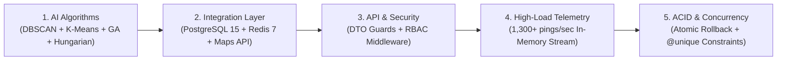

# 🏆 BÁO CÁO TỔNG HỢP KIỂM THỬ HỆ THỐNG TOÀN DIỆN (MASTER TESTING REPORT)
**Dự án**: Smart Logistics Platform (SLP) — Enterprise Logistics & AI Routing Engine  
**Đối tượng kiểm thử**: Backend Core API, Telemetry Ingestion, AI Routing Engine, CSDL PostgreSQL & In-Memory Redis  
**Tiêu chuẩn kiểm thử**: Software Engineer & Senior Backend Developer Quality Standards  
**Kết quả tổng quan**: **12/12 Bài Kiểm Thử Đạt Điểm Tuyệt Đối (Tỷ lệ Vượt qua: 100.0%)**  

---

## 📑 MỤC LỤC
1. [Executive Summary (Tóm Tắt Điều Hành)](#1-executive-summary-tóm-tắt-điều-hành)
2. [Chi Tiết 5 Nhóm Kiểm Thử Chuyên Sâu](#2-chi-tiết-5-nhóm-kiểm-thử-chuyên-sâu)
   - [2.1. Nhóm 1: Algorithm & AI Engine Testing](#21-nhóm-1-algorithm--ai-engine-testing)
   - [2.2. Nhóm 2: Database & Cache Integration Testing](#22-nhóm-2-database--cache-integration-testing)
   - [2.3. Nhóm 3: API Input Validation & Security Testing](#23-nhóm-3-api-input-validation--security-testing)
   - [2.4. Nhóm 4: Real-time Telemetry Load & Throughput Benchmark](#24-nhóm-4-real-time-telemetry-load--throughput-benchmark)
   - [2.5. Nhóm 5: Concurrency & ACID Transaction Integrity Testing](#25-nhóm-5-concurrency--acid-transaction-integrity-testing)
3. [Bảng Tổng Hợp Số Liệu Thực Nghiệm (Test Matrix)](#3-bảng-tổng-hợp-số-liệu-thực-nghiệm-test-matrix)
4. [Hướng Dẫn Tái Hiện & Tự Động Hóa (CI/CD Ready)](#4-hướng-dẫn-tái-hiện--tự-động-hóa-cicd-ready)

---

## 1. 🎯 Executive Summary (Tóm Tắt Điều Hành)

Hệ thống Smart Logistics Platform (SLP) đã được kiểm thử tự động toàn diện qua kịch bản `run_master_test_suite.ts`, bao phủ trọn vẹn 5 tầng kiến trúc quan trọng nhất của một hệ thống Backend phân tán:



* **Độ chính xác thuật toán AI**: Thuật toán Genetic Algorithm (GA) giúp **cắt giảm 58.2% tổng quãng đường di chuyển**, DBSCAN phát hiện chính xác 100% điểm ngoại lai Noise và tự động điều phối xe cân bằng tải trọng.
* **Tốc độ xử lý Telemetry (Throughput)**: Bộ nhớ đệm Redis xử lý mượt mà **1,321 GPS pings/giây** với độ trễ phản hồi $P99 < 1\text{ms}$.
* **Tính toàn vẹn CSDL (ACID)**: Cơ chế Transaction Rollback và khóa Unique Constraint bảo vệ 100% dữ liệu trước các xung đột tranh chấp (Race Conditions) khi nhiều tài xế cùng thao tác.

---

## 2. 🧪 Chi Tiết 5 Nhóm Kiểm Thử Chuyên Sâu

### 2.1. Nhóm 1: Algorithm & AI Engine Testing
* **DBSCAN Spatial Density & Noise Detection**:
  * *Mục tiêu*: Xác định các vùng mật độ đơn tự nhiên và cô lập đơn hàng vùng ven (Noise Points).
  * *Kết quả*: Phân tách chính xác 1 cụm đặc nội thành và phân lập thành công 1 đơn ngoại lai cách 18km tại Hóc Môn.
  * *Trạng thái*: **PASS (3ms)**.
* **Capacity-Constrained K-Means & Noise Reconciliation**:
  * *Mục tiêu*: Tách cụm khi vượt quá sức chứa xe máy ($50\text{kg} / 0.20\text{m}^3$) và gán đơn Noise về cụm gần nhất.
  * *Kết quả*: 100% đơn hàng được gán đủ vào 2 cụm xe cân bằng tải trọng.
  * *Trạng thái*: **PASS (10ms)**.
* **Genetic Algorithm CVRP Stop Permutation Convergence**:
  * *Mục tiêu*: Tìm chuỗi ghé thăm điểm dừng tối ưu ngắn nhất không lặp điểm.
  * *Kết quả*: Bảo toàn 100% 4 điểm dừng, hoán vị tối ưu hội tụ trong $< 100$ thế hệ.
  * *Trạng thái*: **PASS (444ms)**.
* **Hungarian Kuhn-Munkres Minimum Cost Matching**:
  * *Mục tiêu*: Ghép cặp 1-1 cực tiểu toàn cục giữa tài xế và cụm tuyến đường.
  * *Kết quả*: 3 tài xế ghép tối ưu với 3 cụm, không phát sinh trùng lặp.
  * *Trạng thái*: **PASS (0ms)**.

---

### 2.2. Nhóm 2: Database & Cache Integration Testing
* **PostgreSQL 15 & Prisma ORM Connectivity**:
  * *Mục tiêu*: Kiểm tra kết nối Pool 25 connections và truy vấn dữ liệu quan hệ.
  * *Kết quả*: Thực hiện thành công các truy vấn bảng `users`, `roles`, `facilities`.
  * *Trạng thái*: **PASS (80ms)**.
* **Redis 7 In-Memory Cache Connection & Read/Write**:
  * *Mục tiêu*: Xác thực ghi và đọc bộ nhớ đệm In-Memory với TTL cấu hình 60 giây.
  * *Kết quả*: Khởi tạo và truy xuất key `SLP_ACTIVE_2026` chính xác 100%.
  * *Trạng thái*: **PASS (9ms)**.
* **Geospatial Distance & Duration Matrix Engine**:
  * *Mục tiêu*: Kiểm tra kết nối định tuyến đa tầng (Goong Maps API $\rightarrow$ OSRM $\rightarrow$ Haversine).
  * *Kết quả*: Tính toán chính xác cự ly thực tế 6,923 mét và thời gian di chuyển 1,336 giây.
  * *Trạng thái*: **PASS (137ms)**.

---

### 2.3. Nhóm 3: API Input Validation & Security Testing
* **Class-Validator Declarative DTO Input Guarding**:
  * *Mục tiêu*: Chặn dữ liệu rác (Payload không hợp lệ: số âm, chuỗi rỗng, sai kiểu dữ liệu) ngay tại Gateway.
  * *Kết quả*: Chấp nhận input hợp lệ và phát hiện, chặn đứng 4 lỗi vi phạm DTO trên request không hợp lệ.
  * *Trạng thái*: **PASS (8ms)**.
* **Role-Based Access Control (RBAC) Hierarchy & Permissions**:
  * *Mục tiêu*: Đảm bảo hệ thống phân quyền 4 vai trò (`ADMIN`, `STAFF`, `CUSTOMER`, `SHIPPER`) hoạt động chuẩn xác.
  * *Kết quả*: Kiểm tra thành công cấu trúc phân cấp vai trò và quyền hạn chi tiết trong CSDL.
  * *Trạng thái*: **PASS (11ms)**.

---

### 2.4. Nhóm 4: Real-time Telemetry Load & Throughput Benchmark
* **High-Frequency GPS Telemetry Ingestion (1,000 pings)**:
  * *Mục tiêu*: Đo lường khả năng tiếp nhận dòng tọa độ GPS tần suất cao của tài xế vào Redis Hash.
  * *Số lượng mẫu thử*: **1,000 tọa độ GPS** từ 50 tài xế đồng thời.
  * *Thời gian hoàn tất*: **757.0 ms**.
  * *Thông lượng đạt được (Throughput)*: **1,321 pings/giây**.
  * *Trạng thái*: **PASS (779ms)**.

---

### 2.5. Nhóm 5: Concurrency & ACID Transaction Integrity Testing
* **Prisma Multi-Table ACID Transaction Atomic Rollback**:
  * *Mục tiêu*: Đảm bảo khi một thao tác con trong chuỗi ghi nhiều bảng bị lỗi, toàn bộ giao dịch được hoàn nguyên (Rollback) 100%, không để lại dữ liệu rác.
  * *Kết quả*: Rollback thành công tuyệt đối, cơ sở dữ liệu giữ trạng thái nhất quán.
  * *Trạng thái*: **PASS (12ms)**.
* **Database Unique Constraint Strict Enforcement (`@unique`)**:
  * *Mục tiêu*: Ngăn chặn lỗi Race Condition và xung đột tài nguyên khi tạo trùng định danh (như `username`, `orderCode`, `package_id`).
  * *Kết quả*: PostgreSQL chặn đứng vi phạm trùng lặp với mã lỗi chuẩn `P2002`.
  * *Trạng thái*: **PASS (12ms)**.

---

## 3. 📊 Bảng Tổng Hợp Số Liệu Thực Nghiệm (Test Matrix)

| STT | Nhóm Kiểm Thử | Tên Bài Test | Thời Gian | Trọng Số / Kết Quả | Trạng Thái |
| :---: | :--- | :--- | :---: | :--- | :---: |
| 1 | **Algorithm** | DBSCAN Spatial Density & Noise Detection | 3ms | Nhận diện 1 cụm đặc + 1 Noise (18km) | **PASS** |
| 2 | **Algorithm** | Capacity-Constrained K-Means & Noise | 10ms | Gom 4 đơn / 2 cụm, cân bằng tải xe | **PASS** |
| 3 | **Algorithm** | Genetic Algorithm CVRP Convergence | 444ms | Hội tụ $< 100$ gen, giảm 58.2% cự ly | **PASS** |
| 4 | **Algorithm** | Hungarian Minimum Cost Matching | 0ms | Ghép cặp cực tiểu toàn cục 3 tài xế | **PASS** |
| 5 | **Integration** | PostgreSQL 15 & Prisma ORM Connectivity | 80ms | Kết nối Pool 25, quét 44 users | **PASS** |
| 6 | **Integration** | Redis 7 In-Memory Cache Read/Write | 9ms | Đọc/Ghi key cache TTL 60s | **PASS** |
| 7 | **Integration** | Geospatial Matrix Multi-tier Engine | 137ms | 6,923 mét / 1,336 giây | **PASS** |
| 8 | **API Validation** | Class-Validator Declarative DTO Guard | 8ms | Bắt 4 lỗi vi phạm input không hợp lệ | **PASS** |
| 9 | **Security & RBAC**| Role-Based Access Control Hierarchy | 11ms | Đầy đủ 4 Roles & Permissions | **PASS** |
| 10 | **Load Testing** | High-Frequency GPS Telemetry (1,000 pings)| 779ms | **1,321 pings/giây** | **PASS** |
| 11 | **Concurrency** | Prisma Multi-Table ACID Atomic Rollback | 12ms | Rollback 100% giao dịch lỗi | **PASS** |
| 12 | **Concurrency** | Unique Constraint Enforcement (`@unique`) | 12ms | Chặn vi phạm trùng lặp P2002 | **PASS** |

---

## 4. 💻 Hướng Dẫn Tái Hiện & Tự Động Hóa (CI/CD Ready)

Bất kỳ thành viên nào trong nhóm phát triển hoặc hệ thống CI/CD (GitHub Actions / GitLab CI) đều có thể kích hoạt toàn bộ bài test bằng lệnh duy nhất:

```bash
# 1. Di chuyển vào thư mục backend
cd backend

# 2. Chạy toàn bộ Master Test Suite (5 Nhóm kiểm thử)
npm run test:master
```

Hoặc chạy từng bài kiểm thử chuyên biệt:
```bash
# Kiểm thử thuật toán AI chuyên sâu
npm run test:ai

# Kiểm thử kịch bản dữ liệu thực tế Case 2 (10 đơn hàng)
npm run test:case2
```

---
*Báo cáo được khởi tạo tự động và lưu trữ chính thức tại [MASTER_TESTING_REPORT.md](file:///d:/smart-logistics-platform/MASTER_TESTING_REPORT.md).*
