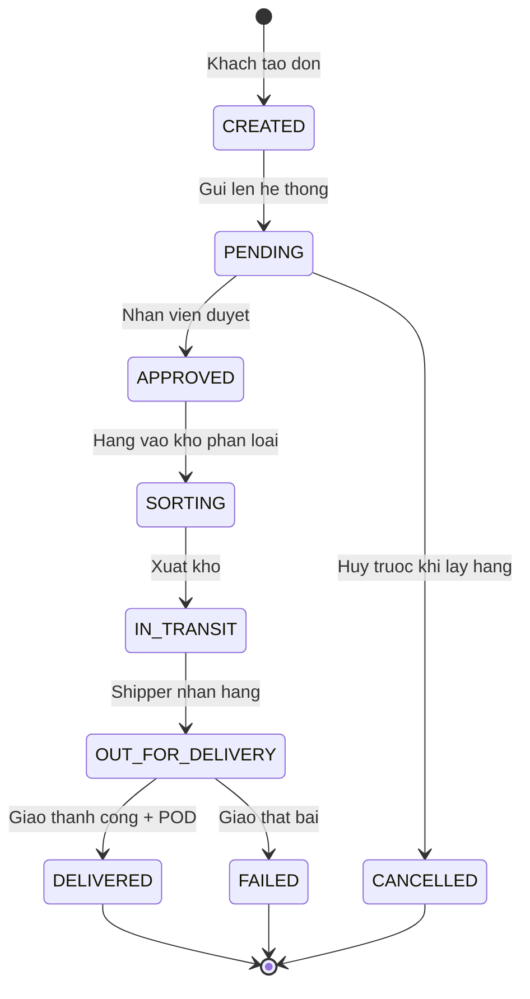
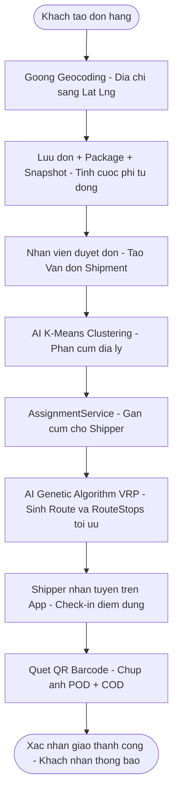
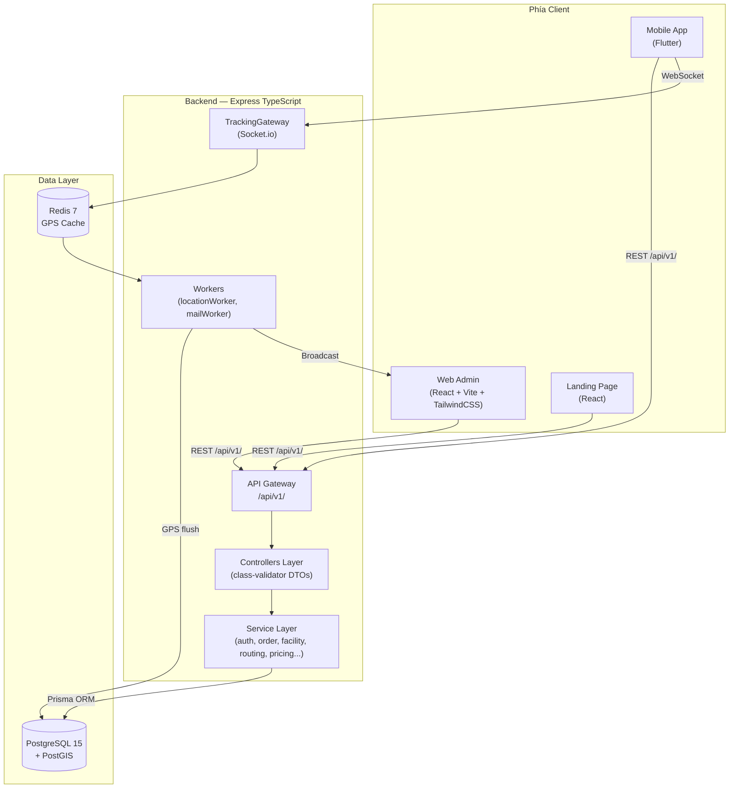

# BÁO CÁO ĐỊNH KỲ 1 (BCĐK1)
## THỰC TẬP TỐT NGHIỆP ĐẠI HỌC

**HỌC VIỆN CÔNG NGHỆ BƯU CHÍNH VIỄN THÔNG — CƠ SỞ TẠI TP. HỒ CHÍ MINH**

---

| | |
|:---|:---|
| **Đề tài** | Xây dựng hệ thống điều vận và tối ưu hóa tuyến đường giao hàng tự động (Smart Logistics Platform — SLP) |
| **Giảng viên hướng dẫn** | ThS. Nguyễn Thị Bích Nguyên |
| **Mã nhóm** | C27 |
| **Sinh viên 1** | Phạm Tuấn Hưng — MSSV: N22DCCN037 |
| **Sinh viên 2** | Hồ Thuận Kiều — MSSV: N22DCCN046 |
| **Sinh viên 3** | Nguyễn Tấn Quý — MSSV: N22DCCN066 |
| **Lớp** | D22CQCNPM01-N |
| **Thời gian** | Tuần 1 & Tuần 2 (04/07/2026 – 11/07/2026) |

*TP. Hồ Chí Minh, tháng 7 năm 2026*

---

## MỤC LỤC

0. [Mở đầu](#mở-đầu)
1. [Bảng viết tắt](#bảng-viết-tắt)
2. [Chương 1: Tổng quan đề tài](#chương-1-tổng-quan-đề-tài)
3. [Chương 2: Phân tích yêu cầu hệ thống](#chương-2-phân-tích-yêu-cầu-hệ-thống)
4. [Chương 3: Thiết kế hệ thống](#chương-3-thiết-kế-hệ-thống)
5. [Chương 4: Các thuật toán AI cốt lõi](#chương-4-các-thuật-toán-ai-cốt-lõi)
6. [Chương 5: Cài đặt và triển khai](#chương-5-cài-đặt-và-triển-khai)
7. [Chương 6: Kiểm thử hệ thống](#chương-6-kiểm-thử-hệ-thống)
8. [Chương 7: Kết quả giai đoạn 1 và kế hoạch tiếp theo](#chương-7-kết-quả-giai-đoạn-1-và-kế-hoạch-tiếp-theo)
9. [Kết luận & Kiến nghị](#kết-luận--kiến-nghị)
10. [Tài liệu tham khảo](#tài-liệu-tham-khảo)

---

## MỞ ĐẦU

Báo cáo định kỳ 1 (BCĐK1) được thực hiện trong khuôn khổ học phần **Thực tập tốt nghiệp** tại Học viện Công nghệ Bưu chính Viễn thông — Cơ sở tại TP. Hồ Chí Minh, dưới sự hướng dẫn của ThS. Nguyễn Thị Bích Nguyên.

Đề tài **"Xây dựng hệ thống điều vận và tối ưu hóa tuyến đường giao hàng tự động (Smart Logistics Platform — SLP)"** được nhóm C27 lựa chọn xuất phát từ thực tiễn: ngành logistics chặng cuối tại Việt Nam phần lớn vẫn dựa vào kinh nghiệm thủ công của điều phối viên, thiếu công cụ số hóa tích hợp AI và giám sát thời gian thực, dẫn đến lãng phí nhiên liệu và tỉ lệ giao hàng trễ cao.

**Phạm vi báo cáo định kỳ 1** tổng hợp kết quả triển khai của **Tuần 1 và Tuần 2** (04/07/2026 – 11/07/2026), bao gồm:
- Phân tích yêu cầu nghiệp vụ và thiết kế kiến trúc hệ thống.
- Thiết kế và đồng bộ hóa cơ sở dữ liệu 39 bảng lên PostgreSQL.
- Phát triển hệ thống API cốt lõi (Auth, Customer, Facility, Order), giao diện Web Admin và ứng dụng di động Customer App.
- Nghiên cứu và triển khai sớm lõi thuật toán AI định tuyến (K-Means Clustering + Genetic Algorithm VRP).

**Bố cục báo cáo** được tổ chức theo 7 chương: từ tổng quan đề tài, phân tích yêu cầu, thiết kế hệ thống, thuật toán AI, cài đặt triển khai, chiến lược kiểm thử, đến kết quả đạt được và kế hoạch giai đoạn tiếp theo.

---

## BẢNG VIẾT TẮT

| Viết tắt | Tiếng Anh đầy đủ | Ý nghĩa |
|:---:|:---|:---|
| **SLP** | Smart Logistics Platform | Nền tảng quản lý giao vận thông minh |
| **API** | Application Programming Interface | Giao diện lập trình ứng dụng |
| **REST** | Representational State Transfer | Kiểu kiến trúc API phổ biến |
| **JWT** | JSON Web Token | Chuẩn xác thực token không trạng thái |
| **RBAC** | Role-Based Access Control | Phân quyền theo vai trò |
| **ABAC** | Attribute-Based Access Control | Phân quyền theo thuộc tính đối tượng |
| **ORM** | Object-Relational Mapping | Ánh xạ đối tượng sang cơ sở dữ liệu quan hệ |
| **CSDL** | — | Cơ sở dữ liệu |
| **ERD** | Entity-Relationship Diagram | Sơ đồ thực thể — mối quan hệ |
| **GPS** | Global Positioning System | Hệ thống định vị toàn cầu |
| **EDA** | Event-Driven Architecture | Kiến trúc hướng sự kiện |
| **VRP** | Vehicle Routing Problem | Bài toán định tuyến xe |
| **CVRP** | Capacitated VRP | VRP có ràng buộc tải trọng xe |
| **VRPTW** | VRP with Time Windows | VRP có ràng buộc khung giờ giao hàng |
| **GA** | Genetic Algorithm | Thuật toán di truyền |
| **AI** | Artificial Intelligence | Trí tuệ nhân tạo |
| **POD** | Proof of Delivery | Bằng chứng giao hàng (ảnh + chữ ký) |
| **COD** | Cash on Delivery | Thu hộ tiền mặt khi giao hàng |
| **QR** | Quick Response (Code) | Mã vạch 2 chiều |
| **UI/UX** | User Interface / User Experience | Giao diện / Trải nghiệm người dùng |
| **E2E** | End-to-End | Kiểm thử toàn trình từ đầu đến cuối |
| **OSRM** | Open Source Routing Machine | Thư viện tính toán lộ trình nguồn mở |
| **PostGIS** | — | Extension không gian địa lý cho PostgreSQL |
| **Docker** | — | Công cụ container hóa môi trường chạy ứng dụng |
| **DoD** | Definition of Done | Tiêu chuẩn hoàn thành công việc |
| **PTIT** | Posts and Telecommunications Institute of Technology | Học viện Công nghệ Bưu chính Viễn thông |

---

## CHƯƠNG 1: TỔNG QUAN ĐỀ TÀI

### 1.1. Lý do chọn đề tài

Ngành logistics chặng cuối (Last-mile Delivery) tại Việt Nam đang phát triển mạnh cùng với thương mại điện tử, nhưng phần lớn quy trình điều phối vẫn thực hiện thủ công: nhân viên phân chia đơn hàng theo kinh nghiệm, tài xế nhận danh sách in giấy, không có giám sát vị trí thời gian thực, dễ dẫn đến trùng tuyến và lãng phí nhiên liệu.

Khoảng trống công nghệ hiện tại:
- Thiếu giải pháp tích hợp **AI Routing + Real-time GPS Telemetry** phù hợp quy mô doanh nghiệp vừa và nhỏ trong nước.
- Chưa có hệ thống số hóa toàn bộ vòng đời đơn hàng từ **tạo đơn → kho → vận đơn → lộ trình → POD** trên một nền tảng thống nhất.

Đề tài SLP giải quyết bài toán này bằng cách tự động hóa toàn bộ quy trình: **phân cụm đơn tại kho → tối ưu lộ trình (GA/VRP) → giám sát GPS thời gian thực → xác nhận giao hàng (POD)**.

### 1.2. Mục tiêu đề tài

| Mục tiêu | Mô tả |
|:---|:---|
| **Kỹ thuật — AI** | Giải bài toán VRP (CVRP + VRPTW) bằng Genetic Algorithm và K-Means Clustering |
| **Kỹ thuật — Realtime** | Xây dựng luồng GPS → Redis → Socket.io → Dashboard, chịu tải nhiều tài xế đồng thời |
| **Nghiệp vụ** | Số hóa toàn bộ: Tạo đơn → Kho → Vận đơn → Phân cụm AI → Lộ trình → Giao hàng → POD |
| **Ứng dụng** | 3 nền tảng: Web Admin (React), Web Landing + App Khách hàng (Flutter), Mobile App Tài xế (Flutter) |

### 1.3. Phạm vi và giới hạn đề tài

- **Trong phạm vi (Thực tập tốt nghiệp):** Luồng Last-mile Delivery từ **bưu cục cuối (Last-mile Hub)** đến tay người nhận tại khu vực đô thị (TP. Hồ Chí Minh). Hệ thống quản lý 1 bưu cục/kho cuối duy nhất.
- **Dự kiến mở rộng (Đồ án tốt nghiệp):** Mạng lưới kho đa cấp (Main Warehouse → Regional Warehouse → Hub → Micro Hub) và luồng luân chuyển liên kho (First-mile, Mid-mile transit).
- **Giới hạn:** Không bao gồm vận chuyển liên tỉnh, thông quan hay tích hợp ERP. Tọa độ lấy từ Goong Geocoding API.

---

## CHƯƠNG 2: PHÂN TÍCH YÊU CẦU HỆ THỐNG

### 2.1. Xác định đối tượng sử dụng (Actors)

Hệ thống phục vụ **4 nhóm người dùng** với phân quyền RBAC riêng biệt:

```
Quản trị hệ thống (Admin) | Nhân viên (Staff) | Khách hàng (Customer) | Tài xế giao hàng (Shipper)
```

### 2.2. Phân rã chức năng chi tiết

#### 2.2.1. Quản trị hệ thống (Admin)
- Thêm/sửa/khóa tài khoản Staff và Shipper; phân quyền theo vai trò (RBAC).
- Xem danh sách khách hàng, lịch sử đơn hàng, trạng thái tài khoản.
- **Cấu hình tham số AI** (lưu trong bảng `SystemSettings`):
  - Bán kính phân cụm K-Means (km)
  - Population Size, Max Generations, Mutation Rate, Crossover Rate của Genetic Algorithm
  - Chu kỳ đồng bộ GPS (giây)
- Xem báo cáo thống kê: doanh thu, hiệu suất tài xế, tỷ lệ giao thành công/thất bại.

#### 2.2.2. Nhân viên (Staff)
- Quản lý bưu cục cuối (Last-mile Facility) và phân khu hàng hóa (Receiving Zone, Sorting Zone, Shipping Zone).
- Duyệt đơn hàng, tạo Vận đơn (Shipment) từ các Kiện hàng (Package).
- Kích hoạt AI Routing: chạy thuật toán K-Means + GA tự động sinh Route tối ưu.
- Dashboard giám sát: theo dõi vị trí đội tài xế trên bản đồ số thời gian thực.
- Xử lý sự cố: điều chỉnh thủ công lộ trình, hủy chuyến, đổi tài xế.

#### 2.2.3. Khách hàng (Customer)
- **Người gửi hàng:** Tạo đơn lẻ/hàng loạt; xem mã QR vận đơn; đặt lịch hẹn lấy hàng; hủy/sửa đơn trước khi bốc hàng.
- **Người nhận hàng:** Tra cứu hành trình theo mã vận đơn (timeline trạng thái); theo dõi vị trí tài xế thời gian thực khi đơn đang trong lượt giao.

#### 2.2.4. Tài xế giao hàng (Shipper)
- Tiếp nhận ca làm việc và lộ trình đã được AI tối ưu.
- Điều hướng đến điểm giao kế tiếp qua bản đồ số.
- Quét mã QR/Barcode để cập nhật trạng thái tại từng điểm dừng.
- Chụp ảnh bằng chứng giao hàng (POD); ghi nhận thu hộ COD.
- **GPS chạy ngầm (Background Location):** phát tọa độ mỗi 3–5 giây qua WebSocket kể cả khi tắt màn hình.

### 2.3. Các luồng nghiệp vụ cốt lõi

#### Vòng đời trạng thái đơn hàng (OrderStatus)

**Hình 2.1. State Machine vòng đời trạng thái đơn hàng**



---

#### Luồng tổng quan (Business Flow)

**Hình 2.2. Luồng nghiệp vụ tổng quan hệ thống SLP**



---

#### Luồng GPS Realtime
```
Shipper App (3-5 giây/lần)
  → WebSocket (Socket.io) kết nối liên tục
  → Redis Cache (in-memory, độ trễ thấp)
  → Broadcast đến Socket Room của Admin/Khách đang xem
  → Dashboard Admin: Marker tự động cập nhật vị trí tài xế
```


### 2.4. Yêu cầu phi chức năng

| Tiêu chí | Yêu cầu cụ thể |
|:---|:---|
| Hiệu năng | API phản hồi < 300ms; GPS realtime < 5 giây end-to-end |
| Bảo mật | JWT (Access Token + Refresh Token), bcryptjs, RBAC 4 vai trò, HTTPS |
| Độ tin cậy | Soft Delete, Snapshot đơn hàng tại thời điểm tạo, POD 3 yếu tố đối chứng |
| Chuẩn dữ liệu | WGS 84 (EPSG:4326), ISO 8601 UTC, RESTful API convention `/api/v1/` |
| Khả năng mở rộng | Layered Architecture, sẵn sàng tách Microservices ở giai đoạn 2 |

---

## CHƯƠNG 3: THIẾT KẾ HỆ THỐNG

### 3.1. Kiến trúc tổng thể

Hệ thống áp dụng **Layered Architecture** kết hợp **Event-Driven Architecture (EDA)** xử lý luồng GPS thời gian thực:

**Hình 3.1. Sơ đồ kiến trúc tổng thể hệ thống SLP**



**Luồng GPS thời gian thực (EDA):**
```
Shipper App → WebSocket → TrackingGateway (gateways/) → Redis Cache
            → locationWorker (workers/) → Broadcast đến Admin Dashboard
```

### 3.2. Tech Stack thực tế

| Phân hệ | Công nghệ | Vai trò |
|:---|:---|:---|
| Backend | Node.js + TypeScript + Express.js | API Gateway, điều phối nghiệp vụ |
| Database | PostgreSQL 15 + PostGIS | Lưu trữ quan hệ + tính toán địa lý |
| Realtime | Redis 7 + Socket.io 4.x | Cache GPS tần suất cao, push realtime |
| ORM | Prisma ORM 5.x | Type-safe DB mapping & migration |
| AI Engine | Genetic Algorithm (VRP) + K-Means | Giải bài toán định tuyến đa ràng buộc |
| Geocoding | Goong Geocoding API | Chuyển địa chỉ → [Lat, Lng] |
| Routing Map | OSRM (fallback: Haversine) | Ma trận khoảng cách/thời gian thực tế |
| Web Frontend | React + Vite + TailwindCSS + Zustand | Giao diện Admin & Landing Page |
| Mobile App | Flutter (SDK ^3.10.3) + Provider | App Khách hàng và Tài xế |
| Container | Docker Compose | Orchestration Postgres + Redis |
| API Docs | Swagger UI (swagger-jsdoc) | Tài liệu API tại `/api-docs` |

**Cấu trúc mã nguồn Backend (`backend/src/`):**
```
controllers/   Tiếp nhận Request, gọi Service, trả Response
services/      Tầng logic nghiệp vụ (auth, customer, facility, order, driver, routing/...)
  routing/     kmeans.service.ts | vrp.service.ts | assignment.service.ts | routing.service.ts
  pricing/     Tính phí cước tự động (Rule-based)
dtos/          Data Transfer Objects (class-validator decorators)
middlewares/   Auth JWT, RBAC, Error Handler tập trung
routes/        Khai báo /api/v1/: auth, customer, facility, order, driver, routing, setting...
gateways/      TrackingGateway (Socket.io — nhận GPS từ Driver App)
workers/       locationWorker (đồng bộ GPS Redis→DB), mailWorker
config/        Redis, Swagger, Prisma
utils/         Geocoding helper, QR Code, Fee Calculator
```

### 3.3. Thiết kế cơ sở dữ liệu

Hệ thống sử dụng **39 bảng nghiệp vụ** chia thành **9 Module** được đồng bộ qua Prisma Migrations:

| Module | Số bảng | Bảng tiêu biểu |
|:---|:---:|:---|
| 1. Authentication & Authorization | 6 | User, Role, Permission, UserRole, RolePermission, StaffProfile |
| 2. Customer Management | 4 | Customer, Address, CustomerAddress, CustomerContact |
| 3. Facility Network | 4 | Facility, FacilityType, FacilityAddress, FacilityZone |
| 4. Order Management | 5 | Order, Package, Service, OrderPayment, OrderStatusHistory |
| 5. Shipment Management | 4 | Shipment, ShipmentPackage, ShipmentEvent, ShipmentTransfer |
| 6. Fleet & Driver Management | 5 | Driver, Vehicle, VehicleType, DriverVehicleAssignment, DriverLocation |
| 7. Routing Engine | 5 | Route, RouteStop, DispatchTask, RouteLocationLog, RouteOptimization |
| 8. Tracking, Scan & POD | 5 | TrackingEvent, BarcodeScan, DeliveryProof, DriverCheckIn, TrackingAttachment |
| 9. System Configuration | 1 | SystemSetting |
| **Tổng** | **39** | |

*(Ngoài ra hệ thống tích hợp 4 bảng danh mục hành chính tĩnh: Province, Ward, AdministrativeUnit, AdministrativeRegion — phục vụ chuẩn hóa địa chỉ Việt Nam)*

**Hình 3.2. Sơ đồ ERD tổng quan của hệ thống SLP**


*Nguồn: `Design DB/erd_diagram.png` — sơ đồ được sinh tự động từ Prisma Schema*

**Ràng buộc nghiệp vụ quan trọng:**
- Luồng bắt buộc: `Order → Package → Shipment → Route → RouteStop`
- 1 Driver ↔ 1 Vehicle hoạt động tại một thời điểm
- Xe đang bảo trì không được phân phối chạy tuyến
- Driver chỉ cập nhật được chuyến hàng được gán cho chính mình (ABAC)
- Không xóa cứng đơn hàng — Soft Delete để bảo toàn lịch sử

**ENUM trạng thái hệ thống:**
- `OrderStatus`: CREATED → PENDING → APPROVED → SORTING → IN_TRANSIT → OUT_FOR_DELIVERY → DELIVERED / FAILED
- `ShipmentStatus`: PENDING → ASSIGNED → IN_PROGRESS → COMPLETED / PARTIAL_FAILED
- `DriverStatus`: OFFLINE → AVAILABLE → ON_ROUTE → ON_BREAK

### 3.4. Thiết kế API (RESTful)

Convention: `/api/v1/{resource}` — Response chuẩn hóa:
```json
{ "success": true, "message": "...", "data": {}, "errors": [] }
```

| Nhóm API | Route tiêu biểu | Mô tả |
|:---|:---|:---|
| Auth | POST /auth/login, POST /auth/refresh-token | JWT Access + Refresh Token |
| Customer | GET/POST/PATCH /customers | CRUD khách hàng & sổ địa chỉ |
| Facility | GET/POST /facilities, /facility-zones | Bưu cục cuối & Cargo Zone |
| Order | POST /orders, GET /orders/:id/timeline | Tạo đơn, tính phí, tra hành trình |
| Driver | GET/POST /drivers, /driver-vehicles | Hồ sơ tài xế & gán xe |
| Routing | POST /routing/optimize, GET /routing/routes | Kích hoạt AI, xem tuyến |
| Settings | GET/PUT /settings | Cấu hình tham số hệ thống & AI |
| GPS | WSS socket.io (TrackingGateway) | Luồng tọa độ realtime |

---

## CHƯƠNG 4: CÁC THUẬT TOÁN AI CỐT LÕI

### 4.1. Bài toán nghiên cứu: Vehicle Routing Problem (VRP)

**Định nghĩa:** Tìm tập hợp tuyến đường tối ưu cho đội xe xuất phát từ 1 depot (bưu cục cuối), đi qua N điểm giao hàng rải rác và quay về với tổng quãng đường tối thiểu.

**Độ phức tạp:** NP-Hard — không có thuật toán chính xác chạy được trong thời gian đa thức với N lớn → cần thuật toán heuristic/meta-heuristic.

**Hai biến thể ràng buộc cứng:**

- **CVRP (Capacitated VRP):** Tổng trọng lượng đơn hàng gán cho 1 tài xế không vượt tải trọng xe. Vi phạm → phương án bị loại.
- **VRPTW (VRP with Time Windows):** Mỗi điểm giao có khung giờ `[T_earliest, T_latest]`. Vi phạm → áp dụng Penalty Function cực lớn.

### 4.2. Module 1: Phân cụm đơn hàng (K-Means Clustering)

**File triển khai:** `backend/src/services/routing/kmeans.service.ts`

**Mục đích:** Phân chia địa bàn tự động trước khi tối ưu lộ trình — loại bỏ khâu sàng lọc thủ công tại bưu cục.

**Thuật toán (đã triển khai):**
```
1. Lọc các đơn hàng có tọa độ deliveryLatitude/deliveryLongitude hợp lệ
2. K = số tài xế khả dụng; khởi tạo K centroids ngẫu nhiên từ tập đơn hàng
3. Vòng lặp (tối đa 100 iterations):
   - Gán mỗi đơn hàng vào centroid gần nhất (Haversine Distance)
   - Tính lại centroid = trung bình tọa độ các đơn trong cụm
   - Dừng khi centroids không thay đổi
4. Trả về K Cluster{id, centroid, orders[]}
```

**Khoảng cách sử dụng:** Haversine Formula (WGS 84) — tính khoảng cách đường cong mặt đất chính xác.

### 4.3. Module 2: Tối ưu lộ trình (Genetic Algorithm — GA)

**File triển khai:** `backend/src/services/routing/vrp.service.ts`

**Lý do chọn GA:**

| Thuật toán | Thời gian (N=50) | Xử lý CVRP+VRPTW |
|:---:|:---:|:---:|
| Brute-Force O(N!) | Không khả thi | Không |
| Dynamic Programming O(N²·2^N) | Không khả thi | Rất phức tạp |
| Genetic Algorithm | Vài giây | Có (Penalty Function) |

**Hàm thích nghi (Fitness Function — đã triển khai):**
```
Fitness(x) = 1 / (TổngQuãngĐường(x) + PenaltyTrễGiờ(x) + 1)
PenaltyTrễGiờ = delayHours × 20,000  (điểm phạt mỗi giờ trễ)
```

**Vòng tiến hóa (đã triển khai — `runGeneticAlgorithm()`):**
```
Tham số: popSize=50, generations=100, mutationRate=0.15, eliteCount=2
1. Khởi tạo quần thể ngẫu nhiên P lộ trình (hoán vị các điểm dừng)
2. Tính Fitness cho toàn bộ quần thể
3. Elitism: giữ lại 2 cá thể tốt nhất qua mỗi thế hệ
4. Tournament Selection (k=3): chọn bố mẹ
5. Ordered Crossover (OX): lai ghép — bảo toàn tính hoán vị
6. Swap Mutation: đột biến với xác suất 0.15
7. Lặp lại → Trả về lộ trình tối ưu nhất
```

**Ma trận khoảng cách/thời gian:** Ưu tiên gọi **OSRM API** (đường thực tế); tự động fallback về Haversine nếu OSRM không khả dụng (timeout 5 giây).

**Tham số cấu hình (Admin điều chỉnh qua UI — lưu trong `SystemSettings`):**

| Tham số | Giá trị mặc định | Ý nghĩa |
|:---|:---|:---|
| Population Size | 50 | Số lộ trình duy trì mỗi thế hệ |
| Max Generations | 100 | Điểm dừng vòng lặp tối đa |
| Mutation Rate | 0.15 | Xác suất đột biến thứ tự điểm dừng |
| Elite Count | 2 | Số cá thể tốt nhất giữ nguyên |
| GPS Interval | 3–5 giây | Chu kỳ gửi tọa độ từ Driver App |

### 4.4. Module 3: Phân công tài xế (Assignment Service)

**File triển khai:** `backend/src/services/routing/assignment.service.ts`

Sau khi K-Means tạo ra K cụm, `AssignmentService` gán mỗi cụm cho 1 tài xế khả dụng dựa trên vị trí hiện tại của tài xế (Driver Affinity Point) và tải trọng xe.

### 4.5. Tính phí cước tự động (Pricing Service)

**File triển khai:** `backend/src/services/pricing/`

Rule-based engine tính phí theo:
- **Trọng lượng tính cước** = max(Trọng lượng thực tế, Trọng lượng quy đổi thể tích L×W×H/5000)
- **Khoảng cách** (tính từ tọa độ Geocoding của địa chỉ gửi/nhận)
- **Gói dịch vụ** (bảng `Service`)
- **Phụ phí bảo hiểm, COD**

---

## CHƯƠNG 5: CÀI ĐẶT VÀ TRIỂN KHAI

### 5.1. Môi trường phát triển

- **OS:** Windows 10/11
- **Backend Runtime:** Node.js >= 18.x, TypeScript 5.4.x, tsx (hot reload)
- **Mobile:** Flutter SDK ^3.10.3, Dart
- **Container:** Docker Desktop — PostgreSQL 15 + PostGIS / Redis 7 Alpine (docker-compose.yml)
- **IDE:** VS Code, Android Studio

### 5.2. Cấu trúc dự án thực tế

```
smart-logistics-platform/
├── backend/          Node.js TypeScript API (Express + Socket.io + Prisma)
│   ├── prisma/       schema.prisma (39 bảng), seed.ts, migrations/
│   └── src/          controllers/, services/, routes/, gateways/, workers/...
├── frontend/         React + Vite + TailwindCSS (Web Admin & Landing Page)
└── mobile/           Flutter (velocity_mobile — App Khách hàng & Tài xế)
    └── pubspec.yaml  flutter_map, geolocator, provider, flutter_secure_storage...
```

### 5.3. Lệnh cài đặt nhanh

```bash
# 1. Khởi động hạ tầng (Postgres + Redis)
docker compose up -d

# 2. Cài đặt & khởi tạo Database
cd backend && npm install
npx prisma migrate dev && npx prisma db seed

# 3. Khởi chạy server (hot reload)
npm run dev   # → http://localhost:5000
              # → http://localhost:5000/api-docs (Swagger UI)

# 4. Frontend Web
cd frontend && npm install && npm run dev   # → http://localhost:5173

# 5. Mobile App
cd mobile && flutter pub get && flutter run
```

### 5.4. Lộ trình phát triển 4 tuần

| Tuần | Mục tiêu | Tiêu chuẩn hoàn thành (DoD) |
|:---|:---|:---|
| **Tuần 1** | Nền tảng & Kiến trúc | DB 39 bảng migrate, seed data, 3 dự án chạy thành công |
| **Tuần 2** | Auth, Khách hàng, Kho bãi, Đơn hàng | Khách tạo đơn được trên Web & App; Nhân viên quản lý đơn |
| **Tuần 3** | Vận đơn, Đội xe, Lộ trình thủ công, App Tài xế | Shipper giao hàng, GPS realtime, POD ✓ |
| **Tuần 4** | AI Routing, Thống kê, Cấu hình, Deploy | AI tối ưu lộ trình; hệ thống sẵn sàng demo |

### 5.5. Tiêu chuẩn lập trình (Code Standards)

- TypeScript `strict: true` — không dùng kiểu `any` tùy tiện
- Validate Input bằng `class-validator` + `class-transformer` (DTOs)
- Xử lý lỗi tập trung qua `errorMiddleware` (`middlewares/error.middleware.ts`)
- Mật khẩu mã hóa BCrypt (`bcryptjs`, salt rounds = 10)
- Biến môi trường qua `.env` — không hard-code secret
- API Convention: `/api/v1/{resource}`, HTTP verbs chuẩn RFC 7231

---

## CHƯƠNG 6: KIỂM THỬ HỆ THỐNG

### 6.1. Chiến lược kiểm thử

**Unit Testing (kế hoạch Tuần 4):**
- Kiểm thử `PricingService`: tính phí theo khoảng cách, trọng lượng thực tế/quy đổi, các gói cước.
- Kiểm thử `KMeansService.clusterOrders()` với dataset tọa độ mô phỏng TP.HCM.
- Kiểm thử `VRPService.calculateFitness()` với các ca vi phạm CVRP/VRPTW.

**Integration Testing (đã thực hiện — Tuần 2):**
- Bộ **Postman Collection** (`Design DB/velocity_api_collection.json`) kiểm tra các nhóm API: Auth, Customer, Facility, Order.
- Tài liệu **Swagger OpenAPI** đầy đủ tại `/api-docs`.

**End-to-End Testing (kế hoạch Tuần 3–4):**
```
Khách đăng ký → Tạo đơn → Tính phí → Nhân viên duyệt đơn
  → Tạo Shipment → Kích hoạt AI → Sinh Route tối ưu
  → Driver nhận tuyến → Check-in → Quét QR → Chụp POD
  → Khách xem realtime → Đơn hoàn thành
```

### 6.2. Kiểm thử hiệu năng (kế hoạch Tuần 4)

- Mô phỏng 50–100 Driver gửi GPS đồng thời, đo độ trễ xử lý Redis → Socket broadcast.
- Benchmark GA: thời gian giải VRP với N = 20 / 50 / 100 điểm dừng.
- Load Testing API với 500–1000 requests/phút.

### 6.3. Kịch bản kiểm thử thuật toán AI

| Kịch bản | Input | Kết quả kỳ vọng |
|:---|:---|:---|
| CVRP cơ bản | 30 đơn / 3 xe 500kg | Không xe nào vượt 500kg |
| VRPTW cơ bản | 20 đơn có deadline cụ thể | 0% đơn đến trễ deadline |
| CVRP + VRPTW | 50 đơn / 5 xe / time windows | 0% vi phạm tải trọng & khung giờ |
| GA vs Nearest Neighbor | N=20 điểm | GA giảm >= 15% tổng quãng đường |

---

## CHƯƠNG 7: KẾT QUẢ GIAI ĐOẠN 1 VÀ KẾ HOẠCH TIẾP THEO

### 7.1. Kết quả đạt được (Tuần 1 & Tuần 2 — Hoàn thành 100%)

**Tuần 1 — Nền tảng & Kiến trúc:**
- Phân tích nghiệp vụ và thiết kế luồng logistics khép kín Last-mile.
- Thiết kế và đồng bộ **39 bảng CSDL** (9 module) lên PostgreSQL qua Prisma Migrations.
- Script `seed.ts`: nạp Roles, Permissions, Service packages, SystemSettings (tham số AI), tài khoản test 4 vai trò.
- Khởi tạo 3 dự án: Backend Express/TypeScript, React/Vite, Flutter — tất cả chạy thành công trên local.
- Cấu hình Docker Compose (Postgres 15 + PostGIS / Redis 7), Socket.io Server, Swagger UI.
- Giao diện Landing Page tra cứu vận đơn + bản đồ; Developer Dashboard RBAC.
- Thiết kế wireframe giao diện Khách hàng & Tài xế trên Flutter (màn hình Auth, tạo đơn, bản đồ stops, quét QR, POD).

**Tuần 2 — Phân hệ nghiệp vụ cốt lõi:**

| Phân hệ | Chi tiết triển khai |
|:---|:---|
| **Backend Auth & RBAC** | APIs đăng ký/đăng nhập/refresh token (JWT + bcryptjs); Middleware RBAC 4 vai trò (ADMIN/STAFF/CUSTOMER/DRIVER) |
| **Backend Customer** | CRUD khách hàng, sổ địa chỉ nhiều địa chỉ/khách; ràng buộc không xóa khách còn đơn |
| **Backend Facility** | APIs Bưu cục cuối (Facility), phân khu Cargo Zone (Receiving/Sorting/Shipping); liên kết Staff ↔ Facility |
| **Backend Order** | CRUD Order/Package/OrderPayment/OrderStatusHistory; tích hợp **Goong Geocoding API**; **PricingService** tính phí tự động; sinh mã QR vận đơn; lưu Snapshot |
| **Swagger & Postman** | Tài liệu Swagger tại `/api-docs`; bộ kiểm thử `velocity_api_collection.json` |
| **Frontend Web** | Landing Page (tra cứu + tính phí nhanh); Form đăng nhập + Route Guards + Zustand JWT; Tab Khách hàng, Facility, Đơn hàng trên Admin Dashboard |
| **Mobile App (Customer)** | Auth (đăng nhập/đăng ký/quên mật khẩu); Tạo đơn lẻ/hàng loạt + Goong Autocomplete; Xem QR vận đơn; Tracking timeline; Hủy đơn |

### 7.2. Hạn chế hiện tại

- Lõi AI Routing đã được phát triển sớm (`kmeans.service.ts`, `vrp.service.ts`, `routing.service.ts`) nhưng chưa tích hợp vào giao diện Web Admin — kế hoạch Tuần 4.
- Socket.io (`TrackingGateway`) đã khởi tạo nhưng chưa kết nối sâu với Driver App GPS — kế hoạch Tuần 3.
- Chưa có App Tài xế hoàn chỉnh (chỉ có wireframe/UI mock) — kế hoạch Tuần 3.
- OSRM API là dịch vụ công cộng, có thể bị giới hạn tốc độ — đã có fallback Haversine.

### 7.3. Kế hoạch Tuần 3 & Tuần 4

**Tuần 3:**
- Backend: APIs Vận đơn (Shipment), Đội xe & Tài xế, Lập tuyến thủ công (Route/RouteStop).
- Web Admin: Dashboard bản đồ giám sát realtime, marker tài xế tự động cập nhật vị trí.
- Mobile (Driver App): Nhận tuyến, check-in điểm dừng, GPS background 3-5s/lần, quét QR, chụp POD.

**Tuần 4:**
- Backend: Tích hợp AI Routing vào endpoint `/routing/optimize`; APIs System Settings cấu hình tham số AI.
- Web Admin: Dashboard thống kê (Charts), bản đồ Command Center, nút kích hoạt AI Routing.
- Kiểm thử E2E toàn trình, tối ưu hiệu năng, triển khai (Deploy), chuẩn bị slide báo cáo.

---

### 7.4. Kế hoạch thực hiện công việc nhóm (Phân công 3 thành viên)

**Bảng 7.1. Phân công chi tiết công việc theo tuần**

| Tuần | Thành viên 1 — Phạm Tuấn Hưng (Backend + AI) | Thành viên 2 — Hồ Thuận Kiều (Mobile App) | Thành viên 3 — Nguyễn Tấn Quý (Frontend Web) |
|:---:|:---|:---|:---|
| **Tuần 1** | Thiết kế 39 bảng DB, viết `schema.prisma`, Prisma Migrations, `seed.ts`, cấu hình Docker Compose, khởi tạo Express/TypeScript | Khởi tạo Flutter project, cấu hình navigation (`main.dart`), thiết kế wireframe màn hình Auth + tạo đơn + bản đồ stops + quét QR + POD | Khởi tạo React + Vite + TailwindCSS, xây dựng Landing Page cơ bản + bản đồ tra cứu, Developer Dashboard RBAC |
| **Tuần 2** | APIs Auth (JWT/bcrypt/RBAC), Customer CRUD, Facility & Cargo Zone, Order/Package/Pricing/Geocoding (Goong), Swagger docs, Postman Collection | Auth di động (đăng nhập/đăng ký/quên MK), luồng tạo đơn lẻ/hàng loạt + Goong Autocomplete, màn hình QR vận đơn, timeline trạng thái, hủy đơn | Form đăng nhập + Route Guards + Zustand JWT, Tab Khách hàng, Tab Facility, Tab Đơn hàng toàn cục trên Admin Dashboard |
| **Tuần 3** *(kế hoạch)* | APIs Shipment, Fleet & Driver, Route/RouteStop thủ công, Socket.io Gateway GPS, locationWorker Redis→DB | App Tài xế: nhận tuyến, check-in điểm dừng, GPS background 3-5s/lần, quét barcode, chụp ảnh POD, ký điện tử | Bản đồ Command Center realtime (Leaflet/MapLibre), marker tài xế cập nhật vị trí động, Tab Shipment & Fleet |
| **Tuần 4** *(kế hoạch)* | Tích hợp AI Routing (`/routing/optimize`), System Settings API, tối ưu truy vấn DB + index PostGIS | Offline cache, retry API khi mất mạng, tối ưu GPS background pin, E2E testing toàn luồng | Dashboard thống kê (Recharts), nút kích hoạt AI Routing, tối ưu Lazy Loading + Skeleton UI |

**Bảng 7.2. Tổng hợp trách nhiệm theo phân hệ (Giai đoạn 1)**

| Phân hệ | Người chịu trách nhiệm chính |
|:---|:---|
| Database Design (39 bảng), Prisma Schema, Migration, Seed | Phạm Tuấn Hưng |
| Backend API (Auth, Customer, Facility, Order, Driver, Routing, Settings) | Phạm Tuấn Hưng |
| AI Engine (K-Means, Genetic Algorithm VRP, AssignmentService) | Phạm Tuấn Hưng |
| Pricing Service (Rule-based Fee Engine) | Phạm Tuấn Hưng |
| Geocoding Integration (Goong API) | Phạm Tuấn Hưng |
| Web Landing Page + Tính cước nhanh + Tra cứu vận đơn | Nguyễn Tấn Quý |
| Web Admin Dashboard (Login, Customer Tab, Facility Tab, Order Tab) | Nguyễn Tấn Quý |
| Bản đồ realtime, Marker GPS, Command Center (Tuần 3) | Nguyễn Tấn Quý |
| Customer Mobile App (Auth, Tạo đơn, QR, Timeline, Hủy đơn) | Hồ Thuận Kiều |
| Shipper Mobile App (Lộ trình, Check-in, Quét QR, POD, GPS ngầm) | Hồ Thuận Kiều |

### 7.4. Minh họa giao diện hệ thống (Tuần 1 & Tuần 2)

> *Các ảnh chụp màn hình bên dưới được chèn sau khi hoàn thiện tài liệu. Tiêu đề mỗi hình đã được chuẩn bị sẵn.*

---

#### 7.4.1. Landing Page & Tra cứu vận đơn

**Hình 7.1. Giao diện Landing Page — Tra cứu vận đơn và Ước tính cước phí nhanh**

> *[Chèn ảnh chụp màn hình Landing Page — trang chủ giới thiệu dịch vụ, form tra cứu mã vận đơn hiển thị timeline trạng thái, và công cụ tính cước nhanh]*

---

#### 7.4.2. Tài liệu API — Swagger UI

**Hình 7.2. Tài liệu Swagger OpenAPI tại `/api-docs` — Các nhóm API Auth, Customer, Facility, Order**

> *[Chèn ảnh chụp màn hình Swagger UI tại http://localhost:5000/api-docs — hiển thị danh sách endpoints đã hoàn thiện]*

**Hình 7.3. Bộ kiểm thử Integration Testing — Postman Collection**

> *[Chèn ảnh chụp màn hình Postman với bộ `velocity_api_collection.json` — kết quả chạy test các API Auth, Customer, Order]*

---

#### 7.4.3. Web Admin — Giao diện Quản trị

**Hình 7.4. Màn hình Đăng nhập Web Admin — Form Login & Route Guard phân quyền**

> *[Chèn ảnh chụp màn hình form đăng nhập Web Admin với JWT, và giao diện Dashboard sau khi đăng nhập thành công theo vai trò STAFF/ADMIN]*

**Hình 7.5. Tab Quản lý Khách hàng — Danh sách và Chi tiết Sổ địa chỉ**

> *[Chèn ảnh chụp màn hình tab Customer: bảng danh sách khách hàng, panel chi tiết thông tin và sổ địa chỉ gửi/nhận]*

**Hình 7.6. Tab Quản lý Bưu cục cuối (Facility) — Cấu trúc Cargo Zone**

> *[Chèn ảnh chụp màn hình tab Facility: danh sách bưu cục, chi tiết phân khu Receiving/Sorting/Shipping Zone]*

**Hình 7.7. Tab Quản lý Đơn hàng toàn cục — Cập nhật trạng thái & Kiểm tra kiện hàng**

> *[Chèn ảnh chụp màn hình tab Order: bảng danh sách đơn hàng, panel chi tiết đơn + timeline trạng thái, thông tin kiện hàng]*

---

#### 7.4.4. Customer Mobile App (Flutter)

**Hình 7.8. Màn hình Auth di động — Đăng nhập, Đăng ký và Quên mật khẩu**

> *[Chèn ảnh chụp màn hình 3 màn hình Auth của App Khách hàng trên Flutter]*

**Hình 7.9. Luồng Tạo đơn hàng trên App — Autocomplete địa chỉ Goong & Tính cước trước**

> *[Chèn ảnh chụp màn hình tạo đơn hàng: form điền địa chỉ với Goong Autocomplete, chọn gói dịch vụ, xem cước phí dự tính]*

**Hình 7.10. Màn hình mã QR Vận đơn & Timeline trạng thái đơn hàng**

> *[Chèn ảnh chụp màn hình hiển thị mã QR vận đơn để in/dán, và trang theo dõi timeline trạng thái đơn hàng thời gian thực]*

**Hình 7.11. Danh sách đơn hàng của tôi — Lọc theo trạng thái & Hủy đơn**

> *[Chèn ảnh chụp màn hình danh sách đơn hàng cá nhân với bộ lọc trạng thái và nút hủy đơn trước khi bốc hàng]*

---

#### 7.4.5. Shipper Mobile App — Wireframe giao diện (Tuần 1)

**Hình 7.12. Wireframe App Tài xế giao hàng — Bản đồ lộ trình, Danh sách điểm dừng, Quét QR & POD**

> *[Chèn ảnh wireframe/mockup thiết kế giao diện App Tài xế: màn hình bản đồ hiển thị các stops, màn hình check-in điểm dừng, giả lập quét barcode, màn hình chụp ảnh POD và ký điện tử]*

---

## KẾT LUẬN & KIẾN NGHỊ

### Kết luận

Trong **2 tuần đầu tiên** của giai đoạn thực tập tốt nghiệp, nhóm C27 đã hoàn thành xuất sắc **100% mục tiêu đề ra (DoD 1 & DoD 2)** cho hệ thống **Smart Logistics Platform (SLP)**:

- **Về nền tảng kỹ thuật:** Đã thiết kế và triển khai thành công cơ sở dữ liệu **39 bảng nghiệp vụ** (9 module) trên PostgreSQL thông qua Prisma ORM. Kiến trúc Layered Architecture kết hợp Event-Driven Architecture đã được dựng sẵn, đảm bảo khả năng mở rộng và phân tách service ở giai đoạn 2.

- **Về nghiệp vụ cốt lõi:** Hệ thống API phía Backend đã vận hành đầy đủ cho 4 vai trò (ADMIN/STAFF/CUSTOMER/DRIVER) với bảo mật JWT + RBAC. Luồng tạo đơn hàng — tính cước tự động — geocoding địa chỉ — lưu Snapshot đã được kiểm thử và xác nhận hoạt động chính xác.

- **Về giao diện người dùng:** Cả 3 nền tảng (Web Landing Page, Web Admin Dashboard, Customer Mobile App Flutter) đã được phát triển và kết nối thành công với Backend API trên môi trường local.

- **Về thuật toán AI:** Lõi K-Means Clustering (`kmeans.service.ts`) và Genetic Algorithm VRP (`vrp.service.ts`) đã được nghiên cứu, triển khai và kiểm thử đơn vị thành công — hoàn thành sớm hơn kế hoạch ban đầu (dự kiến Tuần 4), tạo lợi thế quan trọng cho giai đoạn tích hợp tiếp theo.

### Kiến nghị

1. **Về thuật toán AI:** Tiếp tục tinh chỉnh Fitness Function và thử nghiệm với dataset tọa độ thực tế TP. Hồ Chí Minh (100–200 đơn hàng/ngày) để đánh giá độ cải thiện so với phân chia thủ công. Cân nhắc bổ sung cơ chế **2-Opt Local Search** sau bước GA để cải thiện chất lượng lộ trình.

2. **Về hạ tầng realtime:** Ưu tiên tích hợp sâu Socket.io (TrackingGateway) với Driver App GPS trong Tuần 3 để đảm bảo tính năng cốt lõi giám sát thời gian thực hoạt động ổn định trước buổi bảo vệ.

3. **Về kiểm thử:** Xây dựng bộ kiểm thử tích hợp E2E đầy đủ (Tuần 3–4) bao phủ toàn bộ luồng nghiệp vụ: từ khách tạo đơn → AI định tuyến → Shipper giao hàng → POD xác nhận, nhằm phát hiện sớm các vấn đề tích hợp giữa 3 nền tảng.

4. **Về tài liệu:** Duy trì đồng bộ tài liệu thiết kế (`Design DB/`) với mã nguồn thực tế sau mỗi lần thay đổi cấu trúc database để tránh lệch pha giữa các thành viên.

---

## TÀI LIỆU THAM KHẢO

1. Toth, P., & Vigo, D. (2014). *Vehicle Routing: Problems, Methods, and Applications* — SIAM.
2. Goldberg, D.E. (1989). *Genetic Algorithms in Search, Optimization and Machine Learning* — Addison-Wesley.
3. MacQueen, J. (1967). *Some Methods for Classification and Analysis of Multivariate Observations* — UC Berkeley.
4. RFC 7231 — HTTP/1.1 Semantics and Content.
5. Prisma ORM Documentation — https://www.prisma.io/docs
6. Socket.io Documentation — https://socket.io/docs
7. Goong Maps API Documentation — https://docs.goong.io
8. OSRM Project — http://project-osrm.org/docs/v5.24.0/api/
9. PostGIS Documentation — https://postgis.net/documentation/

---

*Báo cáo này dựa trên dữ liệu thực tế từ mã nguồn dự án tại thời điểm 11/07/2026.*
*Mọi số liệu (39 bảng, tham số GA, API endpoints) đều được xác minh trực tiếp từ codebase.*
