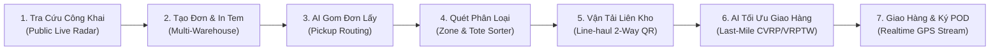
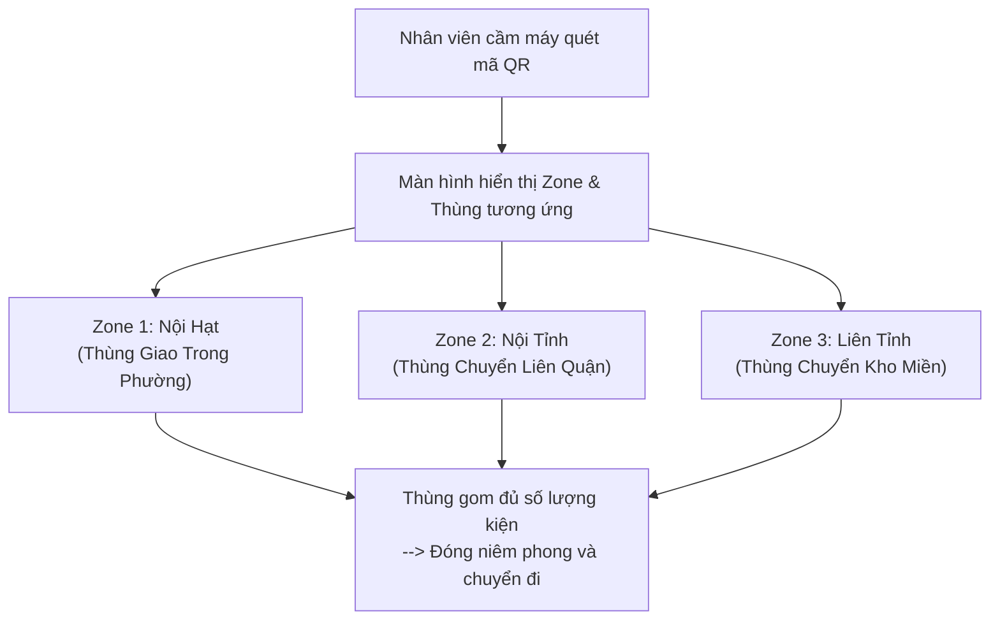
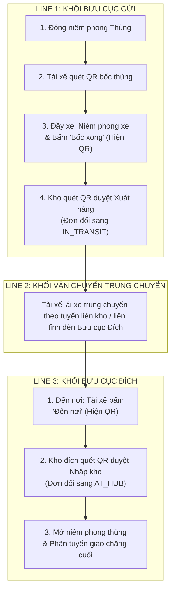
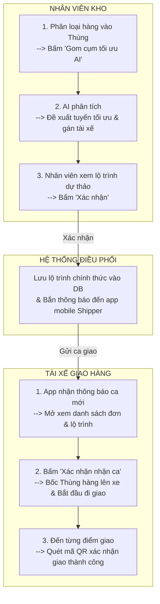
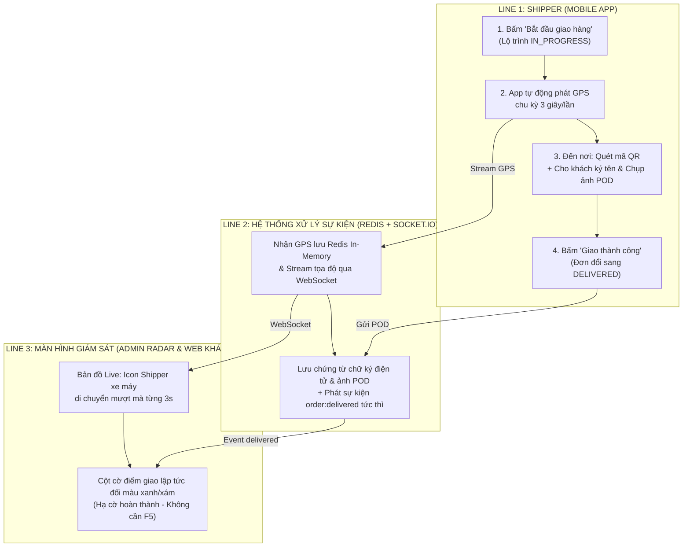

# 📊 DÀN Ý SLIDE THUYẾT TRÌNH & KỊCH BẢN DEMO
## HỆ THỐNG QUẢN LÝ & TỐI ƯU HÓA VẬN TẢI LOGISTICS THÔNG MINH (SMART LOGISTICS PLATFORM - SLP)

> **Tài liệu chuẩn bị Slide Báo cáo & Thuyết minh Demo**  
> Dùng để copy nội dung, sơ đồ Mermaid và lời thoại trực tiếp vào PowerPoint / Canva.

---

```
┌────────────────────────────────────────────────────────────────────────┐
│                        CẤU TRÚC 10 TRANG SLIDE                         │
├────────────────────────────────────────────────────────────────────────┤
│ Slide 01: Trang Bìa & Giới Thiệu Đề Tài                                │
│ Slide 02: Tổng Quan Kiến Trúc Vòng Đời Vận Đơn (7 Giai Đoạn)           │
│ Slide 03: [Demo 1] Tra Cứu Đơn Hàng Công Khai & Live Radar (Landing)   │
│ Slide 04: [Demo 2] Khách Hàng Tạo Đơn, Sổ Địa Chỉ Kho & In Tem QR A6   │
│ Slide 05: [Demo 3] AI Gom Đơn Thu Gom (Pickup) & Tài Xế Lấy Tận Nơi    │
│ Slide 06: [Demo 4] Phân Loại Hàng Vào Từng Zone & Thùng Gom (Tote)     │
│ Slide 07: [Demo 5] Vận Tải Trung Chuyển Liên Kho (Line-haul QR 2 Chiều)│
│ Slide 08: [Demo 6] AI Tối Ưu Lộ Trình Giao Hàng Chặng Cuối (VRPTW)     │
│ Slide 09: [Demo 7] Giao Hàng, Ký Nhận POD & Giám Sát Realtime          │
│ Slide 10: Tổng Kết Giá Trị Công Nghệ & Hiệu Quả Nghiệp Vụ              │
└────────────────────────────────────────────────────────────────────────┘
```

---

## 🖥️ SLIDE 01: TRANG BÌA (TITLE SLIDE)

### 📌 Nội dung hiển thị trên Slide:
* **Tên đề tài**: **SMART LOGISTICS PLATFORM (SLP)**
* **Phụ đề**: Nền tảng Điều phối Vận tải & Tối ưu hóa Giao nhận Chặng cuối Ứng dụng Trí tuệ Nhân tạo và Kiến trúc Hướng sự kiện (EDA)
* **Công nghệ cốt lõi**:
  - 🧠 **AI Optimization**: Genetic Algorithm (CVRP + VRPTW)
  - ⚡ **Realtime Engine**: Redis In-Memory Cache + Socket.io
  - 🗺️ **Geospatial Database**: PostgreSQL + PostGIS Extension
  - 📱 **Cross-Platform**: Web React TypeScript + Mobile Flutter

### 🎙️ Lời thoại thuyết trình (30 giây):
> *"Kính thưa quý Thầy Cô trong Hội đồng, hôm nay nhóm xin phép báo cáo đề tài **Smart Logistics Platform (SLP)**. Hệ thống giải quyết trọn vẹn bài toán vận hành logistics thực tế từ khâu tạo đơn, gom hàng chặng đầu, phân loại kho thông minh, vận tải trung chuyển liên tỉnh cho đến tối ưu lộ trình giao hàng chặng cuối và ký nhận điện tử theo thời gian thực."*

---

## 🖥️ SLIDE 02: TỔNG QUAN KIẾN TRÚC VÒNG ĐỜI VẬN ĐƠN (7 GIAI ĐOẠN)

### 📌 Sơ đồ Mermaid trình chiếu:


### 📌 Điểm nhấn nghiệp vụ:
1. **Khép kín 100% quy trình**: Không đứt gãy thông tin giữa các khâu từ Bưu cục Gửi $\rightarrow$ Kho Trung chuyển $\rightarrow$ Bưu cục Phát.
2. **Cơ chế quản lý Thùng Tote (1-N)**: Quét 1 mã Thùng cập nhật trạng thái đồng loạt cho hàng chục kiện hàng.
3. **Giám sát thời gian thực**: Toàn bộ luồng GPS xe tải và xe máy phát 3 giây/lần lên màn hình Radar không cần F5.

### 🎙️ Lời thoại thuyết trình (45 giây):
> *"Hệ thống chuẩn hóa toàn bộ luồng luân chuyển hàng hóa thành 7 giai đoạn liên hoàn. Tại mỗi mắt xích, hệ thống đều áp dụng công nghệ số hóa như định danh QR 2 chiều, tối ưu hóa AI và đồng bộ dữ liệu đa nền tảng để giảm thiểu tối đa thao tác thủ công của con người."*

---

## 🖥️ SLIDE 03: [DEMO 1] TRA CỨU ĐƠN HÀNG CÔNG KHAI TẠI LANDING PAGE

### 📌 Nội dung & Lý thuyết cốt lõi:
* **❓ Ai tra cứu? Tại sao không cần đăng nhập?**
  - Người nhận và khách mua hàng chỉ cần có Mã Vận Đơn (VD: `ORD-0419000003`) là tra cứu được ngay. Tự động che giấu số điện thoại và tên riêng (PII Masking) để bảo vệ quyền riêng tư.
* **❓ Tại sao chỉ hiển thị các mốc đã diễn ra (Event-driven Milestones)?**
  - Không hiển thị lộ trình tương lai vì tuyến xe điều phối nội bộ là ĐỘNG (Dynamic Routing). Tránh gây hiểu lầm cho khách hàng và bảo mật cấu trúc mạng lưới khai thác của doanh nghiệp.

### 📌 Thao tác Demo trên màn hình:
1. Mở trang chủ chưa đăng nhập $\rightarrow$ Nhập mã vận đơn: `ORD-0419000003` $\rightarrow$ Bấm **"Tra cứu ngay"**.
2. Xem **Timeline Stepper** hiển thị các mốc thời gian thực tế đã hoàn thành.
3. Xem **Thẻ thông tin Shipper**: Tên tài xế, SĐT, Biển số xe máy và Thời gian dự kiến giao (ETA).
4. Xem **Bản đồ Live GPS Radar**: Icon Shipper xe máy đang nhấp nháy di chuyển Live trên cung đường.

### 🎙️ Lời thoại thuyết trình (45 giây):
> *"Mở đầu phần demo, em xin trình chiếu màn hình Tra cứu công khai. Người nhận không cần đăng nhập mà chỉ cần 1 click là thấy toàn bộ tiến trình thực tế của kiện hàng, kèm vị trí xe máy của Shipper đang di chuyển Live trên bản đồ số nhờ luồng dữ liệu GPS từ Redis In-Memory truyền qua WebSockets."*

---

## 🖥️ SLIDE 04: [DEMO 2] KHÁCH HÀNG TẠO ĐƠN, SỔ ĐỊA CHỈ KHO & IN TEM QR A6

### 📌 Nội dung & Lý thuyết cốt lõi:
* **❓ Tại sao có Sổ địa chỉ kho (Multi-Warehouse)?**
  - Chủ shop có nhiều kho hàng/chi nhánh xuất hàng khác nhau tại các quận huyện.
* **❓ Tại sao không lưu tài khoản người nhận & Snapshot địa chỉ gửi?**
  - SLP là nền tảng vận tải 3PL độc lập (không phải sàn TMĐT bán lẻ). Thông tin người nhận là dữ liệu động theo từng đơn (`Consignee Payload`).
  - Địa chỉ lấy hàng được **lưu cứng (Snapshot)** vào bản ghi đơn hàng để khi Shop thay đổi địa chỉ văn phòng, toàn bộ lịch sử đơn hàng cũ không bị sai lệch tọa độ đối soát.
* **❓ Cách tính thời gian giao dự kiến (EDD) trong mã nguồn:**
  - *Gói Hỏa tốc (< 20km)*: $25\text{ phút} + (\text{khoảng cách km} \times 2.4\text{ phút})$.
  - *Gói Tiêu chuẩn/Tiết kiệm*: Nội tỉnh 24h, Nội miền 48h, Cận miền 72h, Bắc-Nam 96h.

### 📌 Thao tác Demo trên màn hình:
1. Đăng nhập tài khoản Shop: `customer@slp.vn`.
2. Bấm **"+ Tạo đơn hàng mới"** $\rightarrow$ Chọn Kho từ Sổ địa chỉ $\rightarrow$ Nhập địa chỉ nhận $\rightarrow$ Chọn khung giờ hẹn giao (09:00 - 11:30) $\rightarrow$ Bấm **"Tạo đơn"**.
3. Bấm **"In nhãn"** $\rightarrow$ Xem tem in nhiệt A6 chuẩn công nghiệp chứa mã QR vận đơn.
4. Bấm **"Tải lên Excel"** $\rightarrow$ Upload file mẫu $\rightarrow$ Tạo đồng loạt 20 đơn hàng trong 2 giây.

### 🎙️ Lời thoại thuyết trình (45 giây):
> *"Tại giao diện khách hàng, chủ shop có thể quản lý đa kho xuất hàng. Dữ liệu địa chỉ được hệ thống Snapshot cố định vào từng vận đơn để bảo toàn tính toàn vẹn dữ liệu. Hệ thống hỗ trợ in tem nhiệt A6 chuẩn hóa và tải file Excel tạo hàng loạt đơn trong tích tắc."*

---

## 🖥️ SLIDE 05: [DEMO 3] AI GOM ĐƠN THU GOM (PICKUP) & TÀI XẾ LẤY TẬN NƠI

### 📌 Nội dung & Lý thuyết cốt lõi:
* **❓ Một tài xế phụ trách bao nhiêu phường/xã?**
  - Đúng **1 phường sau sáp nhập đơn vị hành chính**. Đảm bảo thông thuộc ngõ ngách và giúp thuật toán AI Clustering gom cụm tuần hoàn khép kín trong ranh giới phường.
* **❓ Tại sao Staff phải bấm xác nhận kết quả AI (Human-in-the-Loop)?**
  - AI chỉ trả về bản xem trước dự thảo (Draft Preview). Nhân viên điều phối kiểm tra tính khả thi trên bản đồ rồi mới bấm xác nhận lưu chính thức vào Database.
* **❓ Có gom đơn thủ công không?**
  - Hỗ trợ song song cả **AI Dispatching** (hàng loạt đầu ca) và **Manual Dispatching** (gán đơn khẩn cấp).

### 📌 Thao tác Demo trên màn hình:
1. Nhân viên mở `RouteOptimizationModal.tsx` $\rightarrow$ Chọn hình thức **"PICKUP (Gom hàng)"** $\rightarrow$ Bấm **"Chạy tối ưu AI"**.
2. Xem lộ trình dự thảo vạch qua các shop ngắn nhất $\rightarrow$ Bấm **"Xác nhận phân công"**.
3. Mở Mobile App Shipper $\rightarrow$ Thấy thông báo ca mới và danh sách điểm lấy hàng `1, 2, 3...`.
4. Shipper đến shop $\rightarrow$ Quét mã QR kiện hàng $\rightarrow$ Bấm **"Xác nhận đã lấy hàng"** $\rightarrow$ Đơn đổi sang `PICKED_UP`.

### 🎙️ Lời thoại thuyết trình (45 giây):
> *"Tại khâu thu gom chặng đầu, nhân viên điều phối kích hoạt AI gom đơn lấy hàng theo từng phường. Khi lộ trình được duyệt, Mobile App của Shipper nhận ca ngay lập tức. Shipper đến shop dùng camera quét mã QR xác nhận đã lấy hàng, trạng thái trên máy chủ tự động đồng bộ sang PICKED_UP."*

---

## 🖥️ SLIDE 06: [DEMO 4] PHÂN LOẠI HÀNG VÀO TỪNG ZONE & THÙNG GOM (TOTE)

### 📌 Sơ đồ Mermaid quy trình phân loại (Chuẩn Slide):


### 📌 Khái niệm Thùng Tote & Quy tắc quản lý 1-N:
* **Thùng gom hàng (Tote / Master Container)**: Là đơn vị chứa hàng chục gói hàng có cùng tuyến đích.
* **Quản lý 1 Mã Thùng = N Kiện hàng**: Khi xuất/nhập kho liên tỉnh, chỉ cần **quét 1 lần mã Thùng** là toàn bộ đơn hàng bên trong tự động đổi trạng thái, tiết kiệm 95% thời gian thao tác.

### 📌 Thao tác Demo trên màn hình:
1. Mở `ZoneSortingTab.tsx`: Nhân viên cầm máy quét mã QR quét từng kiện hàng.
2. Hệ thống phát tiếng *"Bíp"* và màn hình hiển thị Zone đích rõ ràng:
   - Cùng phường $\rightarrow$ Thả vào **Thùng Giao Ngay (Zone Nội hạt)**.
   - Liên quận $\rightarrow$ Thả vào **Thùng Chuyển Liên Quận (Zone Nội tỉnh)**.
   - Liên tỉnh $\rightarrow$ Thả vào **Thùng Chuyển Kho Miền (Zone Liên tỉnh)**.

### 🎙️ Lời thoại thuyết trình (45 giây):
> *"Khi hàng được mang về bưu cục gốc, nhân viên chỉ cần quét mã QR 1 lần duy nhất: Hệ thống vừa xác nhận nhập kho AT_HUB, vừa phân tích địa giới hành chính và chỉ dẫn nhân viên thả gói hàng vào đúng Thùng Tote theo từng Zone tương ứng mà không cần đọc địa chỉ thủ công."*

---

## 🖥️ SLIDE 07: [DEMO 5] VẬN TẢI TRUNG CHUYỂN LIÊN KHO (LINE-HAUL QR 2 CHIỀU)

### 📌 Sơ đồ Mermaid 3 Line (Chuẩn Slide):


### 📌 Thao tác Demo trên màn hình:
1. Tại bưu cục gửi: Chọn Thùng hàng đã gom đủ kiện $\rightarrow$ Bấm **"Đóng niêm phong Thùng"** (Seal Container).
2. Tài xế xe tải dùng App quét QR từng thùng bốc lên xe $\rightarrow$ Bấm **"Bốc xong"** $\rightarrow$ App tài xế hiện **Mã QR Xuất Kho**.
3. Nhân viên kho gửi vào Tab **"Xuất hàng"** quét mã QR trên App tài xế $\rightarrow$ Duyệt xuất kho, đơn chuyển sang `IN_TRANSIT`.
4. Xe tải đến kho đích $\rightarrow$ Tài xế bấm **"Đến nơi"** (hiện QR Nhập kho) $\rightarrow$ Nhân viên kho đích quét mã duyệt nhập kho, toàn bộ đơn chuyển sang `AT_HUB` tại bưu cục đích.

### 🎙️ Lời thoại thuyết trình (45 giây):
> *"Tại khâu trung chuyển liên kho, hệ thống áp dụng cơ chế bàn giao 2 chiều bằng mã QR giữa Nhân viên kho và Tài xế xe tải. Chỉ với một lần quét mã QR bàn giao, toàn bộ hàng trăm đơn hàng trong các thùng Tote tự động chuyển trạng thái đồng loạt sang IN_TRANSIT hoặc AT_HUB mà không lo thất lạc."*

---

## 🖥️ SLIDE 08: [DEMO 6] AI TỐI ƯU LỘ TRÌNH GIAO HÀNG CHẶNG CUỐI (LAST-MILE VRPTW)

### 📌 Sơ đồ Mermaid 3 Line (Chuẩn Slide):


### 📌 Điểm sáng thuật toán AI:
* Sử dụng **Thuật toán Di truyền (Genetic Algorithm)** kết hợp hàm phạt để giải đồng thời 2 ràng buộc cứng:
  - **CVRP (Capacitated VRP)**: Không vượt quá tải trọng xe máy của Shipper.
  - **VRPTW (Time Windows VRP)**: Đáp ứng chính xác khung giờ hẹn nhận hàng của từng khách hàng.

### 📌 Thao tác Demo trên màn hình:
1. Tại bưu cục phát: Bấm **"Tối ưu hóa Lộ trình AI"** $\rightarrow$ Chọn hình thức **"DELIVERY (Phát hàng chặng cuối)"**.
2. Xem lộ trình tối ưu hiển thị trên bản đồ $\rightarrow$ Bấm **"Xác nhận phân công"**.
3. Mobile App của Shipper phát chuông nhận ca $\rightarrow$ Shipper mở xem danh sách đơn và chuỗi điểm dừng $\rightarrow$ Bấm **"Xác nhận nhận ca"** $\rightarrow$ Bốc Thùng hàng lên xe xuất phát.

### 🎙️ Lời thoại thuyết trình (45 giây):
> *"Tại chặng giao cuối cùng, AI Engine giải quyết đồng thời bài toán tải trọng xe và khung giờ hẹn của khách hàng để tạo ra chuỗi điểm dừng ngắn nhất. Shipper mở App kiểm tra lộ trình, xác nhận nhận ca và bốc Thùng hàng lên xe đi giao."*

---

## 🖥️ SLIDE 09: [DEMO 7] GIAO HÀNG, KÝ NHẬN POD & GIÁM SÁT REALTIME

### 📌 Sơ đồ Mermaid 3 Line (Chuẩn Slide):


### 📌 Thao tác Demo trên 2 màn hình song song:
1. Shipper mở App bấm **"Bắt đầu giao hàng"** $\rightarrow$ Trên Web Admin, icon xe máy bắt đầu di chuyển Live theo GPS.
2. Shipper đến nhà khách $\rightarrow$ Quét mã QR kiện hàng $\rightarrow$ Cho khách ký tên trên màn hình cảm ứng (`signature_pad`) và chụp ảnh gói hàng tại cửa.
3. Shipper bấm **"Giao hàng thành công"**.
4. **Hiệu ứng hạ cờ tức thì**: Trên màn hình Admin Radar (`LiveTrackingTab.tsx`), **cột cờ điểm giao số 1 đổi từ màu đỏ sang màu xanh/xám** ngay lập tức mà **không cần bấm F5**.

### 🎙️ Lời thoại thuyết trình (45 giây):
> *"Khi Shipper đi giao, tọa độ GPS được phát 3s/lần qua Redis In-Memory và WebSockets giúp Admin và Khách hàng theo dõi vị trí trực tiếp. Khi khách ký nhận điện tử và Shipper bấm Giao thành công, cột cờ điểm giao trên màn hình Admin radar lập tức đổi màu hoàn tất mà không cần F5 tải lại trang."*

---

## 🖥️ SLIDE 10: TỔNG KẾT GIÁ TRỊ CÔNG NGHỆ & HIỆU QUẢ NGHIỆP VỤ

### 📌 Bảng Tổng hợp 4 Trụ Cột Đột Phá:

| Trụ cột | Giải pháp công nghệ | Hiệu quả thực tế |
| :--- | :--- | :--- |
| 🧠 **Tối ưu AI** | Genetic Algorithm (CVRP + VRPTW) | Giảm **20-25% tổng quãng đường** và đảm bảo 100% giao đúng khung giờ hẹn. |
| 📦 **Quản lý Thùng Tote** | Cơ chế gom đơn 1-N & Bàn giao QR 2 chiều | Giảm **95% thời gian quét mã** xuất/nhập kho liên tỉnh, chống thất lạc đơn. |
| ⚡ **Kiến trúc Realtime** | Event-driven (EDA) + Redis Cache + Socket.io | Giám sát GPS Live với độ trễ **< 100ms**, không gây nghẽn Database. |
| 🔒 **Bảo mật & Trải nghiệm** | PII Data Masking + Snapshot Immutability | Tra cứu 1 chạm không cần đăng nhập, bảo toàn dữ liệu lịch sử đối soát cước. |

### 🎙️ Lời thoại kết luận (30 giây):
> *"Kính thưa quý Thầy Cô trong Hội đồng, hệ thống Smart Logistics Platform (SLP) đã chứng minh tính khả thi và hiệu quả vượt trội trong việc tự động hóa và thông minh hóa toàn bộ chuỗi vận hành logistics. Nhóm xin chân thành cảm ơn quý Thầy Cô đã lắng nghe và rất mong nhận được những ý kiến đóng góp quý báu!"*
