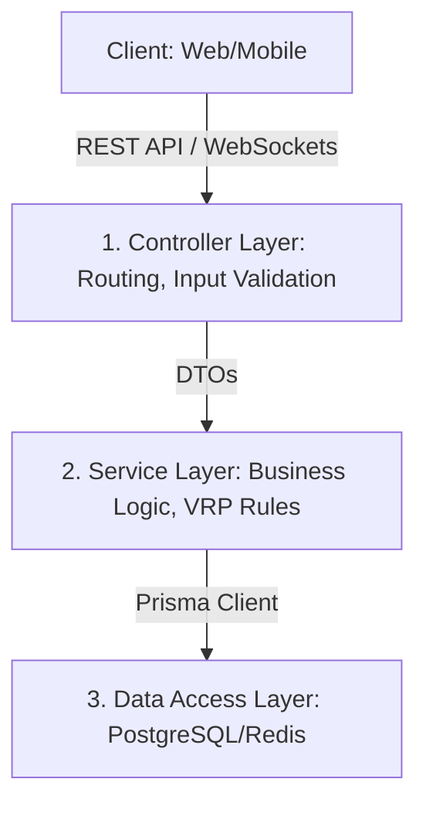

# 🌐 Chuẩn Quốc Tế & Quy Tắc Phát Triển Dự Án Smart Logistics Platform (SLP)

Tài liệu này định nghĩa các tiêu chuẩn quốc tế về **Kiến trúc phần mềm**, **Bảo mật**, **Dữ liệu địa lý**, và **Quy trình phát triển** mà đội ngũ phát triển (Hưng, Kiều, Quý) cần tuân thủ để đảm bảo hệ thống đạt chuẩn Enterprise, bảo mật cao và dễ dàng mở rộng.

---

## 1. 🏗️ Tiêu Chuẩn Kiến Trúc Phần Mềm (Software Architecture Standards)

Hệ thống tuân thủ mô hình **Layered Architecture (Kiến trúc phân tầng)** và nguyên lý **Clean Architecture** để tách biệt trách nhiệm:



### 1.1. Chuẩn RESTful API (RFC 7231)
* **HTTP Method tương ứng hành động**:
  * `GET`: Truy vấn dữ liệu (Không làm thay đổi trạng thái database).
  * `POST`: Tạo mới tài nguyên.
  * `PUT`: Cập nhật toàn bộ tài nguyên.
  * `PATCH`: Cập nhật một phần tài nguyên (Ví dụ: Chỉ cập nhật trạng thái đơn hàng).
  * `DELETE`: Xóa tài nguyên (Hệ thống logistics ưu tiên dùng **Soft Delete** - xóa mềm).
* **HTTP Status Code tiêu chuẩn**:
  * `200 OK`: Yêu cầu thành công.
  * `201 Created`: Tạo mới dữ liệu thành công.
  * `400 Bad Request`: Dữ liệu đầu vào không hợp lệ (Validation fail).
  * `401 Unauthorized`: Chưa đăng nhập hoặc token hết hạn.
  * `403 Forbidden`: Đã đăng nhập nhưng không có quyền truy cập (Ví dụ: Tài xế muốn xóa đơn hàng).
  * `404 Not Found`: Tài nguyên không tồn tại.
  * `429 Too Many Requests`: Vượt quá số lượng request cho phép (Rate Limit).
  * `500 Internal Server Error`: Lỗi hệ thống từ server.

### 1.2. Định dạng Response JSON thống nhất
Tất cả API trả về cấu trúc đồng nhất để Frontend dễ dàng xử lý:
```json
{
  "success": true, // hoặc false
  "message": "Thông báo trạng thái thành công hoặc lỗi",
  "data": {}, // Chứa object hoặc array kết quả (trả về null nếu lỗi)
  "errors": [] // Chi tiết danh sách lỗi (chủ yếu dùng cho mã 400 Validation)
}
```

---

## 2. 🔐 Tiêu Chuẩn Bảo Mật (Security & Protection Standards)

Dự án tuân theo các chỉ dẫn bảo mật quốc tế từ **OWASP (Open Web Application Security Project)**:

### 2.1. Xác thực & Phân quyền (Authentication & Authorization)
* **JWT (JSON Web Token - RFC 7519)**: Sử dụng làm phương thức xác thực không trạng thái (Stateless). Token phải được lưu ở HttpOnly Cookie phía Web để phòng chống tấn công XSS.
* **RBAC (Role-Based Access Control)**: Phân quyền dựa trên chức vụ (Đã seed sẵn trong database). Sử dụng Middleware để kiểm tra Permission của User trước khi vào API.
* **ABAC (Attribute-Based Access Control - Phân quyền theo ngữ cảnh)**:
  * *Nguyên tắc tối quan trọng*: Một tài xế chỉ được xem/cập nhật những chuyến hàng được gán cho chính họ (`driver_id === current_user_id`). Phải kiểm tra ràng buộc này trong tầng Service của API cập nhật trạng thái vận đơn.

### 2.2. Mã hóa dữ liệu (Cryptography)
* **Mật khẩu**: Tuyệt đối không lưu mật khẩu thô. Bắt buộc mã hóa một chiều bằng thuật toán **BCrypt** (với `salt rounds = 10`).
* **HTTPS/TLS**: Toàn bộ dữ liệu truyền tải trên môi trường production bắt buộc phải chạy qua giao thức **HTTPS (TLS 1.3)** để chống nghe trộm (Man-in-the-Middle).

### 2.3. Phòng chống tấn công phổ biến (OWASP Top 10)
* **SQL Injection**: Phòng chống hoàn toàn bằng việc truy vấn qua **Prisma Client** (sử dụng Parameterized Queries mặc định).
* **Rate Limiting**: Giới hạn số lần gọi API từ một IP trong một khoảng thời gian (Ví dụ: Tối đa 100 requests/phút) để ngăn chặn tấn công Brute-force và DDoS.

---

## 3. 🗺️ Tiêu Chuẩn Dữ Liệu Bản Đồ & GPS (Geospatial Standards)

Hệ thống logistics phụ thuộc lớn vào bản đồ và định vị, cần tuân thủ các chuẩn địa lý thế giới:

* **Hệ tọa độ WGS 84 (EPSG:4326)**: Chuẩn tọa độ địa lý quốc tế sử dụng bởi GPS toàn cầu và Google Maps/OpenStreetMap. Tất cả trường Vĩ độ (`latitude`) và Kinh độ (`longitude`) lưu trong database bắt buộc tuân theo định dạng thập phân (Ví dụ: `10.762622, 106.660172`).
* **GeoJSON (RFC 7946)**: Khi trả về tọa độ hoặc đường đi của tuyến đường (route polyline) qua API, ưu tiên sử dụng định dạng GeoJSON chuẩn để các thư viện bản đồ ở Web/Mobile vẽ trực tiếp lên bản đồ dễ dàng:
  ```json
  {
    "type": "Feature",
    "geometry": {
      "type": "LineString",
      "coordinates": [
        [106.660172, 10.762622],
        [106.665213, 10.768912]
      ]
    },
    "properties": {
      "distance_meters": 1200
    }
  }
  ```

---

## 4. 📦 Tiêu Chuẩn Chuỗi Cung Ứng (Supply Chain Standards)

Để sẵn sàng tích hợp với các hệ thống ERP/Logistics khác (như SAP, Oracle, DHL):

* **Chuẩn hóa Trạng thái sự kiện (GS1 EPCIS Standard)**: Các trạng thái và sự kiện của vận đơn cần được map chuẩn hóa:
  * `CREATED` (Tạo đơn)
  * `PICKED_UP` (Lấy hàng thành công)
  * `AT_HUB` (Đã nhập kho trung chuyển)
  * `IN_TRANSIT` (Đang vận chuyển chặng giữa)
  * `OUT_FOR_DELIVERY` (Đang phát hàng)
  * `DELIVERED` (Giao hàng thành công)
  * `FAILED` (Giao hàng thất bại)
* **Bằng chứng giao nhận (Proof of Delivery - POD)**:
  * Bắt buộc lưu trữ 3 yếu tố đối chứng: Ảnh chụp giao hàng (lưu trữ Cloud/S3), Chữ ký điện tử của khách hàng (dưới dạng Base64/SVG Polyline), và Tọa độ GPS tại thời điểm nhấn nút "Hoàn thành" để đối chiếu chống gian lận.

---

## 5. 🛠️ Tiêu Chuẩn Phát Triển Code (Clean Code & TypeScript Rules)

* **Type Safety**: Bật cấu hình `strict: true` trong `tsconfig.json`. Không sử dụng kiểu dữ liệu `any`, bắt buộc định nghĩa rõ ràng Type/Interface cho Request Body, Response và DTOs.
* **Environment Configuration**: Không lưu bất cứ mã khóa bảo mật hay URL kết nối nào trong code. Tất cả phải được nạp thông qua biến môi trường `.env` (`process.env.VARIABLE_NAME`).
* **Xử lý lỗi tập trung (Centralized Error Handling)**: 
  * Viết một Middleware xử lý lỗi toàn cục trong Express.
  * Không dùng `try-catch` tràn lan để trả response lỗi ở khắp các file. Hãy throw các Custom Error class (ví dụ `NotFoundError`, `UnauthorizedError`) và để Error Middleware tự động bắt và format response trả về cho Client.
