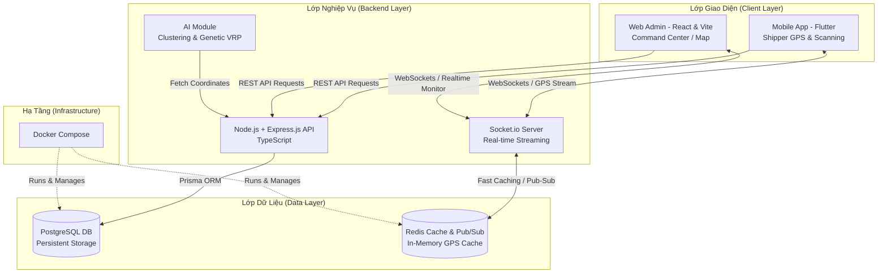

# 🚀 HƯỚNG DẪN CẤU HÌNH VÀ THIẾT LẬP DỰ ÁN (SETUP.MD)

Tài liệu này hướng dẫn chi tiết cách thiết lập môi trường, cấu trúc thư mục, các công nghệ sử dụng và cách cài đặt hệ thống **Điều vận và tối ưu hóa tuyến đường giao hàng tự động (Smart Logistics Platform)**.

---

## 🏗️ 1. Kiến Trúc Hệ Thống (System Architecture)

Hệ thống được thiết kế theo mô hình **Kiến trúc hướng sự kiện (EDA - Event-Driven Architecture)** chịu tải cao để đáp ứng luồng dữ liệu GPS thời gian thực từ hàng trăm Shipper di chuyển đồng thời.



---

## 📂 2. Cấu Trúc Thư Mục Dự Án (Project Folder Structure)

Dự án được phân chia thành 3 phần rõ ràng: **Backend (Node.js/TS)**, **Frontend (React/TS)**, và **Mobile (Flutter)**, cùng với thư mục quản lý **Docker** ở thư mục gốc.

```text
smart-logistics-platform/
├── backend/                       # Backend API Service (Node.js & Express)
│   ├── src/
│   │   ├── config/                # Cấu hình Database, Redis, WebSockets
│   │   ├── controllers/           # Bộ điều khiển xử lý logic request
│   │   ├── middleware/            # Middleware xác thực (JWT), phân quyền
│   │   ├── models/                # Schema hoặc cấu hình ORM (Prisma)
│   │   ├── routes/                # Tuyến đường API (V1)
│   │   ├── services/              # Lõi AI (Genetic Algorithm, DBSCAN, VRP)
│   │   └── index.ts               # Điểm khởi chạy Backend (Entry Point)
│   ├── .env.example               # File cấu hình biến môi trường mẫu
│   ├── package.json               # Quản lý dependencies của backend
│   └── tsconfig.json              # Cấu hình TypeScript compiler
│
├── frontend/                      # Web Admin & Staff Dashboard (React.js)
│   ├── public/                    # Tài nguyên tĩnh
│   ├── src/
│   │   ├── assets/                # Hình ảnh, icons, styles
│   │   ├── components/            # Component dùng chung (Map, Chart, Layout)
│   │   ├── pages/                 # Trang (Dashboard, Orders, DriverMap)
│   │   ├── services/              # API Client (Axios), Socket.io Client
│   │   ├── App.tsx                # Component gốc quản lý layout & socket
│   │   └── main.tsx               # Khởi tạo React DOM
│   ├── package.json               # Quản lý dependencies của React Web
│   └── vite.config.ts             # Cấu hình build nhanh bằng Vite
│
├── mobile/                        # Ứng dụng di động cho tài xế (Flutter)
│   ├── lib/
│   │   ├── models/                # Lớp dữ liệu đơn hàng, shipper, tọa độ
│   │   ├── screens/               # Màn hình giao diện (Task List, Map Nav)
│   │   ├── services/              # Background GPS Location, Socket IO service
│   │   └── main.dart              # Điểm khởi chạy app Flutter
│   └── pubspec.yaml               # Quản lý thư viện Flutter
│
├── docker-compose.yml             # Quản lý Container PostgreSQL và Redis
└── setup.md                       # File tài liệu hướng dẫn này
```

---

## 🛠️ 3. Chi Tiết Công Nghệ & Ngôn Ngữ (Tech Stack)

| Thành phần | Công nghệ / Thư viện | Ngôn ngữ | Lý do lựa chọn |
| :--- | :--- | :--- | :--- |
| **Backend API** | Node.js, Express.js | TypeScript | Đảm bảo tính mở rộng cao, type-safety, xử lý bất đồng bộ tốt cho I/O nặng. |
| **Real-time Engine** | Socket.io | JavaScript/TS | Tạo kết nối song công liên tục giữa Shipper di động và Web Admin giám sát. |
| **Database chính** | PostgreSQL 15 | SQL | Cơ sở dữ liệu quan hệ mạnh mẽ, hỗ trợ PostGIS tối ưu tọa độ địa lý. |
| **Real-time Cache** | Redis 7 | NoSQL (Key-Value) | Lưu trữ đệm GPS tọa độ sống của tài xế với độ trễ cực thấp (micro-giây). |
| **Frontend Web** | React (Vite) | TypeScript | Xây dựng Single Page Application mượt mà, hỗ trợ component hiển thị bản đồ. |
| **Mobile App** | Flutter | Dart | Viết một lần chạy cả iOS và Android, hiệu năng cao, hỗ trợ chạy GPS ngầm. |
| **ORM** | Prisma ORM | TypeScript | Viết câu lệnh truy vấn dễ dàng, auto-generate types từ schema PostgreSQL. |
| **AI Algorithms** | Custom GA & Clustering | JS/TS hoặc Python | Tích hợp thuật toán gom cụm (K-Means/DBSCAN) và VRP (Genetic Algorithm). |

---

## 🐳 4. Cấu Hình Cơ Sở Dữ Liệu (PostgreSQL & Redis trên Docker)

Hệ thống sử dụng Docker để cô lập môi trường của PostgreSQL (CSDL chính) và Redis (Bộ nhớ đệm thời gian thực).

### File `docker-compose.yml` (ở thư mục gốc)

```yaml
version: '3.8'

services:
  # Database PostgreSQL
  postgres:
    image: postgres:15-alpine
    container_name: slp-postgres
    restart: always
    environment:
      POSTGRES_USER: postgres
      POSTGRES_PASSWORD: admin_password
      POSTGRES_DB: smart_logistics_db
    ports:
      - "5432:5432"
    volumes:
      - postgres_data:/var/lib/postgresql/data
    networks:
      - slp-network
    healthcheck:
      test: ["CMD-SHELL", "pg_isready -U postgres -d smart_logistics_db"]
      interval: 10s
      timeout: 5s
      retries: 5

  # Redis Cache & Real-time Stream
  redis:
    image: redis:7-alpine
    container_name: slp-redis
    restart: always
    command: redis-server --requirepass redis_password --appendonly yes
    ports:
      - "6379:6379"
    volumes:
      - redis_data:/data
    networks:
      - slp-network
    healthcheck:
      test: ["CMD", "redis-cli", "ping"]
      interval: 10s
      timeout: 5s
      retries: 5

volumes:
  postgres_data:
    driver: local
  redis_data:
    driver: local

networks:
  slp-network:
    driver: bridge
```

> [!TIP]
> **Khởi chạy nhanh các Database:**
> Mở terminal tại thư mục gốc của dự án và chạy lệnh sau để kéo và chạy ngầm PostgreSQL & Redis:
> ```bash
> docker compose up -d
> ```
> Để kiểm tra xem các container đã chạy thành công hay chưa:
> ```bash
> docker compose ps
> ```

---

## 💻 5. Hướng Dẫn Thiết Lập Từng Phân Hệ (Installation Guide)

### 5.1. Thiết lập Backend (Node.js & Express)

1. Di chuyển vào thư mục backend:
   ```bash
   cd backend
   ```
2. Tạo file cấu hình môi trường `.env` từ file mẫu:
   ```bash
   copy .env.example .env
   ```
3. Cài đặt các thư viện cần thiết:
   ```bash
   npm install
   ```
4. Khởi tạo Prisma và đồng bộ schema vào PostgreSQL:
   ```bash
   npx prisma db push
   # Hoặc nếu chạy migration chính thức:
   # npx prisma migrate dev --name init
   ```
5. Chạy dự án ở chế độ phát triển (Development):
   ```bash
   npm run dev
   ```

---

### 5.2. Thiết lập Frontend (React + Vite)

1. Di chuyển vào thư mục frontend:
   ```bash
   cd ../frontend
   ```
2. Cài đặt thư viện:
   ```bash
   npm install
   ```
3. Khởi chạy dev server:
   ```bash
   npm run dev
   ```
   *Ứng dụng web sẽ được chạy tại địa chỉ: `http://localhost:5173`*

---

### 5.3. Thiết lập Mobile App (Flutter)

1. Đảm bảo bạn đã cài đặt Flutter SDK (`flutter doctor` không báo lỗi).
2. Di chuyển vào thư mục mobile:
   ```bash
   cd ../mobile
   ```
3. Tải các package trong pubspec:
   ```bash
   flutter pub get
   ```
4. Chạy ứng dụng trên thiết bị lập trình (Emulator hoặc thiết bị thật):
   ```bash
   flutter run
   ```

---

## ⚙️ 6. Luồng Vận Hành Của Lõi Tối Ưu AI & Real-time

1. **Khởi tạo đơn:** Khách hàng hoặc Admin tạo đơn hàng trên Web Dashboard, API lưu thông tin đơn với địa chỉ và khung giờ nhận vào PostgreSQL.
2. **Geocoding:** Địa chỉ text được chuyển đổi thành tọa độ Kinh/Vĩ độ thông qua Geocoding API.
3. **AI Phân cụm (Clustering):** Hệ thống quét các đơn hàng chưa phân công. Thuật toán (K-Means/DBSCAN) tự động gom các đơn hàng gần nhau theo cụm (bán kính cấu hình sẵn) và chỉ định cho Shipper phụ trách khu vực đó.
4. **AI Tối ưu lộ trình (Genetic VRP):** Lõi AI giải bài toán VRP đa ràng buộc (Tải trọng xe & Khung giờ hẹn). Đầu ra là chuỗi thứ tự các điểm giao tối ưu nhất (Điểm 1 -> Điểm N).
5. **Real-time GPS Tracking:** 
   - Ứng dụng Flutter của Shipper gửi tọa độ GPS lên server sau mỗi 3-5 giây qua Socket.io.
   - Server lập tiếp nhận vị trí này và ghi vào **Redis Cache** (tốc độ cực nhanh để tránh nghẽn Database PostgreSQL).
   - Socket.io phát tín hiệu này về trang Web Admin để cập nhật vị trí xe trên bản đồ trực quan theo thời gian thực.
   - Khi shipper bấm "Giao thành công", Socket.io thay đổi màu cột cờ trên bản đồ admin từ sáng sang xám.
